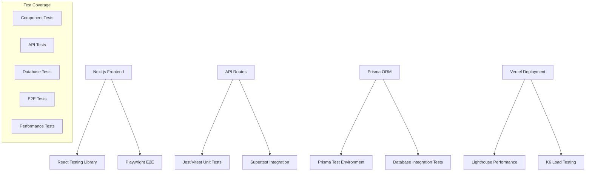

# 機能テスト実行計画書: 年間スキル報告書WEB化PJT

---

## 1. 文書情報

| 項目 | 内容 |
|------|------|
| 文書名 | 機能テスト実行計画書（統合版） |
| プロジェクト名 | 年間スキル報告書WEB化プロジェクト |
| システム名 | スキル報告書管理システム（SRMS） |
| プロジェクトID | SAS-DX-AI-2025-001 |
| 作成者 | AI推進チーム |
| 作成日 | 2025年5月29日 |
| 最終更新日 | 2025年6月2日 |
| 版数 | 2.0 |

---

## 2. 機能テスト実行戦略

### 2.1 テスト実行方針

テスト設計書に基づき、Next.js + TypeScript + Prisma + Vercel 構成での4段階アプローチで機能テストを実行する：

1. **ユニットテスト**: 各コンポーネントの単体テスト（開発と並行）
2. **統合テスト**: API Routes + Prisma の連携テスト（機能実装完了後）
3. **E2Eテスト**: Playwright によるユーザーシナリオテスト（統合テスト完了後）
4. **パフォーマンステスト**: Next.js + Vercel 環境での性能検証（システムテスト段階）

### 2.2 技術スタック対応テスト構成



### 2.3 優先度別実行計画

#### 【最高優先度】基盤機能テスト（Week 5-6）
- **PLT.1-WEB.1**: Next.js 基盤機能
- **ACC.1-AUTH.1**: NextAuth.js 認証機能
- **PRO.1-BASE.1**: プロフィール基本機能
- **SKL.1-HIER.1**: スキル階層構造

#### 【高優先度】コア機能テスト（Week 7）
- **SKL.1-EVAL.1**: スキル評価機能
- **SKL.1-SRCH.1**: スキル検索機能
- **ACC.1-ROLE.1**: 権限管理機能

#### 【中優先度】業務機能テスト（Week 8）
- **CAR.1-PLAN.1**: キャリア目標管理
- **WPM.1-DET.1**: 作業実績管理
- **TRN.1-ATT.1**: 研修管理

#### 【低優先度】補助機能テスト（Week 9）
- **WPM.1-BULK.1**: 一括登録機能
- **RPT.1-EXCEL.1**: レポート出力機能

---

## 3. ユニットテスト実行計画

### 3.1 Next.js テスト環境構成

#### 採用技術スタック
- **テストフレームワーク**: Jest + React Testing Library
- **TypeScript サポート**: ts-jest
- **モックライブラリ**: Jest built-in + MSW
- **Next.js テスト**: @testing-library/react + next/router mock
- **カバレッジ**: Jest built-in coverage

#### 環境設定
```bash
# 必要パッケージのインストール
npm install -D jest @testing-library/react @testing-library/jest-dom @testing-library/user-event
npm install -D jest-environment-jsdom ts-jest @types/jest
npm install -D msw

# Next.js 用テスト設定
npm install -D next-router-mock
```

### 3.2 テスト対象と実行スケジュール

#### Week 1-2: Next.js 基盤テスト構築
| 日程 | テスト対象 | 実行内容 | 担当者 |
|------|-----------|---------|-------|
| Day 1-2 | テスト環境 | Jest + RTL セットアップ・設定 | 開発チーム全員 |
| Day 3-4 | 共通コンポーネント | Button, Input, Modal等のテスト | フロントエンド担当 |
| Day 5 | Next.js 認証 | NextAuth.js, API Routes テスト | バックエンド担当 |

#### Week 3-4: React コンポーネントテスト
| 日程 | テスト対象 | 実行内容 | 担当者 |
|------|-----------|---------|-------|
| Day 6-7 | スキル管理 | SkillForm, SkillList コンポーネント | 業務担当 |
| Day 8-9 | プロフィール管理 | ProfileForm, ProfileView コンポーネント | 業務担当 |
| Day 10 | カバレッジ確認 | 目標80%達成確認・改善 | 開発チーム全員 |

### 3.3 カバレッジ目標（Next.js 対応）

| カテゴリ | 目標カバレッジ | 測定対象 |
|---------|---------------|---------|
| API Routes | 90%以上 | pages/api/**, app/api/** |
| React コンポーネント | 85%以上 | components/**, app/**/page.tsx |
| ビジネスロジック | 95%以上 | lib/**, utils/** |
| Prisma モデル | 90%以上 | lib/prisma.ts, models/** |
| **全体目標** | **85%以上** | **プロジェクト全体** |

---

## 4. 統合テスト実行計画

### 4.1 Next.js + Prisma 統合テスト

#### テスト対象システム
- **Next.js API Routes** ↔ **Prisma ORM** ↔ **PostgreSQL**
- **フロントエンド** ↔ **API Routes**
- **NextAuth.js** ↔ **セッション管理**
- **Vercel Functions** ↔ **外部API**

### 4.2 実行スケジュール

#### Week 7: API Routes + Prisma 統合テスト
| 日程 | テスト対象 | 実行内容 | 期待結果 |
|------|-----------|---------|---------|
| Day 11-12 | 認証API | NextAuth.js + JWT + セッション | 正常な認証フロー |
| Day 13-14 | スキル管理API | CRUD + Prisma + PostgreSQL | データ整合性確保 |
| Day 15 | プロフィールAPI | 更新 + 履歴管理 + トランザクション | 正確なデータ反映 |

#### Week 8: フロントエンド統合テスト
| 日程 | テスト対象 | 実行内容 | 期待結果 |
|------|-----------|---------|---------|
| Day 16-17 | Next.js ページ遷移 | useRouter + 状態管理 | スムーズな画面遷移 |
| Day 18-19 | SWR データフェッチ | API連携 + キャッシュ | データの正確な反映 |
| Day 20 | エラーハンドリング | 通信エラー + バリデーション | 適切なエラー表示 |

---

## 5. E2Eテスト実行計画

### 5.1 Playwright + Next.js E2Eテスト（Playwright Agents統合）

#### Playwright Agents セットアップ

```bash
# Playwright 1.56+ のインストール
npm install -D @playwright/test@latest

# Playwright Agents の初期化
npx playwright init-agents --loop=claude

# 環境変数の設定
# .env.local に追加
ANTHROPIC_API_KEY=your_api_key_here
```

#### テスト環境構成
```typescript
// playwright.config.ts
import { defineConfig, devices } from '@playwright/test'

export default defineConfig({
  testDir: './tests/e2e',
  fullyParallel: true,
  forbidOnly: !!process.env.CI,
  retries: process.env.CI ? 2 : 0,
  workers: process.env.CI ? 1 : undefined,
  reporter: 'html',

  use: {
    baseURL: 'http://localhost:3000',
    trace: 'on-first-retry',
    screenshot: 'only-on-failure',
  },

  projects: [
    {
      name: 'chromium',
      use: { ...devices['Desktop Chrome'] },
    },
    {
      name: 'firefox',
      use: { ...devices['Desktop Firefox'] },
    },
    {
      name: 'webkit',
      use: { ...devices['Desktop Safari'] },
    },
    // モバイルテスト
    {
      name: 'Mobile Chrome',
      use: { ...devices['Pixel 5'] },
    },
  ],

  webServer: {
    command: 'npm run dev',
    url: 'http://localhost:3000',
    reuseExistingServer: !process.env.CI,
  },
})
```

#### Playwright Agents による AI駆動テストワークフロー

##### ステップ1: テスト計画の自動生成

```bash
# ユーザーシナリオからテスト計画を生成
npx playwright agent planner \
  --story "一般ユーザーがスキルを4段階評価（×/△/○/◎）で登録し、カテゴリ別に検索・編集・削除できる" \
  --output tests/plans/skill-management.md
```

##### ステップ2: テストコードの自動生成

```bash
# テスト計画から実行可能なコードを生成
npx playwright agent generator \
  --plan tests/plans/skill-management.md \
  --output tests/e2e/skill-management-generated.spec.ts
```

##### ステップ3: テスト実行と自動修復

```bash
# 自動修復付きでテストを実行
npx playwright agent healer \
  --auto-fix \
  --test tests/e2e/ \
  --max-attempts=3
```

### 5.2 ユーザーシナリオテスト

#### Phase 1: 基本操作シナリオ（Week 8）
| シナリオID | シナリオ名 | 要求仕様ID | 実行者 | 期待結果 |
|-----------|-----------|-----------|-------|---------|
| E2E-001 | NextAuth.js ログイン | ACC.1-AUTH.1 | 一般ユーザー | 正常ログイン後、ダッシュボード表示 |
| E2E-002 | ログイン認証エラー | ACC.1-AUTH.1 | 一般ユーザー | エラーメッセージ表示、再入力促進 |
| E2E-003 | プロフィール参照・編集 | PRO.1-BASE.1 | 一般ユーザー | 情報の参照・編集・保存が正常動作 |
| E2E-004 | スキル情報登録・編集 | SKL.1-HIER.1 | 一般ユーザー | 4段階評価での登録・更新・保存 |

#### Phase 2: 業務フローシナリオ（Week 9）
| シナリオID | シナリオ名 | 要求仕様ID | 実行者 | 期待結果 |
|-----------|-----------|-----------|-------|---------|
| E2E-005 | スキル検索・フィルタ | SKL.1-SRCH.1 | 一般ユーザー | 条件指定検索・結果表示 |
| E2E-006 | 目標設定・進捗管理 | CAR.1-PLAN.1 | 一般ユーザー、上司 | 目標設定・進捗入力・評価 |
| E2E-007 | 作業実績入力 | WPM.1-DET.1 | 一般ユーザー | 実績の個別登録・反映確認 |
| E2E-008 | 研修参加記録 | TRN.1-ATT.1 | 一般ユーザー | 研修記録・PDUポイント管理 |

#### Phase 3: 管理・運用シナリオ（Week 10）
| シナリオID | シナリオ名 | 要求仕様ID | 実行者 | 期待結果 |
|-----------|-----------|-----------|-------|---------|
| E2E-009 | 権限管理（ロール設定） | ACC.1-ROLE.1 | システム管理者 | ロール追加・編集・削除が正常反映 |
| E2E-010 | 一括登録機能 | WPM.1-BULK.1 | 管理者 | CSV/Excel一括登録・エラーハンドリング |
| E2E-011 | レポート出力 | RPT.1-EXCEL.1 | 管理者、人事 | Excel/PDF帳票の正常出力・DL |

---

## 6. パフォーマンステスト実行計画

### 6.1 Next.js + Vercel パフォーマンステスト

#### 測定項目
- **Core Web Vitals**: FCP, LCP, CLS, FID
- **Next.js 特有**: ページロード時間、API Routes 応答時間
- **Vercel 環境**: Edge Functions、CDN キャッシュ効果
- **データベース**: Prisma クエリ性能、接続プール

#### 実行スケジュール
| Week | テスト内容 | 測定対象 | 目標値 |
|------|-----------|---------|-------|
| Week 9 | フロントエンド性能 | Lighthouse, Web Vitals | FCP < 1.8s, LCP < 2.5s |
| Week 10 | API 性能 | K6, Artillery | 応答時間 < 500ms |
| Week 11 | 負荷テスト | 同時接続テスト | 100ユーザー同時利用 |

---

## 7. テスト実行管理

### 7.1 テスト実行環境

#### 環境構成
- **開発環境**: ローカル開発（localhost:3000）
- **テスト環境**: Vercel Preview（テスト用データベース）
- **ステージング環境**: Vercel Production（本番相当）
- **本番環境**: Vercel Production（実運用）

#### CI/CD 統合
```yaml
# .github/workflows/test.yml
name: Test Pipeline

on:
  push:
    branches: [ main, develop ]
  pull_request:
    branches: [ main, develop ]

jobs:
  unit-test:
    runs-on: ubuntu-latest
    steps:
      - uses: actions/checkout@v3
      - uses: actions/setup-node@v3
        with:
          node-version: 18
          cache: 'npm'
      - run: npm ci
      - run: npm run test:unit
      - run: npm run test:coverage

  integration-test:
    runs-on: ubuntu-latest
    needs: unit-test
    services:
      postgres:
        image: postgres:15
        env:
          POSTGRES_PASSWORD: test_password
        options: >-
          --health-cmd pg_isready
          --health-interval 10s
          --health-timeout 5s
          --health-retries 5
    steps:
      - uses: actions/checkout@v3
      - uses: actions/setup-node@v3
      - run: npm ci
      - run: npm run test:integration

  e2e-test:
    runs-on: ubuntu-latest
    needs: integration-test
    steps:
      - uses: actions/checkout@v3
      - uses: actions/setup-node@v3
      - run: npm ci
      - run: npx playwright install
      - run: npm run test:e2e

  performance-test:
    runs-on: ubuntu-latest
    needs: e2e-test
    if: github.ref == 'refs/heads/main'
    steps:
      - uses: actions/checkout@v3
      - uses: actions/setup-node@v3
      - run: npm ci
      - run: npm run test:performance
```

### 7.2 品質ゲート

#### 必須通過条件
- **ユニットテスト**: カバレッジ85%以上、全テスト成功
- **統合テスト**: 主要APIの正常動作確認
- **E2Eテスト**: クリティカルパスの成功
- **パフォーマンス**: Core Web Vitals 基準達成

#### 品質指標
| 指標 | 目標値 | 測定方法 |
|------|-------|---------|
| テストカバレッジ | 85%以上 | Jest Coverage |
| API応答時間 | 500ms以内 | K6 Load Test |
| ページロード時間 | 2秒以内 | Lighthouse |
| エラー率 | 1%未満 | E2E Test Results |

---

## 8. 不具合管理・報告

### 8.1 不具合分類

#### 重要度分類
- **Critical**: システム停止、データ破損
- **High**: 主要機能の動作不良
- **Medium**: 一部機能の問題
- **Low**: UI/UX の軽微な問題

#### 対応優先度
- **P1**: 即座に対応（24時間以内）
- **P2**: 高優先度（3日以内）
- **P3**: 中優先度（1週間以内）
- **P4**: 低優先度（次回リリース）

### 8.2 テスト報告書

#### 週次テスト報告
- **実行テスト数**: 計画 vs 実績
- **成功率**: 成功/失敗/保留の件数
- **不具合件数**: 重要度別の発見・修正状況
- **カバレッジ**: 目標達成状況

#### 最終テスト報告
- **全体サマリー**: テスト実行結果の総括
- **品質評価**: 品質ゲート達成状況
- **残存リスク**: 未解決の問題・制限事項
- **リリース判定**: Go/No-Go の推奨

---

## 9. まとめ

### 9.1 テスト実行計画の価値

- **品質保証**: Next.js + TypeScript + Prisma 構成での高品質システム
- **リスク軽減**: 段階的テストによる早期問題発見
- **効率化**: 自動化による継続的品質監視
- **ユーザー満足**: 実際の利用シナリオに基づく検証

### 9.2 成功要因

- **技術スタック最適化**: Next.js エコシステムに特化したテスト戦略
- **段階的アプローチ**: ユニット→統合→E2E→パフォーマンスの体系的実行
- **自動化推進**: CI/CD パイプラインでの継続的テスト実行
- **品質文化**: チーム全体でのテスト重視の文化醸成

この機能テスト実行計画により、年間スキル報告書WEB化PJTの高品質なシステム提供を実現します。
