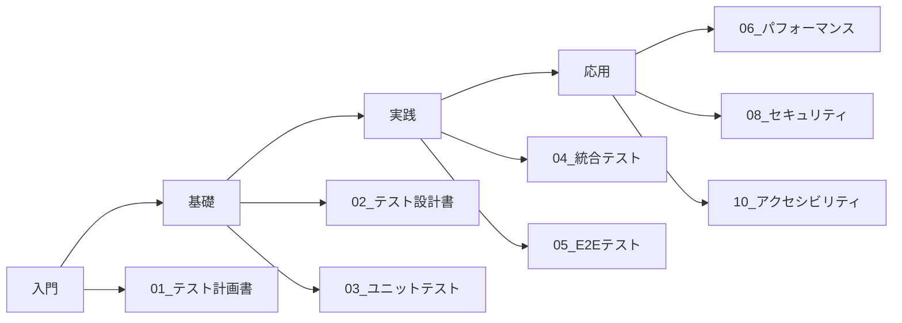

# 📚 スキルレポートシステム テストドキュメント

## 🎯 テストドキュメント概要

本ディレクトリには、スキルレポートシステムの品質保証に関する包括的なテストドキュメントが含まれています。これらのドキュメントは、テスト戦略の立案から実装、実行、評価までのすべてのフェーズをカバーし、高品質なシステムの実現を支援します。

### 📌 ドキュメントの目的

- **品質基準の明確化**: 各テストフェーズで達成すべき品質目標を定義
- **実装ガイドライン**: テスト実装のベストプラクティスと具体的な手順を提供
- **知識の共有**: チーム全体でテストノウハウを共有し、品質文化を醸成
- **継続的改善**: テスト結果のフィードバックループによる品質向上

---

## 📂 ドキュメント体系

テストドキュメントは以下の3つのカテゴリに分類されています：

### 1️⃣ 計画・設計ドキュメント (Planning & Design)
戦略立案とテスト設計のための基本ドキュメント

### 2️⃣ 機能テストドキュメント (Functional Testing)
システムの機能要件を検証するためのテストガイド

### 3️⃣ 非機能テストドキュメント (Non-functional Testing)
性能、セキュリティ、アクセシビリティなどの品質特性を検証

---

## 📊 各ドキュメントの概要一覧

| ドキュメント名 | 目的 | 主要内容 | 役割 |
|------------|------|---------|------|
| **01_テスト計画書** | 全体的なテスト戦略と実行計画の定義 | • テスト方針・目標<br>• テスト体制・役割分担<br>• スケジュール・マイルストーン<br>• リスク管理計画 | プロジェクトマネージャー<br>QAリード |
| **02_テスト設計書** | テストアーキテクチャと技術選定 | • テスト自動化戦略<br>• ツールスタック選定理由<br>• テストデータ管理<br>• 環境構成 | テックリード<br>アーキテクト |
| **03_ユニットテスト実装ガイド** | コンポーネント単位のテスト実装 | • Vitest設定・実装パターン<br>• React Testing Library活用法<br>• MSWによるモック戦略<br>• カバレッジ目標達成方法 | フロントエンド開発者<br>バックエンド開発者 |
| **04_統合テスト実装ガイド** | API・DB連携の検証 | • API統合テストパターン<br>• Supertestの活用<br>• Prismaテスト戦略<br>• データ整合性検証 | バックエンド開発者<br>DBエンジニア |
| **05_E2Eテスト実装ガイド** | ユーザーシナリオの自動検証 | • Playwright実装パターン<br>• シナリオテスト設計<br>• ページオブジェクトモデル<br>• CI/CD統合 | QAエンジニア<br>フルスタック開発者 |
| **06_パフォーマンステスト実装ガイド** | システム性能の測定と最適化 | • k6負荷テストシナリオ<br>• Lighthouse活用法<br>• Core Web Vitals最適化<br>• パフォーマンス改善手法 | パフォーマンスエンジニア<br>SRE |
| **07_機能テスト実行計画書** | テスト実行の管理と追跡 | • 実行スケジュール<br>• テストケース管理<br>• 不具合管理プロセス<br>• レポーティング | QAマネージャー<br>テストエンジニア |
| **08_セキュリティテスト詳細実装ガイド** | セキュリティ脆弱性の検出と対策 | • OWASP Top 10対策<br>• OWASP ZAP活用<br>• ペネトレーションテスト<br>• セキュアコーディング | セキュリティエンジニア<br>開発者 |
| **09_信頼性・可用性テスト実装ガイド** | システムの安定性と可用性の確保 | • 稼働率測定<br>• MTBF/MTTR分析<br>• カオスエンジニアリング<br>• 障害回復テスト | SRE<br>インフラエンジニア |
| **10_アクセシビリティテスト実装ガイド** | すべてのユーザーへの利用可能性確保 | • WCAG 2.1 AA準拠<br>• axe-core自動テスト<br>• Pa11y活用<br>• スクリーンリーダー対応 | UXデザイナー<br>フロントエンド開発者 |

---

## 🔺 テスト戦略概要

### テストピラミッド

```
          /\
         /E2E\        ← 10% (重要なユーザーシナリオ)
        /------\
       /統合テスト\     ← 30% (API・DB連携)
      /----------\
     /ユニットテスト\   ← 60% (コンポーネント・関数)
    /______________\
```

### テストレベルと目的

| レベル | 目的 | カバレッジ目標 | 実行頻度 |
|-------|------|--------------|---------|
| **ユニットテスト** | 個別機能の正確性確認 | 90%以上 | コミット毎 |
| **統合テスト** | モジュール間連携の検証 | 80%以上 | PR毎 |
| **E2Eテスト** | エンドツーエンドのシナリオ検証 | 主要シナリオ100% | デプロイ前 |
| **パフォーマンステスト** | 性能要件の達成確認 | Core Web Vitals 100% | リリース前 |
| **セキュリティテスト** | 脆弱性の検出と対策 | OWASP Top 10 100% | 週次 |
| **アクセシビリティテスト** | WCAG準拠の確認 | WCAG 2.1 AA 100% | スプリント毎 |

---

## 🛠 技術スタック

### 各テストタイプの技術スタック

| テストタイプ | 主要ツール | 補助ツール | 用途 |
|------------|-----------|-----------|-----|
| **ユニットテスト** | Vitest | React Testing Library<br>MSW<br>@testing-library/user-event | コンポーネントテスト<br>APIモック<br>ユーザー操作シミュレーション |
| **統合テスト** | Vitest | Supertest<br>Prisma<br>Docker Compose | APIテスト<br>DBテスト<br>テスト環境構築 |
| **E2Eテスト** | Playwright | @playwright/test<br>Allure Report | ブラウザ自動化<br>テストレポート |
| **パフォーマンス** | k6 | Lighthouse<br>Web Vitals<br>Chrome DevTools | 負荷テスト<br>パフォーマンス測定<br>プロファイリング |
| **セキュリティ** | OWASP ZAP | Snyk<br>npm audit<br>ESLint Security Plugin | 脆弱性スキャン<br>依存関係チェック<br>静的解析 |
| **アクセシビリティ** | axe-core | Pa11y<br>WAVE<br>NVDA/JAWS | 自動検証<br>CI統合<br>スクリーンリーダーテスト |

---

## 🎯 品質目標

### 定量的品質指標

| カテゴリ | 指標 | 目標値 | 測定方法 |
|---------|------|--------|---------|
| **テストカバレッジ** | ユニットテスト | 90%以上 | Vitest Coverage |
| | 統合テスト | 80%以上 | API Coverage |
| | E2Eテスト | 主要シナリオ100% | Playwright Report |
| **パフォーマンス** | LCP (Largest Contentful Paint) | < 2.5秒 | Lighthouse |
| | FID (First Input Delay) | < 100ms | Web Vitals |
| | CLS (Cumulative Layout Shift) | < 0.1 | Web Vitals |
| | TTFB (Time to First Byte) | < 600ms | k6 |
| **可用性** | システム稼働率 | 99.5%以上 | Monitoring Tools |
| | MTBF (平均故障間隔) | > 720時間 | Incident Tracking |
| | MTTR (平均復旧時間) | < 30分 | Incident Response |
| **セキュリティ** | OWASP Top 10準拠率 | 100% | OWASP ZAP |
| | 脆弱性対応時間 | Critical: 24時間以内<br>High: 72時間以内 | Security Dashboard |
| **アクセシビリティ** | WCAG 2.1 AA準拠率 | 100% | axe-core |
| | キーボードナビゲーション | 全機能対応 | Manual Testing |

---

## 🚀 クイックスタート

### 基本的なテストコマンド

```bash
# 📦 依存関係のインストール
npm install

# 🧪 ユニットテストの実行
npm run test:unit

# 🔄 ユニットテスト（ウォッチモード）
npm run test:unit:watch

# 📊 カバレッジレポート生成
npm run test:coverage

# 🔗 統合テストの実行
npm run test:integration

# 🎭 E2Eテスト（ヘッドレス）
npm run test:e2e

# 🎭 E2Eテスト（UI表示）
npm run test:e2e:ui

# ⚡ パフォーマンステスト
npm run test:performance

# 🔒 セキュリティスキャン
npm run test:security

# ♿ アクセシビリティテスト
npm run test:a11y

# 🚀 全テストスイートの実行
npm run test:all
```

### 開発中のテスト実行

```bash
# 特定のテストファイルのみ実行
npm run test:unit -- Button.test.tsx

# 特定のテストスイートのみ実行
npm run test:unit -- --grep="Button component"

# デバッグモードでE2Eテスト実行
npm run test:e2e:debug

# パフォーマンステストのローカル実行
npm run test:perf:local
```

---

## 🔄 CI/CDパイプライン

### GitHub Actions統合

```yaml
# .github/workflows/test.yml の構成

name: Test Pipeline

on:
  push:
    branches: [main, develop]
  pull_request:
    branches: [main, develop]

jobs:
  unit-test:
    runs-on: ubuntu-latest
    steps:
      - uses: actions/checkout@v3
      - uses: actions/setup-node@v3
      - run: npm ci
      - run: npm run test:unit
      - run: npm run test:coverage

  integration-test:
    runs-on: ubuntu-latest
    steps:
      - uses: actions/checkout@v3
      - run: docker-compose up -d
      - run: npm run test:integration

  e2e-test:
    runs-on: ubuntu-latest
    steps:
      - uses: actions/checkout@v3
      - run: npx playwright install
      - run: npm run test:e2e

  performance-test:
    runs-on: ubuntu-latest
    steps:
      - uses: actions/checkout@v3
      - run: npm run test:performance
      - run: npm run lighthouse:ci
```

### パイプラインステージ

| ステージ | 実行内容 | 失敗時の動作 | 所要時間 |
|---------|---------|------------|---------|
| **1. 静的解析** | ESLint, TypeScript, Prettier | ブロック | ~2分 |
| **2. ユニットテスト** | Vitest実行、カバレッジチェック | ブロック | ~5分 |
| **3. 統合テスト** | API/DB連携テスト | ブロック | ~8分 |
| **4. E2Eテスト** | Playwrightシナリオ実行 | ブロック | ~15分 |
| **5. パフォーマンス** | Lighthouse CI実行 | 警告 | ~10分 |
| **6. セキュリティ** | 依存関係スキャン | 警告（Criticalはブロック） | ~3分 |

---

## 📖 ドキュメントの読み方ガイド

### 役割別推奨ドキュメント

#### 🧑‍💻 **開発者向け**
1. **初期セットアップ**: `02_テスト設計書.md` → 環境構築とツール理解
2. **日常開発**: `03_ユニットテスト実装ガイド.md` → テスト駆動開発の実践
3. **API開発**: `04_統合テスト実装ガイド.md` → バックエンドテスト実装
4. **セキュリティ**: `08_セキュリティテスト詳細実装ガイド.md` → セキュアコーディング

#### 🧪 **QAエンジニア向け**
1. **計画立案**: `01_テスト計画書.md` → 全体戦略の理解
2. **テスト設計**: `07_機能テスト実行計画書.md` → テストケース管理
3. **自動化**: `05_E2Eテスト実装ガイド.md` → シナリオテスト自動化
4. **品質分析**: `06_パフォーマンステスト実装ガイド.md` → 性能測定

#### 📊 **プロジェクトマネージャー向け**
1. **全体把握**: `01_テスト計画書.md` → スケジュール・リソース管理
2. **品質指標**: `07_機能テスト実行計画書.md` → 進捗・品質レポート
3. **リスク管理**: `09_信頼性・可用性テスト実装ガイド.md` → 障害対応計画

#### 🎨 **デザイナー向け**
1. **アクセシビリティ**: `10_アクセシビリティテスト実装ガイド.md` → WCAG準拠
2. **パフォーマンス**: `06_パフォーマンステスト実装ガイド.md` → UX最適化

### 学習パス



---

## 🔧 トラブルシューティング

### よくある問題と解決方法

| 問題 | 原因 | 解決方法 |
|------|------|---------|
| テストが遅い | モック未使用、並列実行なし | MSW導入、並列実行設定 |
| カバレッジが上がらない | エッジケース未考慮 | 境界値テスト追加 |
| E2Eテストが不安定 | タイミング依存、セレクタ脆弱 | 明示的待機、data-testid使用 |
| CI/CDでテスト失敗 | 環境差異、依存関係 | Docker使用、package-lock.json固定 |

---

## 📮 お問い合わせ

テストドキュメントに関する質問や改善提案は以下までお願いします：

- **Slackチャンネル**: #qa-testing
- **メール**: qa-team@example.com
- **GitHub Issues**: [skill-report-web/issues](https://github.com/your-org/skill-report-web/issues)

---

## 🔄 更新履歴

| 日付 | バージョン | 更新内容 | 更新者 |
|------|-----------|---------|--------|
| 2024-07-04 | v1.0.0 | 初版作成 | QAチーム |
| - | - | - | - |

---

*このドキュメントは継続的に更新されます。最新情報はGitHubリポジトリをご確認ください。*