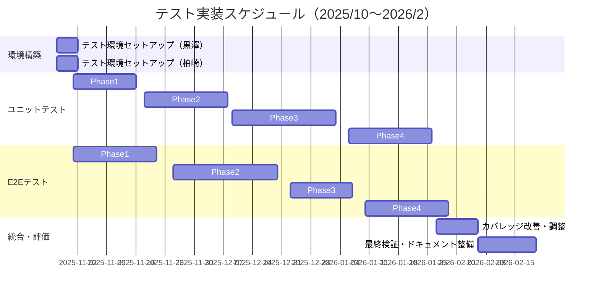

# テスト実装タスクリスト（2025年10月～2026年2月）

---

## 📋 文書情報

| 項目 | 内容 |
|------|------|
| 文書名 | テスト実装タスクリスト（2025年10月～2026年2月） |
| プロジェクト名 | 年間スキル報告書WEB化プロジェクト |
| システム名 | スキル報告書管理システム（SRMS） |
| 作成日 | 2025年10月28日 |
| 対象期間 | 2025年10月～2026年2月 |
| 版数 | 1.0 |

---

## 🎯 担当者別アサイン

| テスト種別 | 担当者 | 実施期間 | 備考 |
|-----------|-------|---------|------|
| **ユニットテスト** | 黒澤 | 2025/10～2026/2 | 本タスクリスト対象 |
| **E2Eテスト** | 柏崎 | 2025/10～2026/2 | 本タスクリスト対象 |
| **統合テスト** | TBD | 2026/3以降 | 次期フェーズで実施 |
| **パフォーマンステスト** | TBD | 2026/3以降 | 次期フェーズで実施 |

---

## 📅 全体スケジュール概要



---

## 🧪 ユニットテスト実装タスク（担当：黒澤）

### Phase 1: 環境構築・基盤テスト（2025/10/28 - 2025/11/15）

#### Week 1: 環境構築（10/28 - 11/1）
| タスクID | タスク名 | 工数 | 期日 | 優先度 | 成果物 |
|---------|---------|-----|------|-------|-------|
| UT-001 | Vitest環境セットアップ | 0.5日 | 10/28 | 高 | vitest.config.ts |
| UT-002 | React Testing Library設定 | 0.5日 | 10/28 | 高 | src/test/setup.ts |
| UT-003 | MSWモックサーバー設定 | 1日 | 10/29 | 高 | src/test/mocks/* |
| UT-004 | カバレッジ設定 | 0.5日 | 10/30 | 高 | coverage設定完了 |
| UT-005 | CI/CD統合（GitHub Actions） | 1日 | 10/31 | 高 | .github/workflows/test.yml |
| UT-006 | テストユーティリティ作成 | 0.5日 | 11/1 | 中 | src/test/utils/* |

**Week 1 成果物**: テスト実行環境の完全構築、サンプルテスト実行成功

#### Week 2-3: ユーティリティ・Lib テスト（11/4 - 11/15）
| タスクID | タスク名 | 対象ファイル | 工数 | 期日 | 優先度 |
|---------|---------|------------|-----|------|-------|
| UT-007 | 日付ユーティリティテスト | src/lib/dateUtils.ts | 0.5日 | 11/4 | 高 |
| UT-008 | バリデーションテスト | src/lib/validation.ts | 1日 | 11/5 | 高 |
| UT-009 | フォーマッターテスト | src/lib/formatters.ts | 0.5日 | 11/6 | 高 |
| UT-010 | Prismaクライアントテスト | src/lib/prisma.ts | 1日 | 11/7 | 高 |
| UT-011 | 認証ヘルパーテスト | src/lib/auth.ts | 1日 | 11/8 | 高 |
| UT-012 | エラーハンドリングテスト | src/lib/errors.ts | 0.5日 | 11/11 | 中 |
| UT-013 | セッション管理テスト | src/lib/session.ts | 1日 | 11/12 | 高 |
| UT-014 | 設定管理テスト | src/lib/config.ts | 0.5日 | 11/13 | 中 |
| UT-015 | その他ユーティリティテスト | src/lib/utils/* | 1日 | 11/15 | 中 |

**Week 2-3 成果物**: Libディレクトリのテストカバレッジ90%以上達成

---

### Phase 2: API Routes テスト（2025/11/18 - 2025/12/6）

#### Week 4-5: 認証・プロフィール系API（11/18 - 11/29）
| タスクID | タスク名 | 対象API | 工数 | 期日 | 優先度 |
|---------|---------|--------|-----|------|-------|
| UT-016 | ログインAPIテスト | /api/auth/login | 1日 | 11/18 | 高 |
| UT-017 | ログアウトAPIテスト | /api/auth/logout | 0.5日 | 11/19 | 高 |
| UT-018 | セッション検証APIテスト | /api/auth/session | 0.5日 | 11/20 | 高 |
| UT-019 | プロフィール取得APIテスト | /api/profiles/[userId] (GET) | 1日 | 11/21 | 高 |
| UT-020 | プロフィール更新APIテスト | /api/profiles/[userId] (PUT) | 1日 | 11/22 | 高 |
| UT-021 | プロフィール一覧APIテスト | /api/profiles (GET) | 0.5日 | 11/25 | 中 |
| UT-022 | 組織情報APIテスト | /api/organization/* | 1日 | 11/26 | 中 |
| UT-023 | エラーハンドリングテスト | 全認証・プロフィールAPI | 1日 | 11/28 | 高 |

**Week 4-5 成果物**: 認証・プロフィール系API完全カバレッジ

#### Week 6: スキル管理系API（12/2 - 12/6）
| タスクID | タスク名 | 対象API | 工数 | 期日 | 優先度 |
|---------|---------|--------|-----|------|-------|
| UT-024 | スキル取得APIテスト | /api/skills/[userId] (GET) | 1日 | 12/2 | 高 |
| UT-025 | スキル登録APIテスト | /api/skills/[userId] (POST) | 1日 | 12/3 | 高 |
| UT-026 | スキル更新APIテスト | /api/skills/[userId] (PUT) | 1日 | 12/4 | 高 |
| UT-027 | スキルカテゴリAPIテスト | /api/skill-categories | 0.5日 | 12/5 | 中 |
| UT-028 | スキル検索APIテスト | /api/skills/search | 0.5日 | 12/6 | 中 |

**Week 6 成果物**: スキル管理系API完全カバレッジ

---

### Phase 3: コンポーネントテスト（2025/12/9 - 2026/1/3）

#### Week 7-8: 共通コンポーネント（12/9 - 12/20）
| タスクID | タスク名 | 対象コンポーネント | 工数 | 期日 | 優先度 |
|---------|---------|------------------|-----|------|-------|
| UT-029 | Buttonコンポーネントテスト | src/components/common/Button.tsx | 0.5日 | 12/9 | 高 |
| UT-030 | Inputコンポーネントテスト | src/components/common/Input.tsx | 0.5日 | 12/10 | 高 |
| UT-031 | Modalコンポーネントテスト | src/components/common/Modal.tsx | 1日 | 12/11 | 高 |
| UT-032 | Tableコンポーネントテスト | src/components/common/Table.tsx | 1日 | 12/12 | 高 |
| UT-033 | Cardコンポーネントテスト | src/components/common/Card.tsx | 0.5日 | 12/13 | 中 |
| UT-034 | Loadingコンポーネントテスト | src/components/common/Loading.tsx | 0.5日 | 12/16 | 中 |
| UT-035 | Alertコンポーネントテスト | src/components/common/Alert.tsx | 0.5日 | 12/17 | 中 |
| UT-036 | Navigationコンポーネントテスト | src/components/common/Navigation.tsx | 1日 | 12/18 | 高 |
| UT-037 | Layoutコンポーネントテスト | src/components/layouts/* | 1日 | 12/19 | 高 |
| UT-038 | その他共通コンポーネント | src/components/common/* | 1日 | 12/20 | 中 |

**Week 7-8 成果物**: 共通コンポーネントのテストカバレッジ90%以上

#### Week 9-10: 業務コンポーネント（12/23 - 1/3）
| タスクID | タスク名 | 対象コンポーネント | 工数 | 期日 | 優先度 |
|---------|---------|------------------|-----|------|-------|
| UT-039 | プロフィールフォームテスト | src/components/profiles/ProfileForm.tsx | 1.5日 | 12/24 | 高 |
| UT-040 | スキル入力フォームテスト | src/components/skills/SkillForm.tsx | 1.5日 | 12/26 | 高 |
| UT-041 | スキルカードテスト | src/components/skills/SkillCard.tsx | 1日 | 12/27 | 高 |
| UT-042 | 目標設定フォームテスト | src/components/goals/GoalForm.tsx | 1.5日 | 12/30 | 高 |
| UT-043 | 作業実績フォームテスト | src/components/work/WorkForm.tsx | 1.5日 | 1/2 | 高 |
| UT-044 | レポート表示コンポーネント | src/components/reports/* | 1日 | 1/3 | 中 |

**Week 9-10 成果物**: 業務コンポーネントのテストカバレッジ85%以上

---

### Phase 4: ビジネスロジック・API Routes追加（2026/1/6 - 1/24）

#### Week 11-12: キャリアプラン・目標管理API（1/6 - 1/17）
| タスクID | タスク名 | 対象API | 工数 | 期日 | 優先度 |
|---------|---------|--------|-----|------|-------|
| UT-045 | キャリア目標APIテスト | /api/career-goals/* | 1.5日 | 1/7 | 高 |
| UT-046 | キャリア進捗APIテスト | /api/career-progress/* | 1.5日 | 1/9 | 高 |
| UT-047 | スキルギャップAPIテスト | /api/career/skill-gap | 1日 | 1/10 | 高 |
| UT-048 | アクションプランAPIテスト | /api/career/action-plans/* | 1.5日 | 1/14 | 高 |
| UT-049 | 上司フィードバックAPIテスト | /api/career/manager-comment | 1日 | 1/15 | 中 |
| UT-050 | 目標進捗集計テスト | ビジネスロジック | 1日 | 1/16 | 高 |
| UT-051 | 評価計算ロジックテスト | ビジネスロジック | 1日 | 1/17 | 高 |

**Week 11-12 成果物**: キャリア関連API・ロジックの完全カバレッジ

#### Week 13: 作業実績・研修管理API（1/20 - 1/24）
| タスクID | タスク名 | 対象API | 工数 | 期日 | 優先度 |
|---------|---------|--------|-----|------|-------|
| UT-052 | 作業実績APIテスト | /api/work/[userId] | 1.5日 | 1/21 | 高 |
| UT-053 | 一括実績登録APIテスト | /api/work/bulk | 1日 | 1/22 | 中 |
| UT-054 | 研修記録APIテスト | /api/training/[userId] | 1日 | 1/23 | 中 |
| UT-055 | PDU管理APIテスト | /api/training/pdu | 0.5日 | 1/24 | 低 |

**Week 13 成果物**: 作業実績・研修管理API完全カバレッジ

---

### Phase 5: 統合・改善フェーズ（2026/1/27 - 2/20）

#### Week 14-15: カバレッジ改善・リファクタリング（1/27 - 2/7）
| タスクID | タスク名 | 内容 | 工数 | 期日 | 優先度 |
|---------|---------|-----|-----|------|-------|
| UT-056 | カバレッジ分析 | 全モジュールのカバレッジ確認 | 0.5日 | 1/27 | 高 |
| UT-057 | 未カバー領域特定 | カバレッジ90%未満の箇所洗い出し | 0.5日 | 1/28 | 高 |
| UT-058 | エッジケース追加 | 境界値・異常系テスト補完 | 2日 | 1/30 | 高 |
| UT-059 | テストコードリファクタリング | 重複排除・可読性向上 | 2日 | 2/3 | 中 |
| UT-060 | パフォーマンス最適化 | テスト実行時間短縮 | 1日 | 2/4 | 中 |
| UT-061 | モック戦略見直し | MSW設定の最適化 | 1日 | 2/5 | 中 |
| UT-062 | CI/CD最適化 | 並列実行・キャッシュ活用 | 1日 | 2/6 | 中 |
| UT-063 | テストドキュメント更新 | 実装ガイド・README更新 | 0.5日 | 2/7 | 低 |

**Week 14-15 成果物**: ユニットテストカバレッジ90%達成、実行時間30%短縮

#### Week 16-17: 最終検証・報告（2/10 - 2/20）
| タスクID | タスク名 | 内容 | 工数 | 期日 | 優先度 |
|---------|---------|-----|-----|------|-------|
| UT-064 | 全テスト実行・検証 | ローカル・CI環境での最終確認 | 1日 | 2/10 | 高 |
| UT-065 | バグ修正 | 発見された問題の修正 | 2日 | 2/12 | 高 |
| UT-066 | レポート作成 | カバレッジレポート・品質報告書 | 1日 | 2/13 | 高 |
| UT-067 | ナレッジ共有会 | チームへのテスト手法共有 | 0.5日 | 2/14 | 中 |
| UT-068 | ベストプラクティス文書化 | 学んだ教訓のドキュメント化 | 1日 | 2/17 | 中 |
| UT-069 | メンテナンス計画策定 | 今後のテストメンテナンス方針 | 0.5日 | 2/18 | 中 |
| UT-070 | 成果報告会 | ステークホルダーへの報告 | 0.5日 | 2/20 | 高 |

**Week 16-17 成果物**: ユニットテスト完了報告書、ナレッジ共有完了

---

## 🎭 E2Eテスト実装タスク（担当：柏崎）

### Phase 1: 環境構築・基本シナリオ（2025/10/28 - 2025/11/22）

#### Week 1: 環境構築（10/28 - 11/1）
| タスクID | タスク名 | 工数 | 期日 | 優先度 | 成果物 |
|---------|---------|-----|------|-------|-------|
| E2E-001 | Playwright環境セットアップ | 0.5日 | 10/28 | 高 | playwright.config.ts |
| E2E-002 | ブラウザインストール・設定 | 0.5日 | 10/28 | 高 | Chromium/Firefox/WebKit |
| E2E-003 | テストデータ準備 | 1日 | 10/29 | 高 | tests/fixtures/* |
| E2E-004 | ページオブジェクトモデル設計 | 1日 | 10/30 | 高 | tests/pages/* 基盤 |
| E2E-005 | CI/CD統合（GitHub Actions） | 1日 | 10/31 | 高 | .github/workflows/e2e.yml |
| E2E-006 | レポート設定 | 0.5日 | 11/1 | 中 | HTML/JSON レポート設定 |

**Week 1 成果物**: E2Eテスト実行環境の完全構築

#### Week 2-3: 基本認証シナリオ（11/4 - 11/15）
| タスクID | タスク名 | テストシナリオ | 工数 | 期日 | 優先度 |
|---------|---------|--------------|-----|------|-------|
| E2E-007 | ログインフローテスト | 正常ログイン・ログアウト | 1日 | 11/4 | 高 |
| E2E-008 | 認証エラーテスト | 不正ログイン・セッション切れ | 1日 | 11/5 | 高 |
| E2E-009 | 権限制御テスト | ロール別アクセス制御確認 | 1.5日 | 11/7 | 高 |
| E2E-010 | セッション管理テスト | セッション維持・タイムアウト | 1日 | 11/8 | 高 |
| E2E-011 | ナビゲーションテスト | 画面遷移・メニュー操作 | 1日 | 11/11 | 中 |
| E2E-012 | レスポンシブテスト | デスクトップ・モバイル表示 | 1.5日 | 11/13 | 中 |

**Week 2-3 成果物**: 認証フローの完全な自動テスト実装

#### Week 4: プロフィール管理シナリオ（11/18 - 11/22）
| タスクID | タスク名 | テストシナリオ | 工数 | 期日 | 優先度 |
|---------|---------|--------------|-----|------|-------|
| E2E-013 | プロフィール参照テスト | 基本情報表示確認 | 0.5日 | 11/18 | 高 |
| E2E-014 | プロフィール編集テスト | 情報更新・保存確認 | 1日 | 11/19 | 高 |
| E2E-015 | バリデーションテスト | 入力エラー処理確認 | 1日 | 11/20 | 高 |
| E2E-016 | 履歴管理テスト | 変更履歴の記録・表示 | 1日 | 11/21 | 中 |

**Week 4 成果物**: プロフィール管理の完全シナリオテスト

---

### Phase 2: 業務シナリオテスト（2025/11/25 - 2025/12/20）

#### Week 5-6: スキル管理シナリオ（11/25 - 12/6）
| タスクID | タスク名 | テストシナリオ | 工数 | 期日 | 優先度 |
|---------|---------|--------------|-----|------|-------|
| E2E-017 | スキル登録フローテスト | 新規スキル登録・カテゴリ選択 | 1.5日 | 11/26 | 高 |
| E2E-018 | スキル編集フローテスト | スキル情報更新・削除 | 1.5日 | 11/28 | 高 |
| E2E-019 | スキル検索テスト | キーワード・カテゴリ検索 | 1日 | 11/29 | 高 |
| E2E-020 | スキルマップ表示テスト | ビジュアル表示・フィルタ | 1.5日 | 12/3 | 中 |
| E2E-021 | 資格管理テスト | 資格登録・期限管理 | 1日 | 12/4 | 中 |
| E2E-022 | スキル一括操作テスト | 複数選択・一括更新 | 1日 | 12/5 | 低 |

**Week 5-6 成果物**: スキル管理の完全な業務フローテスト

#### Week 7-8: キャリアプラン・目標管理（12/9 - 12/20）
| タスクID | タスク名 | テストシナリオ | 工数 | 期日 | 優先度 |
|---------|---------|--------------|-----|------|-------|
| E2E-023 | 目標設定フローテスト | 年間目標設定・承認フロー | 2日 | 12/11 | 高 |
| E2E-024 | 進捗管理テスト | 進捗入力・更新・コメント | 1.5日 | 12/13 | 高 |
| E2E-025 | 評価入力テスト | 自己評価・上長評価 | 1.5日 | 12/16 | 高 |
| E2E-026 | キャリアプラン作成テスト | キャリア目標設定・スキルギャップ | 2日 | 12/18 | 高 |
| E2E-027 | アクションプランテスト | プラン作成・進捗管理 | 1.5日 | 12/20 | 中 |

**Week 7-8 成果物**: キャリア・目標管理の完全シナリオテスト

---

### Phase 3: Playwright Agents統合（2025/12/23 - 2026/1/10）

#### Week 9-10: AI駆動テスト導入（12/23 - 1/10）
| タスクID | タスク名 | 内容 | 工数 | 期日 | 優先度 |
|---------|---------|-----|-----|------|-------|
| E2E-028 | Playwright Agents セットアップ | Claude Code統合設定 | 0.5日 | 12/23 | 高 |
| E2E-029 | Planner エージェント検証 | テスト計画自動生成の検証 | 1日 | 12/24 | 高 |
| E2E-030 | Generator エージェント検証 | テストコード自動生成の検証 | 1日 | 12/25 | 高 |
| E2E-031 | Healer エージェント検証 | 自動修復機能の検証 | 1日 | 12/26 | 高 |
| E2E-032 | 既存テストのAI最適化 | Agentsによる既存テスト改善 | 2日 | 12/30 | 中 |
| E2E-033 | 自動修復ワークフロー構築 | CI/CDでの自動修復統合 | 1.5日 | 1/2 | 高 |
| E2E-034 | 新規シナリオAI生成 | Agentsによる追加テスト生成 | 2日 | 1/6 | 中 |
| E2E-035 | Agents運用ガイド作成 | 使い方・ベストプラクティス | 1日 | 1/7 | 中 |
| E2E-036 | 効果測定・レポート | 工数削減効果の測定 | 1日 | 1/10 | 高 |

**Week 9-10 成果物**: Playwright Agents完全統合、自動修復ワークフロー稼働

---

### Phase 4: 高度なシナリオ・非機能テスト（2026/1/13 - 2/6）

#### Week 11-12: 作業実績・研修管理（1/13 - 1/24）
| タスクID | タスク名 | テストシナリオ | 工数 | 期日 | 優先度 |
|---------|---------|--------------|-----|------|-------|
| E2E-037 | 作業実績登録テスト | 案件実績入力・保存 | 1.5日 | 1/14 | 高 |
| E2E-038 | 一括実績登録テスト | CSV一括登録・エラー処理 | 1.5日 | 1/16 | 中 |
| E2E-039 | 実績集計テスト | 月次・年次集計表示 | 1日 | 1/17 | 中 |
| E2E-040 | 研修記録管理テスト | 研修登録・履歴管理 | 1日 | 1/20 | 中 |
| E2E-041 | PDU管理テスト | PDU登録・期限管理 | 1日 | 1/21 | 低 |
| E2E-042 | レポート出力テスト | Excel/PDF出力確認 | 1.5日 | 1/23 | 中 |

**Week 11-12 成果物**: 作業実績・研修管理の完全シナリオテスト

#### Week 13-14: 非機能テスト（1/27 - 2/6）
| タスクID | タスク名 | テスト内容 | 工数 | 期日 | 優先度 |
|---------|---------|----------|-----|------|-------|
| E2E-043 | アクセシビリティテスト | axe-core統合・WCAG準拠確認 | 2日 | 1/29 | 高 |
| E2E-044 | クロスブラウザテスト | Chrome/Firefox/Safari動作確認 | 1.5日 | 1/31 | 高 |
| E2E-045 | モバイル対応テスト | iOS/Android実機テスト | 1.5日 | 2/3 | 高 |
| E2E-046 | ネットワーク障害テスト | オフライン・遅延シミュレーション | 1日 | 2/4 | 中 |
| E2E-047 | 並行操作テスト | 複数ユーザー同時操作 | 1日 | 2/5 | 中 |
| E2E-048 | セキュリティテスト | XSS・CSRF対策確認 | 1日 | 2/6 | 高 |

**Week 13-14 成果物**: 非機能要件の完全な検証完了

---

### Phase 5: 最終検証・ドキュメント整備（2026/2/9 - 2/20）

#### Week 15-16: 統合・報告（2/9 - 2/20）
| タスクID | タスク名 | 内容 | 工数 | 期日 | 優先度 |
|---------|---------|-----|-----|------|-------|
| E2E-049 | 全シナリオ実行検証 | 全テストスイート実行・結果確認 | 1日 | 2/9 | 高 |
| E2E-050 | 不安定テスト修正 | Flaky テストの特定・修正 | 2日 | 2/11 | 高 |
| E2E-051 | カバレッジ分析 | シナリオカバレッジ・抜け漏れ確認 | 1日 | 2/12 | 高 |
| E2E-052 | パフォーマンス最適化 | テスト実行時間短縮 | 1日 | 2/13 | 中 |
| E2E-053 | CI/CD最適化 | 並列実行・リトライ戦略最適化 | 1日 | 2/16 | 中 |
| E2E-054 | テストドキュメント更新 | 実装ガイド・シナリオ一覧更新 | 1日 | 2/17 | 中 |
| E2E-055 | 動画・スクリーンショット整理 | テスト証跡の整理・アーカイブ | 0.5日 | 2/18 | 低 |
| E2E-056 | 運用ガイド作成 | メンテナンス・トラブルシューティング | 1日 | 2/19 | 中 |
| E2E-057 | 成果報告会 | ステークホルダーへの報告 | 0.5日 | 2/20 | 高 |

**Week 15-16 成果物**: E2Eテスト完了報告書、運用ドキュメント完備

---

## 📊 品質目標

### カバレッジ目標

| テスト種別 | 目標カバレッジ | 測定方法 |
|-----------|-------------|---------|
| **ユニットテスト** | 90%以上 | Vitest Coverage Report |
| **E2Eテスト** | 主要シナリオ100% | Playwright Test Report |
| **コンポーネントテスト** | 85%以上 | React Testing Library Report |
| **API テスト** | 90%以上 | Endpoint Coverage Report |

### 品質指標

| 指標 | 目標値 | 測定時期 |
|------|-------|---------|
| テスト成功率 | 95%以上 | 週次 |
| Flaky テスト率 | 5%以下 | 月次 |
| 平均テスト実行時間 | ユニット: 5分以内<br>E2E: 20分以内 | 毎実行 |
| バグ検出率 | 80%以上（本番前） | リリース前 |
| テストメンテナンス工数 | 月4時間以内 | 月次 |

---

## 🚨 リスク管理

### 主要リスクと対策

| リスク | 影響度 | 発生確率 | 対策 | 担当 |
|--------|-------|---------|-----|------|
| テスト環境の不安定性 | 高 | 中 | Docker化、予備環境準備 | 黒澤・柏崎 |
| テストデータ不足 | 中 | 中 | 早期にダミーデータ生成 | 黒澤・柏崎 |
| Playwright Agents学習曲線 | 中 | 高 | 事前検証、段階的導入 | 柏崎 |
| スケジュール遅延 | 高 | 中 | 週次進捗確認、優先度調整 | PM |
| カバレッジ目標未達 | 高 | 低 | 中間レビュー、早期追加対応 | 黒澤・柏崎 |

---

## 📞 コミュニケーション計画

### 定例ミーティング

| 会議名 | 頻度 | 参加者 | 目的 |
|-------|------|-------|------|
| デイリースタンドアップ | 毎日 | 黒澤、柏崎 | 進捗共有、ブロッカー解消 |
| 週次進捗会議 | 毎週月曜 | PM、黒澤、柏崎 | 週次進捗報告、リスク確認 |
| 月次レビュー会議 | 月末 | 全ステークホルダー | 月次成果報告、次月計画 |
| テクニカルレビュー | 隔週 | 開発チーム全員 | テストコードレビュー、品質確認 |

### 報告フォーマット

```markdown
## 週次報告（YYYY/MM/DD）

### 今週の実績
- 完了タスク: [タスクID一覧]
- カバレッジ: XX%
- 発見バグ: XX件

### 来週の予定
- 実施タスク: [タスクID一覧]
- 目標カバレッジ: XX%

### 課題・リスク
- [課題内容]

### 必要なサポート
- [サポート依頼内容]
```

---

## 📚 参考ドキュメント

| ドキュメント名 | パス | 用途 |
|-------------|------|-----|
| テスト計画書 | docs/testing/01_テスト計画書.md | 全体戦略理解 |
| ユニットテスト実装ガイド | docs/testing/03_ユニットテスト実装ガイド.md | ユニットテスト実装参考 |
| E2Eテスト実装ガイド | docs/testing/05_E2Eテスト実装ガイド.md | E2Eテスト実装参考 |
| Playwright Agents ドキュメント | https://playwright.dev/docs/agents | AI駆動テスト参考 |

---

## ✅ 完了基準

### ユニットテスト完了基準（黒澤）
- [ ] 全70タスク完了
- [ ] テストカバレッジ90%以上達成
- [ ] CI/CDで全テスト成功
- [ ] テストドキュメント更新完了
- [ ] 成果報告会実施

### E2Eテスト完了基準（柏崎）
- [ ] 全57タスク完了
- [ ] 主要シナリオ100%カバー
- [ ] Playwright Agents統合完了
- [ ] 非機能テスト完了
- [ ] 運用ガイド作成完了

---

## 📝 更新履歴

| 日付 | 版数 | 更新内容 | 更新者 |
|------|------|---------|--------|
| 2025/10/28 | 1.0 | 初版作成 | AI推進チーム |

---

*本タスクリストは進捗に応じて随時更新されます。最新版はGitHubリポジトリをご確認ください。*
