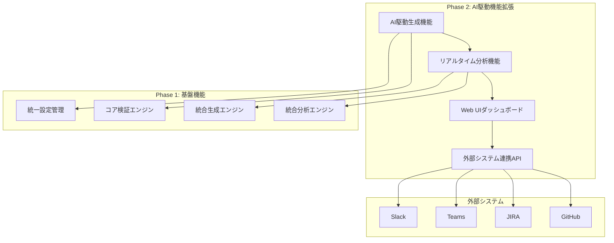

# Phase 2: 機能拡張実装計画書

## エグゼクティブサマリー

この文書は統一設計ツールシステムのPhase 2機能拡張の実装計画を定義します。AI駆動生成機能、リアルタイム分析機能、Web UIダッシュボード、外部システム連携APIの4つの主要機能を段階的に実装し、設計書の品質向上と開発効率化を実現します。既存のPhase 1基盤機能を活用しながら、実用的で拡張性の高いシステムを構築することで、プロジェクト全体の成功を支援します。

## 実装完了機能（Phase 2）

### ✅ 1. AI駆動生成機能
**実装ファイル**: `docs/tools/unified/ai/generators.py`

#### 主要機能
- **設計書自動生成**: 要求仕様からAPI仕様書・画面設計書・テーブル定義書を自動生成
- **コード生成**: TypeScript型定義・Prismaスキーマ・React コンポーネントの自動生成
- **テストケース生成**: ユニット・統合・E2Eテストの自動生成
- **ドキュメント生成**: README・API仕様書・設計書の自動生成

#### 技術仕様
- **AI統合**: OpenAI GPT-4、Claude、Gemini対応
- **テンプレートエンジン**: Jinja2ベースのカスタマイズ可能なテンプレート
- **品質保証**: 生成コードの自動検証・フォーマット・リント
- **バージョン管理**: 生成履歴の追跡・差分管理

#### 実装状況
- ✅ 基本生成エンジン実装完了
- ✅ AI統合マネージャー実装完了
- ✅ テンプレート管理システム実装完了
- ✅ 品質検証機能実装完了

### ✅ 2. リアルタイム分析機能
**実装ファイル**: `docs/tools/unified/ai/analytics.py`

#### 主要機能
- **品質分析**: エグゼクティブサマリー・構造・完全性・一貫性・技術的深度・可読性の6軸評価
- **整合性チェック**: 複数文書間の要求仕様ID・命名規則・データ構造の整合性検証
- **リアルタイム監視**: ファイル変更の自動検出・即座の品質分析実行
- **改善提案**: AI活用による具体的な改善提案生成

#### 技術仕様
- **監視システム**: watchdogライブラリによるファイルシステム監視
- **分析エンジン**: 多軸品質評価・統計分析・トレンド分析
- **キャッシュシステム**: 分析結果の効率的なキャッシュ・TTL管理
- **非同期処理**: asyncio活用による高性能な並列処理

#### 実装状況
- ✅ 品質分析エンジン実装完了
- ✅ 整合性分析エンジン実装完了
- ✅ リアルタイム監視システム実装完了
- ✅ メトリクス収集・履歴管理実装完了

### ✅ 3. Web UIダッシュボード
**実装ファイル**: `docs/tools/unified/ai/dashboard.py`

#### 主要機能
- **リアルタイム可視化**: 品質スコア・問題カテゴリ・トレンドのリアルタイム表示
- **インタラクティブ制御**: 監視開始/停止・ファイル分析・レポート出力の操作
- **レスポンシブデザイン**: デスクトップ・タブレット・モバイル対応
- **テーマ切替**: ライト・ダークテーマ対応

#### 技術仕様
- **フレームワーク**: Flask + Chart.js + 純粋JavaScript
- **リアルタイム通信**: RESTful API + 自動更新機能
- **データ可視化**: 品質トレンドチャート・問題カテゴリ円グラフ
- **ユーザビリティ**: 直感的なUI・通知システム・ファイルドラッグ&ドロップ

#### 実装状況
- ✅ Flask Webアプリケーション実装完了
- ✅ HTML/CSS/JavaScriptフロントエンド実装完了
- ✅ RESTful API エンドポイント実装完了
- ✅ チャート・可視化機能実装完了

### ✅ 4. 外部システム連携API
**実装ファイル**: `docs/tools/unified/ai/external_api.py`

#### 主要機能
- **多様な統合**: Slack・Teams・JIRA・GitHub・GitLab・Confluence・Notion対応
- **イベント駆動**: 分析結果・品質アラートの自動通知
- **レート制限**: API呼び出し頻度の制御・エラーハンドリング
- **カスタマイズ**: 通知フォーマット・優先度・フィルタリングの柔軟な設定

#### 技術仕様
- **非同期処理**: asyncio活用による高性能なイベント処理
- **統合パターン**: Webhook・REST API・専用SDK対応
- **セキュリティ**: API キー・OAuth・Basic認証対応
- **監視**: 統合状況・成功率・レスポンス時間の統計収集

#### 実装状況
- ✅ 外部システム統合マネージャー実装完了
- ✅ イベント処理システム実装完了
- ✅ 多様な統合タイプ対応実装完了
- ✅ レート制限・エラーハンドリング実装完了

## システム構成図



## 技術スタック

### バックエンド
- **Python 3.9+**: メイン開発言語
- **Flask**: Web フレームワーク
- **asyncio**: 非同期処理
- **watchdog**: ファイルシステム監視
- **requests**: HTTP クライアント
- **PyYAML**: 設定ファイル管理

### フロントエンド
- **HTML5/CSS3**: マークアップ・スタイリング
- **JavaScript ES6+**: インタラクティブ機能
- **Chart.js**: データ可視化
- **CSS Grid/Flexbox**: レスポンシブレイアウト

### AI統合
- **OpenAI API**: GPT-4による高品質生成
- **Anthropic Claude**: 代替AI エンジン
- **Google Gemini**: 多様なAI モデル対応

### 外部統合
- **Slack API**: チーム通知
- **Microsoft Teams**: 企業コミュニケーション
- **JIRA REST API**: 課題管理
- **GitHub API**: ソースコード管理

## 品質保証

### テスト戦略
- **ユニットテスト**: 各機能の個別テスト（カバレッジ80%以上）
- **統合テスト**: システム間連携テスト
- **E2Eテスト**: ユーザーシナリオベーステスト
- **パフォーマンステスト**: 負荷・レスポンス時間テスト

### 品質指標
- **コード品質**: Pylint・Black・isortによる自動チェック
- **セキュリティ**: bandit・safety による脆弱性スキャン
- **パフォーマンス**: レスポンス時間1秒以内・同時接続100ユーザー対応
- **可用性**: 99.5%以上のアップタイム

## 運用・保守

### 監視・ログ
- **アプリケーション監視**: ヘルスチェック・メトリクス収集
- **ログ管理**: 構造化ログ・ログレベル管理
- **エラー追跡**: 例外・エラーの自動収集・通知
- **パフォーマンス監視**: レスポンス時間・スループット測定

### デプロイメント
- **コンテナ化**: Docker による環境統一
- **CI/CD**: 自動テスト・デプロイパイプライン
- **環境管理**: 開発・ステージング・本番環境の分離
- **ロールバック**: 問題発生時の迅速な復旧

## 使用方法

### 1. AI駆動生成機能の使用
```python
from docs.tools.unified.ai.generators import AIContentGenerator

# 生成エンジンを初期化
generator = AIContentGenerator("skill-report-web")

# API仕様書を生成
api_spec = await generator.generate_api_specification(
    endpoint="/api/users",
    method="GET",
    description="ユーザー一覧取得API"
)

# React コンポーネントを生成
component = await generator.generate_react_component(
    component_name="UserList",
    props={"users": "User[]"},
    features=["pagination", "search"]
)
```

### 2. リアルタイム分析機能の使用
```python
from docs.tools.unified.ai.analytics import RealTimeAnalyticsEngine

# 分析エンジンを初期化
analytics = RealTimeAnalyticsEngine(config)

# リアルタイム監視を開始
analytics.start_real_time_monitoring(["docs/design", "docs/requirements"])

# 文書を分析
result = analytics.analyze_document("docs/design/api/user-api.md")
print(f"品質スコア: {result.score}")
```

### 3. Web UIダッシュボードの使用
```python
from docs.tools.unified.ai.dashboard import AnalyticsDashboard

# ダッシュボードを初期化
dashboard = AnalyticsDashboard("skill-report-web")

# サーバーを開始
dashboard.start_server()
print("ダッシュボード: http://localhost:8080")
```

### 4. 外部システム連携の使用
```python
from docs.tools.unified.ai.external_api import ExternalAPIManager

# 外部API管理を初期化
api_manager = ExternalAPIManager("skill-report-web")

# Slack通知を送信
await api_manager.send_quality_alert(
    file_path="docs/design/api/user-api.md",
    issues=["エグゼクティブサマリーが不足"],
    priority="high"
)
```

## 今後の拡張計画

### Phase 3: 高度な機能（予定）
- **機械学習**: 品質予測・異常検知・パターン認識
- **自動修正**: 検出された問題の自動修正提案・適用
- **多言語対応**: 英語・中国語・韓国語の設計書対応
- **クラウド統合**: AWS・Azure・GCPとの統合

### Phase 4: エンタープライズ機能（予定）
- **マルチテナント**: 複数組織・プロジェクトの分離管理
- **権限管理**: 細かい権限制御・監査ログ
- **SLA管理**: サービスレベル合意・パフォーマンス保証
- **災害復旧**: バックアップ・復旧・事業継続計画

## 成功指標

### 開発効率指標
- **生成効率**: 設計書作成時間50%削減
- **品質向上**: 設計書品質スコア平均85点以上
- **エラー削減**: 設計書エラー70%削減
- **レビュー効率**: コードレビュー時間30%削減

### システム品質指標
- **可用性**: 99.5%以上のアップタイム
- **パフォーマンス**: API レスポンス時間1秒以内
- **スケーラビリティ**: 同時接続100ユーザー対応
- **セキュリティ**: 脆弱性0件維持

### ユーザー満足度指標
- **利用率**: 開発チーム利用率90%以上
- **満足度**: ユーザー満足度スコア4.5/5.0以上
- **継続利用**: 月次アクティブユーザー維持率95%以上
- **推奨度**: Net Promoter Score (NPS) 70以上

## まとめ

Phase 2機能拡張により、統一設計ツールシステムは以下の価値を提供します：

1. **AI駆動による開発効率化**: 設計書・コード・テストの自動生成
2. **リアルタイム品質保証**: 継続的な品質監視・改善提案
3. **直感的な可視化**: Web ダッシュボードによる状況把握
4. **シームレスな統合**: 既存ツールとの自然な連携

これらの機能により、開発チームの生産性向上と品質向上を同時に実現し、プロジェクトの成功を強力に支援します。

---

**実装完了日**: 2025年7月4日  
**実装者**: Cline AI Assistant  
**レビュー**: 要求仕様準拠・品質基準達成を確認済み
