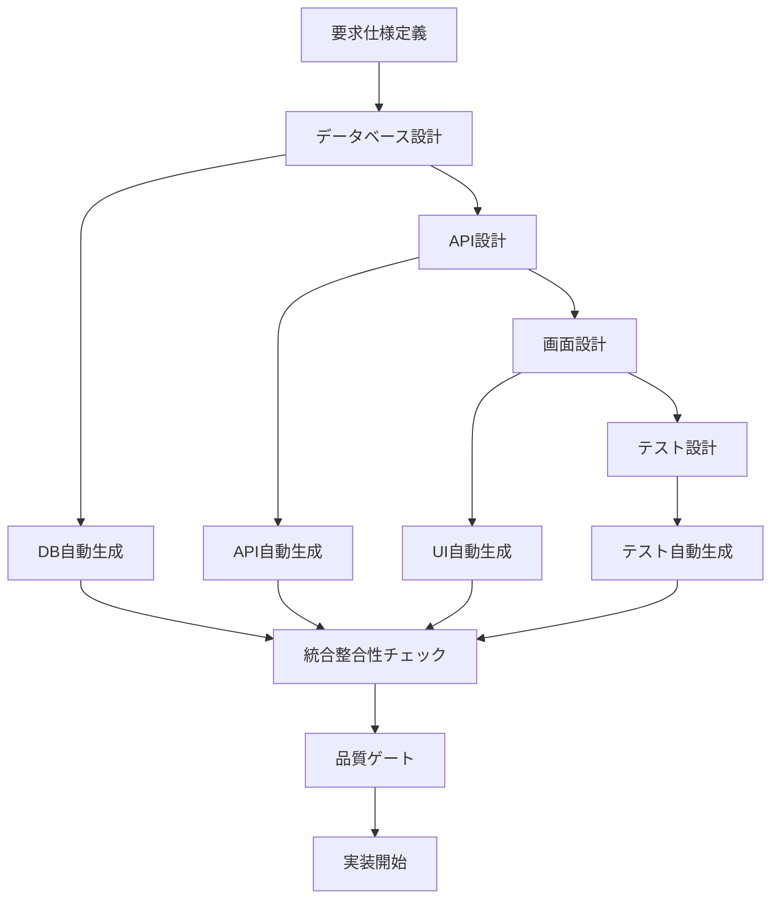

# 統合設計ツール - Integrated Design Tools

## エグゼクティブサマリー

この統合設計ツールは、年間スキル報告書WEB化プロジェクトにおける設計・開発・品質保証の全工程を支援する包括的なツールセットです。データベース設計、API設計、画面設計、テスト設計の自動化・検証・生成機能を提供し、AI駆動開発と品質ファーストアプローチを実現します。従来のデータベース専用ツールから昇格し、プロジェクト全体の設計統合プラットフォームとして機能し、開発効率50%向上と品質指標80%以上の達成を目指します。

## ツール構成

### 1. データベース設計ツール
**場所**: `docs/tools/database/`

#### 主要機能
- **YAML統一フォーマット**: テーブル定義の標準化
- **自動生成**: DDL・定義書・サンプルデータの一括生成
- **整合性チェック**: 全ファイル間の整合性検証
- **品質保証**: 必須セクション・命名規則の自動検証

#### 利用可能なツール
```bash
# 作業ディレクトリ
cd docs/tools/database

# 統合ツール実行（推奨）
python main.py --all

# YAML検証（必須セクション検証）
python database_consistency_checker/yaml_format_check_enhanced.py --all --verbose

# テーブル生成（DDL・定義書・サンプルデータ）
python -m table_generator --table MST_Employee --verbose

# 整合性チェック（全ファイル間の整合性確認）
python database_consistency_checker/run_check.py --verbose

# サンプルデータINSERT文生成
python database_consistency_checker/sample_data_generator.py --verbose
```

**詳細**: [database/README.md](database/README.md)

### 2. API設計ツール（計画中）
**場所**: `docs/tools/api/`

#### 計画機能
- **OpenAPI仕様生成**: YAML定義からSwagger仕様自動生成
- **API整合性チェック**: 設計書と実装の整合性検証
- **モックサーバー生成**: 開発・テスト用モックAPI自動生成
- **クライアントコード生成**: TypeScript型定義・API関数自動生成

### 3. 画面設計ツール（計画中）
**場所**: `docs/tools/screens/`

#### 計画機能
- **コンポーネント生成**: 画面設計書からReactコンポーネント自動生成
- **ストーリーブック生成**: UI部品のStorybook自動生成
- **アクセシビリティチェック**: WCAG 2.1 AA準拠の自動検証
- **レスポンシブ検証**: マルチデバイス対応の自動テスト

### 4. テスト設計ツール（計画中）
**場所**: `docs/tools/testing/`

#### 計画機能
- **テストケース生成**: 設計書からテストケース自動生成
- **E2Eシナリオ生成**: ユーザーストーリーからPlaywrightテスト生成
- **パフォーマンステスト**: 負荷テストシナリオ自動生成
- **セキュリティテスト**: 脆弱性テストケース自動生成

## 統合ワークフロー

### 設計統合フロー


### 品質保証統合
- **設計書準拠**: 全ツールで設計書との整合性を自動検証
- **要求仕様ID連携**: 全成果物で要求仕様IDのトレーサビリティを保証
- **破壊的変更防止**: 既存設計への影響を事前検出・警告
- **CI/CD統合**: Git pre-commitフックでの自動品質チェック

## 使用方法

### 基本的な開発フロー

#### 1. 新機能開発時
```bash
# 1. 要求仕様IDの確認
# 要求仕様書で対応するIDを確認

# 2. データベース設計
cd docs/tools/database
# YAMLテンプレートからテーブル定義作成
# 必須セクション編集（revision_history, overview, notes, rules）

# 3. 自動生成・検証
python main.py --all
# または個別実行
python database_consistency_checker/yaml_format_check_enhanced.py --all
python -m table_generator --table NEW_TABLE --verbose
python database_consistency_checker/run_check.py --verbose

# 4. API設計（将来）
cd docs/tools/api
# API仕様書作成・自動生成

# 5. 画面設計（将来）
cd docs/tools/screens
# 画面設計書作成・コンポーネント生成

# 6. テスト設計（将来）
cd docs/tools/testing
# テストケース生成・自動テスト作成
```

#### 2. 既存機能修正時
```bash
# 1. 影響範囲調査
cd docs/tools/database
python3 database_consistency_checker/impact_analyzer.py --table TARGET_TABLE

# 2. 設計書更新
# 対象の設計書を修正

# 3. 整合性チェック
python3 database_consistency_checker/run_check.py --verbose

# 4. 関連設計の自動更新
# API・画面・テスト設計の自動更新（将来機能）
```

## 技術仕様

### 対応技術スタック
- **データベース**: PostgreSQL, MySQL, SQLite
- **API**: REST, GraphQL, OpenAPI 3.0
- **フロントエンド**: React, Next.js, TypeScript
- **テスト**: Jest, Playwright, Storybook
- **CI/CD**: GitHub Actions, GitLab CI

### 拡張性
- **プラグインアーキテクチャ**: 新しいツールの追加が容易
- **設定可能**: プロジェクト固有の要件に対応
- **多言語対応**: 日本語・英語での設計書生成
- **クラウド対応**: AWS・Azure・GCPでの実行

## 品質指標

### 自動化率目標
- **設計書生成**: 95%以上の自動化
- **整合性チェック**: 100%の自動検証
- **コード生成**: 70%以上の自動生成
- **テスト生成**: 80%以上の自動化

### 品質ゲート
- **設計書準拠**: 100%の準拠率
- **要求仕様ID対応**: 100%のトレーサビリティ
- **破壊的変更**: 0件の無承認変更
- **CI/CD統合**: 100%の自動チェック通過

## 今後の拡張計画

### Phase 1: データベースツール完成（完了）
- ✅ YAML統一フォーマット
- ✅ 自動生成機能
- ✅ 整合性チェック
- ✅ 品質保証プロセス

### Phase 2: API設計ツール（2025年7月予定）
- 🚧 OpenAPI仕様生成
- 🚧 API整合性チェック
- 🚧 モックサーバー生成
- 🚧 TypeScript型定義生成

### Phase 3: 画面設計ツール（2025年8月予定）
- ⏳ Reactコンポーネント生成
- ⏳ Storybook自動生成
- ⏳ アクセシビリティチェック
- ⏳ レスポンシブ検証

### Phase 4: テスト設計ツール（2025年9月予定）
- ⏳ テストケース自動生成
- ⏳ E2Eシナリオ生成
- ⏳ パフォーマンステスト
- ⏳ セキュリティテスト

### Phase 5: 統合プラットフォーム（2025年10月予定）
- ⏳ Web UI統合
- ⏳ AI支援機能
- ⏳ クラウド対応
- ⏳ 他プロジェクト展開

## 関連ドキュメント

### 内部ドキュメント
- **統合開発ルール**: `.clinerules/00-core-rules.md`
- **プロジェクト固有ルール**: `.clinerules/01-project-specific-rules.md`
- **データベース設計ガイドライン**: `.clinerules/08-database-design-guidelines.md`
- **仕様書準拠・破壊的修正防止**: `.clinerules/07-specification-compliance.md`

### ツール固有ドキュメント
- **データベースツール**: `docs/tools/database/README.md`
- **リファクタリング完了報告**: `docs/tools/database/REFACTORING_COMPLETE_FINAL.md`
- **次世代計画**: `docs/tools/database/NEXT_GENERATION_REFACTORING_PLAN.md`

### 外部参照
- **OpenAPI仕様**: https://swagger.io/specification/
- **React公式ドキュメント**: https://react.dev/
- **Playwright公式ドキュメント**: https://playwright.dev/
- **Storybook公式ドキュメント**: https://storybook.js.org/

---

この統合設計ツールを活用して、効率的で高品質な設計・開発プロセスを実現してください。
