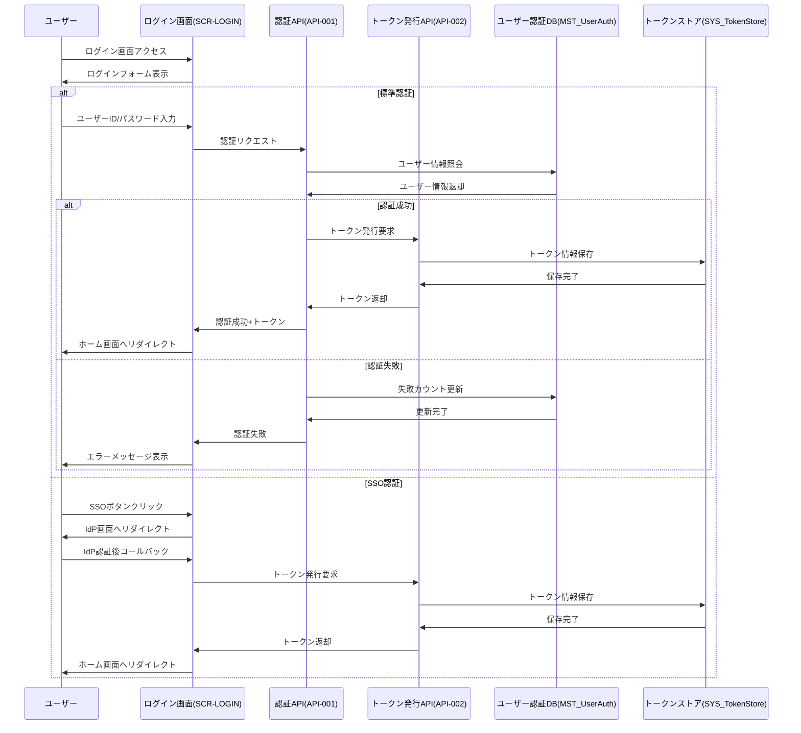

# インターフェース仕様書：ログイン認証 (IF-001)

| 項目                | 内容                                                                                |
|---------------------|------------------------------------------------------------------------------------|
| **インターフェースID** | IF-001                                                                          |
| **名称**            | ログイン認証                                                                        |
| **インターフェース方式** | 内部                                                                           |
| **インターフェース種別** | 画面-API                                                                       |
| **概要**            | ユーザーID・パスワード/SSOによる認証、トークン発行、アカウントロック管理              |
| **主な連携先**      | SCR-LOGIN → API-001/002                                                            |
| **主なAPI/バッチID** | API-001, API-002                                                                  |
| **主なテーブル/データ** | MST_UserAuth, SYS_TokenStore                                                    |
| **主な機能ID**      | F01                                                                                |
| **優先度**          | 最高                                                                                |
| **備考**            | SSO, アカウントロック対応                                                           |

## 1. インターフェース概要

ログイン認証インターフェース（IF-001）は、ユーザーがシステムにアクセスする際の認証処理を担当します。ユーザーIDとパスワードによる標準認証と、SSOによるシングルサインオン認証の両方をサポートし、認証成功時にはアクセストークンを発行します。また、連続した認証失敗に対するアカウントロック機能も提供します。

## 2. インターフェースフロー



## 3. リクエスト・レスポンス仕様

### 3.1 標準認証リクエスト (API-001)

**エンドポイント**: `/api/v1/auth/login`  
**メソッド**: POST  
**Content-Type**: application/json

**リクエスト例**:
```json
{
  "userId": "user123",
  "password": "P@ssw0rd",
  "rememberMe": true
}
```

**レスポンス例 (成功)**:
```json
{
  "status": "success",
  "token": "eyJhbGciOiJIUzI1NiIsInR5cCI6IkpXVCJ9...",
  "refreshToken": "eyJhbGciOiJIUzI1NiIsInR5cCI6IkpXVCJ9...",
  "expiresIn": 3600,
  "user": {
    "userId": "user123",
    "name": "山田 太郎",
    "role": "USER",
    "departmentCode": "D001",
    "departmentName": "開発部"
  }
}
```

**レスポンス例 (失敗)**:
```json
{
  "status": "error",
  "code": "AUTH_FAILED",
  "message": "ユーザーIDまたはパスワードが正しくありません",
  "remainingAttempts": 2
}
```

**レスポンス例 (アカウントロック)**:
```json
{
  "status": "error",
  "code": "ACCOUNT_LOCKED",
  "message": "アカウントがロックされています。管理者に連絡してください",
  "lockedUntil": "2025-05-30T06:00:00Z"
}
```

### 3.2 SSO認証コールバック (API-002)

**エンドポイント**: `/api/v1/auth/sso/callback`  
**メソッド**: GET  
**パラメータ**: IdP固有のパラメータ（code, state等）

**レスポンス例 (成功)**:
```json
{
  "status": "success",
  "token": "eyJhbGciOiJIUzI1NiIsInR5cCI6IkpXVCJ9...",
  "refreshToken": "eyJhbGciOiJIUzI1NiIsInR5cCI6IkpXVCJ9...",
  "expiresIn": 3600,
  "user": {
    "userId": "user123",
    "name": "山田 太郎",
    "role": "USER",
    "departmentCode": "D001",
    "departmentName": "開発部"
  }
}
```

## 4. データ項目定義

### 4.1 MST_UserAuthテーブル

| フィールド名 | データ型 | 必須 | 説明 |
|-------------|---------|------|------|
| user_id | String | ○ | ユーザーID（主キー） |
| password_hash | String | ○ | パスワードハッシュ値 |
| email | String | ○ | メールアドレス |
| status | String | ○ | アカウント状態（"ACTIVE"/"LOCKED"/"INACTIVE"） |
| failed_attempts | Integer | ○ | 連続失敗回数 |
| locked_until | DateTime | × | ロック解除予定日時 |
| last_login | DateTime | × | 最終ログイン日時 |
| sso_enabled | Boolean | ○ | SSO有効フラグ |
| sso_provider | String | × | SSOプロバイダ名 |
| sso_subject | String | × | SSO識別子 |
| created_at | DateTime | ○ | 作成日時 |
| updated_at | DateTime | ○ | 更新日時 |

### 4.2 SYS_TokenStoreテーブル

| フィールド名 | データ型 | 必須 | 説明 |
|-------------|---------|------|------|
| token_id | String | ○ | トークンID（主キー） |
| user_id | String | ○ | ユーザーID（外部キー） |
| token_type | String | ○ | トークンタイプ（"ACCESS"/"REFRESH"） |
| token_value | String | ○ | トークン値（ハッシュ化） |
| issued_at | DateTime | ○ | 発行日時 |
| expires_at | DateTime | ○ | 有効期限 |
| is_revoked | Boolean | ○ | 無効化フラグ |
| client_info | String | × | クライアント情報（ブラウザ/OS等） |
| ip_address | String | × | 発行元IPアドレス |
| created_at | DateTime | ○ | 作成日時 |

## 5. エラーハンドリング

| エラーコード | 説明 | HTTP ステータス | 対応方法 |
|-------------|------|----------------|---------|
| AUTH_FAILED | 認証失敗 | 401 | ユーザーIDまたはパスワードが正しくない場合に返却。失敗回数をカウントアップ |
| ACCOUNT_LOCKED | アカウントロック | 403 | 連続失敗回数が閾値を超えた場合に返却。ロック解除予定日時を含む |
| ACCOUNT_INACTIVE | アカウント無効 | 403 | 無効化されたアカウントでのログイン試行時に返却 |
| SSO_ERROR | SSO連携エラー | 400 | SSO認証プロセスでエラーが発生した場合に返却 |
| TOKEN_ERROR | トークンエラー | 500 | トークン生成・保存時にエラーが発生した場合に返却 |

## 6. セキュリティ要件

1. **パスワード要件**:
   - 8文字以上
   - 英大文字、英小文字、数字、特殊文字を含む
   - 過去3回分のパスワードと異なること

2. **アカウントロック**:
   - 連続5回の認証失敗でロック
   - 30分経過後に自動解除
   - 管理者による手動解除も可能

3. **トークン**:
   - JWTフォーマット
   - アクセストークン有効期間: 60分
   - リフレッシュトークン有効期間: 30日
   - トークンはHTTPSでのみ送受信

4. **SSO連携**:
   - SAML 2.0またはOIDC対応
   - IdPからの属性マッピングによるユーザー情報同期

## 7. 運用・監視要件

1. **ログ記録**:
   - 認証成功/失敗
   - アカウントロック/解除
   - トークン発行/無効化

2. **監視項目**:
   - 認証失敗率
   - アカウントロック発生数
   - 認証処理のレスポンスタイム

3. **アラート条件**:
   - 短時間での大量認証失敗（不正アクセス検知）
   - 特定IPからの連続認証失敗
   - 認証処理の異常なレスポンスタイム

## 8. 関連インターフェース

- [IF-002](./インターフェース仕様書_IF-002.md): 権限・ロール管理
- [IF-015](./インターフェース仕様書_IF-015.md): SSO認証・外部認証連携
- [IF-021](./インターフェース仕様書_IF-021.md): トークン管理

## 9. 改訂履歴

| 改訂日     | 改訂者 | 改訂内容                                         |
|------------|--------|--------------------------------------------------|
| 2025/05/29 | 初版   | 初版作成                                         |
