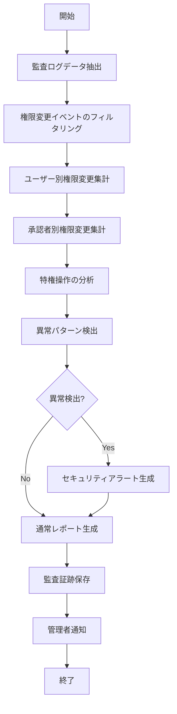

# バッチ仕様書：権限変更監査バッチ

| 項目                | 内容                                                                                |
|---------------------|------------------------------------------------------------------------------------|
| **バッチID**        | BATCH-003                                                                          |
| **バッチ名称**      | 権限変更監査バッチ                                                                  |
| **機能カテゴリ**    | 認証・認可                                                                          |
| **概要・目的**      | 権限変更履歴を集計し、監査証跡として出力することで、権限管理の透明性を確保する       |
| **バッチ種別**      | 定期バッチ                                                                          |
| **実行スケジュール**| 毎日深夜（2:00）                                                                    |
| **入出力対象**      | AuditLog                                                                            |
| **優先度**          | 高                                                                                  |
| **備考**            | 監査証跡レポート                                                                    |

## 1. 処理概要

権限変更監査バッチは、システム内で発生した権限変更操作（ロール割り当て、権限グループ変更、特権付与など）の履歴を集計・分析し、監査証跡として出力するバッチ処理です。権限変更の適切性を確認し、不正な権限昇格や権限変更の検出を支援します。また、コンプライアンス要件や内部監査に必要な証跡を自動的に生成・保存します。

## 2. 処理フロー



## 3. 入力データ

### 3.1 AuditLogテーブル

| フィールド名      | データ型 | 説明                                           |
|-------------------|----------|------------------------------------------------|
| log_id            | String   | ログID（主キー）                               |
| event_type        | String   | イベントタイプ（"PERMISSION_CHANGE"/"ROLE_ASSIGN"/"GROUP_CHANGE"など） |
| event_timestamp   | DateTime | イベント発生日時                               |
| actor_id          | String   | 操作実行者ID（外部キー）                       |
| target_id         | String   | 操作対象ID（外部キー）                         |
| target_type       | String   | 操作対象タイプ（"USER"/"ROLE"/"GROUP"など）    |
| action            | String   | 実行アクション（"ADD"/"REMOVE"/"MODIFY"など）  |
| old_value         | JSON     | 変更前の値（JSON形式）                         |
| new_value         | JSON     | 変更後の値（JSON形式）                         |
| ip_address        | String   | 操作元IPアドレス                               |
| user_agent        | String   | ユーザーエージェント                           |
| result            | String   | 結果（"SUCCESS"/"FAILURE"）                    |
| failure_reason    | String   | 失敗理由（失敗時のみ）                         |
| approver_id       | String   | 承認者ID（承認フローがある場合）               |
| created_at        | DateTime | 記録日時                                       |

### 3.2 UserRoleテーブル

| フィールド名      | データ型 | 説明                                           |
|-------------------|----------|------------------------------------------------|
| mapping_id        | String   | マッピングID（主キー）                         |
| user_id           | String   | ユーザーID（外部キー）                         |
| role_id           | String   | ロールID（外部キー）                           |
| assigned_at       | DateTime | 割り当て日時                                   |
| assigned_by       | String   | 割り当て者ID                                   |
| valid_from        | DateTime | 有効開始日時                                   |
| valid_to          | DateTime | 有効終了日時（nullの場合は無期限）             |
| status            | String   | ステータス（"ACTIVE"/"INACTIVE"）              |

### 3.3 RoleDefinitionテーブル

| フィールド名      | データ型 | 説明                                           |
|-------------------|----------|------------------------------------------------|
| role_id           | String   | ロールID（主キー）                             |
| role_name         | String   | ロール名                                       |
| description       | Text     | 説明                                           |
| is_privileged     | Boolean  | 特権ロールフラグ                               |
| permissions       | JSON     | 権限リスト（JSON形式）                         |
| created_at        | DateTime | 作成日時                                       |
| last_modified_at  | DateTime | 最終更新日時                                   |
| last_modified_by  | String   | 最終更新者                                     |

### 3.4 システム設定

| 設定項目                    | データ型 | デフォルト値 | 説明                                 |
|-----------------------------|----------|--------------|--------------------------------------|
| audit_log_retention_days    | Integer  | 365          | 監査ログの保持日数                   |
| permission_report_format    | String   | "PDF"        | レポート形式（"PDF"/"HTML"/"CSV"）   |
| notify_admin_on_privileged  | Boolean  | true         | 特権操作検出時の管理者通知有無       |
| suspicious_threshold        | Integer  | 5            | 不審権限変更判定閾値（日次変更数）   |
| report_storage_path         | String   | "/reports/audit" | 監査レポート保存パス             |

## 4. 出力データ

### 4.1 PermissionAuditSummaryテーブル（追加/更新）

| フィールド名      | データ型 | 説明                                           |
|-------------------|----------|------------------------------------------------|
| summary_id        | String   | サマリーID（主キー）                           |
| summary_date      | Date     | 集計日                                         |
| total_changes     | Integer  | 総権限変更数                                   |
| role_assignments  | Integer  | ロール割り当て数                               |
| role_removals     | Integer  | ロール削除数                                   |
| permission_changes| Integer  | 権限変更数                                     |
| privileged_changes| Integer  | 特権権限変更数                                 |
| suspicious_activities| Integer | 不審アクティビティ数                         |
| created_at        | DateTime | 作成日時                                       |
| created_by        | String   | "SYSTEM_BATCH"                                 |

### 4.2 PermissionAuditDetailテーブル（追加）

| フィールド名      | データ型 | 説明                                           |
|-------------------|----------|------------------------------------------------|
| detail_id         | String   | 詳細ID（主キー）                               |
| summary_id        | String   | サマリーID（外部キー）                         |
| user_id           | String   | ユーザーID（外部キー）                         |
| role_id           | String   | ロールID（外部キー、該当する場合）             |
| actor_id          | String   | 操作実行者ID                                   |
| event_type        | String   | イベントタイプ                                 |
| action            | String   | アクション                                     |
| event_timestamp   | DateTime | イベント発生日時                               |
| is_privileged     | Boolean  | 特権操作フラグ                                 |
| is_suspicious     | Boolean  | 不審操作フラグ                                 |
| log_id            | String   | 元ログID（外部キー）                           |
| created_at        | DateTime | 作成日時                                       |

### 4.3 SecurityAlertテーブル（追加）

| フィールド名      | データ型 | 説明                                           |
|-------------------|----------|------------------------------------------------|
| alert_id          | String   | アラートID（主キー）                           |
| alert_type        | String   | アラートタイプ（"UNAUTHORIZED_PRIVILEGE"/"MASS_PERMISSION_CHANGE"/"UNUSUAL_PATTERN"） |
| severity          | String   | 重要度（"LOW"/"MEDIUM"/"HIGH"/"CRITICAL"）     |
| actor_id          | String   | 操作実行者ID                                   |
| target_id         | String   | 操作対象ID                                     |
| description       | Text     | アラート詳細                                   |
| detection_time    | DateTime | 検知日時                                       |
| related_log_ids   | String   | 関連ログID（カンマ区切り）                     |
| status            | String   | ステータス（"NEW"/"ACKNOWLEDGED"/"RESOLVED"/"FALSE_POSITIVE"） |
| created_at        | DateTime | 作成日時                                       |
| created_by        | String   | "SYSTEM_BATCH"                                 |

### 4.4 権限変更監査レポート

**ファイル形式**: PDF/HTML/CSV（設定による）  
**ファイル名**: `permission_audit_report_YYYYMMDD.pdf`  
**レポート内容**:

1. **サマリー**
   - 日次権限変更統計（総変更数、ロール割り当て数、権限変更数）
   - 前日比較（増減率）
   - 不審アクティビティ数

2. **ユーザー別権限変更**
   - ユーザーごとの権限変更リスト
   - 新規付与された権限
   - 削除された権限

3. **特権操作分析**
   - 特権ロール割り当て一覧
   - 特権権限変更一覧
   - 承認状況

4. **操作者分析**
   - 操作者別の権限変更数
   - 管理者による操作一覧

5. **異常検出**
   - 検出された不審パターン一覧
   - 推奨アクション

6. **コンプライアンス情報**
   - 権限分離状況
   - 特権アカウント一覧
   - 監査要件対応状況

### 4.5 管理者通知

不審な権限変更が検出された場合、以下の内容で管理者に通知メールを送信：

- 件名：「【セキュリティアラート】不審な権限変更検出」
- 本文：
  - アラートタイプと重要度
  - 操作実行者情報
  - 操作対象情報
  - 検出された不審アクティビティの詳細
  - 推奨アクション
  - 管理画面へのリンク

## 5. エラー処理

| エラーケース                      | 対応方法                                                                 |
|-----------------------------------|--------------------------------------------------------------------------|
| 監査ログデータ不足                | 警告ログを記録し、利用可能なデータのみで処理を継続。                     |
| DBアクセスエラー                  | エラーログを記録し、管理者に通知。処理を中断。                           |
| レポート生成エラー                | エラーログを記録し、管理者に通知。集計データは保存済みの状態で終了。     |
| レポート保存エラー                | エラーログを記録し、管理者に通知。代替保存先に保存を試みる。             |
| 通知送信エラー                    | エラーログを記録。レポート生成は完了させ、通知エラーのみ管理者に報告。   |
| 設定値不正                        | デフォルト値を使用し、警告ログを記録。                                   |

## 6. 依存関係

- AuditLogテーブル
- UserRoleテーブル
- RoleDefinitionテーブル
- PermissionAuditSummaryテーブル
- PermissionAuditDetailテーブル
- SecurityAlertテーブル
- レポート生成サービス
- メール通知サービス
- ファイルストレージサービス

## 7. 実行パラメータ

| パラメータ名        | 必須 | デフォルト値 | 説明                                           |
|---------------------|------|--------------|------------------------------------------------|
| --target-date       | No   | 前日         | 対象日を指定（YYYY-MM-DD形式）                 |
| --report-format     | No   | 設定値       | レポート形式を上書き（"PDF"/"HTML"/"CSV"）     |
| --alert-only        | No   | false        | アラート検出のみ実行（レポート生成なし）       |
| --report-only       | No   | false        | レポート生成のみ実行（アラート検出なし）       |
| --skip-notification | No   | false        | 管理者通知をスキップ                           |
| --actor-id          | No   | null         | 特定操作者のみを対象とする場合に指定           |
| --target-id         | No   | null         | 特定操作対象のみを対象とする場合に指定         |

## 8. 実行例

```bash
# 通常実行（前日の権限変更を分析）
java -jar batch-executor.jar BATCH-003

# 特定日の権限変更を分析
java -jar batch-executor.jar BATCH-003 --target-date=2025-05-28

# HTML形式でレポート生成
java -jar batch-executor.jar BATCH-003 --report-format=HTML

# アラート検出のみ実行
java -jar batch-executor.jar BATCH-003 --alert-only

# 特定操作者の権限変更のみ分析
java -jar batch-executor.jar BATCH-003 --actor-id=U10023
```

## 9. 運用上の注意点

- 本バッチは毎日深夜に実行され、前日の権限変更履歴を分析します。
- セキュリティアラートは重要度に応じて対応が必要です。特に「HIGH」「CRITICAL」レベルのアラートは早急な確認が推奨されます。
- 監査レポートはコンプライアンス要件に基づいて保管されるため、`audit_log_retention_days` の設定値は法的要件を満たす必要があります。
- 大規模な組織変更や権限再構成が行われる場合は、事前に管理者に通知し、誤検知を防止することが推奨されます。
- 監査レポートは定期的にバックアップされ、改ざん防止のための措置が取られます。
- 特権操作の監査は特に重要であり、特権ロールの変更は常に詳細な監査が行われます。

## 10. 改訂履歴

| 改訂日     | 改訂者 | 改訂内容                                         |
|------------|--------|--------------------------------------------------|
| 2025/05/29 | 初版   | 初版作成                                         |
