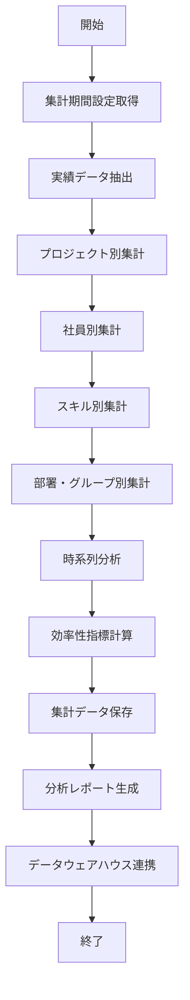

# バッチ仕様書：実績データ集約バッチ

| 項目                | 内容                                                                                |
|---------------------|------------------------------------------------------------------------------------|
| **バッチID**        | BATCH-009                                                                          |
| **バッチ名称**      | 実績データ集約バッチ                                                                |
| **機能カテゴリ**    | 作業実績管理                                                                        |
| **概要・目的**      | 案件実績データを集計・分析し、業務効率化や人材配置の最適化に活用する                 |
| **バッチ種別**      | 定期バッチ                                                                          |
| **実行スケジュール**| 毎日深夜（3:30）                                                                    |
| **入出力対象**      | ProjectRecord                                                                       |
| **優先度**          | 中                                                                                  |
| **備考**            |                                                                                     |

## 1. 処理概要

実績データ集約バッチは、システムに記録された案件・プロジェクトの作業実績データを集計・分析し、業務効率や人材活用の最適化に役立つ情報を提供するバッチ処理です。日次の作業記録から、プロジェクト別・社員別・スキル別などの多角的な視点で実績を集計し、傾向分析やリソース配分の判断材料となるレポートを生成します。また、蓄積されたデータを基に、将来の工数見積もりや人材配置の参考情報としても活用されます。

## 2. 処理フロー



## 3. 入力データ

### 3.1 ProjectRecordテーブル

| フィールド名      | データ型 | 説明                                           |
|-------------------|----------|------------------------------------------------|
| record_id         | String   | 実績記録ID（主キー）                           |
| emp_no            | String   | 社員番号（外部キー）                           |
| project_id        | String   | プロジェクトID（外部キー）                     |
| task_id           | String   | タスクID（外部キー）                           |
| work_date         | Date     | 作業日                                         |
| work_hours        | Double   | 作業時間（時間）                               |
| overtime_hours    | Double   | 残業時間（時間）                               |
| skill_used        | String   | 使用スキル（カンマ区切り）                     |
| work_type         | String   | 作業種別（"DEVELOPMENT"/"TESTING"/"MEETING"など）|
| work_description  | Text     | 作業内容                                       |
| deliverable       | Text     | 成果物                                         |
| status            | String   | ステータス（"DRAFT"/"SUBMITTED"/"APPROVED"）   |
| created_at        | DateTime | 作成日時                                       |
| created_by        | String   | 作成者                                         |
| approved_at       | DateTime | 承認日時                                       |
| approved_by       | String   | 承認者                                         |

### 3.2 Projectテーブル

| フィールド名      | データ型 | 説明                                           |
|-------------------|----------|------------------------------------------------|
| project_id        | String   | プロジェクトID（主キー）                       |
| project_name      | String   | プロジェクト名                                 |
| project_code      | String   | プロジェクトコード                             |
| client_id         | String   | 顧客ID（外部キー）                             |
| project_manager   | String   | プロジェクトマネージャー（社員番号）           |
| start_date        | Date     | 開始日                                         |
| end_date          | Date     | 終了日                                         |
| status            | String   | ステータス（"PLANNING"/"ACTIVE"/"COMPLETED"など）|
| total_budget_hours| Double   | 総予算工数（時間）                             |
| description       | Text     | 説明                                           |
| created_at        | DateTime | 作成日時                                       |
| last_modified_at  | DateTime | 最終更新日時                                   |

### 3.3 Taskテーブル

| フィールド名      | データ型 | 説明                                           |
|-------------------|----------|------------------------------------------------|
| task_id           | String   | タスクID（主キー）                             |
| project_id        | String   | プロジェクトID（外部キー）                     |
| task_name         | String   | タスク名                                       |
| task_type         | String   | タスク種別                                     |
| assignee          | String   | 担当者（社員番号）                             |
| planned_hours     | Double   | 予定工数（時間）                               |
| actual_hours      | Double   | 実績工数（時間）                               |
| start_date        | Date     | 開始日                                         |
| end_date          | Date     | 終了日                                         |
| status            | String   | ステータス（"TODO"/"IN_PROGRESS"/"DONE"など）  |
| priority          | Integer  | 優先度（1-5）                                  |
| created_at        | DateTime | 作成日時                                       |
| last_modified_at  | DateTime | 最終更新日時                                   |

### 3.4 Employeeテーブル

| フィールド名      | データ型 | 説明                                           |
|-------------------|----------|------------------------------------------------|
| emp_no            | String   | 社員番号（主キー）                             |
| name              | String   | 氏名                                           |
| dept_id           | String   | 所属部署ID（外部キー）                         |
| group_id          | String   | 所属グループID（外部キー）                     |
| position_id       | String   | 役職ID（外部キー）                             |
| email             | String   | メールアドレス                                 |
| status            | String   | ステータス（"ACTIVE"/"INACTIVE"）              |
| employment_type   | String   | 雇用形態（"FULL_TIME"/"CONTRACT"/"PART_TIME"） |
| join_date         | Date     | 入社日                                         |

### 3.5 システム設定

| 設定項目                    | データ型 | デフォルト値 | 説明                                 |
|-----------------------------|----------|--------------|--------------------------------------|
| record_aggregation_days     | Integer  | 30           | 集計対象期間（日数）                 |
| efficiency_threshold        | Double   | 0.8          | 効率性指標の閾値                     |
| data_warehouse_sync_enabled | Boolean  | true         | データウェアハウス連携有効/無効      |
| data_warehouse_connection   | String   | ""           | データウェアハウス接続情報（JSON形式）|
| report_storage_path         | String   | "/reports/performance" | レポート保存パス           |

## 4. 出力データ

### 4.1 ProjectPerformanceSummaryテーブル（追加/更新）

| フィールド名      | データ型 | 説明                                           |
|-------------------|----------|------------------------------------------------|
| summary_id        | String   | サマリーID（主キー）                           |
| project_id        | String   | プロジェクトID（外部キー）                     |
| summary_date      | Date     | 集計日                                         |
| period_start      | Date     | 集計期間開始日                                 |
| period_end        | Date     | 集計期間終了日                                 |
| total_hours       | Double   | 総作業時間                                     |
| total_overtime    | Double   | 総残業時間                                     |
| member_count      | Integer  | 参加メンバー数                                 |
| avg_daily_hours   | Double   | 平均日次作業時間                               |
| budget_consumption_rate | Double | 予算消化率                                 |
| efficiency_index  | Double   | 効率性指標                                     |
| created_at        | DateTime | 作成日時                                       |
| created_by        | String   | "SYSTEM_BATCH"                                 |

### 4.2 EmployeePerformanceSummaryテーブル（追加/更新）

| フィールド名      | データ型 | 説明                                           |
|-------------------|----------|------------------------------------------------|
| summary_id        | String   | サマリーID（主キー）                           |
| emp_no            | String   | 社員番号（外部キー）                           |
| summary_date      | Date     | 集計日                                         |
| period_start      | Date     | 集計期間開始日                                 |
| period_end        | Date     | 集計期間終了日                                 |
| total_hours       | Double   | 総作業時間                                     |
| total_overtime    | Double   | 総残業時間                                     |
| project_count     | Integer  | 参加プロジェクト数                             |
| task_count        | Integer  | 担当タスク数                                   |
| avg_daily_hours   | Double   | 平均日次作業時間                               |
| utilization_rate  | Double   | 稼働率                                         |
| skills_utilized   | JSON     | 活用スキル（JSON形式）                         |
| created_at        | DateTime | 作成日時                                       |
| created_by        | String   | "SYSTEM_BATCH"                                 |

### 4.3 SkillUtilizationSummaryテーブル（追加/更新）

| フィールド名      | データ型 | 説明                                           |
|-------------------|----------|------------------------------------------------|
| summary_id        | String   | サマリーID（主キー）                           |
| skill_id          | String   | スキルID（外部キー）                           |
| summary_date      | Date     | 集計日                                         |
| period_start      | Date     | 集計期間開始日                                 |
| period_end        | Date     | 集計期間終了日                                 |
| total_hours       | Double   | 総活用時間                                     |
| employee_count    | Integer  | 活用社員数                                     |
| project_count     | Integer  | 活用プロジェクト数                             |
| avg_hourly_rate   | Double   | 平均時間単価                                   |
| demand_trend      | Double   | 需要トレンド（前月比）                         |
| created_at        | DateTime | 作成日時                                       |
| created_by        | String   | "SYSTEM_BATCH"                                 |

### 4.4 DepartmentPerformanceSummaryテーブル（追加/更新）

| フィールド名      | データ型 | 説明                                           |
|-------------------|----------|------------------------------------------------|
| summary_id        | String   | サマリーID（主キー）                           |
| dept_id           | String   | 部署ID（外部キー）                             |
| summary_date      | Date     | 集計日                                         |
| period_start      | Date     | 集計期間開始日                                 |
| period_end        | Date     | 集計期間終了日                                 |
| total_hours       | Double   | 総作業時間                                     |
| total_overtime    | Double   | 総残業時間                                     |
| employee_count    | Integer  | 社員数                                         |
| project_count     | Integer  | 参加プロジェクト数                             |
| avg_utilization   | Double   | 平均稼働率                                     |
| top_skills        | JSON     | 主要活用スキル（JSON形式）                     |
| created_at        | DateTime | 作成日時                                       |
| created_by        | String   | "SYSTEM_BATCH"                                 |

### 4.5 実績分析レポート

**ファイル形式**: Excel (.xlsx)  
**ファイル名**: `performance_analysis_YYYYMMDD.xlsx`  
**シート構成**:

1. **サマリー**
   - 集計期間
   - 全体作業時間
   - 全体残業時間
   - アクティブプロジェクト数
   - 参加社員数
   - 平均稼働率

2. **プロジェクト分析**
   - プロジェクト別作業時間
   - 予算消化率
   - 効率性指標
   - 進捗状況

3. **社員分析**
   - 社員別作業時間
   - 稼働率
   - スキル活用状況
   - 残業傾向

4. **スキル分析**
   - スキル別活用時間
   - スキル需要トレンド
   - スキル別単価分析

5. **部署・グループ分析**
   - 部署別作業時間
   - グループ別稼働率
   - 組織間比較

6. **時系列分析**
   - 日次/週次/月次推移
   - 季節変動
   - 長期トレンド

### 4.6 データウェアハウス連携

設定が有効な場合、以下のデータをデータウェアハウスに連携：

- 日次実績データ
- 集計サマリーデータ
- 分析指標データ

## 5. エラー処理

| エラーケース                      | 対応方法                                                                 |
|-----------------------------------|--------------------------------------------------------------------------|
| 実績データ不足                    | 警告ログを記録し、利用可能なデータのみで処理を継続。                     |
| マスタデータ不整合                | 警告ログを記録し、整合性のあるデータのみで処理を継続。                   |
| DBアクセスエラー                  | エラーログを記録し、管理者に通知。処理を中断。                           |
| 集計処理エラー                    | エラーログを記録し、エラー発生箇所までの集計結果を保存。処理を中断。     |
| レポート生成エラー                | エラーログを記録し、管理者に通知。集計データは保存済みの状態で終了。     |
| データウェアハウス連携エラー      | エラーログを記録し、管理者に通知。集計・レポート処理は完了させる。       |
| 設定値不正                        | デフォルト値を使用し、警告ログを記録。                                   |

## 6. 依存関係

- ProjectRecordテーブル
- Projectテーブル
- Taskテーブル
- Employeeテーブル
- ProjectPerformanceSummaryテーブル
- EmployeePerformanceSummaryテーブル
- SkillUtilizationSummaryテーブル
- DepartmentPerformanceSummaryテーブル
- レポート生成サービス
- データウェアハウス連携サービス

## 7. 実行パラメータ

| パラメータ名        | 必須 | デフォルト値 | 説明                                           |
|---------------------|------|--------------|------------------------------------------------|
| --period-days       | No   | 設定値       | 集計対象期間を上書き（日数）                   |
| --start-date        | No   | null         | 集計開始日を指定（YYYY-MM-DD形式）             |
| --end-date          | No   | null         | 集計終了日を指定（YYYY-MM-DD形式）             |
| --project-id        | No   | null         | 特定プロジェクトのみを対象とする場合に指定     |
| --dept-id           | No   | null         | 特定部署のみを対象とする場合に指定             |
| --emp-no            | No   | null         | 特定社員のみを対象とする場合に指定             |
| --skip-report       | No   | false        | レポート生成をスキップ                         |
| --skip-dw-sync      | No   | false        | データウェアハウス連携をスキップ               |

## 8. 実行例

```bash
# 通常実行（デフォルト期間で集計）
java -jar batch-executor.jar BATCH-009

# 過去60日間のデータを集計
java -jar batch-executor.jar BATCH-009 --period-days=60

# 特定期間のデータを集計
java -jar batch-executor.jar BATCH-009 --start-date=2025-04-01 --end-date=2025-04-30

# 特定プロジェクトのみ集計
java -jar batch-executor.jar BATCH-009 --project-id=P10023

# 特定部署のみ集計
java -jar batch-executor.jar BATCH-009 --dept-id=D001

# 集計のみ実行（レポート生成とデータウェアハウス連携をスキップ）
java -jar batch-executor.jar BATCH-009 --skip-report --skip-dw-sync
```

## 9. 運用上の注意点

- 本バッチは毎日深夜に実行され、直近の実績データを集計・分析します。
- 集計対象期間は `record_aggregation_days` の設定に基づいて決定されますが、実行パラメータで上書きすることも可能です。
- 効率性指標が `efficiency_threshold` を下回るプロジェクトは、効率改善が必要な可能性があります。
- データウェアハウス連携を有効にする場合は、事前に接続情報の設定が必要です。
- 大量の実績データがある場合、処理時間が長くなる可能性があります。その場合は、集計期間を短くするか、特定のプロジェクトや部署に絞って実行することを検討してください。
- 実績データの入力遅延がある場合、集計結果が実態と乖離する可能性があります。そのため、重要な意思決定には複数日の集計結果を参照することを推奨します。
- レポートは経営層や管理者の意思決定支援に活用されるため、データの正確性と一貫性が重要です。

## 10. 改訂履歴

| 改訂日     | 改訂者 | 改訂内容                                         |
|------------|--------|--------------------------------------------------|
| 2025/05/29 | 初版   | 初版作成                                         |
