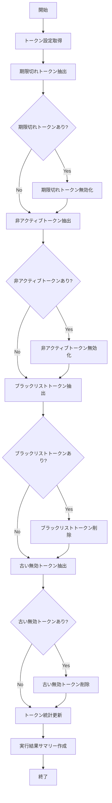

# バッチ仕様書：トークン無効化バッチ

| 項目                | 内容                                                                                |
|---------------------|------------------------------------------------------------------------------------|
| **バッチID**        | BATCH-017                                                                          |
| **バッチ名称**      | トークン無効化バッチ                                                                |
| **機能カテゴリ**    | 認証・認可                                                                          |
| **概要・目的**      | 有効期限切れ・不要な認証トークンを自動削除し、セキュリティとパフォーマンスを向上させる |
| **バッチ種別**      | 定期バッチ                                                                          |
| **実行スケジュール**| 毎時（0分）                                                                         |
| **入出力対象**      | 認証トークンストア                                                                  |
| **優先度**          | 高                                                                                  |
| **備考**            | セッション管理                                                                      |

## 1. 処理概要

トークン無効化バッチは、システムで発行された認証トークン（アクセストークン、リフレッシュトークン、セッショントークンなど）のうち、有効期限が切れたものや不要になったものを定期的に検出し、自動的に無効化・削除するバッチ処理です。これにより、トークンストアのサイズを最適に保ち、システムのパフォーマンスを維持するとともに、期限切れトークンの悪用リスクを低減し、セキュリティを強化します。また、ユーザーのアクティビティ状況に基づいて長期間使用されていないトークンを無効化することで、不正アクセスのリスクも軽減します。

## 2. 処理フロー



## 3. 入力データ

### 3.1 AuthTokenテーブル

| フィールド名      | データ型 | 説明                                           |
|-------------------|----------|------------------------------------------------|
| token_id          | String   | トークンID（主キー）                           |
| token_value       | String   | トークン値（ハッシュ化）                       |
| token_type        | String   | トークンタイプ（"ACCESS"/"REFRESH"/"SESSION"） |
| user_id           | String   | ユーザーID                                     |
| client_id         | String   | クライアントID                                 |
| scope             | String   | スコープ（カンマ区切り）                       |
| issued_at         | DateTime | 発行日時                                       |
| expires_at        | DateTime | 有効期限                                       |
| last_used_at      | DateTime | 最終使用日時                                   |
| is_revoked        | Boolean  | 無効化フラグ                                   |
| revoked_reason    | String   | 無効化理由                                     |
| revoked_at        | DateTime | 無効化日時                                     |
| ip_address        | String   | 発行元IPアドレス                               |
| user_agent        | String   | ユーザーエージェント                           |
| created_at        | DateTime | 作成日時                                       |

### 3.2 TokenBlacklistテーブル

| フィールド名      | データ型 | 説明                                           |
|-------------------|----------|------------------------------------------------|
| blacklist_id      | String   | ブラックリストID（主キー）                     |
| token_value       | String   | トークン値（ハッシュ化）                       |
| token_type        | String   | トークンタイプ                                 |
| user_id           | String   | ユーザーID                                     |
| reason            | String   | 理由                                           |
| added_at          | DateTime | 追加日時                                       |
| expires_at        | DateTime | 有効期限                                       |
| created_by        | String   | 作成者                                         |
| created_at        | DateTime | 作成日時                                       |

### 3.3 システム設定

| 設定項目                    | データ型 | デフォルト値 | 説明                                 |
|-----------------------------|----------|--------------|--------------------------------------|
| access_token_lifetime_minutes | Integer | 60          | アクセストークン有効期間（分）       |
| refresh_token_lifetime_days | Integer  | 30           | リフレッシュトークン有効期間（日）   |
| session_token_lifetime_hours | Integer | 24           | セッショントークン有効期間（時間）   |
| inactive_token_threshold_days | Integer | 7           | 非アクティブ判定閾値（日）           |
| revoked_token_retention_days | Integer | 30           | 無効化トークン保持期間（日）         |
| blacklist_retention_days    | Integer  | 90           | ブラックリスト保持期間（日）         |
| batch_size                  | Integer  | 1000         | バッチサイズ                         |
| log_token_operations        | Boolean  | true         | トークン操作ログ記録有無             |

## 4. 出力データ

### 4.1 AuthTokenテーブル（更新）

期限切れトークンと非アクティブトークンは以下のように更新されます：

| フィールド名      | データ型 | 説明                                           |
|-------------------|----------|------------------------------------------------|
| is_revoked        | Boolean  | true に更新                                    |
| revoked_reason    | String   | "EXPIRED" または "INACTIVE" に更新             |
| revoked_at        | DateTime | 現在日時に更新                                 |

### 4.2 TokenBlacklistテーブル（削除）

期限切れのブラックリストエントリが削除されます。

### 4.3 TokenOperationLogテーブル（追加）

| フィールド名      | データ型 | 説明                                           |
|-------------------|----------|------------------------------------------------|
| log_id            | String   | ログID（主キー）                               |
| operation_type    | String   | 操作タイプ（"REVOKE"/"DELETE"）                |
| token_id          | String   | トークンID                                     |
| token_type        | String   | トークンタイプ                                 |
| user_id           | String   | ユーザーID                                     |
| reason            | String   | 理由                                           |
| operation_date    | DateTime | 操作日時                                       |
| created_at        | DateTime | 作成日時                                       |
| created_by        | String   | "SYSTEM_BATCH"                                 |

### 4.4 TokenStatisticsテーブル（更新）

| フィールド名      | データ型 | 説明                                           |
|-------------------|----------|------------------------------------------------|
| stat_id           | String   | 統計ID（主キー）                               |
| stat_date         | Date     | 統計日                                         |
| token_type        | String   | トークンタイプ                                 |
| active_count      | Integer  | アクティブトークン数                           |
| revoked_count     | Integer  | 無効化トークン数                               |
| expired_count     | Integer  | 期限切れトークン数                             |
| inactive_count    | Integer  | 非アクティブトークン数                         |
| blacklisted_count | Integer  | ブラックリスト数                               |
| avg_lifetime_hours| Double   | 平均有効期間（時間）                           |
| created_at        | DateTime | 作成日時                                       |
| created_by        | String   | "SYSTEM_BATCH"                                 |

### 4.5 実行ログファイル

**ファイル形式**: テキスト (.log)  
**ファイル名**: `token_invalidation_YYYYMMDD_HH.log`  
**内容**:
- 実行開始・終了時刻
- 処理対象トークン数
- 無効化・削除したトークン数
- エラー情報（発生時）
- パフォーマンス統計

## 5. エラー処理

| エラーケース                      | 対応方法                                                                 |
|-----------------------------------|--------------------------------------------------------------------------|
| データベースアクセスエラー        | エラーログを記録し、リトライ。連続失敗時は処理を中断。                   |
| トランザクションエラー            | エラーログを記録し、トランザクションをロールバック。処理を継続。         |
| 大量トークン処理時のパフォーマンス低下 | 警告ログを記録し、バッチサイズを動的に調整。                        |
| ログ記録エラー                    | 警告ログを記録し、トークン処理は完了させる。                             |
| 統計更新エラー                    | 警告ログを記録し、トークン処理は完了させる。                             |
| 設定値不正                        | デフォルト値を使用し、警告ログを記録。                                   |

## 6. 依存関係

- AuthTokenテーブル
- TokenBlacklistテーブル
- TokenOperationLogテーブル
- TokenStatisticsテーブル
- システム設定テーブル

## 7. 実行パラメータ

| パラメータ名        | 必須 | デフォルト値 | 説明                                           |
|---------------------|------|--------------|------------------------------------------------|
| --token-type        | No   | null         | 特定トークンタイプのみを対象とする場合に指定   |
| --user-id           | No   | null         | 特定ユーザーのトークンのみを対象とする場合に指定 |
| --batch-size        | No   | 設定値       | バッチサイズを上書き                           |
| --force-all         | No   | false        | すべての無効トークンを強制的に削除             |
| --skip-blacklist    | No   | false        | ブラックリスト処理をスキップ                   |
| --skip-statistics   | No   | false        | 統計更新をスキップ                             |
| --dry-run           | No   | false        | 実行シミュレーションのみ（実際の処理なし）     |

## 8. 実行例

```bash
# 通常実行
java -jar batch-executor.jar BATCH-017

# 特定トークンタイプのみ処理
java -jar batch-executor.jar BATCH-017 --token-type=ACCESS

# 特定ユーザーのトークンのみ処理
java -jar batch-executor.jar BATCH-017 --user-id=U10023

# バッチサイズを変更して実行
java -jar batch-executor.jar BATCH-017 --batch-size=500

# すべての無効トークンを強制削除
java -jar batch-executor.jar BATCH-017 --force-all

# 実行シミュレーション（ドライラン）
java -jar batch-executor.jar BATCH-017 --dry-run
```

## 9. 運用上の注意点

- 本バッチは毎時0分に実行され、期限切れトークンや不要なトークンを定期的に無効化・削除します。
- トークンの無効化と削除は2段階で行われます。まず無効化（is_revoked=true）され、一定期間後に完全に削除されます。これにより、誤って無効化された場合でも一定期間は復旧が可能です。
- ブラックリストに登録されたトークンは、有効期限が切れるまでブラックリストに保持されます。これにより、無効化されたトークンの不正使用を防止します。
- 大量のトークンが存在する場合、処理時間が長くなる可能性があります。その場合は、`batch_size` の設定値を調整することを検討してください。
- トークン操作のログ記録は、`log_token_operations` の設定に基づいて行われます。セキュリティ監査が必要な環境では、この設定を有効にすることを推奨します。
- 本バッチの実行頻度（毎時）は、アクセストークンの有効期間（デフォルト60分）に合わせて設定されています。有効期間を変更する場合は、バッチの実行頻度も適宜調整することを検討してください。
- 非アクティブトークンの無効化は、長期間使用されていないトークンを自動的に無効化する機能です。ユーザーの利便性とセキュリティのバランスを考慮して、`inactive_token_threshold_days` の設定値を適切に調整してください。

## 10. 改訂履歴

| 改訂日     | 改訂者 | 改訂内容                                         |
|------------|--------|--------------------------------------------------|
| 2025/05/29 | 初版   | 初版作成                                         |
