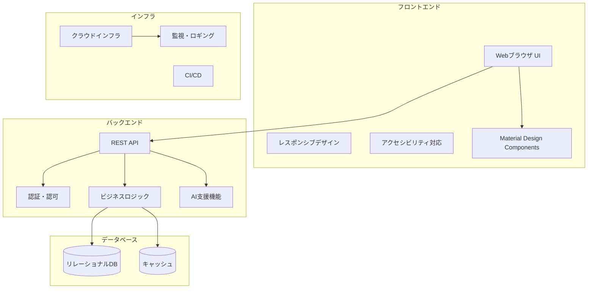
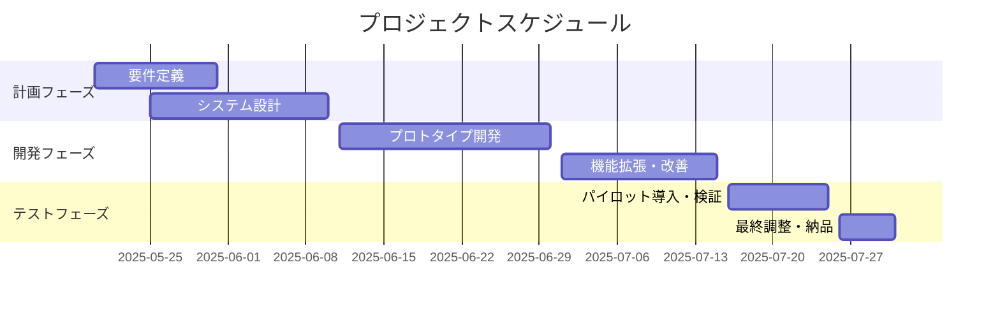

# プロジェクト基本情報

## 1. プロジェクト概要

- **プロジェクト名**: 年間スキル報告書WEB化PJT
- **プロジェクトコード**: AI-Smile Chain（エーアイスマイルチェーン）
- **プロジェクトID／管理番号**: SAS-DX-AI-2025-001
- **システム名／開発対象名**: スキル報告書管理システム（Skill Report Management System, SRMS）

### 1.1 プロジェクトの目的・背景

本プロジェクトは、以下の2つの主要目的を持っています：

- **AI駆動開発の知見獲得**：AI駆動型のチーム開発を実践し、今後の全社展開や他プロジェクトへの応用可能な知見・ベストプラクティスを確立する。AIアーキテクチャや技術スタックに関する知識を組織内に蓄積し、技術的な自律性と競争力を高める。

- **業務効率化と可視化の実現**：社内で毎年作成している「個人マスタースケジュール」や「スキル報告書」などの帳票業務をWeb化し、配布・回収・集計など手作業の負担を抜本的に削減する。帳票・人材情報の一元管理と可視化を通じて、社員・管理職・経営層がリアルタイムで状況を把握し、迅速かつ的確な意思決定を可能にする。

現行のExcelによる手作業（配布・記入・回収・集計・レビュー・フィードバック）では、作業負荷が大きく、データの一元管理や分析が困難な状況です。新システムでは、最新のWeb技術とAIを活用し、社員のスキル情報を可視化し、人材育成や適材適所の人員配置、組織全体のスキルギャップ分析などに活用することが可能になります。

### 1.2 解決したい課題や達成目標

1. **現状課題**
   - Excelによる手作業（配布・記入・回収・集計・レビュー・フィードバック）による作業負荷の増大
   - 記載内容や評価基準のバラつき・主観性
   - Excel中心の手作業による高い作業負荷と非効率
   - 定量的・客観的評価の不足
   - 情報共有・ナレッジ活用の限定

2. **達成目標**
   - **定量目標**: 3年間で約1,000万円のコスト削減、作業時間を現行の1.5時間から0.5時間へ短縮（67%削減）
   - **定性目標**: データ活用による経営判断の迅速化、業務の標準化・可視化、AI技術の組織内蓄積
   - 社員のスキル情報を一元管理し、検索・分析を容易にする
   - スキルマップやレポート機能により組織のスキル分布を可視化する
   - キャリアプラン・研修記録・作業実績を連携させ、人材育成を支援する
   - モバイル対応とアクセシビリティ向上により、利用率を向上させる
   - データ分析機能により、人材配置や育成計画の意思決定を支援する

## 2. 開発対象範囲・スコープ

### 2.1 システム構成・全体像



### 2.2 対象業務・対象外業務

#### 対象業務・システム構成
- **対象帳票**：個人マスタースケジュール、スキル報告書、年間作業報告書
- **対象ユーザー**：全社員（約100名）、管理職、経営層
- **年間処理件数**：3帳票 × 4回 × 100名 = 1,200回/年

#### 含まれるもの
- ユーザー認証機能（SSO対応）
- スキル入力・編集機能
- ダッシュボード表示機能
- 基本的なレポート機能
- 進捗管理・可視化機能
- AI支援機能（入力補助、自動チェック等）

#### 含まれないもの（対象外業務）
- 高度な分析機能（将来拡張として検討）
- 他システムとの連携（将来的な拡張可能性として検討）
- モバイルアプリ版（Webアプリのみ）
- 人事評価システムとの直接連携
- 給与計算・昇給査定
- 勤怠管理
- プロジェクト管理
- 経費精算

## 3. 開発体制・関係者

### 3.1 発注者（クライアント）情報

- **発注部署**：DX推進チーム・AI推進TF
- **最終承認者**：経営推進会議

### 3.2 開発ベンダー／担当部署・担当者

- **開発主体**：社内開発（DX推進チーム・AI推進TF）
- **責任者**：黒澤 (@yusuke-kurosawa) - kurosawa@sas-com.com
- **プロジェクトマネージャー（PM）**：中島 (@SAS-nakajima) - nakajima@sas-com.com
- **プロジェクトリーダー（PL）**：笹尾 (@SAS-sasao) - sasao@sas-com.com

### 3.3 プロジェクト体制

```mermaid
graph TD
    PM[プロジェクトマネージャー<br>中島 (@SAS-nakajima)] --> TL1[フロントエンドチーム<br>リーダー: 笹尾 (@SAS-sasao)]
    PM --> TL2[バックエンドチーム<br>リーダー: 笹尾 (@SAS-sasao)]
    PM --> TL3[インフラチーム<br>リーダー: 笹尾 (@SAS-sasao)]
    PM --> TL4[テストチーム<br>リーダー: 中島 (@SAS-nakajima)]
    
    TL1 --> FE1[フロントエンド開発者<br>柏崎・室山・市川・杉本・金子]
    TL2 --> BE1[バックエンド開発者<br>柏崎・室山・市川・杉本・金子]
    TL3 --> INFRA1[インフラエンジニア<br>笹尾 (@SAS-sasao)]
    TL4 --> TEST1[テストエンジニア<br>中島 (@SAS-nakajima)]
    
    CLIENT[クライアント<br>DX推進チーム・AI推進TF] --> PM
    RESP[責任者<br>黒澤 (@yusuke-kurosawa)] --> PM
    RESP --> CLIENT
```

### 3.4 主要メンバー・役割

| 役割 | 名前 / GitHub | 連絡先 | 担当領域 | 主な責任・業務内容 |
|------|--------------|-------|----------|-------------------|
| **責任者** | 黒澤 (@yusuke-kurosawa) | kurosawa@sas-com.com | **全体統括・意思決定** | プロジェクト全体の責任者として、戦略的意思決定、リソース配分、ステークホルダー調整、最終承認を担当 |
| **PM** | 中島 (@SAS-nakajima) | nakajima@sas-com.com | **プロジェクト管理・進捗統制** | スケジュール管理、リスク管理、品質管理、チーム調整、ステークホルダー報告、課題解決の推進を担当 |
| **PL** | 笹尾 (@SAS-sasao) | sasao@sas-com.com | **技術統括・開発リード** | 技術アーキテクチャ決定、開発標準策定、技術課題解決、コードレビュー、技術メンバーの指導を担当 |
| **業務L** | 黒澤 (@yusuke-kurosawa) | kurosawa@sas-com.com | **要件定義** | ビジネス要件の整理、機能要件・非機能要件の定義、ユーザーストーリー作成、受入基準策定を担当 |
| **業務L** | 黒澤 (@yusuke-kurosawa) | kurosawa@sas-com.com | **業務設計**<br>（画面設計、API設計、DB設計、バッチ設計、インターフェース設計） | 業務フロー設計、画面遷移・UI設計、REST API設計、データベース論理・物理設計、バッチ処理設計、外部システム連携設計を担当 |
| **フロントエンド開発L** | 笹尾 (@SAS-sasao) | sasao@sas-com.com | **UI/UX/フロントエンド**<br>（優先度最高・高） | ユーザーインターフェース設計、ユーザーエクスペリエンス設計、フロントエンド実装、レスポンシブ対応、アクセシビリティ対応を担当 |
| **フロントエンド開発メンバー** | 柏崎・室山・市川・杉本・金子 | - | **UI/UX/フロントエンド**<br>（優先度中） | 笹尾のサポートとして、フロントエンド開発の補助業務を担当 |
| **バックエンド開発L** | 笹尾 (@SAS-sasao) | sasao@sas-com.com | **バックエンド開発**<br>（優先度最高・高） | サーバーサイドロジック実装、API実装、データベース操作、セキュリティ実装、パフォーマンス最適化を担当 |
| **バックエンド開発メンバー** | 柏崎・室山・市川・杉本・金子 | - | **バックエンド開発**<br>（優先度中） | 笹尾のサポートとして、バックエンド開発の補助業務を担当 |
| **インフラL** | 笹尾 (@SAS-sasao) | sasao@sas-com.com | **インフラ・DBA** | インフラ環境構築、データベース管理、デプロイメント自動化、監視・運用設計、セキュリティ設定を担当 |
| **テストL** | 中島 (@SAS-nakajima) | nakajima@sas-com.com | **テスト・品質管理** | テスト計画策定、テストケース作成、自動テスト実装、品質保証、バグ管理、リリース判定を担当 |

## 4. プロジェクト期間・スケジュール

### 4.1 全体スケジュール

- **プロジェクト開始日**: 2025年5月20日
- **プロジェクト終了日**: 2025年7月31日（約2.5ヶ月）



### 4.2 主要マイルストーン

| マイルストーン | 予定日 | 成果物 |
|----------------|--------|--------|
| 要件定義・設計完了 | 2025/6/10 | 要件定義書、基本設計書、技術選定 |
| プロトタイプ完成 | 2025/6/30 | MVP（最小機能プロダクト） |
| 機能拡張・改善完了 | 2025/7/15 | 完成版アプリケーション |
| パイロット導入・検証 | 2025/7/25 | 検証レポート、改善版 |
| 最終成果物納品 | 2025/7/31 | 最終成果物一式 |

## 5. 予算・コスト

### 5.1 概算費用・予算枠

- **開発費用**：社内工数（人件費換算：約200万円相当、3ヶ月間）
- **インフラ・ツール費用**：約10万円（3ヶ月間）
- **将来的ROI**：投資回収期間2年以内、3年間で約1,000万円のコスト削減効果（本格運用時）

### 5.2 費用対効果分析

| 項目                   | 現行運用                    | Web化・AI導入後                | 計算式 |
|------------------------|-----------------------------|---------------------------------|--------|
| 年間レビュー回数       | 1,200回                     | 1,200回                         | 100名×3帳票×4回 |
| 1回あたり工数          | 1.5時間                     | 0.5時間                         |        |
| 年間総工数             | 1,800時間                   | 600時間                         | 1,200回×工数/回 |
| 年間人件費             | 7,200,000円                 | 2,400,000円                     | 総工数×4,000円 |
| 初期投資               | 0円                         | 3,000,000円                     | 固定   |
| 年間保守費             | 0円                         | 500,000円                       | 固定   |
| 3年間総コスト          | 21,600,000円                | 11,700,000円                    | 現行: 7,200,000円×3年<br>Web化: 3,000,000円＋(500,000円×3年)+(2,400,000円×3年) |
| 3年間コスト削減効果    | ―                           | 9,900,000円                     | 21,600,000円−11,700,000円 |

## 6. 納品物一覧

### 6.1 成果物・納品書類

1. **Webアプリケーション**（フロントエンド + バックエンド）
2. **技術文書・設計書**
   - システム設計書
   - API仕様書
   - データベース設計書
3. **AI駆動開発のナレッジベース**
   - 開発プロセス文書
   - ベストプラクティス集
   - 技術検証レポート
4. **ユーザーマニュアル**
   - 操作マニュアル
   - 管理者マニュアル
5. **運用・保守文書**
   - 運用手順書
   - 障害対応手順書

## 7. 開発・運用環境

### 7.1 ハードウェア／ソフトウェア要件

- **開発環境**：検討中（TBD）
- **本番環境**：クラウド環境（AWS/Azure等を検討中）
- **データベース**：検討中（PostgreSQL/MySQL等を検討中）
- **OS・ミドルウェア**：検討中（TBD）

### 7.2 ネットワーク・インフラ構成

- **セキュリティ**：ゼロトラストセキュリティ対応
- **アクセス制御**：SSO（Single Sign-On）対応
- **データ暗号化**：保存時・転送時の暗号化対応

### 7.3 非機能要件

| 項目 | 要件 |
|------|------|
| 可用性 | 稼働率99.9%以上（計画メンテナンス除く） |
| 性能 | 画面レスポンス1秒以内、API応答0.5秒以内 |
| 同時接続 | 最大500ユーザー同時接続 |
| バックアップ | 日次バックアップ、30日間保持 |
| セキュリティ | OWASP Top 10対応、年1回脆弱性診断実施 |
| 拡張性 | ユーザー数・データ量50%増加に対応可能な設計 |

## 8. 適用標準・ルール

### 8.1 開発手法・標準・ガイドライン

- **開発手法**：アジャイル開発（1週間スプリント）
- **AI協働開発**：AI駆動開発プロセスの実践
- **品質管理**：GitHub Pull Request + コードレビュー

### 8.2 コーディング規約・レビュー基準

- **コーディング規約**：`.cursor/rules/myrules.mdc`に準拠
- **UI設計**：Material Design Components（MDC Web）を優先使用
- **アクセシビリティ**：WCAG 2.1 AA相当対応

### 8.3 開発・検証の進め方

1. **イテレーション**: 1 週間スプリントで計画 → 実装 → レビュー（毎週金曜に週次レビュー実施）
2. **レビュー方法**: GitHub Pull Request + 毎週火曜日ステークホルダーミーティング
3. **バックログ管理**: Backlogでタスク管理を実施（画面ベースでチケット管理）
4. **変更管理**: ユーザーストーリー単位で Issue を起票し、必要に応じて仕様を更新
5. **WBSと工数管理**: [SharePointリンク](https://sasbusiness.sharepoint.com/:f:/r/sites/msteams_81e110_093265/Shared%20Documents/General/43_AI%E6%8E%A8%E9%80%B2TF/2025%E5%B9%B4%E5%BA%A6/AI%E9%A7%86%E5%8B%95%E9%96%8B%E7%99%BA/%E5%B9%B4%E9%96%93%E3%82%B9%E3%82%AD%E3%83%AB%E5%A0%B1%E5%91%8A%E6%9B%B8WEB%E5%8C%96PJT?csf=1&web=1&e=ZQJDLB)で管理（各メンバーは週次で工数実績を記録）

## 9. 連絡体制・報告ルール

### 9.1 連絡先・連絡方法

- **定例会議**：毎週火曜日ステークホルダーミーティング
- **週次レビュー**：毎週金曜日技術レビュー
- **緊急連絡**：Microsoft Teams、メール

### 9.2 会議体・定例報告の頻度

- **ステークホルダーミーティング**：週1回（火曜日）
- **技術レビュー**：週1回（金曜日）
- **スプリントレビュー**：1週間ごと
- **月次進捗報告**：経営推進会議への報告

## 10. リスク・課題管理

### 10.1 主要リスク・対応方針

- **スケジュールリスク**：短期間での開発 → MVP重視、段階的機能実装
- **技術リスク**：AI駆動開発の知見不足 → プロトタイプ検証による早期技術習得
- **品質リスク**：セキュリティ・プライバシー → 初期段階からのセキュリティ対策実装
- **運用リスク**：ユーザー受容性 → パイロット導入による段階的展開

### 10.2 課題管理方法

- **課題管理ツール**：Backlog
- **課題分類**：技術課題、業務課題、スケジュール課題
- **エスカレーション**：重要課題は責任者・PM・PLで即座に対応

## 11. 変更管理・承認フロー

### 11.1 変更管理プロセス

1. **変更要求**：ユーザーストーリー単位でIssue起票
2. **影響分析**：PM・PLによる影響範囲・工数見積もり
3. **承認**：責任者による承認（重要変更は経営推進会議承認）
4. **実装**：承認後の開発・テスト・リリース
5. **文書更新**：仕様書・マニュアル等の更新

## 12. 参考資料・関連ドキュメント一覧

### 12.1 社内参考資料

- [SAS2030経営計画書_DX推進詳細版_v3.0](https://sasbusiness.sharepoint.com/:p:/r/sites/msteams_81e110_093265/Shared%20Documents/%E3%83%9E%E3%83%8D%E3%82%B8%E3%83%A1%E3%83%B3%E3%83%88T/SAS2030%E8%A8%88%E7%94%BB%E7%AD%96%E5%AE%9A/02.%E3%83%AD%E3%83%BC%E3%83%AA%E3%83%B3%E3%82%B0/%E7%AC%AC3.0%E7%89%88/SAS2030%E7%B5%8C%E5%96%B6%E8%A8%88%E7%94%BB%E6%9B%B8_DX%E6%8E%A8%E9%80%B2%E8%A9%B3%E7%B4%B0%E7%89%88_v3.0.pptx?d=we84411bdba944deea167b87ec976cc6b&csf=1&web=1&e=SP3bK9)
- [DX推進全体定例_20250520](https://sasbusiness.sharepoint.com/:p:/r/sites/msteams_81e110_093265/Shared%20Documents/%E3%83%9E%E3%83%8D%E3%82%B8%E3%83%A1%E3%83%B3%E3%83%88T/DX%E6%96%B9%E9%87%9D/2025%E5%B9%B4%E5%BA%A6/DX%E6%8E%A8%E9%80%B2%E5%85%A8%E4%BD%93%E5%AE%9A%E4%BE%8B_20250520.pptx?d=wf9b6ebf9dba34b57b4989f7a6a8ff5c1&csf=1&web=1&e=K6n760)
- [【AI推進】2025年度キックオフ](https://sasbusiness.sharepoint.com/:p:/r/sites/msteams_81e110_093265/Shared%20Documents/General/99_%E3%82%A2%E3%83%BC%E3%82%AB%E3%82%A4%E3%83%96/43_AI%E6%8E%A8%E9%80%B2TF/2025%E5%B9%B4%E5%BA%A6/%E3%80%90AI%E6%8E%A8%E9%80%B2%E3%80%912025%E5%B9%B4%E5%BA%A6%E3%82%AD%E3%83%83%E3%82%AF%E3%82%AA%E3%83%95.pptx?d=wae26d43d5b6f48f5a1cc4f1ff9ad3783&csf=1&web=1&e=uWD4kn)
- [WBSと工数管理](https://sasbusiness.sharepoint.com/:f:/r/sites/msteams_81e110_093265/Shared%20Documents/General/43_AI%E6%8E%A8%E9%80%B2TF/2025%E5%B9%B4%E5%BA%A6/AI%E9%A7%86%E5%8B%95%E9%96%8B%E7%99%BA/%E5%B9%B4%E9%96%93%E3%82%B9%E3%82%AD%E3%83%AB%E5%A0%B1%E5%91%8A%E6%9B%B8WEB%E5%8C%96PJT?csf=1&web=1&e=ZQJDLB)

### 12.2 プロジェクト管理文書

- **memory-bank/**：AI駆動開発における文脈・設計・進捗情報の管理
- **.clinerules/**：AI開発ルール・ガイドライン
- **CustomInstructions/**：AIカスタムインストラクション

## 13. 改訂履歴

| 版数 | 改訂日 | 改訂者 | 改訂内容 |
|------|--------|--------|----------|
| 1.0 | 2025/05/20 | 黒澤 | 初版作成 |
| 1.1 | 2025/05/27 | 黒澤 | プロジェクト基本情報の詳細化・構造化、期間を2025年7月末まで修正 |
| 1.2 | 2025/05/28 | 黒澤 | READMEと要件定義の内容を反映して更新 |

## 14. 備考・特記事項

- **非機能要件**：セキュリティ（個人情報保護、アクセス制御）、可用性（99.9%稼働率目標）、運用・保守性（24時間監視体制）については、詳細設計フェーズで具体化
- **AI駆動開発の実験的側面**：本プロジェクトは技術検証・知見獲得も重要な目的であり、開発プロセス自体も成果物の一部として位置づける
- **短期集中開発**：3ヶ月という短期間でのMVP開発を重視し、プロトタイプ検証と段階的機能実装を行う
- **ユーザー受容性**：パイロット導入による段階的展開を行い、ユーザーフィードバックを積極的に取り入れる
- **拡張性**：将来的な機能拡張（高度な分析機能、他システム連携等）を見据えた設計を行う
- **データ移行**：既存のExcelデータからの移行手順を検討し、初期データ投入を効率的に行う
- **教育・トレーニング**：システム導入時にはユーザー向けトレーニングを実施し、スムーズな移行を支援する
