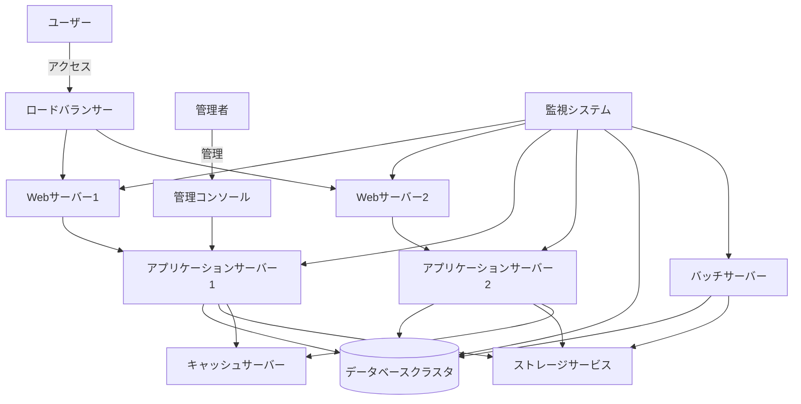
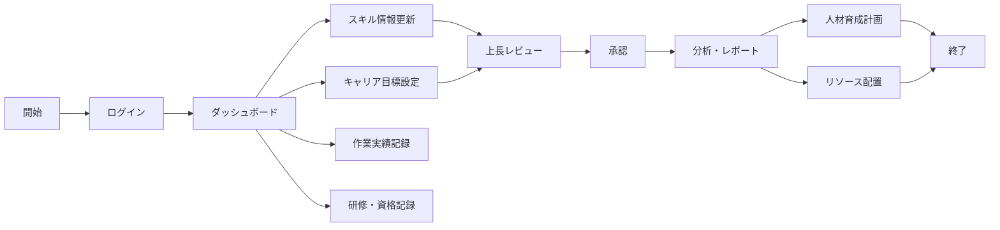

# プロジェクト基本情報

## 1. プロジェクト概要

### 1.1 プロジェクト名
年間スキル報告書WEB化プロジェクト

### 1.2 プロジェクトID／管理番号
SKILL-REPORT-WEB-2025

### 1.3 システム名／開発対象名
スキル報告書管理システム（Skill Report Management System）

### 1.4 プロジェクトの目的・背景
従来、紙やExcelで管理されていた年間スキル報告書をWEB化することで、社員のスキル情報の一元管理、効率的な情報収集、リアルタイムな分析を可能にし、人材育成と最適配置を促進する。また、スキル情報の可視化により、社員の自己啓発意欲を高め、組織全体の技術力向上を図る。

本プロジェクトは、2025年度の全社的なデジタルトランスフォーメーション推進計画の一環として位置づけられており、人材情報のデジタル化による経営判断の迅速化・高度化を実現する重要施策である。

### 1.5 解決したい課題
- 紙/Excel管理による情報分断と検索性の低さ
- スキル情報収集・集計作業の工数負荷（年間約500時間）
- スキル情報の鮮度低下と活用機会の損失
- 部門間でのスキル情報共有の困難さ
- キャリア目標と実績の連携不足
- 人材配置・育成計画立案における情報不足
- グローバル展開に向けた人材情報の標準化の遅れ

### 1.6 達成目標
- スキル情報の一元管理によるデータ活用促進
- 情報収集・集計作業の80%削減（年間約400時間の工数削減）
- リアルタイムなスキルマップ生成と人材配置最適化
- 社員のスキル向上とキャリア開発の促進
- 組織全体の技術力の可視化と戦略的な人材育成
- 部門間でのスキル情報共有率100%の実現
- 経営層への人材情報の迅速な提供（レポート生成時間を1週間→即時へ短縮）

## 2. 開発対象範囲・スコープ

### 2.1 システム構成・全体像

#### 2.1.1 システム機能構成
```
【スキル報告書管理システム】
┣━ ユーザー管理サブシステム
┃   ┣━ 認証・認可機能
┃   ┣━ プロフィール管理機能
┃   ┗━ 権限管理機能
┣━ スキル管理サブシステム
┃   ┣━ スキル情報登録・更新機能
┃   ┣━ スキル検索・閲覧機能
┃   ┗━ スキルマップ生成機能
┣━ キャリア管理サブシステム
┃   ┣━ 目標設定・管理機能
┃   ┗━ 進捗管理機能
┣━ 作業実績管理サブシステム
┃   ┣━ 作業実績登録機能
┃   ┣━ 作業実績一括登録機能
┃   ┗━ 作業実績分析機能
┣━ 研修・資格管理サブシステム
┃   ┣━ 研修記録管理機能
┃   ┗━ 資格情報管理機能
┣━ レポート・分析サブシステム
┃   ┣━ レポート生成機能
┃   ┗━ データ分析機能
┣━ 通知・アラートサブシステム
┃   ┣━ 通知管理機能
┃   ┗━ リマインダー機能
┗━ システム管理サブシステム
    ┣━ マスタデータ管理機能
    ┣━ システム設定機能
    ┗━ バッチ処理機能
```

#### 2.1.2 システム構成図


#### 2.1.3 業務フロー概要


### 2.2 対象業務・対象外業務

#### 対象業務
- スキル情報の登録・更新・閲覧
- キャリア目標の設定・進捗管理
- 作業実績の記録・分析
- 研修受講履歴・資格取得情報の管理
- スキル情報の検索・マッチング
- 各種レポート生成・データ分析
- 通知・アラート管理
- 組織情報の管理・参照
- 人材配置シミュレーション
- スキルギャップ分析

#### 対象外業務
- 人事評価・査定
- 給与計算・報酬管理
- 勤怠管理
- 経費精算
- プロジェクト管理
- 顧客情報管理
- 採用管理
- 福利厚生管理

## 3. 開発体制・関係者

### 3.1 発注者（クライアント）情報
- 発注部門：人事部 人材開発課
- 責任者：山田 太郎（課長）
- 連絡先：yamada.taro@example.com / 03-1234-5678

### 3.2 開発ベンダー／担当部署・担当者
- 開発部門：情報システム部 アプリケーション開発課
- 責任者：鈴木 一郎（課長）
- 連絡先：suzuki.ichiro@example.com / 03-1234-5679

### 3.3 プロジェクト体制
- プロジェクトスポンサー：佐藤 次郎（人事部長）
- プロジェクトマネージャー：鈴木 一郎（情報システム部 課長）
- 技術リーダー：田中 三郎（情報システム部 主任）
- 業務アナリスト：高橋 花子（人事部 主任）
- 開発チーム：5名（フロントエンド2名、バックエンド2名、インフラ1名）
- テストチーム：2名
- 運用担当：1名

### 3.4 ステークホルダー
- 経営層：経営戦略への活用
- 人事部：人材育成・配置計画への活用
- 各部門管理者：部下のスキル把握・育成計画
- 一般社員：自己スキル管理・キャリア開発
- 情報システム部：システム開発・運用

## 4. プロジェクト期間・スケジュール

### 4.1 全体スケジュール
- プロジェクト開始日：2025年4月1日
- プロジェクト終了日：2026年3月31日（予定）
- 総期間：12ヶ月

### 4.2 フェーズ別スケジュール
| フェーズ | 期間 | 主要マイルストーン |
|---------|------|------------------|
| 要件定義 | 2025年4月1日～5月31日 | 要件定義書承認 |
| 基本設計 | 2025年6月1日～7月31日 | 基本設計書承認 |
| 詳細設計 | 2025年8月1日～9月30日 | 詳細設計書承認 |
| 開発 | 2025年10月1日～12月31日 | コーディング完了 |
| テスト | 2026年1月1日～2月15日 | テスト完了 |
| 導入・移行 | 2026年2月16日～3月15日 | システム導入完了 |
| 安定化運用 | 2026年3月16日～3月31日 | 本番稼働安定化 |

### 4.3 主要マイルストーン
- 要件定義完了：2025年5月31日
- 基本設計完了：2025年7月31日
- 詳細設計完了：2025年9月30日
- 開発完了：2025年12月31日
- テスト完了：2026年2月15日
- 本番リリース：2026年3月15日
- プロジェクト完了：2026年3月31日

## 5. 予算・コスト

### 5.1 総予算
総額：5,000万円（税抜）

### 5.2 予算内訳
| 項目 | 金額（万円） | 備考 |
|------|------------|------|
| 要件定義 | 500 | 外部コンサルタント含む |
| 設計 | 1,000 | 基本設計・詳細設計 |
| 開発 | 2,000 | フロントエンド・バックエンド開発 |
| テスト | 800 | 単体・結合・総合テスト |
| 導入・移行 | 400 | データ移行、環境構築 |
| プロジェクト管理 | 300 | PM、会議体運営等 |

### 5.3 支払条件
- 契約時：総額の20%（1,000万円）
- 基本設計完了時：総額の20%（1,000万円）
- 詳細設計完了時：総額の20%（1,000万円）
- 開発完了時：総額の20%（1,000万円）
- 最終納品時：総額の20%（1,000万円）

## 6. 納品物一覧

### 6.1 ドキュメント
- 要件定義書
- 基本設計書
- 詳細設計書
- テスト計画書・結果報告書
- 操作マニュアル（一般ユーザー向け、管理者向け）
- 運用保守マニュアル
- 導入手順書
- 教育研修資料

### 6.2 ソフトウェア
- ソースコード一式
- 実行モジュール一式
- 設定ファイル一式
- データベーススクリプト一式
- テストデータ一式

### 6.3 その他成果物
- プロジェクト計画書
- 進捗報告書
- 議事録
- 課題管理表
- リスク管理表

## 7. 開発・運用環境

### 7.1 開発環境
- 開発言語：JavaScript/TypeScript、Java
- フロントエンド：React、Material Design Components
- バックエンド：Spring Boot
- データベース：PostgreSQL
- 開発ツール：Visual Studio Code、IntelliJ IDEA
- バージョン管理：Git/GitHub
- CI/CD：Jenkins
- コンテナ：Docker
- テスト自動化：Jest、JUnit、Selenium

### 7.2 テスト環境
- サーバー：AWS EC2（t3.large）
- OS：Amazon Linux 2
- ミドルウェア：Nginx、Tomcat
- データベース：PostgreSQL（RDS）
- 監視：CloudWatch
- テストデータ：本番データの匿名化コピー
- 負荷テストツール：JMeter

### 7.3 本番環境
- サーバー：AWS EC2（m5.xlarge）×2（冗長構成）
- OS：Amazon Linux 2
- ミドルウェア：Nginx、Tomcat
- データベース：PostgreSQL（Aurora）
- ロードバランサー：AWS ELB
- 監視：CloudWatch、Datadog
- バックアップ：日次フルバックアップ、1時間ごとの増分バックアップ
- DR対策：マルチAZ配置、リージョン間レプリケーション
- CDN：CloudFront（静的コンテンツ配信用）
- WAF：AWS WAF（Webアプリケーションファイアウォール）

### 7.4 クライアント環境
- 対応ブラウザ：Chrome（最新版）、Edge（最新版）、Firefox（最新版）、Safari（最新版）
- 対応デバイス：PC、タブレット（レスポンシブ対応）
- 最小画面解像度：1280×800
- オフライン対応：PWA（Progressive Web App）対応
- アクセシビリティ：WCAG 2.1 AA準拠

## 8. 適用標準・ルール

### 8.1 開発手法・標準
- 開発手法：アジャイル開発（スクラム）
- 設計手法：オブジェクト指向設計
- テスト手法：TDD（テスト駆動開発）
- UI設計：Material Design ガイドライン準拠

### 8.2 コーディング規約・レビュー基準
- JavaScript/TypeScript：Airbnb JavaScript Style Guide
- Java：Google Java Style Guide
- コードレビュー：プルリクエスト方式、最低1名のレビュー必須
- 静的解析：ESLint、SonarQube
- 単体テストカバレッジ：80%以上

### 8.3 ドキュメント標準
- 設計ドキュメント：UML 2.0準拠
- API仕様：OpenAPI（Swagger）形式
- コメント：JSDoc、Javadoc形式

## 9. 連絡体制・報告ルール

### 9.1 連絡先・連絡方法
- 定例連絡：メール、Slack
- 緊急連絡：電話、SMS
- 資料共有：SharePoint、Confluence

### 9.2 会議体・定例報告
- 週次進捗会議：毎週月曜日 10:00～11:00
- 月次報告会：毎月第1金曜日 13:00～15:00
- デイリースクラム：平日 9:30～9:45

### 9.3 報告フォーマット
- 週次進捗報告書：所定フォーマット
- 月次報告書：所定フォーマット
- 課題報告：JIRA

## 10. リスク・課題管理

### 10.1 主要リスク・対応方針
| リスク | 影響度 | 発生確率 | 対応方針 |
|-------|-------|---------|---------|
| 要件の追加・変更 | 高 | 中 | 変更管理プロセスの徹底、スコープ管理の強化 |
| 技術的課題の発生 | 中 | 中 | 早期PoC実施、技術検証の徹底 |
| リソース不足 | 高 | 低 | バックアップ要員の確保、スキル移転の促進 |
| スケジュール遅延 | 高 | 中 | バッファの確保、優先度に基づく機能実装 |
| セキュリティリスク | 高 | 低 | セキュリティレビューの実施、脆弱性診断の定期実施 |

### 10.2 課題管理方法
- 課題管理ツール：JIRA
- 課題報告フロー：発見者→担当者→PM→ステークホルダー
- エスカレーションルール：3日以上未解決の場合は上位者へエスカレーション

## 11. 変更管理・承認フロー

### 11.1 変更管理プロセス
1. 変更要求の提出（変更要求書）
2. 変更影響分析（スコープ・スケジュール・コスト）
3. 変更審査委員会での審議
4. 承認/却下の決定
5. 変更実施と計画更新

### 11.2 承認フロー
- 小規模変更（工数1人日未満）：PM承認
- 中規模変更（工数1～5人日）：PM＋発注者責任者承認
- 大規模変更（工数5人日以上）：変更審査委員会承認

## 12. 参考資料・関連ドキュメント一覧

### 12.1 参考資料
- 現行スキル報告書フォーマット
- 組織図・人員配置表
- 関連システム構成図
- 業務フロー図
- 人事システム連携仕様書
- 情報セキュリティポリシー
- 個人情報保護ガイドライン
- 社内システム開発標準

### 12.2 関連ドキュメント
- [要件定義書](要件定義.md)
- [API一覧](API一覧.md)
- [技術スタック選定](技術スタック選定.md)
- [画面一覧](画面一覧.md)
- [データベース設計書](DB設計書.md)
- [非機能要件定義書](非機能要件定義.md)
- [セキュリティ設計書](セキュリティ設計.md)
- [テスト計画書](テスト計画.md)

## 13. 非機能要件概要

### 13.1 性能要件
- 応答時間：画面表示3秒以内、データ処理5秒以内
- 同時接続ユーザー数：最大500ユーザー
- バッチ処理：日次処理は6時間以内に完了
- データ容量：初年度10GB、5年後50GB想定
- ピーク時のスループット：1分間に最大300リクエスト処理
- レポート生成：大規模レポートでも30秒以内に生成完了

### 13.2 可用性要件
- サービス稼働時間：24時間365日
- 計画停止：月1回（日曜日早朝2時間以内）
- 目標稼働率：99.9%以上（年間ダウンタイム8.76時間以内）
- 障害復旧時間：重大障害2時間以内、軽微障害8時間以内
- 障害検知：異常検知から5分以内にアラート通知
- バックアップからの復旧：24時間以内に完全復旧可能
- 災害対策：地理的に分散したバックアップと復旧手順の整備

### 13.3 セキュリティ要件
- 認証：多要素認証対応
- アクセス制御：ロールベースアクセス制御
- 通信暗号化：TLS 1.3
- データ暗号化：保存データの暗号化（AES-256）
- 監査ログ：全ての重要操作の記録と保存（1年間）
- 脆弱性対策：定期的なセキュリティテスト実施（四半期ごと）
- 不正アクセス検知：リアルタイム監視と自動遮断
- パスワードポリシー：複雑性要件、定期的な変更強制
- セッション管理：タイムアウト（30分）、同時ログイン制限
- データ漏洩防止：個人情報マスキング、アクセスログ監視

### 13.4 運用・保守性要件
- 監視体制：24時間自動監視
- バックアップ：日次フルバックアップ、1時間ごとの増分バックアップ
- 障害検知：自動アラート通知
- メンテナンス性：コンポーネント単位の更新が可能な設計
- 運用手順：自動化・マニュアル化の徹底
- パッチ適用：セキュリティパッチは72時間以内に適用
- 構成管理：Infrastructure as Code（IaC）による環境構成の一元管理
- ログ管理：集中ログ管理、検索可能なログ形式
- 障害対応：24時間対応体制、エスカレーションフロー整備
- 変更管理：変更影響の事前評価、ロールバック手順の整備

### 13.5 拡張性・移植性要件
- スケーラビリティ：水平スケーリング対応
- モジュール性：疎結合設計によるコンポーネント単位の拡張
- API対応：標準化されたRESTful API提供
- マルチテナント：将来的な複数組織対応を考慮した設計
- 国際化対応：多言語対応（日本語・英語）
- データ移行：他システムからのデータインポート機能
- クラウド移行：クラウドネイティブ設計
- バージョンアップ：ダウンタイム最小化のための段階的更新対応

## 14. 改訂履歴

| 版数 | 日付 | 改訂者 | 承認者 | 改訂内容 |
|------|------|-------|-------|---------|
| 1.0 | 2025/04/15 | 鈴木 一郎 | 佐藤 次郎 | 初版作成 |
| 1.1 | 2025/05/10 | 田中 三郎 | 佐藤 次郎 | 非機能要件の追加 |
| 1.2 | 2025/05/28 | 高橋 花子 | 山田 太郎 | プロジェクト基本情報の見直し・更新<br>・非機能要件の詳細化<br>・セキュリティ要件の強化<br>・運用・保守性要件の追加 |
