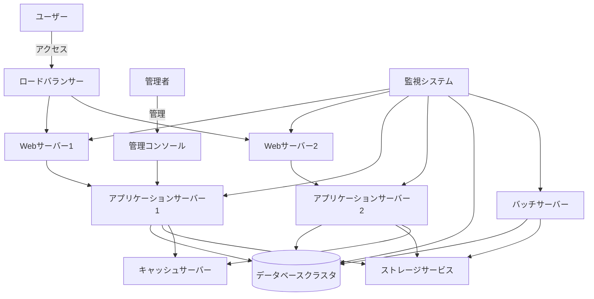
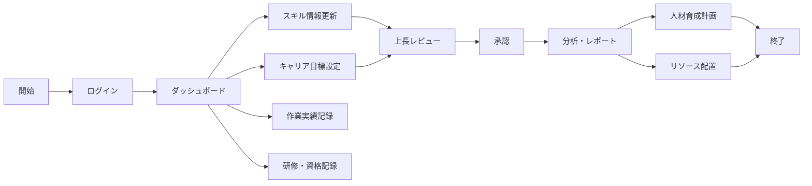

# プロジェクト基本情報

## 1. プロジェクト概要

### 1.1 プロジェクト名
年間スキル報告書WEB化プロジェクト

### 1.2 プロジェクトID／管理番号
SAS-DX-AI-2025-001

### 1.3 システム名／開発対象名
スキル報告書管理システム（Skill Report Management System, SRMS）

### 1.4 プロジェクトの目的・背景
従来、紙やExcelで管理されていた年間スキル報告書をWEB化することで、社員のスキル情報の一元管理、効率的な情報収集、リアルタイムな分析を可能にし、人材育成と最適配置を促進する。また、スキル情報の可視化により、社員の自己啓発意欲を高め、組織全体の技術力向上を図る。

本プロジェクトは、2025年度の全社的なデジタルトランスフォーメーション推進計画の一環として位置づけられており、人材情報のデジタル化による経営判断の迅速化・高度化を実現する重要施策である。

#### 1.4.1 ビジョン
社員一人ひとりの成長と組織の持続的な競争力向上を両立する"データドリブンな人材マネジメント文化"を実現し、業務の生産性と透明性を高めることで、組織全体の価値創造力を最大化する。

#### 1.4.2 目的
- **AI駆動開発の知見獲得**  
  AI駆動型のチーム開発を実践し、今後の全社展開や他プロジェクトへの応用可能な知見・ベストプラクティスを確立する。AIアーキテクチャや技術スタックに関する知識を組織内に蓄積し、技術的な自律性と競争力を高める。

- **業務効率化と可視化の実現**  
  社内で毎年作成している「個人マスタースケジュール」や「スキル報告書」などの帳票業務をWeb化し、配布・回収・集計など手作業の負担を抜本的に削減する。帳票・人材情報の一元管理と可視化を通じて、社員・管理職・経営層がリアルタイムで状況を把握し、迅速かつ的確な意思決定を可能にする。

#### 1.4.3 エス・エー・エスの基本方針との整合性
本プロジェクトは、エス・エー・エスの以下の基本方針に沿って推進される：

- **使命**: すべては笑顔のために ～世の中のすべての人を笑顔にする～
- **経営理念**: 常に質の高いサービスを提供し、会社のスキルアップを通じてSAS全メンバーの生活水準の向上を図ると共に社会の笑顔に貢献していく
- **経営ビジョン**: ITサービスで社会に笑顔をとどける会社になる
- **ブランドコンセプト**: Make IT Smile. / 社会に笑顔を実装するスマイルテック・カンパニー

#### 1.4.4 DX推進チーム基本方針との整合性
本プロジェクトは、DX推進チームの以下の基本方針に沿って推進される：

- **DX戦略 背景・目的**: 「ＩＴサービスで社会に笑顔をとどける会社になる」を実現するために、社内のIT導入促進・業務改善をメンバーと共に創り上げ、運営することでIT価値を体験できるよう変革し、SASの組織・事業価値を変革するための土台作りを推進していく
- **ビジョン**: DXを価値に変えよ -Success for SAS2030-
- **活動方針**: 
  1. 「人と社会に笑顔を届けるDX」を実現させるための社内DX活動推進をリードする
  2. DXを活用し、組織の競争力を強化し、持続的な成長を実現する
  3. SASメンバーの一人ひとりのスキルとキャリアの成長を加速する
  4. 変化に迅速に適用できる柔軟な組織の構築

#### 1.4.5 AI推進チーム基本方針との整合性
本プロジェクトは、AI推進チームの以下の基本方針に沿って推進される：

- **2030年(SAS2030)に向けての目的**: AIで業務効率化やストレス軽減を実現し、社会に時間的・精神的な余裕を創造することで笑顔を提供する
- **2025年度目的**: AI駆動開発を推進する基盤を作る、社内のAI利用を促進する

### 1.5 解決したい課題
#### 1.5.1 現状分析
- **個人マスタースケジュール**
  - 目的や記載範囲が個人・部署ごとに曖昧で、内容やレベルにバラつきがある
  - Excel等で個別運用されており、フォーマットや記載方法が統一されていない
  - 定期的な見直しや進捗更新が徹底されておらず、計画と実態の乖離が発生しやすい
  - 各スキル領域での目標設定が抽象的・主観的になりやすく、具体的なアクションや評価指標が不足
  - 昇進ポイントや評価基準が明確でなく、納得感やモチベーション向上に十分つながっていない

- **年間作業報告書**
  - 作成目的や記載範囲が個人によって曖昧で、全体像や規模感の把握が不十分なケースが多い
  - 統一されたフォーマットやガイドラインがなく、記載内容や粒度にバラつきがある
  - 記載内容が主観的になりやすく、プロジェクト規模やスキル実績の定量的な記録が不足
  - システム構成やアーキテクチャ情報の記載が曖昧・不足しがち
  - 手作業・個別ファイル（Excel等）による運用が多く、本人・上司ともに作業負荷が高い

- **スキル報告書**
  - スキル報告書の目的や記載範囲が個人によって曖昧になりやすく、自己評価の基準や粒度にバラつきがある
  - Excelでの個別運用が主流で、記載内容や評価方法の統一性が不足
  - 「×/△/○/◎」評価は主観的になりやすく、実際の業務成果やキャリア目標との整合性が弱いケースがある
  - 資格や研修履歴の記載が漏れがちで、最新情報の反映や一元管理が十分でない
  - セールスポイントの記載が抽象的・簡素で、具体的な強みや実績に基づくアピールが弱い

#### 1.5.2 主な課題
- 紙/Excel管理による情報分断と検索性の低さ
- スキル情報収集・集計作業の工数負荷（年間約500時間）
- スキル情報の鮮度低下と活用機会の損失
- 部門間でのスキル情報共有の困難さ
- キャリア目標と実績の連携不足
- 人材配置・育成計画立案における情報不足
- グローバル展開に向けた人材情報の標準化の遅れ
- 記載内容や評価基準のバラつき・主観性
- Excel中心の手作業による高い作業負荷と非効率
- 定量的・客観的評価の不足
- 情報共有・ナレッジ活用の限定

### 1.6 達成目標
#### 1.6.1 ビジネス成功基準
- スキル情報の一元管理によるデータ活用促進
- 情報収集・集計作業の80%削減（年間約400時間の工数削減）
- リアルタイムなスキルマップ生成と人材配置最適化
- 社員のスキル向上とキャリア開発の促進
- 組織全体の技術力の可視化と戦略的な人材育成
- 部門間でのスキル情報共有率100%の実現
- 経営層への人材情報の迅速な提供（レポート生成時間を1週間→即時へ短縮）
- 人材配置最適化による生産性5%向上
- 社員のスキル向上率前年比10%増加

#### 1.6.2 技術的成功基準
- 全ての機能要件の100%実装
- 非機能要件の達成率95%以上
- システム安定稼働率99.9%以上
- ユーザー満足度調査で80%以上の肯定的評価
- AI駆動開発の知見獲得とナレッジベースの構築

#### 1.6.3 プロジェクト管理成功基準
- 予算内での完遂（予算超過5%以内）
- スケジュール遵守（遅延2週間以内）
- スコープ変更の適切な管理（変更要求の90%以上を計画的に対応）
- ステークホルダー満足度85%以上

## 2. 開発対象範囲・スコープ

### 2.1 システム構成・全体像

#### 2.1.1 システム機能構成
```
【スキル報告書管理システム】
┣━ ユーザー管理サブシステム
┃   ┣━ 認証・認可機能
┃   ┣━ プロフィール管理機能
┃   ┗━ 権限管理機能
┣━ スキル管理サブシステム
┃   ┣━ スキル情報登録・更新機能
┃   ┣━ スキル検索・閲覧機能
┃   ┗━ スキルマップ生成機能
┣━ キャリア管理サブシステム
┃   ┣━ 目標設定・管理機能
┃   ┗━ 進捗管理機能
┣━ 作業実績管理サブシステム
┃   ┣━ 作業実績登録機能
┃   ┣━ 作業実績一括登録機能
┃   ┗━ 作業実績分析機能
┣━ 研修・資格管理サブシステム
┃   ┣━ 研修記録管理機能
┃   ┗━ 資格情報管理機能
┣━ レポート・分析サブシステム
┃   ┣━ レポート生成機能
┃   ┗━ データ分析機能
┣━ 通知・アラートサブシステム
┃   ┣━ 通知管理機能
┃   ┗━ リマインダー機能
┗━ システム管理サブシステム
    ┣━ マスタデータ管理機能
    ┣━ システム設定機能
    ┗━ バッチ処理機能
```

#### 2.1.2 システム構成図


#### 2.1.3 業務フロー概要


### 2.2 対象業務・対象外業務

#### 対象業務
- スキル情報の登録・更新・閲覧
- キャリア目標の設定・進捗管理
- 作業実績の記録・分析
- 研修受講履歴・資格取得情報の管理
- スキル情報の検索・マッチング
- 各種レポート生成・データ分析
- 通知・アラート管理
- 組織情報の管理・参照
- 人材配置シミュレーション
- スキルギャップ分析

#### 対象外業務
- 人事評価・査定
- 給与計算・報酬管理
- 勤怠管理
- 経費精算
- プロジェクト管理
- 顧客情報管理
- 採用管理
- 福利厚生管理

### 2.3 要求仕様カテゴリ

| カテゴリID | 名称 | 説明 |
| :--: | :-- | :-- |
| PLT | Platform | システム基盤要件 |
| ACC | Access Control | ユーザー権限管理 |
| PRO | Profile | 個人プロフィール管理 |
| SKL | Skill | スキル情報管理 |
| CAR | Career | 目標・キャリア管理 |
| WPM | Work Performance Mgmt | 作業実績管理 |
| TRN | Training | 研修・セミナー管理 |
| RPT | Report | レポート出力 |

### 2.4 データモデル概要

#### 2.4.1 主要エンティティ
- **ユーザ (User)**: 社員基本情報
- **個人マスタスケジュール (PersonalMasterSchedule)**: キャリア目標情報
- **スキル報告書 (SkillReport)**: スキル評価情報
- **年間作業報告書 (AnnualWorkReport)**: 作業実績情報
- **メンバー管理 (MemberManagement)**: 上司-部下関係管理

## 3. 開発体制・関係者

### 3.1 発注者（クライアント）情報
- 発注部署：DX推進チーム・AI推進TF
- 最終承認者：経営推進会議
- 責任者：黒澤 (@yusuke-kurosawa) - kurosawa@sas-com.com
- プロジェクトマネージャー（PM）：中島 (@SAS-nakajima) - nakajima@sas-com.com
- プロジェクトリーダー（PL）：笹尾 (@SAS-sasao) - sasao@sas-com.com

### 3.2 開発ベンダー／担当部署・担当者
- 開発主体：社内開発（DX推進チーム・AI推進TF）

### 3.3 プロジェクト体制
- プロジェクトスポンサー：経営推進会議
- プロジェクトマネージャー：中島 (@SAS-nakajima)
- プロジェクトリーダー：笹尾 (@SAS-sasao)
- 業務アナリスト：黒澤 (@yusuke-kurosawa)
- 開発チーム：5名（フロントエンド2名、バックエンド2名、インフラ1名）
- テストチーム：2名

### 3.4 主要メンバー・役割
| 役割 | 名前 / GitHub | 連絡先 | 担当領域 | 主な責任・業務内容 |
|------|--------------|-------|----------|-------------------|
| **責任者** | 黒澤 (@yusuke-kurosawa) | kurosawa@sas-com.com | **全体統括・意思決定** | プロジェクト全体の責任者として、戦略的意思決定、リソース配分、ステークホルダー調整、最終承認を担当 |
| **PM** | 中島 (@SAS-nakajima) | nakajima@sas-com.com | **プロジェクト管理・進捗統制** | スケジュール管理、リスク管理、品質管理、チーム調整、ステークホルダー報告、課題解決の推進を担当 |
| **PL** | 笹尾 (@SAS-sasao) | sasao@sas-com.com | **技術統括・開発リード** | 技術アーキテクチャ決定、開発標準策定、技術課題解決、コードレビュー、技術メンバーの指導を担当 |
| **業務L** | 黒澤 (@yusuke-kurosawa) | kurosawa@sas-com.com | **要件定義** | ビジネス要件の整理、機能要件・非機能要件の定義、ユーザーストーリー作成、受入基準策定を担当 |
| **業務L** | 黒澤 (@yusuke-kurosawa) | kurosawa@sas-com.com | **業務設計**<br>（画面設計、API設計、DB設計、バッチ設計、インターフェース設計） | 業務フロー設計、画面遷移・UI設計、REST API設計、データベース論理・物理設計、バッチ処理設計、外部システム連携設計を担当 |
| **フロントエンド開発L** | 笹尾 (@SAS-sasao) | sasao@sas-com.com | **UI/UX/フロントエンド**<br>（優先度最高・高） | ユーザーインターフェース設計、ユーザーエクスペリエンス設計、フロントエンド実装、レスポンシブ対応、アクセシビリティ対応を担当 |
| **フロントエンド開発メンバー** | 柏崎・室山・市川・杉本・金子 | - | **UI/UX/フロントエンド**<br>（優先度中） | 笹尾のサポートとして、フロントエンド開発の補助業務を担当 |
| **バックエンド開発L** | 笹尾 (@SAS-sasao) | sasao@sas-com.com | **バックエンド開発**<br>（優先度最高・高） | サーバーサイドロジック実装、API実装、データベース操作、セキュリティ実装、パフォーマンス最適化を担当 |
| **バックエンド開発メンバー** | 柏崎・室山・市川・杉本・金子 | - | **バックエンド開発**<br>（優先度中） | 笹尾のサポートとして、バックエンド開発の補助業務を担当 |
| **インフラL** | 笹尾 (@SAS-sasao) | sasao@sas-com.com | **インフラ・DBA** | インフラ環境構築、データベース管理、デプロイメント自動化、監視・運用設計、セキュリティ設定を担当 |
| **テストL** | 中島 (@SAS-nakajima) | nakajima@sas-com.com | **テスト・品質管理** | テスト計画策定、テストケース作成、自動テスト実装、品質保証、バグ管理、リリース判定を担当 |

## 4. プロジェクト期間・スケジュール

### 4.1 全体スケジュール
- プロジェクト開始日：2025年5月20日
- プロジェクト終了日：2025年7月31日
- 総期間：約2.5ヶ月

### 4.2 フェーズ別スケジュール
| フェーズ | 期間 | 主要マイルストーン |
|---------|------|------------------|
| 要件定義・設計 | 2025年5月20日～6月10日 | 要件定義書承認、基本設計書承認 |
| プロトタイプ開発 | 2025年6月11日～6月30日 | MVP（最小機能プロダクト）完成 |
| 機能拡張・改善 | 2025年7月1日～7月15日 | 完成版アプリケーション |
| パイロット導入・検証 | 2025年7月16日～7月25日 | 検証レポート、改善版 |
| 最終調整・納品 | 2025年7月26日～7月31日 | 最終成果物一式 |

### 4.3 主要マイルストーン
- 要件定義・設計完了：2025年6月10日
- プロトタイプ完成：2025年6月30日
- 完成版アプリケーション：2025年7月15日
- パイロット検証完了：2025年7月25日
- 最終納品：2025年7月31日

## 5. 予算・コスト

### 5.1 概算費用・予算枠
- **開発費用**：社内工数（人件費換算：約200万円相当、3ヶ月間）
- **インフラ・ツール費用**：約10万円（3ヶ月間）
- **将来的ROI**：投資回収期間2年以内、3年間で約1,000万円のコスト削減効果（本格運用時）

### 5.2 費用対効果分析

| 項目                   | 現行運用                    | Web化・AI導入後                | 計算式 |
|------------------------|-----------------------------|---------------------------------|--------|
| 年間レビュー回数       | 1,200回                     | 1,200回                         | 100名×3帳票×4回 |
| 1回あたり工数          | 1.5時間                     | 0.5時間                         |        |
| 年間総工数             | 1,800時間                   | 600時間                         | 1,200回×工数/回 |
| 年間人件費             | 7,200,000円                 | 2,400,000円                     | 総工数×4,000円 |
| 初期投資               | 0円                         | 3,000,000円                     | 固定   |
| 年間保守費             | 0円                         | 500,000円                       | 固定   |
| 3年間総コスト          | 21,600,000円                | 11,700,000円                    | 現行: 7,200,000円×3年<br>Web化: 3,000,000円＋(500,000円×3年)+(2,400,000円×3年) |
| 3年間コスト削減効果    | ―                           | 9,900,000円                     | 21,600,000円−11,700,000円 |

## 6. 納品物一覧

### 6.1 成果物・納品書類
1. **Webアプリケーション**（フロントエンド + バックエンド）
2. **技術文書・設計書**
   - システム設計書
   - API仕様書
   - データベース設計書
3. **AI駆動開発のナレッジベース**
   - 開発プロセス文書
   - ベストプラクティス集
   - 技術検証レポート
4. **ユーザーマニュアル**
   - 操作マニュアル
   - 管理者マニュアル
5. **運用・保守文書**
   - 運用手順書
   - 障害対応手順書

## 7. 開発・運用環境

### 7.1 開発環境
- 開発言語：TypeScript
- フレームワーク：Next.js 14（React 18ベース）
- ORM：Prisma
- データベース：PostgreSQL 15
- 認証：NextAuth.js
- UI：Tailwind CSS + shadcn/ui
- バリデーション：Zod
- API：tRPC（型安全なAPI）
- 開発ツール：Visual Studio Code、Cursor
- バージョン管理：Git/GitHub
- CI/CD：GitHub Actions
- コンテナ：Docker + Docker Compose
- テスト自動化：Vitest + Testing Library
- AI開発支援：Cline（Claude）、Cursor
- memory-bank：AI駆動開発におけるコンテキスト管理
- .clinerules：AI駆動開発におけるルール管理

### 7.2 テスト環境
- ホスティング：Vercel（プレビュー環境）
- データベース：Supabase PostgreSQL / Neon PostgreSQL
- コンテナ：Docker + Docker Compose
-
