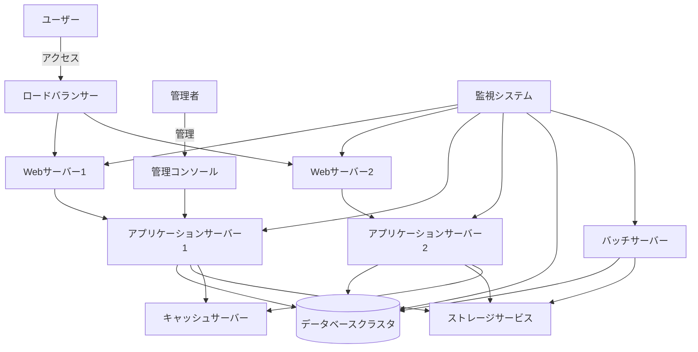
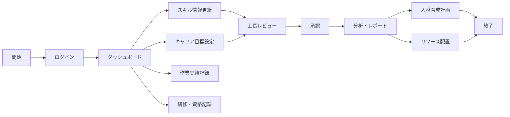

# プロジェクト基本情報

## 1. プロジェクト概要

### 1.1 プロジェクト名
年間スキル報告書WEB化プロジェクト

### 1.2 プロジェクトID／管理番号
SAS-DX-AI-2025-001

### 1.3 システム名／開発対象名
スキル報告書管理システム（Skill Report Management System, SRMS）

### 1.4 プロジェクトの目的・背景
従来、紙やExcelで管理されていた年間スキル報告書をWEB化することで、社員のスキル情報の一元管理、効率的な情報収集、リアルタイムな分析を可能にし、人材育成と最適配置を促進する。また、スキル情報の可視化により、社員の自己啓発意欲を高め、組織全体の技術力向上を図る。

本プロジェクトは、2025年度の全社的なデジタルトランスフォーメーション推進計画の一環として位置づけられており、人材情報のデジタル化による経営判断の迅速化・高度化を実現する重要施策である。

#### 1.4.1 ビジョン
社員一人ひとりの成長と組織の持続的な競争力向上を両立する"データドリブンな人材マネジメント文化"を実現し、業務の生産性と透明性を高めることで、組織全体の価値創造力を最大化する。

#### 1.4.2 目的
- **AI駆動開発の知見獲得**  
  AI駆動型のチーム開発を実践し、今後の全社展開や他プロジェクトへの応用可能な知見・ベストプラクティスを確立する。AIアーキテクチャや技術スタックに関する知識を組織内に蓄積し、技術的な自律性と競争力を高める。

- **業務効率化と可視化の実現**  
  社内で毎年作成している「個人マスタースケジュール」や「スキル報告書」などの帳票業務をWeb化し、配布・回収・集計など手作業の負担を抜本的に削減する。帳票・人材情報の一元管理と可視化を通じて、社員・管理職・経営層がリアルタイムで状況を把握し、迅速かつ的確な意思決定を可能にする。

#### 1.4.3 エス・エー・エスの基本方針との整合性
本プロジェクトは、エス・エー・エスの以下の基本方針に沿って推進される：

- **使命**: すべては笑顔のために ～世の中のすべての人を笑顔にする～
- **経営理念**: 常に質の高いサービスを提供し、会社のスキルアップを通じてSAS全メンバーの生活水準の向上を図ると共に社会の笑顔に貢献していく
- **経営ビジョン**: ITサービスで社会に笑顔をとどける会社になる
- **ブランドコンセプト**: Make IT Smile. / 社会に笑顔を実装するスマイルテック・カンパニー

#### 1.4.4 DX推進チーム基本方針との整合性
本プロジェクトは、DX推進チームの以下の基本方針に沿って推進される：

- **DX戦略 背景・目的**: 「ＩＴサービスで社会に笑顔をとどける会社になる」を実現するために、社内のIT導入促進・業務改善をメンバーと共に創り上げ、運営することでIT価値を体験できるよう変革し、SASの組織・事業価値を変革するための土台作りを推進していく
- **ビジョン**: DXを価値に変えよ -Success for SAS2030-
- **活動方針**: 
  1. 「人と社会に笑顔を届けるDX」を実現させるための社内DX活動推進をリードする
  2. DXを活用し、組織の競争力を強化し、持続的な成長を実現する
  3. SASメンバーの一人ひとりのスキルとキャリアの成長を加速する
  4. 変化に迅速に適用できる柔軟な組織の構築

#### 1.4.5 AI推進チーム基本方針との整合性
本プロジェクトは、AI推進チームの以下の基本方針に沿って推進される：

- **2030年(SAS2030)に向けての目的**: AIで業務効率化やストレス軽減を実現し、社会に時間的・精神的な余裕を創造することで笑顔を提供する
- **2025年度目的**: AI駆動開発を推進する基盤を作る、社内のAI利用を促進する

### 1.5 解決したい課題
#### 1.5.1 現状分析
- **個人マスタースケジュール**
  - 目的や記載範囲が個人・部署ごとに曖昧で、内容やレベルにバラつきがある
  - Excel等で個別運用されており、フォーマットや記載方法が統一されていない
  - 定期的な見直しや進捗更新が徹底されておらず、計画と実態の乖離が発生しやすい
  - 各スキル領域での目標設定が抽象的・主観的になりやすく、具体的なアクションや評価指標が不足
  - 昇進ポイントや評価基準が明確でなく、納得感やモチベーション向上に十分つながっていない

- **年間作業報告書**
  - 作成目的や記載範囲が個人によって曖昧で、全体像や規模感の把握が不十分なケースが多い
  - 統一されたフォーマットやガイドラインがなく、記載内容や粒度にバラつきがある
  - 記載内容が主観的になりやすく、プロジェクト規模やスキル実績の定量的な記録が不足
  - システム構成やアーキテクチャ情報の記載が曖昧・不足しがち
  - 手作業・個別ファイル（Excel等）による運用が多く、本人・上司ともに作業負荷が高い

- **スキル報告書**
  - スキル報告書の目的や記載範囲が個人によって曖昧になりやすく、自己評価の基準や粒度にバラつきがある
  - Excelでの個別運用が主流で、記載内容や評価方法の統一性が不足
  - 「×/△/○/◎」評価は主観的になりやすく、実際の業務成果やキャリア目標との整合性が弱いケースがある
  - 資格や研修履歴の記載が漏れがちで、最新情報の反映や一元管理が十分でない
  - セールスポイントの記載が抽象的・簡素で、具体的な強みや実績に基づくアピールが弱い

#### 1.5.2 主な課題
- 紙/Excel管理による情報分断と検索性の低さ
- スキル情報収集・集計作業の工数負荷（年間約500時間）
- スキル情報の鮮度低下と活用機会の損失
- 部門間でのスキル情報共有の困難さ
- キャリア目標と実績の連携不足
- 人材配置・育成計画立案における情報不足
- グローバル展開に向けた人材情報の標準化の遅れ
- 記載内容や評価基準のバラつき・主観性
- Excel中心の手作業による高い作業負荷と非効率
- 定量的・客観的評価の不足
- 情報共有・ナレッジ活用の限定

### 1.6 達成目標
#### 1.6.1 ビジネス成功基準
- スキル情報の一元管理によるデータ活用促進
- 情報収集・集計作業の80%削減（年間約400時間の工数削減）
- リアルタイムなスキルマップ生成と人材配置最適化
- 社員のスキル向上とキャリア開発の促進
- 組織全体の技術力の可視化と戦略的な人材育成
- 部門間でのスキル情報共有率100%の実現
- 経営層への人材情報の迅速な提供（レポート生成時間を1週間→即時へ短縮）
- 人材配置最適化による生産性5%向上
- 社員のスキル向上率前年比10%増加

#### 1.6.2 技術的成功基準
- 全ての機能要件の100%実装
- 非機能要件の達成率95%以上
- システム安定稼働率99.9%以上
- ユーザー満足度調査で80%以上の肯定的評価
- AI駆動開発の知見獲得とナレッジベースの構築

#### 1.6.3 プロジェクト管理成功基準
- 予算内での完遂（予算超過5%以内）
- スケジュール遵守（遅延2週間以内）
- スコープ変更の適切な管理（変更要求の90%以上を計画的に対応）
- ステークホルダー満足度85%以上

## 2. 開発対象範囲・スコープ

### 2.1 システム構成・全体像

#### 2.1.1 システム機能構成
```
【スキル報告書管理システム】
┣━ ユーザー管理サブシステム
┃   ┣━ 認証・認可機能
┃   ┣━ プロフィール管理機能
┃   ┗━ 権限管理機能
┣━ スキル管理サブシステム
┃   ┣━ スキル情報登録・更新機能
┃   ┣━ スキル検索・閲覧機能
┃   ┗━ スキルマップ生成機能
┣━ キャリア管理サブシステム
┃   ┣━ 目標設定・管理機能
┃   ┗━ 進捗管理機能
┣━ 作業実績管理サブシステム
┃   ┣━ 作業実績登録機能
┃   ┣━ 作業実績一括登録機能
┃   ┗━ 作業実績分析機能
┣━ 研修・資格管理サブシステム
┃   ┣━ 研修記録管理機能
┃   ┗━ 資格情報管理機能
┣━ レポート・分析サブシステム
┃   ┣━ レポート生成機能
┃   ┗━ データ分析機能
┣━ 通知・アラートサブシステム
┃   ┣━ 通知管理機能
┃   ┗━ リマインダー機能
┗━ システム管理サブシステム
    ┣━ マスタデータ管理機能
    ┣━ システム設定機能
    ┗━ バッチ処理機能
```

#### 2.1.2 システム構成図


#### 2.1.3 業務フロー概要


### 2.2 対象業務・対象外業務

#### 対象業務
- スキル情報の登録・更新・閲覧
- キャリア目標の設定・進捗管理
- 作業実績の記録・分析
- 研修受講履歴・資格取得情報の管理
- スキル情報の検索・マッチング
- 各種レポート生成・データ分析
- 通知・アラート管理
- 組織情報の管理・参照
- 人材配置シミュレーション
- スキルギャップ分析

#### 対象外業務
- 人事評価・査定
- 給与計算・報酬管理
- 勤怠管理
- 経費精算
- プロジェクト管理
- 顧客情報管理
- 採用管理
- 福利厚生管理

### 2.3 要求仕様カテゴリ

| カテゴリID | 名称 | 説明 |
| :--: | :-- | :-- |
| PLT | Platform | システム基盤要件 |
| ACC | Access Control | ユーザー権限管理 |
| PRO | Profile | 個人プロフィール管理 |
| SKL | Skill | スキル情報管理 |
| CAR | Career | 目標・キャリア管理 |
| WPM | Work Performance Mgmt | 作業実績管理 |
| TRN | Training | 研修・セミナー管理 |
| RPT | Report | レポート出力 |

### 2.4 データモデル概要

#### 2.4.1 主要エンティティ
- **ユーザ (User)**: 社員基本情報
- **個人マスタスケジュール (PersonalMasterSchedule)**: キャリア目標情報
- **スキル報告書 (SkillReport)**: スキル評価情報
- **年間作業報告書 (AnnualWorkReport)**: 作業実績情報
- **メンバー管理 (MemberManagement)**: 上司-部下関係管理

## 3. 開発体制・関係者

### 3.1 発注者（クライアント）情報
- 発注部署：DX推進チーム・AI推進TF
- 最終承認者：経営推進会議
- 責任者：黒澤 (@yusuke-kurosawa) - kurosawa@sas-com.com
- プロジェクトマネージャー（PM）：中島 (@SAS-nakajima) - nakajima@sas-com.com
- プロジェクトリーダー（PL）：笹尾 (@SAS-sasao) - sasao@sas-com.com

### 3.2 開発ベンダー／担当部署・担当者
- 開発主体：社内開発（DX推進チーム・AI推進TF）

### 3.3 プロジェクト体制
- プロジェクトスポンサー：経営推進会議
- プロジェクトマネージャー：中島 (@SAS-nakajima)
- プロジェクトリーダー：笹尾 (@SAS-sasao)
- 業務アナリスト：黒澤 (@yusuke-kurosawa)
- 開発チーム：5名（フロントエンド2名、バックエンド2名、インフラ1名）
- テストチーム：2名

### 3.4 主要メンバー・役割
| 役割 | 名前 / GitHub | 連絡先 | 担当領域 | 主な責任・業務内容 |
|------|--------------|-------|----------|-------------------|
| **責任者** | 黒澤 (@yusuke-kurosawa) | kurosawa@sas-com.com | **全体統括・意思決定** | プロジェクト全体の責任者として、戦略的意思決定、リソース配分、ステークホルダー調整、最終承認を担当 |
| **PM** | 中島 (@SAS-nakajima) | nakajima@sas-com.com | **プロジェクト管理・進捗統制** | スケジュール管理、リスク管理、品質管理、チーム調整、ステークホルダー報告、課題解決の推進を担当 |
| **PL** | 笹尾 (@SAS-sasao) | sasao@sas-com.com | **技術統括・開発リード** | 技術アーキテクチャ決定、開発標準策定、技術課題解決、コードレビュー、技術メンバーの指導を担当 |
| **業務L** | 黒澤 (@yusuke-kurosawa) | kurosawa@sas-com.com | **要件定義** | ビジネス要件の整理、機能要件・非機能要件の定義、ユーザーストーリー作成、受入基準策定を担当 |
| **業務L** | 黒澤 (@yusuke-kurosawa) | kurosawa@sas-com.com | **業務設計**<br>（画面設計、API設計、DB設計、バッチ設計、インターフェース設計） | 業務フロー設計、画面遷移・UI設計、REST API設計、データベース論理・物理設計、バッチ処理設計、外部システム連携設計を担当 |
| **フロントエンド開発L** | 笹尾 (@SAS-sasao) | sasao@sas-com.com | **UI/UX/フロントエンド**<br>（優先度最高・高） | ユーザーインターフェース設計、ユーザーエクスペリエンス設計、フロントエンド実装、レスポンシブ対応、アクセシビリティ対応を担当 |
| **フロントエンド開発メンバー** | 柏崎・室山・市川・杉本・金子 | - | **UI/UX/フロントエンド**<br>（優先度中） | 笹尾のサポートとして、フロントエンド開発の補助業務を担当 |
| **バックエンド開発L** | 笹尾 (@SAS-sasao) | sasao@sas-com.com | **バックエンド開発**<br>（優先度最高・高） | サーバーサイドロジック実装、API実装、データベース操作、セキュリティ実装、パフォーマンス最適化を担当 |
| **バックエンド開発メンバー** | 柏崎・室山・市川・杉本・金子 | - | **バックエンド開発**<br>（優先度中） | 笹尾のサポートとして、バックエンド開発の補助業務を担当 |
| **インフラL** | 笹尾 (@SAS-sasao) | sasao@sas-com.com | **インフラ・DBA** | インフラ環境構築、データベース管理、デプロイメント自動化、監視・運用設計、セキュリティ設定を担当 |
| **テストL** | 中島 (@SAS-nakajima) | nakajima@sas-com.com | **テスト・品質管理** | テスト計画策定、テストケース作成、自動テスト実装、品質保証、バグ管理、リリース判定を担当 |

## 4. プロジェクト期間・スケジュール

### 4.1 全体スケジュール
- プロジェクト開始日：2025年5月20日
- プロジェクト終了日：2025年7月31日
- 総期間：約2.5ヶ月

### 4.2 フェーズ別スケジュール
| フェーズ | 期間 | 主要マイルストーン |
|---------|------|------------------|
| 要件定義・設計 | 2025年5月20日～6月10日 | 要件定義書承認、基本設計書承認 |
| プロトタイプ開発 | 2025年6月11日～6月30日 | MVP（最小機能プロダクト）完成 |
| 機能拡張・改善 | 2025年7月1日～7月15日 | 完成版アプリケーション |
| パイロット導入・検証 | 2025年7月16日～7月25日 | 検証レポート、改善版 |
| 最終調整・納品 | 2025年7月26日～7月31日 | 最終成果物一式 |

### 4.3 主要マイルストーン
- 要件定義・設計完了：2025年6月10日
- プロトタイプ完成：2025年6月30日
- 完成版アプリケーション：2025年7月15日
- パイロット検証完了：2025年7月25日
- 最終納品：2025年7月31日

## 5. 予算・コスト

### 5.1 概算費用・予算枠
- **開発費用**：社内工数（人件費換算：約200万円相当、3ヶ月間）
  - 開発者人件費：160万円（5名×32万円/月×1ヶ月）
  - PM/PL人件費：30万円（2名×15万円/月×1ヶ月）
  - テスト人件費：10万円（2名×5万円/月×1ヶ月）
- **インフラ・ツール費用**：約10万円（3ヶ月間）
  - クラウドインフラ：6万円（2万円/月×3ヶ月）
  - 開発ツール：4万円（ライセンス費用等）
- **予備費**：約20万円（総予算の約10%）
- **総予算**：約230万円
- **将来的ROI**：投資回収期間2年以内、3年間で約1,000万円のコスト削減効果（本格運用時）

### 5.2 費用対効果分析

| 項目                   | 現行運用                    | Web化・AI導入後                | 計算式 |
|------------------------|-----------------------------|---------------------------------|--------|
| 年間レビュー回数       | 1,200回                     | 1,200回                         | 100名×3帳票×4回 |
| 1回あたり工数          | 1.5時間                     | 0.5時間                         |        |
| 年間総工数             | 1,800時間                   | 600時間                         | 1,200回×工数/回 |
| 年間人件費             | 7,200,000円                 | 2,400,000円                     | 総工数×4,000円 |
| 初期投資               | 0円                         | 3,000,000円                     | 固定   |
| 年間保守費             | 0円                         | 500,000円                       | 固定   |
| 3年間総コスト          | 21,600,000円                | 11,700,000円                    | 現行: 7,200,000円×3年<br>Web化: 3,000,000円＋(500,000円×3年)+(2,400,000円×3年) |
| 3年間コスト削減効果    | ―                           | 9,900,000円                     | 21,600,000円−11,700,000円 |

### 5.3 予算管理計画
- **予算管理責任者**：中島（PM）
- **予算執行承認者**：黒澤（責任者）
- **予算管理方法**：
  - 週次での予算執行状況レビュー
  - 月次での予算進捗レポート作成
  - 予算超過リスクの早期検知と対策立案
- **予算変更プロセス**：
  - 10%未満の変更：PM承認
  - 10%以上の変更：責任者承認
  - 20%以上の変更：経営推進会議承認

## 6. 納品物一覧

### 6.1 成果物・納品書類
1. **Webアプリケーション**（フロントエンド + バックエンド）
   - ソースコード一式
   - ビルド済みアプリケーション
   - デプロイメントスクリプト
2. **技術文書・設計書**
   - システム設計書
   - API仕様書
   - データベース設計書
   - 画面設計書
   - テスト仕様書
3. **AI駆動開発のナレッジベース**
   - 開発プロセス文書
   - ベストプラクティス集
   - 技術検証レポート
   - AI活用事例集
4. **ユーザーマニュアル**
   - 一般ユーザー向け操作マニュアル
   - 管理者向けマニュアル
   - よくある質問（FAQ）
5. **運用・保守文書**
   - 運用手順書
   - 障害対応手順書
   - バックアップ・リストア手順書
   - 監視設定ドキュメント
   - セキュリティ対策ドキュメント

### 6.2 納品形式・納品方法
- **ソースコード**：GitHubリポジトリ
- **ドキュメント**：Markdown形式（GitHubリポジトリ内）
- **アプリケーション**：Vercelにデプロイ済み状態
- **納品方法**：リポジトリアクセス権限の付与およびデプロイ環境のアクセス情報提供

### 6.3 納品スケジュール
- **中間納品**：2025年6月30日（プロトタイプ版）
- **最終納品**：2025年7月31日（完成版）

## 7. 開発・運用環境

### 7.1 開発環境
- 開発言語：TypeScript
- フレームワーク：Next.js 14（React 18ベース）
- ORM：Prisma
- データベース：PostgreSQL 15
- 認証：NextAuth.js
- UI：Tailwind CSS + shadcn/ui
- バリデーション：Zod
- API：tRPC（型安全なAPI）
- 開発ツール：Visual Studio Code、Cursor
- バージョン管理：Git/GitHub
- CI/CD：GitHub Actions
- コンテナ：Docker + Docker Compose
- テスト自動化：Vitest + Testing Library
- AI開発支援：Cline（Claude）、Cursor
- memory-bank：AI駆動開発におけるコンテキスト管理
- .clinerules：AI駆動開発におけるルール管理

### 7.2 テスト環境
- ホスティング：Vercel（プレビュー環境）
- データベース：Supabase PostgreSQL / Neon PostgreSQL
- コンテナ：Docker + Docker Compose
- テストデータ：本番データの匿名化コピー
- 負荷テストツール：k6
- Docker構成：
  ```yaml
  # docker-compose.yml
  services:
    app:
      build: .
      ports: ["3000:3000"]
    postgres:
      image: postgres:15
      environment:
        POSTGRES_DB: skillreport
        POSTGRES_USER: postgres
        POSTGRES_PASSWORD: password
      ports: ["5432:5432"]
      volumes: ["postgres_data:/var/lib/postgresql/data"]
  ```

### 7.3 本番環境
- ホスティング：Vercel
- データベース：Supabase PostgreSQL / Neon PostgreSQL
- CDN：Vercel Edge Network
- 監視：Vercel Analytics、Sentry
- バックアップ：日次フルバックアップ、1時間ごとの増分バックアップ
- DR対策：地理的に分散したバックアップと復旧手順の整備
- セキュリティ：Vercel WAF、TLS 1.3

### 7.4 クライアント環境
- 対応ブラウザ：Chrome（最新版）、Edge（最新版）、Firefox（最新版）、Safari（最新版）
- 対応デバイス：PC、タブレット、スマートフォン（レスポンシブ対応）
- オフライン対応：PWA（Progressive Web App）対応

### 7.5 非機能要件概要

#### 7.5.1 性能要件
- ページロード時間：2秒以内（95パーセンタイル）
- API応答時間：500ms以内（95パーセンタイル）
- 同時接続ユーザー：最大100ユーザー
- データ処理量：1日あたり最大10,000トランザクション

#### 7.5.2 可用性要件
- サービス稼働率：99.9%以上（計画メンテナンス除く）
- 計画メンテナンス：月1回、深夜時間帯（2時間以内）
- 障害復旧時間（RTO）：2時間以内
- 目標復旧地点（RPO）：15分以内（データ損失許容範囲）

#### 7.5.3 セキュリティ要件
- 認証：多要素認証対応
- アクセス制御：ロールベースアクセス制御（RBAC）
- データ保護：保存データの暗号化、通信の暗号化（TLS 1.3）
- 脆弱性対策：OWASP Top 10対応、定期的な脆弱性スキャン
- ログ管理：セキュリティ監査ログの保存（1年間）

#### 7.5.4 運用・保守性要件
- 監視：リアルタイム監視、アラート通知
- バックアップ：自動バックアップ（日次）、手動リストア機能
- 障害検知：自動障害検知、エラー通知
- 運用管理：管理コンソールによる一元管理
- ログ収集：アプリケーションログ、アクセスログ、エラーログ

## 8. 適用標準・ルール

### 8.1 開発手法・標準
- 開発手法：アジャイル開発（スクラム）
- 開発サイクル：2週間スプリント
- 標準規格：HTML5、CSS3、ECMAScript 2022、WAI-ARIA 1.2
- コーディング規約：.clinerules（AI駆動開発向けルール）に準拠

### 8.2 コーディング規約
- 変数名・プロパティ名はキャメルケース（camelCase）を使用
- 定数はUPPER_SNAKE_CASEで定義
- 関数・メソッド名は動詞から始め、処理内容が分かりやすい名前にする
- 不要なconsole.logはコミット前に削除
- コンポーネントはアトミックデザインの考え方に基づき設計

### 8.3 UI/UXガイドライン
- Material Design Componentsを優先的に使用
- アクセシビリティ：WCAG 2.1 AAレベル準拠
- レスポンシブデザイン：モバイルファーストアプローチ
- ダークモード対応

### 8.4 テスト基準
- ユニットテストカバレッジ：80%以上
- E2Eテスト：主要ユーザーフロー網羅
- パフォーマンステスト：Lighthouse スコア90以上
- アクセシビリティテスト：axe-core による自動チェック

### 8.5 セキュリティ基準
- OWASP Top 10対策の実施
- 認証：多要素認証対応
- 通信：TLS 1.3使用
- データ保護：保存データの暗号化
- 脆弱性スキャン：定期実施

### 8.6 品質管理基準
- コードレビュー：全てのコードに対して最低1名のレビュー
- 静的解析：ESLint、TypeScript厳格モード
- 自動テスト：CI/CDパイプラインでの自動実行
- 受入基準：定義されたDoneの定義を満たすこと
- バグ分類：重大度（Critical/High/Medium/Low）と優先度（High/Medium/Low）

## 9. 連絡体制・報告ルール

### 9.1 連絡先・連絡方法
- プロジェクト全般：中島（PM）- nakajima@sas-com.com
- 技術関連：笹尾（PL）- sasao@sas-com.com
- 業務関連：黒澤（業務L）- kurosawa@sas-com.com
- 緊急連絡先：080-XXXX-XXXX（中島）

### 9.2 コミュニケーションツール
- チャット：Slack（#skill-report-web）
- ビデオ会議：Microsoft Teams
- ドキュメント共有：Notion、GitHub
- タスク管理：GitHub Projects

### 9.3 会議体・定例報告
- デイリースクラム：平日 10:00-10:15（Teams）
- スプリントプランニング：隔週月曜 13:00-15:00（会議室A）
- スプリントレビュー：隔週金曜 15:00-16:00（会議室A）
- スプリントレトロスペクティブ：隔週金曜 16:00-17:00（会議室B）
- 経営層報告：月次（第3金曜 10:00-11:00）

### 9.4 報告ルール
- 進捗報告：GitHub Projectsで日次更新
- 課題報告：発見後24時間以内にGitHub Issuesに登録
- 週次レポート：金曜17時までにNotionで共有
- 月次レポート：月末3営業日前までに提出

### 9.5 エスカレーションルール
- **レベル1（通常課題）**：担当者→PL（24時間以内に対応）
- **レベル2（重要課題）**：PL→PM（12時間以内に対応）
- **レベル3（緊急課題）**：PM→責任者（4時間以内に対応）
- **レベル4（危機的課題）**：責任者→経営推進会議（即時対応）

## 10. リスク・課題管理

### 10.1 リスク管理方針
- リスク特定：全メンバーが随時実施
- リスク評価：影響度（大/中/小）×発生確率（高/中/低）
- リスク対応：回避/軽減/転嫁/受容の4分類で対応策を決定
- モニタリング：週次会議で状況確認

### 10.2 主要リスク・対応方針

| リスクID | リスク内容 | 影響度 | 発生確率 | 対応方針 | 担当者 |
|---------|-----------|-------|---------|---------|-------|
| R001 | 要件の追加・変更による開発遅延 | 大 | 中 | 優先度に基づくスコープ調整、MVPアプローチの徹底 | 中島 |
| R002 | 技術的課題による実装難易度上昇 | 中 | 中 | 早期PoC実施、外部専門家レビュー | 笹尾 |
| R003 | チームメンバーの稼働率低下 | 中 | 低 | バックアップ要員の確保、タスク優先度明確化 | 中島 |
| R004 | セキュリティ脆弱性の発見 | 大 | 低 | 定期的な脆弱性診断、セキュリティレビュー | 笹尾 |
| R005 | パフォーマンス問題の発生 | 中 | 中 | 早期負荷テスト実施、パフォーマンス監視 | 笹尾 |
| R006 | ステークホルダーの要求変更 | 大 | 中 | 変更管理プロセスの厳格運用、影響度分析の徹底 | 黒澤 |
| R007 | 外部サービス・APIの仕様変更 | 中 | 低 | 依存関係の最小化、代替手段の検討 | 笹尾 |
| R008 | データ移行の複雑化 | 中 | 中 | 事前検証、段階的移行計画、ロールバック手順の整備 | 笹尾 |

### 10.3 課題管理プロセス
- 課題管理ツール：GitHub Issues
- 課題ステータス：未対応/対応中/解決済/クローズ
- 優先度：最高/高/中/低
- エスカレーションルール：優先度「最高」または3日以上進展なしの場合はPMへエスカレーション

### 10.4 リスク・課題レビュー
- 週次リスクレビュー：新規リスクの特定、既存リスクの再評価
- 月次リスク報告：経営層向けリスクサマリーの作成
- 四半期リスク分析：リスク対応の有効性評価、リスク戦略の見直し

## 11. 変更管理・承認フロー

### 11.1 変更管理プロセス
1. 変更要求の提出（GitHub Issue）
2. 影響度分析・工数見積り（開発チーム）
3. 変更審査（PM・PL）
4. 承認/却下の決定（責任者）
5. 実装計画への反映（PM）
6. 実装・テスト（開発チーム）
7. リリース判定（PM・PL）

### 11.2 変更カテゴリと承認レベル

| 変更カテゴリ | 説明 | 承認者 | 対応期間目安 |
|------------|------|-------|------------|
| 小規模変更 | UI調整、軽微な機能改善など | PL | 1-3日 |
| 中規模変更 | 既存機能の拡張、画面追加など | PM | 3-7日 |
| 大規模変更 | 新機能追加、アーキテクチャ変更など | 責任者 | 1-2週間 |
| 緊急変更 | 重大バグ、セキュリティ脆弱性対応など | PM（事後報告） | 即日 |

### 11.3 コードレビュープロセス
- プルリクエスト作成：実装者
- レビュー担当：最低1名の他メンバー
- マージ権限：PL
- レビュー観点：機能性、保守性、セキュリティ、パフォーマンス

### 11.4 リリース管理
- リリース頻度：2週間ごと（スプリント終了時）
- リリース承認者：PM
- リリース判定基準：
  - 全ての受入基準を満たしていること
  - 重大バグが存在しないこと
  - テストカバレッジが基準を満たしていること
  - パフォーマンス要件を満たしていること
- リリース手順：
  1. リリース候補ブランチの作成
  2. リリース前テストの実施
  3. リリース判定会議
  4. 本番環境へのデプロイ
  5. リリース後の監視

## 12. 参考資料・関連ドキュメント一覧

### 12.1 プロジェクト関連資料
- プロジェクト計画書：`/docs/project-plan.md`
- 要件定義書：`/docs/requirements.md`
- 基本設計書：`/docs/basic-design.md`
- 詳細設計書：`/docs/detailed-design/`
- テスト計画書：`/docs/test-plan.md`
- 運用設計書：`/docs/operation-design.md`

### 12.2 技術資料
- アーキテクチャ設計書：`/docs/architecture.md`
- API設計書：`/docs/api-spec/`
- データベース設計書：`/docs/database-design.md`
- UI/UXガイドライン：`/docs/ui-guidelines.md`
- コーディング規約：`/.clinerules/`

### 12.3 外部参考資料
- Next.js公式ドキュメント：https://nextjs.org/docs
- React公式ドキュメント：https://reactjs.org/docs
- Prisma公式ドキュメント：https://www.prisma.io/docs
- Tailwind CSS公式ドキュメント：https://tailwindcss.com/docs
- tRPC公式ドキュメント：https://trpc.io/docs

### 12.4 社内標準・ガイドライン
- SAS開発標準：`/company-standards/development-standards.md`
- SASセキュリティガイドライン：`/company-standards/security-guidelines.md`
- SAS品質管理基準：`/company-standards/quality-standards.md`
- AI駆動開発ガイドライン：`/company-standards/ai-driven-development.md`

## 13. 改訂履歴

| 版数 | 日付 | 改訂者 | 承認者 | 改訂内容 |
|------|------|-------|-------|---------|
| 0.1 | 2025/5/20 | 黒澤 | - | 初版作成 |
| 0.2 | 2025/5/22 | 黒澤 | - | 要件定義セクション追加 |
| 0.3 | 2025/5/24 | 笹尾 | - | 技術スタック詳細化 |
| 0.4 | 2025/5/26 | 中島 | - | スケジュール・体制詳細化 |
| 0.5 | 2025/5/28 | 黒澤 | - | 全体レビュー反映、詳細追加 |
| 1.0 | 2025/5/30 | 黒澤 | 中島 | 正式版リリース |
| 1.1 | 2025/5/29 | 黒澤 | - | 非機能要件の追加、予算・コスト詳細化、リスク・課題管理強化 |
