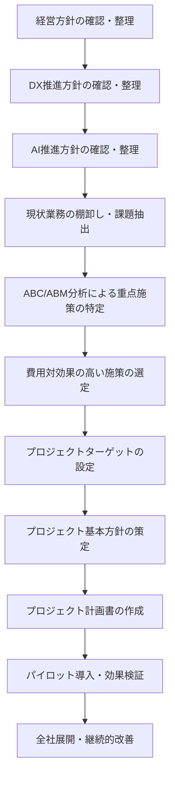

# 年間スキル報告書WEB化PJT

---
# プロジェクト基本方針

## DXプロジェクト標準プロセスフロー

このフローを標準プロセスとすることで、経営方針～現場施策まで一貫性を持ったDX・AI推進が可能となります。

---

### フロー詳細解説

1. **経営方針の確認・整理**  
   既存の経営方針を再確認し、DX/AI推進の大前提となる経営目標や価値観を整理。

2. **DX推進方針の確認・整理**  
   策定済みのDX推進方針（業務デジタル化・データ一元管理・生産性向上等）を具体的に確認。

3. **AI推進方針の確認・整理**  
   策定済みのAI推進方針（業務自動化・AI活用文化の醸成等）を明確に把握。

4. **現状業務の棚卸し・課題抽出**  
   現状運用業務を棚卸しし、非効率・属人化・作業負荷等の課題を洗い出す。

5. **ABC/ABM分析による重点施策の特定**  
   活動別コストを算出し、費用対効果の高い業務・施策（例：回収・集計等の自動化）を特定。

6. **費用対効果の高い施策の選定**  
   ABC/ABM分析結果をもとに、最も効果の高い施策を優先ターゲットとして選定。

7. **プロジェクトターゲットの設定**  
   対象帳票・業務範囲・自動化対象プロセスなどプロジェクトのターゲットを明確化。

8. **プロジェクト基本方針の策定**  
   目的・スコープ・推進体制・ROI重視の方針を明文化。

9. **プロジェクト計画書の作成**  
   目的・目標・コスト・スケジュール・体制・リスク管理等を計画書に明記。

10. **パイロット導入・効果検証**  
    限定範囲で施策を導入し、実際の効果を定量・定性両面で検証。

11. **全社展開・継続的改善**  
    効果検証後、全社展開と継続的な改善サイクルへ移行。

---

## エス・エー・エスの基本方針

### 使命
- すべては笑顔のために ～世の中のすべての人を笑顔にする～

### 経営理念
- 常に質の高いサービスを提供し  
会社のスキルアップを通じて  
SAS全メンバーの生活水準の向上を図る  
と共に社会の笑顔に貢献していく  

### 経営ビジョン
- ITサービスで社会に笑顔をとどける会社になる

### ブランドコンセプト

- Make IT Smile.  
ITと笑顔を掛け合わせた Make It Smileという標語として作成しました。  
「make it ◯◯◯」＝◯◯◯にさせることをうまく活用し、「笑顔にする」というストレートな表現をしています。  
itをIT（大文字）とすることで、ITソリューションを提供する会社であることを表現しています。  
最後のピリオドで、強い意志（想い）を表現しています。  

- 社会に笑顔を実装するスマイルテック・カンパニー  
使命・理念・ビジョンで掲げられる「笑顔」を他社との差別化できるキーワードとして活用しています。  
「テック」というキーワードを入れることで、事業領域を目立たせています。  
提供価値・ソリューションであるテックというワードと笑顔を掛け合わせることで、シンプルながらコンパクトなキーワードとして活用しやすい文字数としました。  

---
## DX推進チーム基本方針

### DX推進​チーム 全体基本方針
#### DX戦略 背景・目的​
「ＩＴサービスで社会に笑顔をとどける会社になる」​を実現するために​  
我々は「ＩＴサービスで社会に笑顔をとどける会社になる」を経営ビジョンに掲げ​事業しているが、ユーザーとしてIT体験が少なく、価値を理解できているのだろうか…？​  
DX推進では、社内のIT導入促進・業務改善をメンバーと共に創り上げ、運営することで​IT価値を体験できるよう変革し、更にSASの組織・事業価値を変革するための​土台作りを推進していくことで、顧客や社会にも笑顔を提供していく​  

#### DX戦略 DX戦略イメージ​
トランスフォーメーションインフラとして3つの基盤を構築し、2つの変革を推進する​ことで顧客や社会に笑顔を提供していく​
- 提供価値の変革
    - ビジネスのトランスフォーメーション​
        - 仮説検証に基づく実験を繰り返し、結果を積み上げ、新たな事業の立ち上げや顧客への価値提供に繋げるためのIT臨床実験の場を提供する​
    - データドリブンによる経営の実現​
        - SoI（System of Insight）の構築によりSAS内部に独自データを蓄積​
        - 蓄積した情報を加工・分析して新たな洞察や知見を得ることで、施策・改善を考案する​
    - 共通プラットフォーム構築​
        - お客様と共に笑顔を生み出すための共通基盤を構築し、新規事業を提供する環境としても活用する
- 組織の変革
    - メンバーが変化に適応できる足場の構築​​
        - スキルのトランスフォーメーション、​業務のデジタル化の実現のために​既存のIT環境などの見直しや再構築を図る​
    - 業務の高度化実現​
        - 基幹・バックオフィスを中心に​業務プロセスを改革する基盤を構築し、​業務効率化の実現から高度化に繋げる​
    - ハイブリットワーク環境の構築​​
        - ゼロトラストセキュリティと​ライフサイクル管理により​いつでもどこでも働ける基盤を構築​

- 参考文献  
[SAS2030経営計画書_DX推進詳細版_v3.0](https://sasbusiness.sharepoint.com/:p:/r/sites/msteams_81e110_093265/Shared%20Documents/%E3%83%9E%E3%83%8D%E3%82%B8%E3%83%A1%E3%83%B3%E3%83%88T/SAS2030%E8%A8%88%E7%94%BB%E7%AD%96%E5%AE%9A/02.%E3%83%AD%E3%83%BC%E3%83%AA%E3%83%B3%E3%82%B0/%E7%AC%AC3.0%E7%89%88/SAS2030%E7%B5%8C%E5%96%B6%E8%A8%88%E7%94%BB%E6%9B%B8_DX%E6%8E%A8%E9%80%B2%E8%A9%B3%E7%B4%B0%E7%89%88_v3.0.pptx?d=we84411bdba944deea167b87ec976cc6b&csf=1&web=1&e=SP3bK9)

### DX推進チーム 2025年度基本方針
#### ビジョン
- DXを価値に変えよ​ -Success for SAS2030-​  

#### 活動方針
1. 「人と社会に笑顔を届けるDX」（DX推進の目的）を実現させるための社内DX活動推進をリードする
    1. SAS2030実行フェーズ3年目として、単なる「変化」ではなく、「定着」や「成果創出」といった視点を持つ​
2. DXを活用し、組織の競争力を強化し、持続的な成長を実現する​
    1. DXの定着は、単なるIT導入や業務効率化ではなく、デジタル技術を活用して市場優位性を確立し、​環境変化に適応しながら新たな価値を創出できる組織になること​
3. SASメンバーの一人ひとりのスキルとキャリアの成長を加速する​
    1. DXを特定のチームやプロジェクトだけでなく、全社の働き方・考え方に浸透させる​
4. 変化に迅速に適用できる柔軟な組織の構築​
    1. 業務のデジタル化・標準化 により、属人化を解消し、組織全体の対応速度を向上させる​

- 参考文献  
[DX推進全体定例_20250520](https://sasbusiness.sharepoint.com/:p:/r/sites/msteams_81e110_093265/Shared%20Documents/%E3%83%9E%E3%83%8D%E3%82%B8%E3%83%A1%E3%83%B3%E3%83%88T/DX%E6%96%B9%E9%87%9D/2025%E5%B9%B4%E5%BA%A6/DX%E6%8E%A8%E9%80%B2%E5%85%A8%E4%BD%93%E5%AE%9A%E4%BE%8B_20250520.pptx?d=wf9b6ebf9dba34b57b4989f7a6a8ff5c1&csf=1&web=1&e=K6n760)

---
## AI推進チーム基本方針

### AI推進​チーム 全体基本方針

#### 2030年(SAS2030)に向けての目的
- AIで業務効率化やストレス軽減を実現し、​社会に時間的・精神的な余裕を創造することで笑顔を提供する

#### 2030年(SAS2030)に向けての目標
- AIを駆使したSAS独自のシステム開発支援ツールを提供する​

> 【AI推進チーム内指摘事項】
> 目標は定量的評価に落とし込んだ設定が必要のため再検討
> 対象がAI駆動開発のみに着目されているためAI利活用の観点で再検討

### AI推進​チーム 2025年度基本方針
#### 目的
- AI駆動開発を推進する基盤を作る​
- 社内のAI利用を促進する​

> 【経営推進会議内指摘事項】
> 目的が手段となっているため、何のために活動して何を実現したいのか本来の目的として落とし込んだ設定が必要のため再検討

#### 目標​
- 既存のAI駆動開発ツールを検証して資料にまとめて全社展開する​
- 社内のAI利用状況を調査する​
- バックオフィス業務向けのAIツールの選定、検証する​

> 【経営推進会議内指摘事項】
> 2030年(SAS2030)に向けての目標に対して2025年度の目標設定が必要のため再検討

- 参考文献  
[【AI推進】2025年度キックオフ](https://sasbusiness.sharepoint.com/:p:/r/sites/msteams_81e110_093265/Shared%20Documents/General/99_%E3%82%A2%E3%83%BC%E3%82%AB%E3%82%A4%E3%83%96/43_AI%E6%8E%A8%E9%80%B2TF/2025%E5%B9%B4%E5%BA%A6/%E3%80%90AI%E6%8E%A8%E9%80%B2%E3%80%912025%E5%B9%B4%E5%BA%A6%E3%82%AD%E3%83%83%E3%82%AF%E3%82%AA%E3%83%95.pptx?d=wae26d43d5b6f48f5a1cc4f1ff9ad3783&csf=1&web=1&e=uWD4kn)

---
## プロジェクト化にむけた費用対効果分析

---

### 1. 分析の前提

- **対象業務**：「個人マスタースケジュール」「スキル報告書」「年間作業報告書」など帳票作成・管理業務
- **現状運用**：Excelによる手作業（配布・記入・回収・集計・レビュー・フィードバック）
- **対象人数**：100名
- **年間帳票レビュー回数**：3帳票 × 4回 × 100名 = 1,200回
- **1回あたり作業工数**：1.5時間（現行）、0.5時間（Web化・AI導入後）
- **人件費単価**：4,000円/時間
- **Web化・AI導入コスト**：初期3,000,000円、年保守500,000円
- **分析目的**：現行のコスト構造を明確化し、Webアプリ・AI自動化導入による費用対効果を可視化

---

### 2. ABC（活動基準原価計算）による現状コスト算出

#### 活動定義（業務棚卸し）
- A活動：回収・確認・集計・フィードバック（上司・管理職の負担が大きい）
- B活動：記入・提出（社員本人の負担）
- C活動：フォーマット作成・再集計（事務・管理部門）

#### 年間コスト試算

| 項目                   | 現行運用                    | Web化・AI導入後                | 計算式 |
|------------------------|-----------------------------|---------------------------------|--------|
| 年間レビュー回数       | 1,200回                     | 1,200回                         | 100名×3帳票×4回 |
| 1回あたり工数          | 1.5時間                     | 0.5時間                         |        |
| 年間総工数             | 1,800時間                   | 600時間                         | 1,200回×工数/回 |
| 年間人件費             | 7,200,000円                 | 2,400,000円                     | 総工数×4,000円 |
| 初期投資               | 0円                         | 3,000,000円                     | 固定   |
| 年間保守費             | 0円                         | 500,000円                       | 固定   |
| 3年間総コスト          | 21,600,000円                | 11,700,000円                    | 現行: 7,200,000円×3年Web化: 3,000,000円＋(500,000円×3年)+(2,400,000円×3年) |
| 3年間コスト削減効果    | ―                           | 9,900,000円                     | 21,600,000円−11,700,000円 |

---

### 3. ABM（活動基準管理）による改善施策

- **A活動（回収・確認・集計・フィードバック）**  
  Web化・AI自動化で大幅削減（例：1,260時間→210時間/年）
- **B活動（記入・提出）**  
  入力支援・UI改善で効率化（360時間→240時間/年）
- **C活動（フォーマット作成・再集計）**  
  テンプレート化・標準化で省力化（180時間→150時間/年）

---

### 4. 費用対効果（ROI）のポイント

- **現行運用3年間総コスト**：21,600,000円
- **Web化・AI導入後3年間総コスト**：11,700,000円（初期投資・保守費用含む）
- **3年間のコスト削減効果**：**9,900,000円**（約46%削減）
- **投資回収期間**：2年以内

---

### 5. 経営的示唆・意思決定ポイント

- **最大のコストドライバーはA活動（回収・確認・集計・フィードバック）**  
  →Web化・AI自動化でここを徹底的に省力化することで、全体コストの70％以上を削減可能
- **B・C活動もUI改善・標準化で効率化**
- **投資回収が早く、以降は大幅なコスト圧縮・生産性向上が持続**
- **帳票・人材情報の一元管理・可視化で、経営層もリアルタイムで状況把握・迅速な意思決定が可能**

---

### 6. 結論

ABC/ABM分析の結果、帳票業務のWeb化・AI自動化は  
**「3年間で約1,000万円のコスト削減」「作業負荷の大幅軽減」「データ活用による経営判断の迅速化」**  
という高い費用対効果を発揮します。

**経営資源の最適配分・組織力強化・DX推進の観点からも、全社的な導入を強く推奨できる施策です。**

---
## プロジェクト基本方針

---

### 1. ビジョン

社員一人ひとりの成長と組織の持続的な競争力向上を両立する"データドリブンな人材マネジメント文化"を実現し、業務の生産性と透明性を高めることで、組織全体の価値創造力を最大化する。

---

### 2. 目的

- **AI駆動開発の知見獲得**  
  AI駆動型のチーム開発を実践し、今後の全社展開や他プロジェクトへの応用可能な知見・ベストプラクティスを確立する。AIアーキテクチャや技術スタックに関する知識を組織内に蓄積し、技術的な自律性と競争力を高める。

- **業務効率化と可視化の実現**  
  社内で毎年作成している「個人マスタースケジュール」や「スキル報告書」などの帳票業務をWeb化し、配布・回収・集計など手作業の負担を抜本的に削減する。帳票・人材情報の一元管理と可視化を通じて、社員・管理職・経営層がリアルタイムで状況を把握し、迅速かつ的確な意思決定を可能にする。

---

### 3. 推進方針

#### (1) タスクフォースによる少数精鋭・迅速な推進
- 専門性・現場知見を持つメンバーによる小規模チームで、意思決定・実装・改善を高速に回す。
- 明確なビジョンと短期成果（プロトタイプ・パイロット導入）を全員で共有し、目的意識を統一する。

#### (2) プロトタイプ開発・パイロット導入重視
- 初期は必要最小限の機能（MVP）に絞り、短期間でWebアプリのプロトタイプを開発。
- 限定部署・ユーザーでのパイロット導入を実施し、現場からのフィードバックを素早く反映。

#### (3) AIプロセスオートメーションの段階的実装
- 帳票入力補助、記載内容の自動チェック、進捗・スキルギャップ分析、フィードバック自動生成等、AI機能を段階的に組み込む。
- 開発者とAIの協働により、コード品質と開発速度を両立させる。

#### (4) ユーザー体験・現場フィードバック重視
- UI/UXは現場の業務フロー・課題に即した設計とし、パイロットユーザーの声を最優先で改善サイクルに反映。
- コミュニケーションを密にし、現場の納得感と実効性を高める。

#### (5) セキュリティ・プライバシー確保
- 個人情報・評価データのアクセス制御・暗号化など、パイロット段階から基本的なセキュリティ対策を実装。

---

### 4. 開発・運用プロセス

- **アジャイル短サイクル開発**  
  スプリント単位で要件定義→開発→レビュー→改善を繰り返し、短期間で仮説検証と機能追加を実施。

- **AI協働開発**  
  開発者がAIに要件提示→AIがコード提案→開発者がレビュー・調整→機能改善のサイクルを高速回転。

- **ローコード／ノーコード活用**  
  開発スピードを重視し、ローコードツール等も積極的に活用。

---

### 5. パイロット導入・評価

- **限定範囲での実証**  
  一部部署・業務を対象にパイロット導入し、実運用での効果・課題・ユーザビリティを検証。

- **定量・定性評価の両立**  
  作業時間削減率、帳票標準化率、ユーザー満足度等のKPIを設定し、成果を可視化。現場ヒアリングも重視。

- **成果・ナレッジの全社展開準備**  
  プロトタイプ・パイロットの成果・課題・改善点をドキュメント化し、全社展開時の基盤とする。

---

### 6. コミュニケーション・ナレッジ共有

- タスクフォース内で進捗・課題・アイデアを定期的に共有し、オープンな議論を促進。
- 成果や失敗も含めてナレッジを蓄積し、次フェーズや他部署展開時の資産とする。

---

### 7. プロジェクト管理・成功指標

- **KPI例**
  - 帳票作成・レビュー・集計等の作業時間削減率
  - AIによる自動化・提案機能の活用率
  - ユーザー満足度・現場定着度
  - パイロット導入後の全社展開可能性

- **管理体制**
  - タスクフォースリーダー（意思決定・進捗管理）
  - 開発担当（AI・Webエンジニア、UI/UXデザイナー）
  - 業務アナリスト・現場代表（現場フィードバック担当）

---

### 8. 開発・検証の進め方

1. **イテレーション**: 1 週間スプリントで計画 → 実装 → レビュー（毎週金曜に週次レビュー実施）
2. **レビュー方法**: GitHub Pull Request + 毎週火曜日ステークホルダーミーティング
3. **バックログ管理**: Backlogでタスク管理を実施（画面ベースでチケット管理）
4. **変更管理**: ユーザーストーリー単位で Issue を起票し、必要に応じて仕様を更新
5. **WBSと工数管理**: [SharePointリンク](https://sasbusiness.sharepoint.com/:f:/r/sites/msteams_81e110_093265/Shared%20Documents/General/43_AI%E6%8E%A8%E9%80%B2TF/2025%E5%B9%B4%E5%BA%A6/AI%E9%A7%86%E5%8B%95%E9%96%8B%E7%99%BA/%E5%B9%B4%E9%96%93%E3%82%B9%E3%82%AD%E3%83%AB%E5%A0%B1%E5%91%8A%E6%9B%B8WEB%E5%8C%96PJT?csf=1&web=1&e=ZQJDLB)で管理（各メンバーは週次で工数実績を記録）

---

### 9. プロジェクト成果物

1. **Webアプリケーション**（フロントエンド + バックエンド）
2. **技術文書・設計書**
   - システム設計書
   - API仕様書
   - データベース設計書
3. **AI駆動開発のナレッジベース**
   - 開発プロセス文書
   - ベストプラクティス集
   - 技術検証レポート
4. **ユーザーマニュアル**
   - 操作マニュアル
   - 管理者マニュアル
5. **運用・保守文書**
   - 運用手順書
   - 障害対応手順書

**この方針により、ビジョンと目的の実現に向けて、AI駆動開発と業務効率化・可視化を両立し、短期間で最大の成果を創出できるプロジェクト運営を目指します。**

---
## プロジェクトコード

### AI-Smile Chain（エーアイスマイルチェーン）

#### コンセプト
「AI駆動開発」と「笑顔の連鎖」を表現したプロジェクトコード。社内から顧客、そして社会全体への笑顔の波及効果を「Chain（連鎖）」で視覚化し、本プロジェクトの「データドリブンな人材マネジメント文化の実現」という目標にも合致している。

#### 設定基準
- **プロジェクトポリシーとの整合性**: エス・エー・エスの「Make IT Smile.」「社会に笑顔を実装するスマイルテック・カンパニー」との高い親和性
- **ネーミングの独創性**: 技術用語「Chain」とスマイルの組み合わせが秀逸で覚えやすい
- **グローバル感**: 英語圏でも自然に理解される国際的な響き

---
## プロジェクト基本情報

### 基本項目

| 項目 | 内容 |
|------|------|
| **プロジェクト名** | 年間スキル報告書WEB化PJT |
| **プロジェクトコード** | AI-Smile Chain（エーアイスマイルチェーン） |
| **プロジェクトID／管理番号** | SAS-DX-AI-2025-001 |
| **システム名／開発対象名** | スキル報告書管理システム（Skill Report Management System, SRMS） |
| **プロジェクト期間** | 2025年5月 ～ 2025年7月 |
| **プロジェクト開始日** | 2025年5月20日 |
| **プロジェクト終了日** | 2025年7月31日 |
| **主要マイルストーン** | プロトタイプ完成：2025年6月末、パイロット導入・検証：2025年7月中旬、最終成果物納品：2025年7月末|
| **プロジェクトマネージャー** | 黒澤 |
| **開発チーム** | AI推進チーム |
| **ステークホルダー** | DX推進チーム、人事部、経営陣 |
| **予算** | 3,000,000円（初期開発費） |
| **想定ROI** | 3年間で9,900,000円のコスト削減効果 |

---

### プロジェクト概要

#### 背景
現在、社内で年間3回実施している「個人マスタースケジュール」「スキル報告書」「年間作業報告書」の作成・管理業務は、Excelベースの手作業で行われており、配布・記入・回収・集計・レビュー・フィードバックの各工程で多大な工数が発生している。

#### 課題
- 手作業による非効率性（年間1,800時間の工数）
- 属人化による品質のばらつき
- リアルタイムでの進捗把握困難
- データの一元管理・分析機能の欠如
- 管理職の負担集中

#### 解決策
Webアプリケーション化とAI機能の導入により、業務プロセスを抜本的に改善し、工数削減と品質向上を同時に実現する。

---

### 技術スタック

#### フロントエンド
- **フレームワーク**: React 18.x
- **言語**: TypeScript 5.x
- **UIライブラリ**: Material-UI (MUI) v5
- **状態管理**: Redux Toolkit
- **ルーティング**: React Router v6
- **フォーム管理**: React Hook Form
- **バリデーション**: Yup
- **HTTP通信**: Axios
- **ビルドツール**: Vite

#### バックエンド
- **フレームワーク**: Node.js + Express.js
- **言語**: TypeScript 5.x
- **データベース**: PostgreSQL 15.x
- **ORM**: Prisma
- **認証**: JWT (JSON Web Token)
- **API仕様**: OpenAPI 3.0 (Swagger)
- **ファイルアップロード**: Multer
- **バリデーション**: Joi

#### インフラ・デプロイ
- **コンテナ**: Docker + Docker Compose
- **Webサーバー**: Nginx
- **プロセス管理**: PM2
- **環境管理**: dotenv
- **ログ管理**: Winston

#### 開発・運用ツール
- **バージョン管理**: Git + GitHub
- **CI/CD**: GitHub Actions
- **コード品質**: ESLint + Prettier
- **テスト**: Jest + React Testing Library
- **プロジェクト管理**: Backlog
- **ドキュメント**: Markdown + Mermaid

#### AI・機械学習
- **AI API**: OpenAI GPT-4 API
- **自然言語処理**: 入力支援、内容チェック、フィードバック生成
- **データ分析**: スキルギャップ分析、進捗予測

---

### 開発環境

#### 必要なソフトウェア
- Node.js 18.x以上
- npm 9.x以上
- Docker Desktop
- PostgreSQL 15.x
- Git
- VSCode（推奨エディタ）

#### 推奨VSCode拡張機能
- TypeScript and JavaScript Language Features
- ES7+ React/Redux/React-Native snippets
- Prettier - Code formatter
- ESLint
- GitLens
- Thunder Client（API テスト用）

---

### セキュリティ要件

#### 認証・認可
- JWT ベースの認証システム
- ロールベースアクセス制御（RBAC）
- セッション管理とタイムアウト

#### データ保護
- 個人情報の暗号化
- HTTPS通信の強制
- SQLインジェクション対策
- XSS対策

#### アクセス制御
- 部署・役職に応じた閲覧権限
- 操作ログの記録
- 不正アクセス検知

---

### 非機能要件

#### パフォーマンス
- ページ読み込み時間：3秒以内
- 同時接続ユーザー数：100名
- データベースレスポンス：1秒以内

#### 可用性
- システム稼働率：99%以上
- 定期メンテナンス時間：月1回、2時間以内

#### 拡張性
- ユーザー数の増加に対応可能な設計
- 新機能追加時の影響範囲最小化

#### 保守性
- コードの可読性とドキュメント整備
- 自動テストカバレッジ：80%以上

---

### 予算管理

#### 初期開発費用
- 開発工数：300時間 × 10,000円 = 3,000,000円
- 外部ツール・ライセンス費用：含む
- インフラ初期構築費用：含む

#### 年間運用費用
- サーバー・インフラ費用：300,000円/年
- AI API利用料：100,000円/年
- 保守・サポート費用：100,000円/年
- **合計**：500,000円/年

---

### リスク管理

#### 技術リスク
- **リスク**: AI API の利用制限・料金変更
- **対策**: 複数のAIサービスプロバイダーとの契約検討

#### スケジュールリスク
- **リスク**: 要件変更による開発遅延
- **対策**: アジャイル開発による柔軟な対応、MVP優先

#### 品質リスク
- **リスク**: バグ・セキュリティ脆弱性
- **対策**: 自動テスト、コードレビュー、セキュリティ監査

#### 運用リスク
- **リスク**: システム障害・データ損失
- **対策**: 定期バックアップ、冗長化、監視体制

---

### memory-bank開発ルール

#### memory-bankとは
プロジェクト全体の知識・経験・ノウハウを体系的に蓄積・共有するためのナレッジベースシステム。AI駆動開発で得られた知見を組織資産として活用する。

#### 蓄積対象
1. **技術的知見**
   - AI駆動開発のベストプラクティス
   - 技術選定の判断基準と結果
   - パフォーマンス最適化手法
   - セキュリティ対策の実装方法

2. **プロジェクト管理知見**
   - アジャイル開発の運用ノウハウ
   - ステークホルダー管理手法
   - リスク対応事例
   - 品質管理プロセス

3. **業務改善知見**
   - 現場フィードバックの活用方法
   - UI/UX改善のポイント
   - ユーザー教育・サポート手法
   - 効果測定・KPI管理

#### 運用ルール
- 週次レビューでナレッジ蓄積状況を確認
- 重要な意思決定は必ず記録・共有
- 失敗事例も含めて率直に記録
- 他プロジェクトへの応用可能性を常に意識

---

### Cline開発ルール

#### Clineとは
AI駆動開発において、開発者とAIアシスタント（Cline）が協働するための開発プロセス・ルール体系。

#### 基本原則
1. **AI First**: AIの提案を最大限活用し、人間は判断・調整に集中
2. **Iterative**: 小さな単位で実装→検証→改善を高速回転
3. **Transparent**: AI との対話・判断過程を可視化・記録
4. **Quality**: AIが生成したコードも必ず人間がレビュー

#### 開発フロー
1. **要件定義**: 人間が要件をAIに明確に伝達
2. **設計提案**: AIが技術選定・アーキテクチャを提案
3. **実装**: AIがコード生成、人間がレビュー・調整
4. **テスト**: AIがテストコード生成、人間が検証
5. **ドキュメント**: AIが文書作成、人間が最終確認

#### 品質管理
- AIが生成したコードは必ず人間がレビュー
- セキュリティ・パフォーマンスは人間が最終判断
- 重要な設計判断は人間が主導
- AI提案の採用・却下理由を記録

#### コミュニケーション
- AI との対話は具体的・明確に
- 期待する成果物の形式・品質を事前に指定
- AIの提案に対する評価・フィードバックを適切に実施
- チーム内でAI活用状況を定期的に共有

---

### プロジェクト成功の定義

#### 短期目標（プロトタイプ完成時）
- 基本機能（帳票作成・提出・承認）の動作確認
- パイロットユーザーからの肯定的フィードバック
- AI機能の基本動作確認

#### 中期目標（パイロット導入完了時）
- 作業時間50%以上削減の実証
- ユーザー満足度80%以上
- システム稼働率99%以上

#### 長期目標（全社展開準備完了時）
- 全社展開可能な品質・機能の確保
- AI駆動開発ナレッジの体系化
- 他プロジェクトへの応用可能性確認
- ROI目標（3年間で9,900,000円削減）の達成見込み確保

---

**このプロジェクト基本情報により、AI-Smile Chainプロジェクトの全体像と推進方針を明確化し、関係者全員が同じ方向を向いて効率的にプロジェクトを推進できる基盤を構築します。**ーとの整合性**: エス・エー・エスの「Make IT Smile.」「社会に笑顔を実装するスマイルテック・カンパニー」との高い親和性
- **ネーミングの独創性**: 技術用語「Chain」とスマイルの組み合わせが秀逸で覚えやすい
- **グローバル感**: 英語圏でも自然に理解される国際的な響き

---
## プロジェクト基本情報

### 基本項目

| 項目 | 内容 |
|------|------|
| **プロジェクト名** | 年間スキル報告書WEB化PJT |
| **プロジェクトコード** | AI-Smile Chain（エーアイスマイルチェーン） |
| **プロジェクトID／管理番号** | SAS-DX-AI-2025-001 |
| **システム名／開発対象名** | スキル報告書管理システム（Skill Report Management System, SRMS） |
| **プロジェクト期間** | 2025年5月 ～ 2025年7月 |
| **プロジェクト開始日** | 2025年5月20日 |
| **プロジェクト終了日** | 2025年7月31日 |
| **主要マイルストーン** | プロトタイプ完成：2025年6月末、パイロット導入・検証：2025年7月中旬、最終成果物納品：2025年7月末 |
| **プロジェクトマネージャー** | 黒澤 |
| **開発チーム** | AI推進チーム |
| **ステークホルダー** | DX推進チーム、人事部、経営陣 |
| **予算** | 3,000,000円（初期開発費） |
| **想定ROI** | 3年間で9,900,000円のコスト削減効果 |

---

### プロジェクト概要

#### 背景
現在、社内で年間3回実施している「個人マスタースケジュール」「スキル報告書」「年間作業報告書」の作成・管理業務は、Excelベースの手作業で行われており、配布・記入・回収・集計・レビュー・フィードバックの各工程で多大な工数が発生している。

#### 課題
- 手作業による非効率性（年間1,800時間の工数）
- 属人化による品質のばらつき
- リアルタイムでの進捗把握困難
- データの一元管理・分析機能の欠如
- 管理職の負担集中

#### 解決策
Webアプリケーション化とAI機能の導入により、業務プロセスを抜本的に改善し、工数削減と品質向上を同時に実現する。

---

### 技術スタック

#### フロントエンド
- **フレームワーク**: React 18.x
- **言語**: TypeScript 5.x
- **UIライブラリ**: Material-UI (MUI) v5
- **状態管理**: Redux Toolkit
- **ルーティング**: React Router v6
- **フォーム管理**: React Hook Form
- **バリデーション**: Yup
- **HTTP通信**: Axios
- **ビルドツール**: Vite

#### バックエンド
- **フレームワーク**: Node.js + Express.js
- **言語**: TypeScript 5.x
- **データベース**: PostgreSQL 15.x
- **ORM**: Prisma
- **認証**: JWT (JSON Web Token)
- **API仕様**: OpenAPI 3.0 (Swagger)
- **ファイルアップロード**: Multer
- **バリデーション**: Joi

#### インフラ・デプロイ
- **コンテナ**: Docker + Docker Compose
- **Webサーバー**: Nginx
- **プロセス管理**: PM2
- **環境管理**: dotenv
- **ログ管理**: Winston

#### 開発・運用ツール
- **バージョン管理**: Git + GitHub
- **CI/CD**: GitHub Actions
- **コード品質**: ESLint + Prettier
- **テスト**: Jest + React Testing Library
- **プロジェクト管理**: Backlog
- **ドキュメント**: Markdown + Mermaid

#### AI・機械学習
- **AI API**: OpenAI GPT-4 API
- **自然言語処理**: 入力支援、内容チェック、フィードバック生成
- **データ分析**: スキルギャップ分析、進捗予測

---

### 開発環境

#### 必要なソフトウェア
- Node.js 18.x以上
- npm 9.x以上
- Docker Desktop
- PostgreSQL 15.x
- Git
- VSCode（推奨エディタ）

#### 推奨VSCode拡張機能
- TypeScript and JavaScript Language Features
- ES7+ React/Redux/React-Native snippets
- Prettier - Code formatter
- ESLint
- GitLens
- Thunder Client（API テスト用）

---

### セキュリティ要件

#### 認証・認可
- JWT ベースの認証システム
- ロールベースアクセス制御（RBAC）
- セッション管理とタイムアウト

#### データ保護
- 個人情報の暗号化
- HTTPS通信の強制
- SQLインジェクション対策
- XSS対策

#### アクセス制御
- 部署・役職に応じた閲覧権限
- 操作ログの記録
- 不正アクセス検知

---

### 非機能要件

#### パフォーマンス
- ページ読み込み時間：3秒以内
- 同時接続ユーザー数：100名
- データベースレスポンス：1秒以内

#### 可用性
- システム稼働率：99%以上
- 定期メンテナンス時間：月1回、2時間以内

#### 拡張性
- ユーザー数の増加に対応可能な設計
- 新機能追加時の影響範囲最小化

#### 保守性
- コードの可読性とドキュメント整備
- 自動テストカバレッジ：80%以上

---

### 予算管理

#### 初期開発費用
- 開発工数：300時間 × 10,000円 = 3,000,000円
- 外部ツール・ライセンス費用：含む
- インフラ初期構築費用：含む

#### 年間運用費用
- サーバー・インフラ費用：300,000円/年
- AI API利用料：100,000円/年
- 保守・サポート費用：100,000円/年
- **合計**：500,000円/年

---

### リスク管理

#### 技術リスク
- **リスク**: AI API の利用制限・料金変更
- **対策**: 複数のAIサービスプロバイダーとの契約検討

#### スケジュールリスク
- **リスク**: 要件変更による開発遅延
- **対策**: アジャイル開発による柔軟な対応、MVP優先

#### 品質リスク
- **リスク**: バグ・セキュリティ脆弱性
- **対策**: 自動テスト、コードレビュー、セキュリティ監査

#### 運用リスク
- **リスク**: システム障害・データ損失
- **対策**: 定期バックアップ、冗長化、監視体制

---

### memory-bank開発ルール

#### memory-bankとは
プロジェクト全体の知識・経験・ノウハウを体系的に蓄積・共有するためのナレッジベースシステム。AI駆動開発で得られた知見を組織資産として活用する。

#### 蓄積対象
1. **技術的知見**
   - AI駆動開発のベストプラクティス
   - 技術選定の判断基準と結果
   - パフォーマンス最適化手法
   - セキュリティ対策の実装方法

2. **プロジェクト管理知見**
   - アジャイル開発の運用ノウハウ
   - ステークホルダー管理手法
   - リスク対応事例
   - 品質管理プロセス

3. **業務改善知見**
   - 現場フィードバックの活用方法
   - UI/UX改善のポイント
   - ユーザー教育・サポート手法
   - 効果測定・KPI管理

#### 運用ルール
- 週次レビューでナレッジ蓄積状況を確認
- 重要な意思決定は必ず記録・共有
- 失敗事例も含めて率直に記録
- 他プロジェクトへの応用可能性を常に意識

---

### Cline開発ルール

#### Clineとは
AI駆動開発において、開発者とAIアシスタント（Cline）が協働するための開発プロセス・ルール体系。

#### 基本原則
1. **AI First**: AIの提案を最大限活用し、人間は判断・調整に集中
2. **Iterative**: 小さな単位で実装→検証→改善を高速回転
3. **Transparent**: AI との対話・判断過程を可視化・記録
4. **Quality**: AIが生成したコードも必ず人間がレビュー

#### 開発フロー
1. **要件定義**: 人間が要件をAIに明確に伝達
2. **設計提案**: AIが技術選定・アーキテクチャを提案
3. **実装**: AIがコード生成、人間がレビュー・調整
4. **テスト**: AIがテストコード生成、人間が検証
5. **ドキュメント**: AIが文書作成、人間が最終確認

#### 品質管理
- AIが生成したコードは必ず人間がレビュー
- セキュリティ・パフォーマンスは人間が最終判断
- 重要な設計判断は人間が主導
- AI提案の採用・却下理由を記録

#### コミュニケーション
- AI との対話は具体的・明確に
- 期待する成果物の形式・品質を事前に指定
- AIの提案に対する評価・フィードバックを適切に実施
- チーム内でAI活用状況を定期的に共有

---

### プロジェクト成功の定義

#### 短期目標（プロトタイプ完成時）
- 基本機能（帳票作成・提出・承認）の動作確認
- パイロットユーザーからの肯定的フィードバック
- AI機能の基本動作確認

#### 中期目標（パイロット導入完了時）
- 作業時間50%以上削減の実証
- ユーザー満足度80%以上
- システム稼働率99%以上

#### 長期目標（全社展開準備完了時）
- 全社展開可能な品質・機能の確保
- AI駆動開発ナレッジの体系化
- 他プロジェクトへの応用可能性確認
- ROI目標（3年間で9,900,000円削減）の達成見込み確保

---

**このプロジェクト基本情報により、AI-Smile Chainプロジェクトの全体像と推進方針を明確化し、関係者全員が同じ方向を向いて効率的にプロジェクトを推進できる基盤を構築します。**
