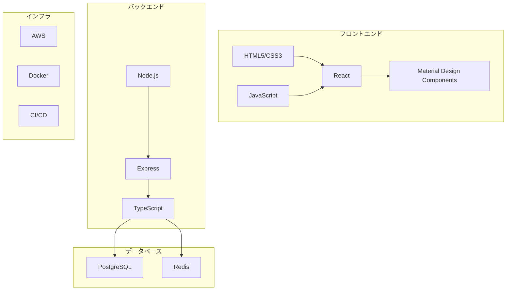
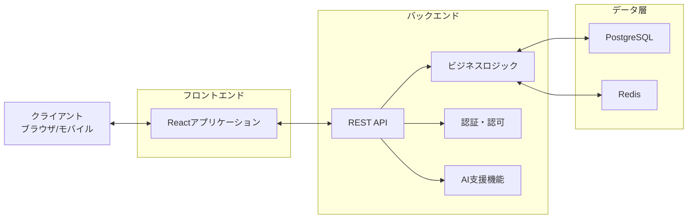
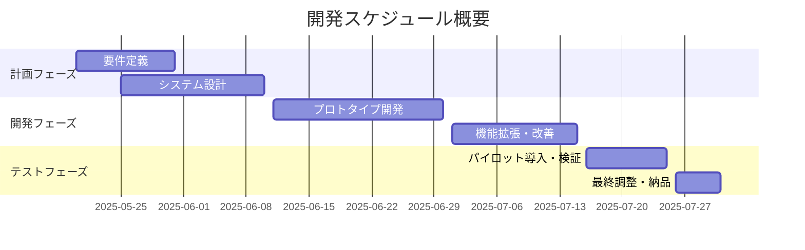

# 年間スキル報告書WEB化PJT 概要資料

## 1. プロジェクト概要

- **プロジェクト名**: 年間スキル報告書WEB化PJT
- **プロジェクトコード**: AI-Smile Chain（エーアイスマイルチェーン）
- **プロジェクトID**: SAS-DX-AI-2025-001
- **開発期間**: 2025年5月20日 ～ 2025年7月31日（約2.5ヶ月）
- **予算総額**: 約210万円（社内工数換算：約200万円、インフラ・ツール費用：約10万円）

## 2. プロジェクトの目的と背景

本プロジェクトは、以下の2つの主要目的を持っています：

- **AI駆動開発の知見獲得**  
  AI駆動型のチーム開発を実践し、今後の全社展開や他プロジェクトへの応用可能な知見・ベストプラクティスを確立する。AIアーキテクチャや技術スタックに関する知識を組織内に蓄積し、技術的な自律性と競争力を高める。

- **業務効率化と可視化の実現**  
  社内で毎年作成している「個人マスタースケジュール」や「スキル報告書」などの帳票業務をWeb化し、配布・回収・集計など手作業の負担を抜本的に削減する。帳票・人材情報の一元管理と可視化を通じて、社員・管理職・経営層がリアルタイムで状況を把握し、迅速かつ的確な意思決定を可能にする。

現行のExcelによる手作業（配布・記入・回収・集計・レビュー・フィードバック）では、作業負荷が大きく、データの一元管理や分析が困難な状況です。新システムでは、最新のWeb技術とAIを活用し、社員のスキル情報を可視化し、人材育成や適材適所の人員配置、組織全体のスキルギャップ分析などに活用することが可能になります。

## 3. 主要機能と画面構成

### 3.1 主要機能一覧

| 機能ID | 機能名 | 概要 |
|--------|--------|------|
| F01 | ユーザー認証・権限管理 | ユーザーの認証と権限に基づいた機能制御 |
| F02 | スキル情報管理 | 社員のスキル情報の登録・更新・評価 |
| F03 | スキルマスタ管理 | スキル項目・カテゴリのマスタ管理 |
| F04 | スキル検索 | 条件指定によるスキル情報の検索 |
| F05 | システム管理 | ユーザー・組織・権限などの管理 |
| F06 | レポート出力 | 各種レポートの生成・出力 |
| F07 | スキルマップ | 組織・グループのスキル分布可視化 |
| F08 | キャリアプラン管理 | 社員のキャリア目標設定・管理 |
| F09 | 作業実績管理 | プロジェクト・業務実績の記録 |
| F10 | 研修・資格管理 | 研修受講・資格取得の記録管理 |

### 3.2 画面一覧

| 画面ID | 画面名 | 主要機能 | 利用ユーザー |
|--------|--------|----------|--------------|
| SCR-LOGIN | ログイン画面 | ユーザー認証 | 全ユーザー |
| SCR-HOME | ホームダッシュボード | 情報サマリー表示 | 全ユーザー |
| SCR-PROFILE | プロフィール管理画面 | 個人情報管理 | 全ユーザー |
| SCR-SKILL | スキル情報管理画面 | スキル登録・更新 | 社員、上司 |
| SCR-SKILL-M | スキルマスタ管理画面 | スキル項目管理 | 管理者 |
| SCR-SKILL-SEARCH | スキル検索画面 | スキル情報検索 | 上司、管理者、人事 |
| SCR-ADMIN | システム管理画面 | システム設定管理 | 管理者 |
| SCR-ACCESS | 権限管理画面 | 権限設定 | 管理者 |
| SCR-REPORT | レポート出力画面 | レポート生成 | 上司、管理者、人事 |
| SCR-SKILL-MAP | スキルマップ画面 | スキル分布表示 | 上司、管理者、人事 |
| SCR-CAREER | キャリアプラン管理画面 | キャリア目標設定 | 社員、上司 |
| SCR-WORK | 作業実績管理画面 | 実績記録 | 社員、上司 |
| SCR-TRAINING | 研修記録画面 | 研修・資格記録 | 社員、上司、人事 |

## 4. システム構成

### 4.1 技術スタック



### 4.2 システムアーキテクチャ



## 5. 主要画面の概要

### 5.1 ホームダッシュボード（SCR-HOME）

ユーザーがログイン後最初に表示される画面。個人のスキル情報サマリー、未完了タスク、お知らせなどを表示します。

**主な機能**:
- スキル評価サマリー表示
- 未完了タスク・アクション表示
- お知らせ・通知表示
- クイックアクセスメニュー

### 5.2 スキル情報管理画面（SCR-SKILL）

社員が自身のスキル情報を登録・更新する画面。スキルカテゴリごとに評価レベルを設定し、エビデンスを記録できます。

**主な機能**:
- スキル自己評価入力
- スキル評価履歴表示
- 上司評価・フィードバック表示
- エビデンス登録

### 5.3 スキル検索画面（SCR-SKILL-SEARCH）

条件を指定してスキル情報を検索する画面。人材配置や育成計画の立案に活用します。

**主な機能**:
- 複合条件検索
- 検索結果一覧表示
- 検索条件保存
- CSV/Excel出力

### 5.4 レポート出力画面（SCR-REPORT）

スキル情報や評価データを様々な切り口で集計・分析し、レポートとして出力する画面。

**主な機能**:
- レポート種別選択
- 出力条件設定
- レポートプレビュー
- ダウンロード・印刷

### 5.5 スキルマップ画面（SCR-SKILL-MAP）

組織全体または特定グループのスキル分布をビジュアル化する画面。

**主な機能**:
- 表示条件設定
- スキルマップ表示（ヒートマップ/レーダーチャート等）
- 詳細データ表示
- CSVエクスポート・画像保存

### 5.6 キャリアプラン管理画面（SCR-CAREER）

社員が自身のキャリア目標を設定し、それに向けた計画を管理する画面。

**主な機能**:
- キャリア目標設定
- スキルギャップ分析
- アクションプラン管理
- 上司フィードバック

### 5.7 作業実績管理画面（SCR-WORK）

社員が担当したプロジェクトや業務の実績を記録・管理する画面。

**主な機能**:
- 作業実績登録・編集
- 期間検索・一覧表示
- 使用技術・習得スキル記録
- 上司コメント表示

### 5.8 研修記録画面（SCR-TRAINING）

社員が受講した研修や取得した資格の記録を管理する画面。

**主な機能**:
- 研修・資格記録管理
- 期間検索・一覧表示
- 推奨研修表示
- 関連スキル紐付け

## 6. 開発スケジュール



## 7. 主要マイルストーン

| マイルストーン | 予定日 | 成果物 |
|----------------|--------|--------|
| 要件定義・設計完了 | 2025/6/10 | 要件定義書、基本設計書、技術選定 |
| プロトタイプ完成 | 2025/6/30 | MVP（最小機能プロダクト） |
| 機能拡張・改善完了 | 2025/7/15 | 完成版アプリケーション |
| パイロット導入・検証 | 2025/7/25 | 検証レポート、改善版 |
| 最終成果物納品 | 2025/7/31 | 最終成果物一式 |

## 8. プロジェクト体制

```mermaid
graph TD
    PM[プロジェクトマネージャー<br>中島 (@SAS-nakajima)] --> TL1[フロントエンドチーム<br>リーダー: 笹尾 (@SAS-sasao)]
    PM --> TL2[バックエンドチーム<br>リーダー: 笹尾 (@SAS-sasao)]
    PM --> TL3[インフラチーム<br>リーダー: 笹尾 (@SAS-sasao)]
    PM --> TL4[テストチーム<br>リーダー: 中島 (@SAS-nakajima)]
    
    TL1 --> FE1[フロントエンド開発者<br>柏崎・室山・市川・杉本・金子]
    TL2 --> BE1[バックエンド開発者<br>柏崎・室山・市川・杉本・金子]
    TL3 --> INFRA1[インフラエンジニア<br>笹尾 (@SAS-sasao)]
    TL4 --> TEST1[テストエンジニア<br>中島 (@SAS-nakajima)]
    
    CLIENT[クライアント<br>DX推進チーム・AI推進TF] --> PM
    RESP[責任者<br>黒澤 (@yusuke-kurosawa)] --> PM
    RESP --> CLIENT
```

## 9. 主要リスクと対応方針

| リスクID | リスク内容 | 影響度 | 発生確率 | 対応方針 |
|----------|------------|--------|----------|----------|
| R001 | 短期間での開発によるスケジュール遅延 | 高 | 中 | MVP重視、段階的機能実装、優先度明確化 |
| R002 | AI駆動開発の知見不足 | 高 | 中 | プロトタイプ検証による早期技術習得、外部専門家の活用 |
| R003 | セキュリティ・プライバシーリスク | 中 | 低 | 初期段階からのセキュリティ対策実装、定期的なレビュー |
| R004 | ユーザー受容性の低さ | 中 | 中 | パイロット導入による段階的展開、ユーザーフィードバックの反映 |
| R005 | 技術的な問題（パフォーマンス等） | 中 | 低 | 早期からのパフォーマンステスト実施、チューニング |

## 10. 非機能要件

| 項目 | 要件 |
|------|------|
| 可用性 | 稼働率99.9%以上（計画メンテナンス除く） |
| 性能 | 画面レスポンス1秒以内、API応答0.5秒以内 |
| 同時接続 | 最大500ユーザー同時接続 |
| バックアップ | 日次バックアップ、30日間保持 |
| セキュリティ | OWASP Top 10対応、年1回脆弱性診断実施 |
| 拡張性 | ユーザー数・データ量50%増加に対応可能な設計 |

## 11. 開発標準・ガイドライン

- **コーディング規約**
  - 変数名・プロパティ名はキャメルケース（camelCase）
  - 定数はUPPER_SNAKE_CASE
  - 関数・メソッド名は動詞から始める
  - 不要なconsole.logはコミット前に削除

- **UI設計・MDC利用指針**
  - Material Design Components（MDC Web）を優先的に使用
  - 必要なMDCコンポーネントはnpmで個別にインストール
  - SCSSでMDCのスタイルをimport
  - ボタンや入力欄などの主要UIはMDCクラスを付与

- **品質基準**
  - 単体テスト: コードカバレッジ80%以上
  - E2Eテスト: 主要ユースケースをカバー
  - パフォーマンステスト: 応答時間基準の達成

## 12. 費用対効果分析

| 項目                   | 現行運用                    | Web化・AI導入後                | 計算式 |
|------------------------|-----------------------------|---------------------------------|--------|
| 年間レビュー回数       | 1,200回                     | 1,200回                         | 100名×3帳票×4回 |
| 1回あたり工数          | 1.5時間                     | 0.5時間                         |        |
| 年間総工数             | 1,800時間                   | 600時間                         | 1,200回×工数/回 |
| 年間人件費             | 7,200,000円                 | 2,400,000円                     | 総工数×4,000円 |
| 初期投資               | 0円                         | 3,000,000円                     | 固定   |
| 年間保守費             | 0円                         | 500,000円                       | 固定   |
| 3年間総コスト          | 21,600,000円                | 11,700,000円                    | 現行: 7,200,000円×3年<br>Web化: 3,000,000円＋(500,000円×3年)+(2,400,000円×3年) |
| 3年間コスト削減効果    | ―                           | 9,900,000円                     | 21,600,000円−11,700,000円 |

## 13. まとめ

年間スキル報告書WEB化PJTは、AI駆動開発の知見獲得と業務効率化の両面を目的とした戦略的プロジェクトです。本プロジェクトにより、以下の効果が期待されます：

1. **作業効率・生産性の大幅向上**
   - 帳票作成・レビュー・集計の手間を大幅に削減し、社員は本来業務や高付加価値活動に集中できる
   - 3年間で約1,000万円のコスト削減効果

2. **データドリブンな人材戦略と意思決定**
   - 全社のスキル・目標進捗・人材配置状況をリアルタイムで把握し、AIが最適な人材育成や配置を提案

3. **ナレッジ共有と組織力強化**
   - 全社員の実績・スキル・知見がデータベース化され、組織全体でのナレッジ活用とイノベーション創出が促進される

4. **AI駆動開発の知見蓄積**
   - AI駆動型のチーム開発を実践し、今後の全社展開や他プロジェクトへの応用可能な知見・ベストプラクティスを確立

本プロジェクトを通じて、人材育成・活用の基盤となるシステムを構築し、組織全体の競争力強化に貢献します。
