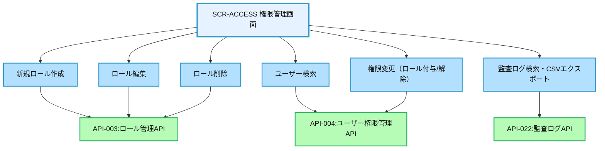
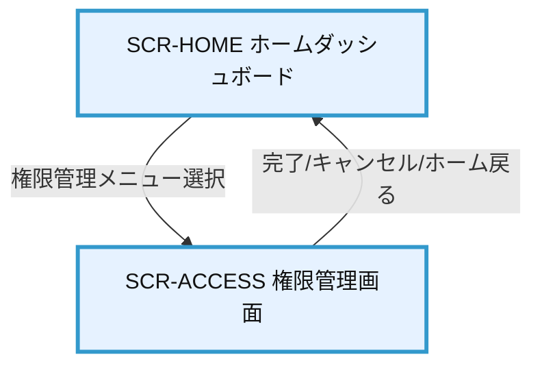

# 画面設計書：SCR-ACCESS（権限管理画面）

## 1. 画面基本情報

- **画面ID**：SCR-ACCESS  
- **画面名称**：権限管理画面  
- **画面の機能概要・目的**：  
  システム管理者がユーザーのロール・権限を管理し、操作履歴（監査ログ）を確認する画面。ユーザー・ロール単位での権限付与・変更、監査証跡の検索・閲覧を行う。  
- **利用ユーザー・アクター**：システム管理者  
- **関連機能・仕様ID・機能ID**：F02 / ACC.1-ROLE.1, ACC.1-PERM.1, ACC.1-HIER.1, ACC.3-AUDT.1  
- **作成日**：2025/05/28  
- **作成者**：システム設計担当  
- **改訂履歴**：2025/05/28 初版作成

---

## 2. 画面レイアウト

- **画面イメージ・ワイヤーフレーム**
```
+---------------------------------------------------------------+
| [権限管理]                                                    |
+---------------------------------------------------------------+
| [ロール一覧] [ユーザー別権限] [監査ログ]                      |
+---------------------------------------------------------------+
| ＜ロール一覧タブ＞                                            |
| [新規ロール作成]                                              |
| ┌─────────┬──────┬──────┬──────┬──────┐
| │ ロール名 │ 説明 │ 権限数 │ 階層 │ 操作 │
| ├─────────┼──────┼──────┼──────┼──────┤
| │ 管理者   │ 全機能 │ 12   │ 1   │[編集][削除]|
| │ 一般社員 │ 閲覧・入力 │ 5   │ 2   │[編集][削除]|
| └─────────┴──────┴──────┴──────┴──────┘
+---------------------------------------------------------------+
| ＜ユーザー別権限タブ＞                                        |
| [ユーザー検索][ユーザー選択]                                  |
| ┌─────────┬──────┬──────┬──────┬──────┐
| │ ユーザー名 │ 所属 │ 付与ロール │ 権限 │ 操作 │
| ├─────────┼──────┼──────┼──────┼──────┤
| │ 山田太郎 │ 営業部 │ 一般社員 │ 参照 │[変更]|
| │ 佐藤花子 │ 開発部 │ 管理者   │ 全権 │[変更]|
| └─────────┴──────┴──────┴──────┴──────┘
+---------------------------------------------------------------+
| ＜監査ログタブ＞                                              |
| [期間指定][ロール/ユーザー指定][検索]                         |
| ┌──────────────┬─────────────┬─────────────┬─────────────┐
| │ 日時         │ 操作ユーザー │ 操作内容    │ 詳細         │
| ├──────────────┼─────────────┼─────────────┼─────────────┤
| │ 2025/05/20   │ 管理者A     │ 権限付与    │ 山田太郎→管理者|
| │ 2025/05/18   │ 管理者B     │ ロール作成  │ 新規ロール:監査担当|
| └──────────────┴─────────────┴─────────────┴─────────────┘
| [CSVエクスポート]                                             |
+---------------------------------------------------------------+
```
- **画面サイズ**：レスポンシブ（PC：横1200px基準、スマホ：100%）
- **UI/UX設計上の注意点**：タブ切替、テーブルソート、検索・フィルタ、モーダル編集、操作ログの即時反映

---

## 3. 画面項目定義（APIパラメータ紐付け付き）

| 項目ID | 項目名           | APIパラメータ対応                | データ型     | I/O区分 | 必須 | 備考                       |
|--------|------------------|----------------------------------|-------------|---------|------|----------------------------|
| ①      | タブ切替         | -                                | タブ        | 入力    | -    | ロール/ユーザー/監査       |
| ②      | ロール名         | API-003.role_name                | テキスト    | 入力    | ○    | ロール編集・新規           |
| ③      | ロール説明       | API-003.description              | テキスト    | 入力    | -    |                            |
| ④      | 権限数           | API-003.permissions              | 数値        | 出力    | -    | 権限マスタ連携             |
| ⑤      | 階層             | API-003.level                    | 数値        | 入力    | -    | 権限継承用                 |
| ⑥      | 編集ボタン       | API-003（PUT）                   | ボタン      | 入力    | -    | 編集モーダル表示           |
| ⑦      | 削除ボタン       | API-003（DELETE）                | ボタン      | 入力    | -    | 削除確認ダイアログ         |
| ⑧      | 新規ロール作成   | API-003（POST）                  | ボタン      | 入力    | -    | 新規ロール追加モーダル     |
| ⑨      | ユーザー検索     | API-004.user_id                  | テキスト    | 入力    | -    | 氏名・社員番号検索         |
| ⑩      | ユーザー選択     | API-004.user_id                  | プルダウン  | 入力    | -    | 検索結果から選択           |
| ⑪      | 付与ロール       | API-004.role_id                  | プルダウン  | 入力    | -    | ロール一覧から選択         |
| ⑫      | 権限             | API-004.permissions              | ラベル      | 出力    | -    | 権限一覧参照               |
| ⑬      | 監査ログ検索     | API-022.period, user_id, role_id | ボタン      | 入力    | -    | 検索実行                   |
| ⑭      | 監査ログテーブル | API-022.auditlog_list            | テーブル    | 出力    | -    | 日時・操作・内容・詳細     |
| ⑮      | CSVエクスポート  | API-022（CSV形式）               | ボタン      | 入力    | -    | 検索結果をCSV出力          |

---

## 4. 画面イベント・アクション定義（API紐付け明記）

| イベントID | トリガー/アクション           | イベント内容・アクション詳細                                         | 紐付くAPI ID・名称      | メッセージ表示                       |
|------------|------------------------------|---------------------------------------------------------------------|------------------------|--------------------------------------|
| E01        | タブ切替                     | ロール/ユーザー/監査ログの管理対象切替                              | -                      |                                      |
| E02        | [新規ロール作成]ボタン押下    | ロール追加モーダル表示、入力値バリデーション後API-003呼出で登録      | API-003:ロール管理API   | 成功/エラー                          |
| E03        | [編集]ボタン押下              | 編集モーダル表示、編集後API-003呼出で保存                            | API-003                | 成功/エラー                          |
| E04        | [削除]ボタン押下              | 削除確認ダイアログ表示、OKでAPI-003呼出で論理削除                    | API-003                | 成功/エラー                          |
| E05        | ユーザー検索                  | 氏名・社員番号等でAPI-004呼出しユーザー一覧を絞込                    | API-004:ユーザー権限管理API |                                      |
| E06        | [変更]ボタン押下              | 権限変更モーダル表示、変更内容API-004呼出で保存                      | API-004                | 成功/エラー                          |
| E07        | 監査ログ検索                  | 検索条件指定→API-022呼出し検索実行                                  | API-022:監査ログAPI     |                                      |
| E08        | [CSVエクスポート]ボタン押下   | 現在の一覧をCSV形式でダウンロード                                   | API-022                |                                      |

---

## 5. 画面イベント・API関連図（Mermaid）



---

## 6. 画面遷移図・フロー


- 遷移元：SCR-HOME（管理者メニューから遷移）
- 遷移先：SCR-HOME（完了、キャンセル、またはメニュー選択時）

---

## 7. メッセージ定義

| メッセージID | メッセージ内容                                  | 種別    | 表示タイミング           |
|--------------|-----------------------------------------------|---------|-------------------------|
| MSG01        | ロール名は必須です                             | エラー  | ロール追加・編集時      |
| MSG02        | ロール名が重複しています                       | エラー  | ロール追加・編集時      |
| MSG03        | 削除しますか？                                 | 確認    | ロール削除時            |
| MSG04        | 権限変更を保存しました                         | 完了    | 権限変更時              |
| MSG05        | 監査ログ検索条件を入力してください             | エラー  | 監査ログ検索時          |
| MSG06        | CSVエクスポートが完了しました                  | 完了    | CSV出力時               |

---

## 8. 入出力一覧（API経由アクセス明示）

| 種別      | 名称           | 概要                         | アクセス方式 | 経由API（ID・名称・エンドポイント）         |
|-----------|----------------|------------------------------|--------------|--------------------------------------------|
| テーブル  | Role           | ロール情報                   | API経由      | API-003: ロール管理API /api/roles          |
| テーブル  | UserRole       | ユーザーロール紐付け         | API経由      | API-004: ユーザー権限管理API /api/users/{id}/roles |
| テーブル  | AuditLog       | 監査ログ                     | API経由      | API-022: 監査ログAPI /api/system/auditlog  |

---

## 9. バックエンドAPIコール仕様（APIファースト設計）

### API-003 ロール管理API
- エンドポイント: `/api/roles`
- HTTPメソッド: GET, POST, PUT, DELETE
- リクエストパラメータ: role_id, role_name, description, permissions, level
- レスポンスパラメータ: role_info
- ステータスコードとエラーケース: 200, 400, 409, 500
- 認証・認可要件: 管理者権限必須
- 呼び出しタイミング: タブ表示時（GET）、新規作成・編集・削除時（POST/PUT/DELETE）
- 備考: 削除は論理削除

### API-004 ユーザー権限管理API
- エンドポイント: `/api/users/{id}/roles`
- HTTPメソッド: GET, PUT
- リクエストパラメータ: user_id, role_id
- レスポンスパラメータ: user_role_info
- ステータスコードとエラーケース: 200, 400, 403, 500
- 認証・認可要件: 管理者権限必須
- 呼び出しタイミング: ユーザー検索時（GET）、権限変更時（PUT）
- 備考: 権限変更履歴は自動で監査ログ記録

### API-022 監査ログAPI
- エンドポイント: `/api/system/auditlog`
- HTTPメソッド: GET
- リクエストパラメータ: period, user_id, role_id
- レスポンスパラメータ: auditlog_list
- ステータスコードとエラーケース: 200, 400, 500
- 認証・認可要件: 管理者権限必須
- 呼び出しタイミング: 監査ログ検索時、CSVエクスポート時
- 備考: CSVエクスポートはレスポンス形式で切替

---

## 10. オブジェクト構成・CRUD定義

- Role: C, R, U, D（API-003経由のみ）
- UserRole: C, R, U, D（API-004経由のみ）
- AuditLog: C, R（API-022経由のみ）

---

## 11. その他

- **アクセシビリティ要件**  
  - キーボード操作・スクリーンリーダー対応、ラベル付与、テーブルソート・フィルタ操作の視認性向上
- **セキュリティ要件**  
  - 権限変更・ロール削除時の操作ログ記録、CSRF/XSS対策、権限チェック
- **操作手順・利用ガイド**  
  - 管理者はタブで管理対象を切り替え、ロール・ユーザー権限・監査ログの管理を行う
  - 編集・削除・追加はモーダルダイアログで実施
  - 監査ログは条件指定で検索・CSV出力可能
- **備考・補足**  
  - ロール削除は論理削除とし、履歴保持
  - 操作ログ・監査証跡は全操作で必ず記録
  - 権限継承（階層）はロール階層で自動反映
