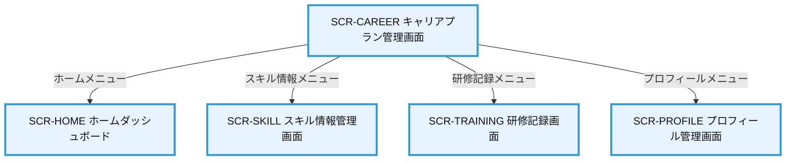

# 画面設計書：SCR-CAREER（キャリアプラン管理画面）

## 1. 画面基本情報

- **画面ID**：SCR-CAREER
- **画面名称**：キャリアプラン管理画面
- **画面の機能概要・目的**：  
  社員が自身のキャリア目標を設定し、それに向けた計画を管理する画面。現在のスキルレベルと目標スキルのギャップを可視化し、スキル習得のためのアクションプランを立案・管理することで、計画的なキャリア形成を支援する。
- **利用ユーザー・アクター**：社員、上司
- **関連機能・仕様ID・機能ID**：F08 / PLT.1-WEB.1, PLT.1-RESP.1, PLT.2-ENC.1, ACC.1-ROLE.1, CAR.1-PLAN.1
- **作成日**：2025/05/28
- **作成者**：システム設計担当
- **改訂履歴**：2025/05/28 初版作成

---

## 2. 画面レイアウト

- **画面イメージ・ワイヤーフレーム**
```
+------------------------------------------------------+
| [ロゴ] 年間スキル報告書システム    [ユーザー名▼] [🔔] |
+------------------------------------------------------+
| [サイドメニュー] | [キャリアプラン管理]              |
| ┌─────────────┐ | ┌─────────────────────────────┐    |
| │ ホーム      │ | │ キャリア目標                │    | ①
| │ プロフィール │ | │ 目標ポジション: [_________] │    |
| │ スキル情報   │ | │ 達成目標時期: [▼2027年]     │    |
| │ キャリアプラン│ | │ 目標概要:                  │    |
| │ 作業実績    │ | │ [____________________]      │    |
| │ 研修記録    │ | │ [保存]                     │    |
| │ レポート    │ | └─────────────────────────────┘    |
| │ 管理機能    │ | ┌─────────────────────────────┐    |
| └─────────────┘ | │ スキルギャップ分析          │    | ②
|                 | │ ┌─────────────────────────┐ │    |
|                 | │ │                         │ │    |
|                 | │ │ [レーダーチャート表示領域] │ │    |
|                 | │ │ (現在スキル vs 目標スキル) │ │    |
|                 | │ │                         │ │    |
|                 | │ └─────────────────────────┘ │    |
|                 | │ [スキル目標設定]             │    |
|                 | └─────────────────────────────┘    |
|                 | ┌─────────────────────────────┐    |
|                 | │ アクションプラン            │    | ③
|                 | │ [+ 新規追加]                │    |
|                 | │ ┌────┬────────┬────┬────┬──┐│    |
|                 | │ │項目│習得スキル│期限│状態│操作││    |
|                 | │ ├────┼────────┼────┼────┼──┤│    |
|                 | │ │Java研修│Java基礎│6月末│未着手│編集││    |
|                 | │ │資格取得│AWS認定│9月末│進行中│編集││    |
|                 | │ │...  │...     │... │... │..││    |
|                 | │ └────┴────────┴────┴────┴──┘│    |
|                 | └─────────────────────────────┘    |
|                 | ┌─────────────────────────────┐    |
|                 | │ 上司コメント                │    | ④
|                 | │ [____________________]      │    |
|                 | │ 最終更新: 2025/05/15 山田部長│    |
|                 | └─────────────────────────────┘    |
+------------------------------------------------------+
|  © 2025 Example Corp.                                |
+------------------------------------------------------+
```
- **画面サイズ**：レスポンシブ（PC：横1200px基準、スマホ：100%）
- **UI/UX設計上の注意点**：
  - キャリア目標、スキルギャップ分析、アクションプランを一画面で管理
  - レーダーチャートで現在のスキルと目標スキルのギャップを視覚的に表示
  - アクションプランはドラッグ&ドロップで優先順位変更可能
  - 上司からのフィードバックを表示し、コミュニケーションを促進
  - アクセシビリティ対応（キーボード操作・スクリーンリーダー対応）

---

## 3. 画面項目定義

| 項目ID | 項目名                | APIパラメータ対応           | データ型   | I/O区分 | 必須 | 備考                       |
|--------|----------------------|----------------------------|-----------|---------|------|----------------------------|
| ①      | キャリア目標セクション | -                          | セクション | -       | -    | キャリア目標入力エリア     |
| -      | 目標ポジション入力    | API-701.target_position    | テキスト   | 入力    | ○    | 目標ポジション入力フィールド |
| -      | 達成目標時期選択      | API-701.target_date        | セレクト   | 入力    | ○    | 目標達成時期選択ドロップダウン |
| -      | 目標概要入力          | API-701.target_description | テキストエリア | 入力 | ○    | 目標概要入力エリア         |
| -      | 保存ボタン            | -                          | ボタン     | 入力    | -    | キャリア目標保存ボタン     |
| ②      | スキルギャップ分析セクション | -                    | セクション | -       | -    | スキルギャップ表示エリア   |
| -      | レーダーチャート表示領域 | API-702.skill_gap_data   | グラフ     | 出力    | -    | スキルギャップ可視化チャート |
| -      | スキル目標設定ボタン  | -                          | ボタン     | 入力    | -    | スキル目標設定ダイアログ表示ボタン |
| ③      | アクションプランセクション | -                      | セクション | -       | -    | アクションプラン管理エリア |
| -      | 新規追加ボタン        | -                          | ボタン     | 入力    | -    | アクションプラン追加ボタン |
| -      | アクションプラン一覧  | API-703.action_plans       | テーブル   | 出力    | -    | アクションプラン一覧表示   |
| -      | 項目列                | API-703.action_plans[].title | テキスト | 出力    | -    | アクション項目名表示       |
| -      | 習得スキル列          | API-703.action_plans[].skill_item | テキスト | 出力 | -    | 習得対象スキル表示         |
| -      | 期限列                | API-703.action_plans[].due_date | テキスト | 出力   | -    | 完了期限表示               |
| -      | 状態列                | API-703.action_plans[].status | テキスト | 出力    | -    | 進捗状態表示               |
| -      | 操作列                | -                          | ボタン     | 入力    | -    | 編集/削除ボタン表示        |
| ④      | 上司コメントセクション | -                          | セクション | -       | -    | 上司フィードバックエリア   |
| -      | コメント表示          | API-704.manager_comment    | テキストエリア | 出力 | -    | 上司コメント表示           |
| -      | 最終更新情報          | API-704.updated_at, API-704.manager_name | テキスト | 出力 | -    | 更新日時・担当者表示       |

---

## 4. 画面イベント・アクション定義

| イベントID | トリガー/アクション           | イベント内容・アクション詳細                                         | 紐付くAPI ID・名称      | メッセージ表示                       |
|------------|------------------------------|---------------------------------------------------------------------|------------------------|--------------------------------------|
| E01        | 画面初期表示                  | API-700呼出→初期データ取得、API-702呼出→スキルギャップデータ取得、API-703呼出→アクションプラン取得、API-704呼出→上司コメント取得 | API-700, API-702, API-703, API-704 | エラー時：エラーメッセージ表示 |
| E02        | 保存ボタンクリック            | 入力値バリデーション→API-701呼出→キャリア目標保存                    | API-701                | 成功/失敗メッセージ表示               |
| E03        | スキル目標設定ボタンクリック  | スキル目標設定ダイアログ表示→API-705呼出→スキル目標保存              | API-705                | 成功/失敗メッセージ表示               |
| E04        | 新規追加ボタンクリック        | アクションプラン追加ダイアログ表示→API-706呼出→アクションプラン追加  | API-706                | 成功/失敗メッセージ表示               |
| E05        | 編集ボタンクリック            | アクションプラン編集ダイアログ表示→API-707呼出→アクションプラン更新  | API-707                | 成功/失敗メッセージ表示               |
| E06        | 削除ボタンクリック            | 確認ダイアログ表示→API-708呼出→アクションプラン削除                  | API-708                | 成功/失敗メッセージ表示               |
| E07        | アクションプランドラッグ&ドロップ | API-709呼出→アクションプラン順序更新                             | API-709                | 成功/失敗メッセージ表示               |
| E08        | 入力エラー                    | 必須項目未入力・形式不正                                            | -                      | 「必須項目を入力してください」等      |

---

## 5. 画面イベント・API関連図（Mermaid）

```mermaid
graph TD
    SCR_CAREER["SCR-CAREER キャリアプラン管理画面"]:::screen
    E_INIT["画面初期表示"]:::event
    E_SAVE_GOAL["キャリア目標保存"]:::event
    E_SET_SKILL["スキル目標設定"]:::event
    E_ADD_ACTION["アクションプラン追加"]:::event
    E_EDIT_ACTION["アクションプラン編集"]:::event
    E_DELETE_ACTION["アクションプラン削除"]:::event
    
    SCR_CAREER --> E_INIT
    SCR_CAREER --> E_SAVE_GOAL
    SCR_CAREER --> E_SET_SKILL
    SCR_CAREER --> E_ADD_ACTION
    SCR_CAREER --> E_EDIT_ACTION
    SCR_CAREER --> E_DELETE_ACTION
    
    E_INIT --> API700["API-700:初期データ取得API"]:::api
    E_INIT --> API702["API-702:スキルギャップ取得API"]:::api
    E_INIT --> API703["API-703:アクションプラン取得API"]:::api
    E_INIT --> API704["API-704:上司コメント取得API"]:::api
    E_SAVE_GOAL --> API701["API-701:キャリア目標保存API"]:::api
    E_SET_SKILL --> API705["API-705:スキル目標保存API"]:::api
    E_ADD_ACTION --> API706["API-706:アクションプラン追加API"]:::api
    E_EDIT_ACTION --> API707["API-707:アクションプラン更新API"]:::api
    E_DELETE_ACTION --> API708["API-708:アクションプラン削除API"]:::api
    
    classDef screen fill:#e6f2ff,stroke:#3399cc,stroke-width:3px,color:#111;
    classDef event fill:#b3e0ff,stroke:#3399cc,stroke-width:2px,color:#111;
    classDef api fill:#b6fcb6,stroke:#27ae60,stroke-width:2px,color:#111;
```



---

## 6. 画面遷移図・フロー



---

## 7. メッセージ定義

| メッセージID | メッセージ内容                                  | 種別    | 表示タイミング           |
|--------------|-----------------------------------------------|---------|-------------------------|
| MSG01        | データの取得に失敗しました                      | エラー  | API呼出失敗時           |
| MSG02        | 必須項目を入力してください                      | エラー  | 必須項目未入力時        |
| MSG03        | キャリア目標を保存しました                      | 成功    | 目標保存成功時          |
| MSG04        | スキル目標を設定しました                        | 成功    | スキル目標設定成功時    |
| MSG05        | アクションプランを追加しました                  | 成功    | プラン追加成功時        |
| MSG06        | アクションプランを更新しました                  | 成功    | プラン更新成功時        |
| MSG07        | アクションプランを削除しました                  | 成功    | プラン削除成功時        |
| MSG08        | このアクションプランを削除してもよろしいですか？ | 確認    | プラン削除実行前        |

---

## 8. 入出力一覧

| 種別      | 名称           | 概要                         | アクセス方式 | 経由API（ID・名称・エンドポイント）         |
|-----------|----------------|------------------------------|--------------|--------------------------------------------|
| API       | API-700        | 初期データ取得API            | -            | /api/career/init                           |
| API       | API-701        | キャリア目標保存API          | -            | /api/career/goal                           |
| API       | API-702        | スキルギャップ取得API        | -            | /api/career/skill-gap                      |
| API       | API-703        | アクションプラン取得API      | -            | /api/career/action-plans                   |
| API       | API-704        | 上司コメント取得API          | -            | /api/career/manager-comment                |
| API       | API-705        | スキル目標保存API            | -            | /api/career/skill-goals                    |
| API       | API-706        | アクションプラン追加API      | -            | /api/career/action-plans                   |
| API       | API-707        | アクションプラン更新API      | -            | /api/career/action-plans/{id}              |
| API       | API-708        | アクションプラン削除API      | -            | /api/career/action-plans/{id}              |
| API       | API-709        | アクションプラン順序更新API  | -            | /api/career/action-plans/order             |
| テーブル  | CareerGoals    | キャリア目標                 | API経由      | API-700/701経由                            |
| テーブル  | SkillGaps      | スキルギャップデータ         | API経由      | API-702経由                                |
| テーブル  | SkillGoals     | スキル目標                   | API経由      | API-705経由                                |
| テーブル  | ActionPlans    | アクションプラン             | API経由      | API-703/706/707/708/709経由                |
| テーブル  | ManagerComments| 上司コメント                 | API経由      | API-704経由                                |

---

## 9. バックエンドAPIコール仕様（APIファースト設計）

### API-700 初期データ取得API
- エンドポイント: `/api/career/init`
- HTTPメソッド: GET
- リクエストパラメータ: なし
- レスポンスパラメータ: career_goal (object), skill_categories (array), positions (array)
- ステータスコードとエラーケース: 200, 401, 403, 500
- 認証・認可要件: 認証済みユーザー
- 呼び出しタイミング: 画面初期表示時（E01）
- 備考: 初期表示に必要なマスタデータとキャリア目標情報を返却

### API-701 キャリア目標保存API
- エンドポイント: `/api/career/goal`
- HTTPメソッド: POST
- リクエストパラメータ: target_position (string, 必須), target_date (string, 必須), target_description (string, 必須)
- レスポンスパラメータ: success (boolean), career_goal (object)
- ステータスコードとエラーケース: 200, 400, 401, 403, 500
- 認証・認可要件: 認証済みユーザー
- 呼び出しタイミング: 保存ボタンクリック時（E02）
- 備考: キャリア目標情報を保存

### API-702 スキルギャップ取得API
- エンドポイント: `/api/career/skill-gap`
- HTTPメソッド: GET
- リクエストパラメータ: なし
- レスポンスパラメータ: skill_gap_data (object)
- ステータスコードとエラーケース: 200, 401, 403, 500
- 認証・認可要件: 認証済みユーザー
- 呼び出しタイミング: 画面初期表示時（E01）
- 備考: 現在のスキルと目標スキルのギャップデータを返却

### API-703 アクションプラン取得API
- エンドポイント: `/api/career/action-plans`
- HTTPメソッド: GET
- リクエストパラメータ: なし
- レスポンスパラメータ: action_plans (array of action plan objects)
- ステータスコードとエラーケース: 200, 401, 403, 500
- 認証・認可要件: 認証済みユーザー
- 呼び出しタイミング: 画面初期表示時（E01）
- 備考: 登録済みのアクションプラン一覧を返却

### API-704 上司コメント取得API
- エンドポイント: `/api/career/manager-comment`
- HTTPメソッド: GET
- リクエストパラメータ: なし
- レスポンスパラメータ: manager_comment (string), updated_at (string), manager_name (string)
- ステータスコードとエラーケース: 200, 401, 403, 500
- 認証・認可要件: 認証済みユーザー
- 呼び出しタイミング: 画面初期表示時（E01）
- 備考: 上司からのコメント情報を返却

### API-705 スキル目標保存API
- エンドポイント: `/api/career/skill-goals`
- HTTPメソッド: POST
- リクエストパラメータ: skill_goals (array of skill goal objects)
- レスポンスパラメータ: success (boolean), skill_gap_data (object)
- ステータスコードとエラーケース: 200, 400, 401, 403, 500
- 認証・認可要件: 認証済みユーザー
- 呼び出しタイミング: スキル目標設定ボタンクリック時（E03）
- 備考: スキル目標情報を保存し、更新後のギャップデータを返却

### API-706 アクションプラン追加API
- エンドポイント: `/api/career/action-plans`
- HTTPメソッド: POST
- リクエストパラメータ: title (string, 必須), skill_item (string, 必須), due_date (string, 必須), description (string, 任意)
- レスポンスパラメータ: success (boolean), action_plan (object)
- ステータスコードとエラーケース: 200, 400, 401, 403, 500
- 認証・認可要件: 認証済みユーザー
- 呼び出しタイミング: 新規追加ボタンクリック時（E04）
- 備考: 新規アクションプランを追加

### API-707 アクションプラン更新API
- エンドポイント: `/api/career/action-plans/{id}`
- HTTPメソッド: PUT
- リクエストパラメータ: id (path parameter, 必須), title (string, 必須), skill_item (string, 必須), due_date (string, 必須), status (string, 必須), description (string, 任意)
- レスポンスパラメータ: success (boolean), action_plan (object)
- ステータスコードとエラーケース: 200, 400, 401, 403, 404, 500
- 認証・認可要件: 認証済みユーザー
- 呼び出しタイミング: 編集ボタンクリック時（E05）
- 備考: 既存アクションプランを更新

### API-708 アクションプラン削除API
- エンドポイント: `/api/career/action-plans/{id}`
- HTTPメソッド: DELETE
- リクエストパラメータ: id (path parameter, 必須)
- レスポンスパラメータ: success (boolean)
- ステータスコードとエラーケース: 200, 400, 401, 403, 404, 500
- 認証・認可要件: 認証済みユーザー
- 呼び出しタイミング: 削除ボタンクリック時（E06）
- 備考: アクションプランを削除

### API-709 アクションプラン順序更新API
- エンドポイント: `/api/career/action-plans/order`
- HTTPメソッド: PUT
- リクエストパラメータ: action_plan_ids (array of strings, 必須)
- レスポンスパラメータ: success (boolean)
- ステータスコードとエラーケース: 200, 400, 401, 403, 500
- 認証・認可要件: 認証済みユーザー
- 呼び出しタイミング: アクションプランドラッグ&ドロップ時（E07）
- 備考: アクションプランの表示順序を更新

---

## 10. オブジェクト構成・CRUD定義

- CareerGoals: C, R, U（API-700/701経由）
- SkillGaps: R（API-702経由）
- SkillGoals: C, R, U（API-705経由）
- ActionPlans: C, R, U, D（API-703/706/707/708/709経由）
- ManagerComments: R（API-704経由）

---

## 11. その他

- **アクセシビリティ要件**  
  - キーボード操作・スクリーンリーダー対応、コントラスト確保、ラベル付与
  - グラフ・チャートには代替テキスト提供
  - テーブルにはキャプションと適切なヘッダー設定
  - フォーム要素にはラベルと説明テキスト提供

- **セキュリティ要件**  
  - 自身のキャリアプランのみ閲覧・編集可能
  - 上司は部下のキャリアプランを閲覧・コメント可能
  - 操作の監査ログ記録
  - CSRF対策、XSS対策
  - API呼出時のJWTトークン検証

- **操作手順・利用ガイド**  
  - キャリア目標を設定し、保存ボタンをクリック
  - スキル目標設定ボタンから目標とするスキルレベルを設定
  - アクションプラン追加ボタンから具体的な行動計画を追加
  - アクションプランの進捗状況を随時更新
  - 上司からのコメントを確認し、キャリア形成に活用

- **備考・補足**  
  - キャリア目標は半期・年次で見直しを推奨
  - スキルギャップ分析は現在のスキル評価と目標スキルを比較して自動生成
  - アクションプランの状態は「未着手」「進行中」「完了」「中止」から選択
  - 上司コメントは上司のみ編集可能（社員は閲覧のみ）
  - 将来的には、推奨研修や資格情報との連携機能を追加予定
  - モバイル表示時も操作性を確保するためにレスポンシブ対応
