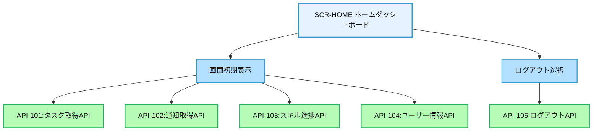

# 画面設計書：SCR-HOME（ホームダッシュボード）

## 1. 画面基本情報

- **画面ID**：SCR-HOME
- **画面名称**：ホームダッシュボード
- **画面の機能概要・目的**：  
  ログイン後の最初の画面として、ユーザーに必要な情報を一覧表示するダッシュボード。各種通知・進捗サマリ・ショートカットを提供し、システム内の主要機能へのアクセスポイントとなる。
- **利用ユーザー・アクター**：全ユーザー（社員・上司・人事・管理者）
- **関連機能・仕様ID・機能ID**：F02 / PLT.1-WEB.1, PLT.1-RESP.1, PLT.1-BRS.1, PLT.2-ENC.1, ACC.1-ROLE.1
- **作成日**：2025/05/28
- **作成者**：システム設計担当
- **改訂履歴**：2025/05/28 初版作成

---

## 2. 画面レイアウト

- **画面イメージ・ワイヤーフレーム**
```
+------------------------------------------------------+
| [ロゴ] 年間スキル報告書システム    [ユーザー名▼] [🔔] |
+------------------------------------------------------+
| [サイドメニュー] | [ようこそ、{ユーザー名}さん]      |
| ┌─────────────┐ | ┌─────────────────────────────┐    |
| │ ホーム      │ | │ 未完了タスク (3)            │    | ①
| │ プロフィール │ | │ ・スキル情報の更新          │    |
| │ スキル情報   │ | │ ・目標設定の承認           │    |
| │ キャリアプラン│ | │ ・研修参加記録の入力       │    |
| │ 作業実績    │ | └─────────────────────────────┘    |
| │ 研修記録    │ | ┌─────────────────────────────┐    |
| │ レポート    │ | │ お知らせ・通知 (5)          │    | ②
| │ 管理機能    │ | │ ・[NEW] システムメンテナンス │    |
| └─────────────┘ | │ ・[NEW] 四半期レビュー開始   │    |
|                 | │ ・資格更新リマインダー       │    |
|                 | │ ・[すべて表示]               │    |
|                 | └─────────────────────────────┘    |
|                 | ┌─────────────────────────────┐    |
|                 | │ クイックアクセス            │    | ③
|                 | │ [スキル入力] [目標設定]      │    |
|                 | │ [作業実績] [研修記録]        │    |
|                 | └─────────────────────────────┘    |
|                 | ┌─────────────────────────────┐    |
|                 | │ スキル達成状況              │    | ④
|                 | │ [グラフ/チャート表示]        │    |
|                 | │                             │    |
|                 | └─────────────────────────────┘    |
+------------------------------------------------------+
|  © 2025 Example Corp.                                |
+------------------------------------------------------+
```
- **画面サイズ**：レスポンシブ（PC：横1200px基準、スマホ：100%）
- **UI/UX設計上の注意点**：
  - ユーザーの役割（社員/上司/管理者）に応じて表示内容を動的に変更
  - スマホ表示時はカード型レイアウトに自動変換
  - アクセシビリティ対応（キーボード操作・スクリーンリーダー対応）

---

## 3. 画面項目定義

| 項目ID | 項目名            | APIパラメータ対応           | データ型   | I/O区分 | 必須 | 備考                       |
|--------|-------------------|----------------------------|-----------|---------|------|----------------------------|
| ①      | 未完了タスク      | API-101.tasks              | リスト     | 出力    | -    | ユーザーの未完了タスク一覧 |
| ②      | お知らせ・通知    | API-102.notifications      | リスト     | 出力    | -    | システム通知・個人通知     |
| ③      | クイックアクセス  | -                          | ボタン群   | 入力    | -    | 主要機能へのショートカット |
| ④      | スキル達成状況    | API-103.skill_progress     | グラフ     | 出力    | -    | スキル達成度の可視化       |
| -      | ユーザー名表示    | API-104.user_info.name     | テキスト   | 出力    | -    | ヘッダー部のユーザー表示   |
| -      | 通知アイコン      | API-102.unread_count       | アイコン   | 出力    | -    | 未読通知数をバッジ表示     |
| -      | サイドメニュー    | -                          | メニュー   | 入力    | -    | 主要画面へのナビゲーション |

---

## 4. 画面イベント・アクション定義

| イベントID | トリガー/アクション           | イベント内容・アクション詳細                                         | 紐付くAPI ID・名称      | メッセージ表示                       |
|------------|------------------------------|---------------------------------------------------------------------|------------------------|--------------------------------------|
| E01        | 画面初期表示                  | API-101/102/103/104呼出→各セクションにデータ表示                    | API-101/102/103/104    | エラー時：エラーメッセージ表示        |
| E02        | 未完了タスク項目クリック      | 対応する機能画面へ遷移（スキル情報/目標設定/研修記録等）             | -                      | -                                    |
| E03        | [すべて表示]リンククリック    | SCR-NOTIFY（通知・アラート画面）へ遷移                              | -                      | -                                    |
| E04        | クイックアクセスボタンクリック| 対応する機能画面へ遷移                                              | -                      | -                                    |
| E05        | サイドメニュー項目クリック    | 選択した機能画面へ遷移                                              | -                      | -                                    |
| E06        | ユーザー名ドロップダウンクリック| ユーザーメニュー表示（プロフィール/設定/ログアウト等）             | -                      | -                                    |
| E07        | 通知アイコンクリック          | 通知ポップアップ表示                                                | API-102                | -                                    |
| E08        | 通知項目クリック              | 対応する詳細画面へ遷移                                              | -                      | -                                    |
| E09        | ログアウト選択                | セッション破棄→SCR-LOGINへ遷移                                      | API-105                | -                                    |

---

## 5. 画面イベント・API関連図（Mermaid）



---

## 6. 画面遷移図・フロー

```mermaid
flowchart TD
    SCR-HOME["SCR-HOME ホームダッシュボード"]:::screen
    SCR-LOGIN["SCR-LOGIN ログイン画面"]:::screen
    SCR-PROFILE["SCR-PROFILE プロフィール管理"]:::screen
    SCR-SKILL["SCR-SKILL スキル情報管理"]:::screen
    SCR-CAR-PLAN["SCR-CAR-PLAN キャリアプラン"]:::screen
    SCR-WORK["SCR-WORK 作業実績入力"]:::screen
    SCR-TRAIN["SCR-TRAIN 研修参加記録"]:::screen
    SCR-REPORT["SCR-REPORT レポート出力"]:::screen
    SCR-ADMIN["SCR-ADMIN システム管理"]:::screen
    SCR-NOTIFY["SCR-NOTIFY 通知・アラート"]:::screen
    
    SCR-HOME -- ログアウト --> SCR-LOGIN
    SCR-HOME -- プロフィールメニュー --> SCR-PROFILE
    SCR-HOME -- スキル情報メニュー --> SCR-SKILL
    SCR-HOME -- キャリアプランメニュー --> SCR-CAR-PLAN
    SCR-HOME -- 作業実績メニュー --> SCR-WORK
    SCR-HOME -- 研修記録メニュー --> SCR-TRAIN
    SCR-HOME -- レポートメニュー --> SCR-REPORT
    SCR-HOME -- 管理機能メニュー --> SCR-ADMIN
    SCR-HOME -- 通知表示/すべて表示 --> SCR-NOTIFY
    
    classDef screen fill:#e6f2ff,stroke:#3399cc,stroke-width:3px,color:#111;
```



---

## 7. メッセージ定義

| メッセージID | メッセージ内容                                  | 種別    | 表示タイミング           |
|--------------|-----------------------------------------------|---------|-------------------------|
| MSG01        | データの取得に失敗しました                      | エラー  | API呼出失敗時           |
| MSG02        | セッションが切れました。再ログインしてください  | エラー  | セッションタイムアウト時 |
| MSG03        | 〇件の未完了タスクがあります                    | 警告    | 未完了タスク存在時      |
| MSG04        | 〇件の未読通知があります                        | 情報    | 未読通知存在時          |

---

## 8. 入出力一覧

| 種別      | 名称           | 概要                         | アクセス方式 | 経由API（ID・名称・エンドポイント）         |
|-----------|----------------|------------------------------|--------------|--------------------------------------------|
| API       | API-101        | タスク取得API                | -            | /api/tasks                                 |
| API       | API-102        | 通知取得API                  | -            | /api/notifications                         |
| API       | API-103        | スキル進捗API                | -            | /api/skills/progress                       |
| API       | API-104        | ユーザー情報API              | -            | /api/users/me                              |
| API       | API-105        | ログアウトAPI                | -            | /api/auth/logout                           |
| テーブル  | Tasks          | タスク情報                   | API経由      | API-101経由                                |
| テーブル  | Notifications  | 通知情報                     | API経由      | API-102経由                                |
| テーブル  | SkillProgress  | スキル進捗情報               | API経由      | API-103経由                                |
| テーブル  | UserInfo       | ユーザー情報                 | API経由      | API-104経由                                |
| セッション| Session        | ログインセッション管理       | API経由      | API-105経由で破棄                          |

---

## 9. バックエンドAPIコール仕様（APIファースト設計）

### API-101 タスク取得API
- エンドポイント: `/api/tasks`
- HTTPメソッド: GET
- リクエストパラメータ: status (string, 任意, デフォルト="incomplete")
- レスポンスパラメータ: tasks (array of task objects)
- ステータスコードとエラーケース: 200, 401, 403, 500
- 認証・認可要件: 認証済みユーザー
- 呼び出しタイミング: 画面初期表示時（E01）
- 備考: ユーザーの役割に応じたタスクを返却

### API-102 通知取得API
- エンドポイント: `/api/notifications`
- HTTPメソッド: GET
- リクエストパラメータ: limit (integer, 任意, デフォルト=5), read_status (string, 任意)
- レスポンスパラメータ: notifications (array of notification objects), unread_count (integer)
- ステータスコードとエラーケース: 200, 401, 403, 500
- 認証・認可要件: 認証済みユーザー
- 呼び出しタイミング: 画面初期表示時（E01）、通知アイコンクリック時（E07）
- 備考: 未読/既読ステータス管理

### API-103 スキル進捗API
- エンドポイント: `/api/skills/progress`
- HTTPメソッド: GET
- リクエストパラメータ: period (string, 任意, デフォルト="current")
- レスポンスパラメータ: skill_progress (object with progress data)
- ステータスコードとエラーケース: 200, 401, 403, 500
- 認証・認可要件: 認証済みユーザー
- 呼び出しタイミング: 画面初期表示時（E01）
- 備考: グラフ表示用のデータ形式

### API-104 ユーザー情報API
- エンドポイント: `/api/users/me`
- HTTPメソッド: GET
- リクエストパラメータ: なし
- レスポンスパラメータ: user_info (object)
- ステータスコードとエラーケース: 200, 401, 403, 500
- 認証・認可要件: 認証済みユーザー
- 呼び出しタイミング: 画面初期表示時（E01）
- 備考: ユーザー基本情報と権限情報を含む

### API-105 ログアウトAPI
- エンドポイント: `/api/auth/logout`
- HTTPメソッド: POST
- リクエストパラメータ: なし
- レスポンスパラメータ: success (boolean)
- ステータスコードとエラーケース: 200, 401, 500
- 認証・認可要件: 認証済みユーザー
- 呼び出しタイミング: ログアウト選択時（E09）
- 備考: セッション破棄処理

---

## 10. オブジェクト構成・CRUD定義

- Tasks: R（API-101経由）
- Notifications: R, U（既読ステータス更新、API-102経由）
- SkillProgress: R（API-103経由）
- UserInfo: R（API-104経由）
- Session: D（API-105経由）

---

## 11. その他

- **アクセシビリティ要件**  
  - キーボード操作・スクリーンリーダー対応、コントラスト確保、ラベル付与
  - WAI-ARIA準拠のダッシュボードコンポーネント
  - グラフ・チャートには代替テキスト提供

- **セキュリティ要件**  
  - 認証済みセッション必須、CSRF対策、XSS対策
  - ユーザー権限に応じた表示制御（RBAC）
  - API呼出時のJWTトークン検証

- **操作手順・利用ガイド**  
  - ログイン後、自動的にホームダッシュボードが表示される
  - 未完了タスクは優先度順に表示され、クリックで対応画面へ直接遷移
  - サイドメニューから各機能へアクセス可能
  - 通知アイコンをクリックすると最新の通知一覧がポップアップ表示
  - ユーザー名をクリックするとドロップダウンメニューが表示され、プロフィール確認やログアウトが可能

- **備考・補足**  
  - ダッシュボードのレイアウトはユーザー権限によってカスタマイズ
  - 管理者向けには追加の管理機能ショートカットを表示
  - スキル達成状況グラフは四半期ごとの推移を可視化
  - 将来的にはダッシュボードのウィジェットをユーザーがカスタマイズ可能に拡張予定
