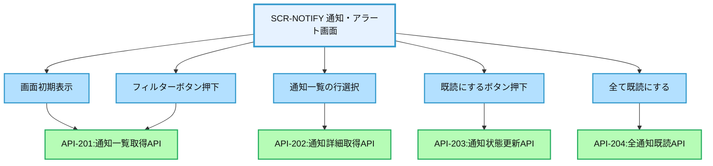
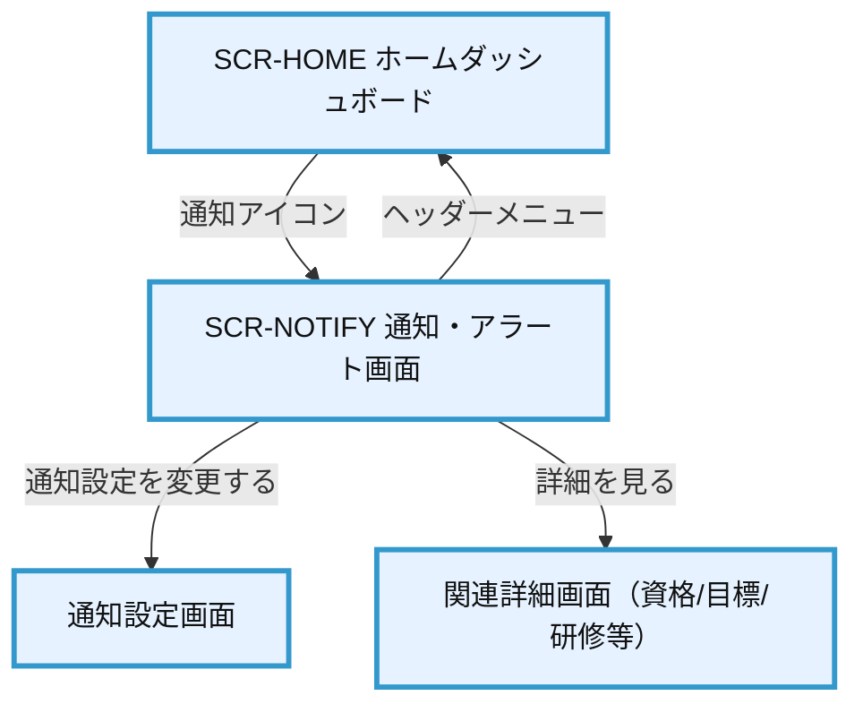

# 画面設計書：SCR-NOTIFY（通知・アラート画面）

## 1. 画面基本情報

- **画面ID**：SCR-NOTIFY
- **画面名称**：通知・アラート画面
- **画面の機能概要・目的**：  
  システム内の各種通知・アラートを一元管理し、ユーザーに適切なタイミングで情報を提供する画面。システム障害通知、資格期限アラート、進捗リマインダーなど、重要な情報をユーザーに通知し、必要なアクションを促す。
- **利用ユーザー・アクター**：全ユーザー（社員・上司・人事・管理者）
- **関連機能・仕様ID・機能ID**：F06 / PLT.3-NOTIF.1, PLT.3-NOTIF.2, PLT.3-NOTIF.3, TRN.2-CERT.2
- **作成日**：2025/05/28
- **作成者**：システム設計担当
- **改訂履歴**：2025/05/28 初版作成

---

## 2. 画面レイアウト

- **画面イメージ・ワイヤーフレーム**
```
+------------------------------------------------------+
|  [ヘッダー]                      [通知アイコン(3)]    |
+------------------------------------------------------+
|  通知・アラート                                      |
|                                                      |
|  ■ フィルター                                        |
|  [ 全て ] [システム] [資格] [目標] [研修] [その他]    | ①
|                                                      |
|  ■ 通知一覧                                          |
|  +--------------------------------------------------+|
|  | 種別 | 日時      | 内容                 | 状態   ||
|  |------|-----------|----------------------|--------||
|  | 資格 | 2025/5/20 | 資格Aの期限が近づい.. | 未読   || ②
|  | 目標 | 2025/5/19 | 目標Bの進捗報告期限.. | 既読   ||
|  | ｼｽﾃﾑ | 2025/5/18 | システムメンテナンス.. | 既読   ||
|  | ...  | ...       | ...                  | ...    ||
|  +--------------------------------------------------+|
|                                                      |
|  [ 前へ ] 1 2 3 ... 10 [ 次へ ]                     | ③
|                                                      |
|  ■ 通知詳細                                          |
|  +--------------------------------------------------+|
|  | 【資格期限アラート】                             ||
|  | 資格Aの有効期限が2025年6月30日に到来します。     || ④
|  | 更新手続きを行ってください。                     ||
|  |                                                  ||
|  | [ 詳細を見る ] [ 既読にする ] [ 閉じる ]         || ⑤⑥⑦
|  +--------------------------------------------------+|
|                                                      |
|  ■ 通知設定                                          |
|  [ 通知設定を変更する ]                              | ⑧
+------------------------------------------------------+
|  [フッター]                                          |
+------------------------------------------------------+
```
- **画面サイズ**：レスポンシブ（PC：横1000px基準、スマホ：100%）
- **UI/UX設計上の注意点**：通知の重要度による視覚的区別、既読/未読の明確な表示、簡潔な通知文

---

## 3. 画面項目定義

| 項目ID | 項目名                  | APIパラメータ対応           | データ型   | I/O区分 | 必須 | 備考                       |
|--------|-------------------------|----------------------------|-----------|---------|------|----------------------------|
| ①      | フィルターボタン群      | API-201.filter_type        | ボタングループ | 入力  | -    | 通知種別によるフィルタリング |
| ②      | 通知一覧テーブル        | API-201レスポンス          | テーブル   | 出力    | -    | ページング対応、ソート可能  |
| ③      | ページネーション        | API-201.page, API-201.size | ページャー | 入力/出力 | -  | 1ページ10件表示            |
| ④      | 通知詳細表示エリア      | API-202レスポンス          | テキスト   | 出力    | -    | 選択した通知の詳細表示     |
| ⑤      | 詳細を見るボタン        | -                          | ボタン     | 入力    | -    | 関連画面への遷移           |
| ⑥      | 既読にするボタン        | API-203（PUT）             | ボタン     | 入力    | -    | 通知の既読状態更新         |
| ⑦      | 閉じるボタン            | -                          | ボタン     | 入力    | -    | 通知詳細エリアを閉じる     |
| ⑧      | 通知設定を変更するボタン | -                          | ボタン     | 入力    | -    | 通知設定画面への遷移       |

---

## 4. 画面イベント・アクション定義

| イベントID | トリガー/アクション           | イベント内容・アクション詳細                                         | 紐付くAPI ID・名称      | メッセージ表示                       |
|------------|------------------------------|---------------------------------------------------------------------|------------------------|--------------------------------------|
| E01        | 画面初期表示                 | API-201呼出→通知一覧取得・表示                                      | API-201:通知一覧取得API | エラー時：エラーメッセージ表示        |
| E02        | [フィルターボタン]押下       | API-201呼出→フィルター条件指定→通知一覧更新                         | API-201:通知一覧取得API | エラー時：エラーメッセージ表示        |
| E03        | 通知一覧の行選択             | API-202呼出→選択通知の詳細取得→通知詳細エリアに表示                 | API-202:通知詳細取得API | エラー時：エラーメッセージ表示        |
| E04        | [詳細を見る]ボタン押下       | 通知内容に関連する画面へ遷移（資格詳細、目標詳細など）               | -                      |                                      |
| E05        | [既読にする]ボタン押下       | API-203呼出→通知の既読状態更新→通知一覧更新                         | API-203:通知状態更新API | 成功時：「既読にしました」<br>エラー時：エラーメッセージ表示 |
| E06        | [閉じる]ボタン押下           | 通知詳細エリアを閉じる                                              | -                      |                                      |
| E07        | [通知設定を変更する]ボタン押下| 通知設定画面へ遷移                                                  | -                      |                                      |
| E08        | ページネーション操作         | API-201呼出→指定ページの通知一覧取得・表示                          | API-201:通知一覧取得API | エラー時：エラーメッセージ表示        |
| E09        | 通知一覧ヘッダーでのソート   | API-201呼出→ソート条件指定→通知一覧更新                             | API-201:通知一覧取得API | エラー時：エラーメッセージ表示        |
| E10        | 全て既読にする               | API-204呼出→全通知の既読状態更新→通知一覧更新                       | API-204:全通知既読API   | 成功時：「全ての通知を既読にしました」<br>エラー時：エラーメッセージ表示 |

---

## 5. 画面イベント・API関連図（Mermaid）



---

## 6. 画面遷移図・フロー



---

## 7. メッセージ定義

| メッセージID | メッセージ内容                                  | 種別    | 表示タイミング           |
|--------------|-----------------------------------------------|---------|-------------------------|
| MSG01        | 通知情報の取得に失敗しました                   | エラー  | 通知一覧取得失敗時      |
| MSG02        | 通知詳細の取得に失敗しました                   | エラー  | 通知詳細取得失敗時      |
| MSG03        | 既読にしました                                 | 成功    | 既読処理成功時          |
| MSG04        | 既読処理に失敗しました                         | エラー  | 既読処理失敗時          |
| MSG05        | 全ての通知を既読にしました                     | 成功    | 全通知既読処理成功時    |
| MSG06        | 全通知の既読処理に失敗しました                 | エラー  | 全通知既読処理失敗時    |
| MSG07        | システム障害が発生しました。再度お試しください | エラー  | システム例外時          |

---

## 8. 入出力一覧

| 種別      | 名称           | 概要                         | アクセス方式 | 経由API（ID・名称・エンドポイント）         |
|-----------|----------------|------------------------------|--------------|--------------------------------------------|
| テーブル  | Notification   | 通知情報                     | API経由      | API-201:通知一覧取得API /api/notifications |
| API       | API-201        | 通知一覧取得API              | -            | /api/notifications                         |
| API       | API-202        | 通知詳細取得API              | -            | /api/notifications/{id}                    |
| API       | API-203        | 通知状態更新API              | -            | /api/notifications/{id}/read               |
| API       | API-204        | 全通知既読API                | -            | /api/notifications/read-all                |
| セッション| UserPreference | ユーザー通知設定             | API経由      | 通知設定画面経由で更新                     |

---

## 9. バックエンドAPIコール仕様（APIファースト設計）

### API-201 通知一覧取得API
- エンドポイント: `/api/notifications`
- HTTPメソッド: GET
- リクエストパラメータ: filter_type (string, オプション), page (number, オプション), size (number, オプション), sort (string, オプション)
- レスポンスパラメータ: notifications (array), total_count (number), page_info (object)
- ステータスコードとエラーケース: 200, 400, 401, 403, 500
- 認証・認可要件: 認証済みユーザー
- 呼び出しタイミング: 画面初期表示時（E01）、フィルターボタン押下時（E02）、ページネーション操作時（E08）
- 備考: filter_typeは"all", "system", "certification", "goal", "training", "other"のいずれか

### API-202 通知詳細取得API
- エンドポイント: `/api/notifications/{id}`
- HTTPメソッド: GET
- リクエストパラメータ: id (string, 必須)
- レスポンスパラメータ: notification (object)
- ステータスコードとエラーケース: 200, 400, 401, 403, 404, 500
- 認証・認可要件: 認証済みユーザー
- 呼び出しタイミング: 通知一覧の行選択時（E03）
- 備考: 通知詳細にはリンク先情報も含まれる

### API-203 通知状態更新API
- エンドポイント: `/api/notifications/{id}/read`
- HTTPメソッド: PUT
- リクエストパラメータ: id (string, 必須)
- レスポンスパラメータ: success (boolean), notification (object)
- ステータスコードとエラーケース: 200, 400, 401, 403, 404, 500
- 認証・認可要件: 認証済みユーザー
- 呼び出しタイミング: [既読にする]ボタン押下時（E05）
- 備考: 既読状態のみ更新、通知内容は変更不可

### API-204 全通知既読API
- エンドポイント: `/api/notifications/read-all`
- HTTPメソッド: PUT
- リクエストパラメータ: filter_type (string, オプション)
- レスポンスパラメータ: success (boolean), count (number)
- ステータスコードとエラーケース: 200, 400, 401, 403, 500
- 認証・認可要件: 認証済みユーザー
- 呼び出しタイミング: [全て既読にする]ボタン押下時（E10）
- 備考: filter_typeを指定した場合、該当種別の通知のみ既読化

---

## 10. オブジェクト構成・CRUD定義

- Notification: R, U（API-201/202/203/204経由）
- NotificationSetting: R（API-201経由）
- NotificationLog: C（システム内部処理）
- UserPreference: R（通知表示制御用）

---

## 11. その他

- **アクセシビリティ要件**  
  - キーボード操作対応、スクリーンリーダー対応、色だけに依存しない重要度表示
  - 通知音・バイブレーション設定オプション（モバイル対応時）
- **セキュリティ要件**  
  - 通知内容の機密レベルに応じた表示制御（詳細情報は認証後のみ表示）
  - クロスサイトスクリプティング対策（通知内容のサニタイズ）
- **操作手順・利用ガイド**  
  - ヘッダーの通知アイコンから通知画面へアクセス
  - 通知一覧から項目を選択して詳細表示
  - 必要に応じて関連画面へ遷移または既読処理
  - 通知設定画面で通知種別ごとの受信設定変更可能
- **備考・補足**  
  - 通知は最大90日間保持、その後自動アーカイブ
  - 重要度の高い通知はログイン時にポップアップ表示
  - 将来的にはメール通知・モバイルプッシュ通知との連携も検討
  - 通知頻度・表示方法はユーザー設定で変更可能
