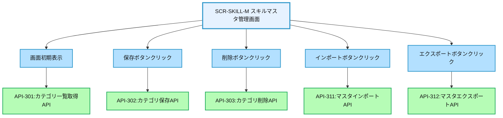
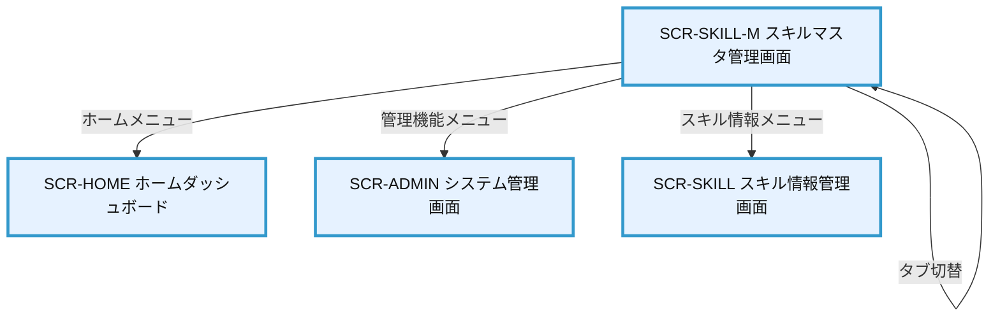

# 画面設計書：SCR-SKILL-M（スキルマスタ管理画面）

## 1. 画面基本情報

- **画面ID**：SCR-SKILL-M
- **画面名称**：スキルマスタ管理画面
- **画面の機能概要・目的**：  
  システム全体で使用するスキル項目のマスタデータを管理する画面。スキルカテゴリ、スキル項目、評価基準などの登録・編集・削除機能を提供し、スキル評価の基盤となるデータを整備する。
- **利用ユーザー・アクター**：システム管理者、人事担当者
- **関連機能・仕様ID・機能ID**：F04 / PLT.1-WEB.1, PLT.1-RESP.1, PLT.2-ENC.1, ACC.1-ROLE.1, SKL.1-MSTR.1
- **作成日**：2025/05/28
- **作成者**：システム設計担当
- **改訂履歴**：2025/05/28 初版作成

---

## 2. 画面レイアウト

- **画面イメージ・ワイヤーフレーム**
```
+------------------------------------------------------+
| [ロゴ] 年間スキル報告書システム    [ユーザー名▼] [🔔] |
+------------------------------------------------------+
| [サイドメニュー] | [スキルマスタ管理]                |
| ┌─────────────┐ | ┌─────────────────────────────┐    |
| │ ホーム      │ | │ [スキルカテゴリ] [スキル項目] │    | ①
| │ プロフィール │ | │ [評価基準] [インポート/エクスポート]│ |
| │ スキル情報   │ | └─────────────────────────────┘    |
| │ キャリアプラン│ | ┌─────────────────────────────┐    |
| │ 作業実績    │ | │ スキルカテゴリ一覧           │    | ②
| │ 研修記録    │ | │ [+ 新規作成]                 │    |
| │ レポート    │ | │ ┌───────┬────────┬────────┐ │    |
| │ 管理機能    │ | │ │カテゴリID│カテゴリ名│表示順 │ │    |
| └─────────────┘ | │ ├───────┼────────┼────────┤ │    |
|                 | │ │TECH    │技術スキル│1      │ │    |
|                 | │ │MGMT    │管理スキル│2      │ │    |
|                 | │ │COMM    │対人スキル│3      │ │    |
|                 | │ │CERT    │資格    │4      │ │    |
|                 | │ └───────┴────────┴────────┘ │    |
|                 | │                             │    |
|                 | │ [< 前へ] 1/2 [次へ >]        │    |
|                 | └─────────────────────────────┘    |
|                 | ┌─────────────────────────────┐    |
|                 | │ カテゴリ詳細                │    | ③
|                 | │ カテゴリID: [_______]        │    |
|                 | │ カテゴリ名: [_______]        │    |
|                 | │ 表示順: [_______]            │    |
|                 | │ 説明: [_________________]    │    |
|                 | │                             │    |
|                 | │ [保存] [削除] [キャンセル]   │    |
|                 | └─────────────────────────────┘    |
+------------------------------------------------------+
|  © 2025 Example Corp.                                |
+------------------------------------------------------+
```
- **画面サイズ**：レスポンシブ（PC：横1200px基準、スマホ：100%）
- **UI/UX設計上の注意点**：
  - タブ切り替えでスキルカテゴリ/スキル項目/評価基準を管理
  - 一覧と詳細編集を同一画面に配置し、操作性を向上
  - 削除操作は確認ダイアログ表示
  - インポート/エクスポート機能でCSV/Excel連携
  - アクセシビリティ対応（キーボード操作・スクリーンリーダー対応）

---

## 3. 画面項目定義

| 項目ID | 項目名                | APIパラメータ対応           | データ型   | I/O区分 | 必須 | 備考                       |
|--------|----------------------|----------------------------|-----------|---------|------|----------------------------|
| ①      | タブメニュー          | -                          | タブ      | 入力    | -    | 管理対象切替               |
| -      | スキルカテゴリタブ    | -                          | タブ      | 入力    | -    | カテゴリ管理画面表示       |
| -      | スキル項目タブ        | -                          | タブ      | 入力    | -    | スキル項目管理画面表示     |
| -      | 評価基準タブ          | -                          | タブ      | 入力    | -    | 評価基準管理画面表示       |
| -      | インポート/エクスポートタブ | -                    | タブ      | 入力    | -    | データ入出力画面表示       |
| ②      | スキルカテゴリ一覧    | API-301.categories         | テーブル   | 出力    | -    | カテゴリ一覧表示           |
| -      | 新規作成ボタン        | -                          | ボタン     | 入力    | -    | 新規カテゴリ作成           |
| -      | カテゴリID列          | API-301.categories[].id    | テキスト   | 出力    | -    | カテゴリID表示             |
| -      | カテゴリ名列          | API-301.categories[].name  | テキスト   | 出力    | -    | カテゴリ名表示             |
| -      | 表示順列              | API-301.categories[].order | 数値      | 出力    | -    | 表示順序表示               |
| -      | ページネーション      | API-301.pagination         | ページャー | 入力    | -    | ページ切替                 |
| ③      | カテゴリ詳細          | -                          | セクション | -       | -    | カテゴリ詳細編集セクション |
| -      | カテゴリID入力        | API-302.category_id        | テキスト   | 入力    | ○    | カテゴリID入力             |
| -      | カテゴリ名入力        | API-302.category_name      | テキスト   | 入力    | ○    | カテゴリ名入力             |
| -      | 表示順入力            | API-302.display_order      | 数値      | 入力    | ○    | 表示順序入力               |
| -      | 説明入力              | API-302.description        | テキストエリア | 入力 | -    | カテゴリ説明入力           |
| -      | 保存ボタン            | API-302                    | ボタン     | 入力    | -    | カテゴリ保存               |
| -      | 削除ボタン            | API-303                    | ボタン     | 入力    | -    | カテゴリ削除               |
| -      | キャンセルボタン      | -                          | ボタン     | 入力    | -    | 編集キャンセル             |

---

## 4. 画面イベント・アクション定義

| イベントID | トリガー/アクション           | イベント内容・アクション詳細                                         | 紐付くAPI ID・名称      | メッセージ表示                       |
|------------|------------------------------|---------------------------------------------------------------------|------------------------|--------------------------------------|
| E01        | 画面初期表示                  | API-301呼出→カテゴリ一覧表示                                        | API-301                | エラー時：エラーメッセージ表示        |
| E02        | タブクリック                  | 対応する管理画面（カテゴリ/項目/基準/インポート）に切替              | API-301/304/307/310    | -                                    |
| E03        | 一覧行クリック                | 選択したカテゴリの詳細情報を詳細セクションに表示                     | -                      | -                                    |
| E04        | 新規作成ボタンクリック        | 詳細セクションをクリアし、新規入力モードに切替                       | -                      | -                                    |
| E05        | 保存ボタンクリック            | 入力値バリデーション→API-302呼出→保存処理                           | API-302                | 成功/失敗メッセージ表示               |
| E06        | 削除ボタンクリック            | 確認ダイアログ表示→API-303呼出→削除処理                             | API-303                | 成功/失敗メッセージ表示               |
| E07        | キャンセルボタンクリック      | 詳細セクションの編集内容を破棄                                      | -                      | -                                    |
| E08        | ページネーションクリック      | API-301呼出→指定ページのカテゴリ一覧表示                            | API-301                | エラー時：エラーメッセージ表示        |
| E09        | 入力エラー                    | 必須項目未入力・形式不正                                            | -                      | 「必須項目を入力してください」等      |
| E10        | インポートボタンクリック      | ファイル選択ダイアログ表示→API-311呼出→インポート処理               | API-311                | 成功/失敗メッセージ表示               |
| E11        | エクスポートボタンクリック    | API-312呼出→CSVファイルダウンロード                                | API-312                | 成功/失敗メッセージ表示               |

---

## 5. 画面イベント・API関連図（Mermaid）



---

## 6. 画面遷移図・フロー



---

## 7. メッセージ定義

| メッセージID | メッセージ内容                                  | 種別    | 表示タイミング           |
|--------------|-----------------------------------------------|---------|-------------------------|
| MSG01        | データの取得に失敗しました                      | エラー  | API呼出失敗時           |
| MSG02        | 必須項目を入力してください                      | エラー  | 必須項目未入力時        |
| MSG03        | カテゴリIDは英数字のみ使用可能です              | エラー  | ID形式不正時            |
| MSG04        | 同じIDのカテゴリが既に存在します                | エラー  | ID重複時                |
| MSG05        | カテゴリを保存しました                          | 成功    | 保存成功時              |
| MSG06        | カテゴリを削除しました                          | 成功    | 削除成功時              |
| MSG07        | このカテゴリを削除してもよろしいですか？         | 確認    | 削除実行前              |
| MSG08        | インポートが完了しました（成功: XX件、失敗: XX件）| 成功    | インポート成功時        |
| MSG09        | エクスポートが完了しました                      | 成功    | エクスポート成功時      |

---

## 8. 入出力一覧

| 種別      | 名称           | 概要                         | アクセス方式 | 経由API（ID・名称・エンドポイント）         |
|-----------|----------------|------------------------------|--------------|--------------------------------------------|
| API       | API-301        | カテゴリ一覧取得API          | -            | /api/skill-categories                      |
| API       | API-302        | カテゴリ保存API              | -            | /api/skill-categories                      |
| API       | API-303        | カテゴリ削除API              | -            | /api/skill-categories/{id}                 |
| API       | API-304        | スキル項目一覧取得API        | -            | /api/skill-items                           |
| API       | API-305        | スキル項目保存API            | -            | /api/skill-items                           |
| API       | API-306        | スキル項目削除API            | -            | /api/skill-items/{id}                      |
| API       | API-307        | 評価基準一覧取得API          | -            | /api/evaluation-criteria                   |
| API       | API-308        | 評価基準保存API              | -            | /api/evaluation-criteria                   |
| API       | API-309        | 評価基準削除API              | -            | /api/evaluation-criteria/{id}              |
| API       | API-310        | マスタ一覧取得API            | -            | /api/skill-masters                         |
| API       | API-311        | マスタインポートAPI          | -            | /api/skill-masters/import                  |
| API       | API-312        | マスタエクスポートAPI        | -            | /api/skill-masters/export                  |
| テーブル  | SkillCategories| スキルカテゴリマスタ         | API経由      | API-301/302/303経由                        |
| テーブル  | SkillItems     | スキル項目マスタ             | API経由      | API-304/305/306経由                        |
| テーブル  | EvalCriteria   | 評価基準マスタ               | API経由      | API-307/308/309経由                        |
| ファイル  | CSV/Excel      | インポート/エクスポートファイル | API経由    | API-311/312経由                           |

---

## 9. バックエンドAPIコール仕様（APIファースト設計）

### API-301 カテゴリ一覧取得API
- エンドポイント: `/api/skill-categories`
- HTTPメソッド: GET
- リクエストパラメータ: page (integer, 任意), limit (integer, 任意)
- レスポンスパラメータ: categories (array of category objects), pagination (object)
- ステータスコードとエラーケース: 200, 401, 403, 500
- 認証・認可要件: 認証済みユーザー、管理者権限
- 呼び出しタイミング: 画面初期表示時（E01）、ページネーション操作時（E08）
- 備考: ページング対応

### API-302 カテゴリ保存API
- エンドポイント: `/api/skill-categories`
- HTTPメソッド: POST
- リクエストパラメータ: category_id (string, 必須), category_name (string, 必須), display_order (integer, 必須), description (string, 任意)
- レスポンスパラメータ: success (boolean), category (object)
- ステータスコードとエラーケース: 200, 400, 401, 403, 409, 500
- 認証・認可要件: 認証済みユーザー、管理者権限
- 呼び出しタイミング: 保存ボタンクリック時（E05）
- 備考: 新規作成/更新共通API

### API-303 カテゴリ削除API
- エンドポイント: `/api/skill-categories/{id}`
- HTTPメソッド: DELETE
- リクエストパラメータ: id (path parameter, 必須)
- レスポンスパラメータ: success (boolean)
- ステータスコードとエラーケース: 200, 400, 401, 403, 404, 500
- 認証・認可要件: 認証済みユーザー、管理者権限
- 呼び出しタイミング: 削除ボタンクリック時（E06）
- 備考: 関連データ存在時は削除不可

### API-311 マスタインポートAPI
- エンドポイント: `/api/skill-masters/import`
- HTTPメソッド: POST
- リクエストパラメータ: file (multipart/form-data, 必須), type (string, 必須)
- レスポンスパラメータ: success (boolean), imported_count (integer), failed_count (integer), errors (array)
- ステータスコードとエラーケース: 200, 400, 401, 403, 500
- 認証・認可要件: 認証済みユーザー、管理者権限
- 呼び出しタイミング: インポートボタンクリック時（E10）
- 備考: CSV/Excel形式対応

### API-312 マスタエクスポートAPI
- エンドポイント: `/api/skill-masters/export`
- HTTPメソッド: GET
- リクエストパラメータ: type (string, 必須), format (string, 任意, デフォルト="csv")
- レスポンスパラメータ: ファイルダウンロード
- ステータスコードとエラーケース: 200, 400, 401, 403, 500
- 認証・認可要件: 認証済みユーザー、管理者権限
- 呼び出しタイミング: エクスポートボタンクリック時（E11）
- 備考: CSV/Excel形式対応

---

## 10. オブジェクト構成・CRUD定義

- SkillCategories: C, R, U, D（API-301/302/303経由）
- SkillItems: C, R, U, D（API-304/305/306経由）
- EvalCriteria: C, R, U, D（API-307/308/309経由）
- MasterImportLog: C（API-311経由）
- MasterExportLog: C（API-312経由）

---

## 11. その他

- **アクセシビリティ要件**  
  - キーボード操作・スクリーンリーダー対応、コントラスト確保、ラベル付与
  - テーブルにはキャプションと適切なヘッダー設定
  - フォーム要素にはラベルと説明テキスト提供

- **セキュリティ要件**  
  - 管理者権限の厳格な検証
  - 全操作の監査ログ記録
  - インポートファイルのウイルスチェック
  - CSRF対策、XSS対策
  - API呼出時のJWTトークン検証

- **操作手順・利用ガイド**  
  - タブでカテゴリ/スキル項目/評価基準/インポート・エクスポートを切り替え
  - 一覧から項目をクリックして詳細表示・編集
  - 新規作成ボタンで新規項目追加
  - インポート/エクスポートタブでCSV/Excelファイルによる一括処理
  - 削除前には確認ダイアログを表示

- **備考・補足**  
  - スキルカテゴリ、スキル項目、評価基準は階層構造（親子関係）を持つ
  - インポート時のテンプレートファイルをダウンロード可能
  - エクスポート時はCSV/Excel形式を選択可能
  - 将来的にはドラッグ&ドロップによる表示順変更機能を追加予定
  - スキル項目タブでは、カテゴリとの関連付けが可能
