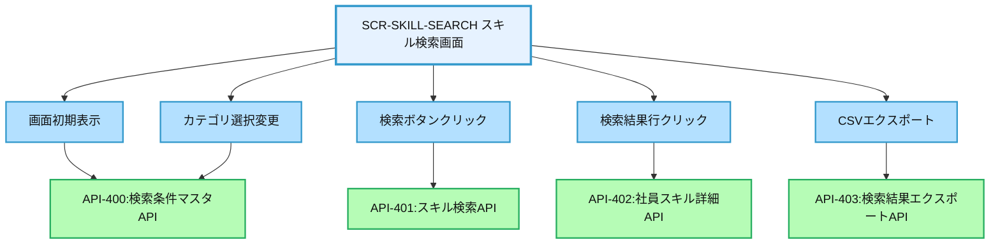
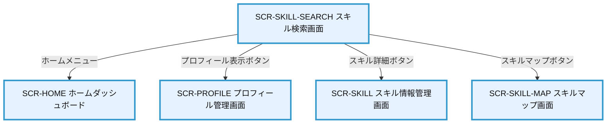

# 画面設計書：SCR-SKILL-SEARCH（スキル検索画面）

## 1. 画面基本情報

- **画面ID**：SCR-SKILL-SEARCH
- **画面名称**：スキル検索画面
- **画面の機能概要・目的**：  
  社員のスキル情報を多角的に検索・抽出する画面。スキルカテゴリ、スキル項目、評価レベル、資格などの条件で社員を検索し、プロジェクトアサインや人材育成計画の立案に活用する。
- **利用ユーザー・アクター**：上司・管理者・人事担当者
- **関連機能・仕様ID・機能ID**：F05 / PLT.1-WEB.1, PLT.1-RESP.1, PLT.2-ENC.1, ACC.1-ROLE.1, SKL.2-SRCH.1
- **作成日**：2025/05/28
- **作成者**：システム設計担当
- **改訂履歴**：2025/05/28 初版作成

---

## 2. 画面レイアウト

- **画面イメージ・ワイヤーフレーム**
```
+------------------------------------------------------+
| [ロゴ] 年間スキル報告書システム    [ユーザー名▼] [🔔] |
+------------------------------------------------------+
| [サイドメニュー] | [スキル検索]                      |
| ┌─────────────┐ | ┌─────────────────────────────┐    |
| │ ホーム      │ | │ 検索条件                    │    | ①
| │ プロフィール │ | │ 組織: [▼選択してください]    │    |
| │ スキル情報   │ | │ 役職: [▼選択してください]    │    |
| │ キャリアプラン│ | │ スキルカテゴリ: [▼選択]      │    |
| │ 作業実績    │ | │ スキル項目: [▼選択]          │    |
| │ 研修記録    │ | │ 評価レベル: [▼選択] [以上▼]   │    |
| │ レポート    │ | │ 資格: [▼選択してください]    │    |
| │ 管理機能    │ | │ フリーワード: [_________]    │    |
| └─────────────┘ | │ [検索] [条件クリア]          │    |
|                 | └─────────────────────────────┘    |
|                 | ┌─────────────────────────────┐    |
|                 | │ 検索結果 (15件)             │    | ②
|                 | │ [CSVエクスポート]            │    |
|                 | │ ┌────┬────┬────┬────┬────┐ │    |
|                 | │ │社員ID│氏名│組織│役職│評価│ │    |
|                 | │ ├────┼────┼────┼────┼────┤ │    |
|                 | │ │1001 │山田│開発│主任│A   │ │    |
|                 | │ │1002 │鈴木│営業│課長│B+  │ │    |
|                 | │ │1003 │佐藤│人事│係長│A-  │ │    |
|                 | │ │...  │... │... │... │... │ │    |
|                 | │ └────┴────┴────┴────┴────┘ │    |
|                 | │                             │    |
|                 | │ [< 前へ] 1/3 [次へ >]        │    |
|                 | └─────────────────────────────┘    |
|                 | ┌─────────────────────────────┐    |
|                 | │ 詳細表示                    │    | ③
|                 | │ 社員ID: 1001                │    |
|                 | │ 氏名: 山田太郎              │    |
|                 | │ 組織: 開発部                │    |
|                 | │ 役職: 主任                  │    |
|                 | │ ┌────────┬────────┬────┐   │    |
|                 | │ │スキル項目│評価レベル│備考│   │    |
|                 | │ ├────────┼────────┼────┤   │    |
|                 | │ │Java    │A       │... │   │    |
|                 | │ │SQL     │A+      │... │   │    |
|                 | │ │...     │...     │... │   │    |
|                 | │ └────────┴────────┴────┘   │    |
|                 | │ [プロフィール表示] [スキル詳細]│    |
|                 | └─────────────────────────────┘    |
+------------------------------------------------------+
|  © 2025 Example Corp.                                |
+------------------------------------------------------+
```
- **画面サイズ**：レスポンシブ（PC：横1200px基準、スマホ：100%）
- **UI/UX設計上の注意点**：
  - 検索条件は複数組み合わせ可能で、AND条件で絞り込み
  - 検索結果一覧から社員を選択すると詳細情報を表示
  - 検索結果はCSVエクスポート可能
  - 詳細表示からプロフィール画面やスキル詳細画面へ遷移可能
  - アクセシビリティ対応（キーボード操作・スクリーンリーダー対応）

---

## 3. 画面項目定義

| 項目ID | 項目名                | APIパラメータ対応           | データ型   | I/O区分 | 必須 | 備考                       |
|--------|----------------------|----------------------------|-----------|---------|------|----------------------------|
| ①      | 検索条件セクション    | -                          | セクション | -       | -    | 検索条件入力エリア         |
| -      | 組織選択              | API-401.organization_id    | セレクト   | 入力    | -    | 組織選択ドロップダウン     |
| -      | 役職選択              | API-401.position_id        | セレクト   | 入力    | -    | 役職選択ドロップダウン     |
| -      | スキルカテゴリ選択    | API-401.skill_category_id  | セレクト   | 入力    | -    | カテゴリ選択ドロップダウン |
| -      | スキル項目選択        | API-401.skill_item_id      | セレクト   | 入力    | -    | スキル項目選択ドロップダウン |
| -      | 評価レベル選択        | API-401.evaluation_level   | セレクト   | 入力    | -    | 評価レベル選択ドロップダウン |
| -      | 評価条件選択          | API-401.level_condition    | セレクト   | 入力    | -    | 以上/以下/等しい選択       |
| -      | 資格選択              | API-401.certification_id   | セレクト   | 入力    | -    | 資格選択ドロップダウン     |
| -      | フリーワード入力      | API-401.keyword            | テキスト   | 入力    | -    | フリーワード検索入力       |
| -      | 検索ボタン            | -                          | ボタン     | 入力    | -    | 検索実行ボタン             |
| -      | 条件クリアボタン      | -                          | ボタン     | 入力    | -    | 検索条件リセットボタン     |
| ②      | 検索結果セクション    | -                          | セクション | -       | -    | 検索結果表示エリア         |
| -      | 検索結果件数          | API-401.total_count        | テキスト   | 出力    | -    | 検索結果総件数表示         |
| -      | CSVエクスポートボタン | -                          | ボタン     | 入力    | -    | 検索結果エクスポートボタン |
| -      | 検索結果テーブル      | API-401.results            | テーブル   | 出力    | -    | 検索結果一覧表示           |
| -      | 社員ID列              | API-401.results[].employee_id | テキスト | 出力    | -    | 社員ID表示                 |
| -      | 氏名列                | API-401.results[].name     | テキスト   | 出力    | -    | 氏名表示                   |
| -      | 組織列                | API-401.results[].organization | テキスト | 出力  | -    | 組織名表示                 |
| -      | 役職列                | API-401.results[].position | テキスト   | 出力    | -    | 役職名表示                 |
| -      | 評価列                | API-401.results[].evaluation | テキスト | 出力    | -    | 評価レベル表示             |
| -      | ページネーション      | API-401.pagination         | ページャー | 入力    | -    | ページ切替                 |
| ③      | 詳細表示セクション    | -                          | セクション | -       | -    | 社員詳細表示エリア         |
| -      | 社員ID表示            | API-402.employee_id        | テキスト   | 出力    | -    | 社員ID表示                 |
| -      | 氏名表示              | API-402.name               | テキスト   | 出力    | -    | 氏名表示                   |
| -      | 組織表示              | API-402.organization       | テキスト   | 出力    | -    | 組織名表示                 |
| -      | 役職表示              | API-402.position           | テキスト   | 出力    | -    | 役職名表示                 |
| -      | スキル詳細テーブル    | API-402.skills             | テーブル   | 出力    | -    | スキル詳細一覧表示         |
| -      | プロフィール表示ボタン | -                          | ボタン     | 入力    | -    | プロフィール画面遷移ボタン |
| -      | スキル詳細ボタン      | -                          | ボタン     | 入力    | -    | スキル詳細画面遷移ボタン   |

---

## 4. 画面イベント・アクション定義

| イベントID | トリガー/アクション           | イベント内容・アクション詳細                                         | 紐付くAPI ID・名称      | メッセージ表示                       |
|------------|------------------------------|---------------------------------------------------------------------|------------------------|--------------------------------------|
| E01        | 画面初期表示                  | API-400呼出→検索条件ドロップダウン初期化                            | API-400                | エラー時：エラーメッセージ表示        |
| E02        | スキルカテゴリ選択変更        | API-400呼出→選択カテゴリに対応するスキル項目リスト取得・表示         | API-400                | -                                    |
| E03        | 検索ボタンクリック            | 入力値バリデーション→API-401呼出→検索結果表示                       | API-401                | 該当データなし時：「検索結果がありません」|
| E04        | 条件クリアボタンクリック      | 検索条件入力値をクリア                                              | -                      | -                                    |
| E05        | 検索結果行クリック            | API-402呼出→選択社員の詳細情報を詳細セクションに表示                | API-402                | エラー時：エラーメッセージ表示        |
| E06        | CSVエクスポートボタンクリック | API-403呼出→検索結果CSVダウンロード                                | API-403                | エラー時：エラーメッセージ表示        |
| E07        | ページネーションクリック      | API-401呼出→指定ページの検索結果表示                                | API-401                | エラー時：エラーメッセージ表示        |
| E08        | プロフィール表示ボタンクリック | SCR-PROFILE画面へ遷移（選択社員のIDをパラメータ指定）               | -                      | -                                    |
| E09        | スキル詳細ボタンクリック      | SCR-SKILL画面へ遷移（選択社員のIDをパラメータ指定）                 | -                      | -                                    |

---

## 5. 画面イベント・API関連図（Mermaid）



---

## 6. 画面遷移図・フロー



---

## 7. メッセージ定義

| メッセージID | メッセージ内容                                  | 種別    | 表示タイミング           |
|--------------|-----------------------------------------------|---------|-------------------------|
| MSG01        | データの取得に失敗しました                      | エラー  | API呼出失敗時           |
| MSG02        | 検索条件を入力してください                      | 警告    | 条件未入力で検索時      |
| MSG03        | 検索結果がありません                            | 情報    | 該当データなし時        |
| MSG04        | CSVエクスポートが完了しました                   | 成功    | エクスポート成功時      |
| MSG05        | 検索結果は最大1000件までエクスポート可能です     | 警告    | 大量データエクスポート時 |

---

## 8. 入出力一覧

| 種別      | 名称           | 概要                         | アクセス方式 | 経由API（ID・名称・エンドポイント）         |
|-----------|----------------|------------------------------|--------------|--------------------------------------------|
| API       | API-400        | 検索条件マスタAPI            | -            | /api/search/conditions                     |
| API       | API-401        | スキル検索API                | -            | /api/search/skills                         |
| API       | API-402        | 社員スキル詳細API            | -            | /api/employees/{id}/skills                 |
| API       | API-403        | 検索結果エクスポートAPI      | -            | /api/search/skills/export                  |
| テーブル  | Organizations  | 組織マスタ                   | API経由      | API-400経由                                |
| テーブル  | Positions      | 役職マスタ                   | API経由      | API-400経由                                |
| テーブル  | SkillCategories| スキルカテゴリマスタ         | API経由      | API-400経由                                |
| テーブル  | SkillItems     | スキル項目マスタ             | API経由      | API-400経由                                |
| テーブル  | Certifications | 資格マスタ                   | API経由      | API-400経由                                |
| テーブル  | Employees      | 社員情報                     | API経由      | API-401/402経由                            |
| テーブル  | EmployeeSkills | 社員スキル情報               | API経由      | API-401/402経由                            |
| ファイル  | CSV            | エクスポートファイル         | API経由      | API-403経由                                |

---

## 9. バックエンドAPIコール仕様（APIファースト設計）

### API-400 検索条件マスタAPI
- エンドポイント: `/api/search/conditions`
- HTTPメソッド: GET
- リクエストパラメータ: category_id (string, 任意)
- レスポンスパラメータ: organizations (array), positions (array), skill_categories (array), skill_items (array), certifications (array)
- ステータスコードとエラーケース: 200, 401, 403, 500
- 認証・認可要件: 認証済みユーザー、検索権限
- 呼び出しタイミング: 画面初期表示時（E01）、カテゴリ選択変更時（E02）
- 備考: カテゴリ選択時はそのカテゴリに属するスキル項目のみ返却

### API-401 スキル検索API
- エンドポイント: `/api/search/skills`
- HTTPメソッド: POST
- リクエストパラメータ: organization_id (string, 任意), position_id (string, 任意), skill_category_id (string, 任意), skill_item_id (string, 任意), evaluation_level (string, 任意), level_condition (string, 任意), certification_id (string, 任意), keyword (string, 任意), page (integer, 任意), limit (integer, 任意)
- レスポンスパラメータ: results (array of employee objects), total_count (integer), pagination (object)
- ステータスコードとエラーケース: 200, 400, 401, 403, 500
- 認証・認可要件: 認証済みユーザー、検索権限
- 呼び出しタイミング: 検索ボタンクリック時（E03）、ページネーション操作時（E07）
- 備考: 検索条件はAND条件で絞り込み、ページング対応

### API-402 社員スキル詳細API
- エンドポイント: `/api/employees/{id}/skills`
- HTTPメソッド: GET
- リクエストパラメータ: id (path parameter, 必須)
- レスポンスパラメータ: employee_id (string), name (string), organization (string), position (string), skills (array of skill objects)
- ステータスコードとエラーケース: 200, 400, 401, 403, 404, 500
- 認証・認可要件: 認証済みユーザー、検索権限
- 呼び出しタイミング: 検索結果行クリック時（E05）
- 備考: 社員のスキル詳細情報を返却

### API-403 検索結果エクスポートAPI
- エンドポイント: `/api/search/skills/export`
- HTTPメソッド: POST
- リクエストパラメータ: API-401と同じ検索条件パラメータ, format (string, 任意, デフォルト="csv")
- レスポンスパラメータ: CSVファイルダウンロード
- ステータスコードとエラーケース: 200, 400, 401, 403, 500
- 認証・認可要件: 認証済みユーザー、エクスポート権限
- 呼び出しタイミング: CSVエクスポートボタンクリック時（E06）
- 備考: 検索結果をCSV形式でエクスポート、最大1000件まで

---

## 10. オブジェクト構成・CRUD定義

- Organizations: R（API-400経由）
- Positions: R（API-400経由）
- SkillCategories: R（API-400経由）
- SkillItems: R（API-400経由）
- Certifications: R（API-400経由）
- Employees: R（API-401/402経由）
- EmployeeSkills: R（API-401/402経由）
- SearchLog: C（検索履歴記録）
- ExportLog: C（エクスポート履歴記録）

---

## 11. その他

- **アクセシビリティ要件**  
  - キーボード操作・スクリーンリーダー対応、コントラスト確保、ラベル付与
  - テーブルにはキャプションと適切なヘッダー設定
  - フォーム要素にはラベルと説明テキスト提供
  - 検索結果の並び替えやフィルタリングをキーボードで操作可能

- **セキュリティ要件**  
  - 検索権限の厳格な検証
  - 検索・エクスポート操作の監査ログ記録
  - 検索結果は権限に応じた範囲のみ表示（組織階層制限等）
  - CSRF対策、XSS対策
  - API呼出時のJWTトークン検証

- **操作手順・利用ガイド**  
  - 検索条件を入力し、検索ボタンをクリックして検索実行
  - 複数の検索条件を組み合わせることでAND条件で絞り込み
  - 検索結果一覧から社員をクリックすると詳細情報を表示
  - CSVエクスポートボタンで検索結果をCSVファイルとしてダウンロード
  - プロフィール表示ボタンで社員のプロフィール画面へ遷移
  - スキル詳細ボタンで社員のスキル情報管理画面へ遷移

- **備考・補足**  
  - 検索条件は組み合わせ自由で、未指定の条件は検索条件から除外
  - 評価レベル条件は「以上/以下/等しい」から選択可能
  - フリーワード検索は氏名、スキル項目、備考などを対象に部分一致検索
  - 検索結果は権限に応じた範囲のみ表示（例：上司は自部門の社員のみ）
  - 将来的には検索条件の保存機能や、検索結果のグラフ表示機能を追加予定
