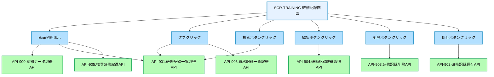
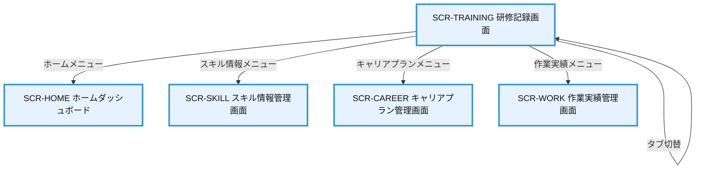

# 画面設計書：SCR-TRAINING（研修記録画面）

## 1. 画面基本情報

- **画面ID**：SCR-TRAINING
- **画面名称**：研修記録画面
- **画面の機能概要・目的**：  
  社員が受講した研修や取得した資格の記録を管理する画面。社内外の研修参加履歴、e-learning受講状況、資格取得情報などを登録・管理し、スキル向上の取り組みを可視化するとともに、キャリア形成や評価の参考資料として活用する。
- **利用ユーザー・アクター**：社員、上司、人事担当者
- **関連機能・仕様ID・機能ID**：F10 / PLT.1-WEB.1, PLT.1-RESP.1, PLT.2-ENC.1, ACC.1-ROLE.1, TRN.1-HIST.1
- **作成日**：2025/05/28
- **作成者**：システム設計担当
- **改訂履歴**：2025/05/28 初版作成

---

## 2. 画面レイアウト

- **画面イメージ・ワイヤーフレーム**
```
+------------------------------------------------------+
| [ロゴ] 年間スキル報告書システム    [ユーザー名▼] [🔔] |
+------------------------------------------------------+
| [サイドメニュー] | [研修記録]                        |
| ┌─────────────┐ | ┌─────────────────────────────┐    |
| │ ホーム      │ | │ [研修] [資格]                │    | ①
| │ プロフィール │ | └─────────────────────────────┘    |
| │ スキル情報   │ | ┌─────────────────────────────┐    |
| │ キャリアプラン│ | │ 研修記録一覧                │    | ②
| │ 作業実績    │ | │ [+ 新規登録]                │    |
| │ 研修記録    │ | │ 期間: [▼2025年度] [検索]    │    |
| │ レポート    │ | │ ┌────┬────┬────┬────┬────┐ │    |
| │ 管理機能    │ | │ │研修名│種別│期間│状態│操作│ │    |
| └─────────────┘ | │ ├────┼────┼────┼────┼────┤ │    |
|                 | │ │Java基礎│社内│4/1-4/5│完了│編集│ │    |
|                 | │ │AWS認定│外部│5/10-5/20│受講中│編集│ │    |
|                 | │ │...    │... │...  │... │... │ │    |
|                 | │ └────┴────┴────┴────┴────┘ │    |
|                 | │ [< 前へ] 1/2 [次へ >]        │    |
|                 | └─────────────────────────────┘    |
|                 | ┌─────────────────────────────┐    |
|                 | │ 研修詳細                    │    | ③
|                 | │ 研修名: [_________]         │    |
|                 | │ 種別: [▼社内研修]           │    |
|                 | │ 期間: [▼2025/4/1] ～ [▼2025/4/5]│    |
|                 | │ 主催: [_________]           │    |
|                 | │ 状態: [▼完了]               │    |
|                 | │ 関連スキル:                 │    |
|                 | │ [✓] Java [✓] Spring [ ] React │    |
|                 | │ 研修内容:                   │    |
|                 | │ [____________________]      │    |
|                 | │ 習得スキル:                 │    |
|                 | │ [____________________]      │    |
|                 | │ [保存] [キャンセル]         │    |
|                 | └─────────────────────────────┘    |
|                 | ┌─────────────────────────────┐    |
|                 | │ 推奨研修                    │    | ④
|                 | │ ┌────┬────┬────┬────┐      │    |
|                 | │ │研修名│種別│期間│詳細│      │    |
|                 | │ ├────┼────┼────┼────┤      │    |
|                 | │ │Spring応用│社内│6/1-6/5│詳細│      │    |
|                 | │ │AWS Dev..│外部│随時 │詳細│      │    |
|                 | │ └────┴────┴────┴────┘      │    |
|                 | └─────────────────────────────┘    |
+------------------------------------------------------+
|  © 2025 Example Corp.                                |
+------------------------------------------------------+
```
- **画面サイズ**：レスポンシブ（PC：横1200px基準、スマホ：100%）
- **UI/UX設計上の注意点**：
  - タブ切り替えで研修記録と資格記録を管理
  - 研修記録一覧と詳細入力フォームを一画面で管理
  - 一覧から選択すると詳細情報を表示・編集可能
  - 関連スキルはチェックボックスで複数選択可能
  - 推奨研修セクションでは、現在のスキルレベルや目標に基づいた研修を表示
  - アクセシビリティ対応（キーボード操作・スクリーンリーダー対応）

---

## 3. 画面項目定義

| 項目ID | 項目名                | APIパラメータ対応           | データ型   | I/O区分 | 必須 | 備考                       |
|--------|----------------------|----------------------------|-----------|---------|------|----------------------------|
| ①      | タブメニュー          | -                          | タブ      | 入力    | -    | 研修/資格切替タブ          |
| -      | 研修タブ              | -                          | タブ      | 入力    | -    | 研修記録表示タブ           |
| -      | 資格タブ              | -                          | タブ      | 入力    | -    | 資格記録表示タブ           |
| ②      | 研修記録一覧セクション | -                          | セクション | -       | -    | 研修記録一覧表示エリア     |
| -      | 新規登録ボタン        | -                          | ボタン     | 入力    | -    | 新規研修記録登録ボタン     |
| -      | 期間選択              | API-901.period             | セレクト   | 入力    | -    | 表示期間選択ドロップダウン |
| -      | 検索ボタン            | -                          | ボタン     | 入力    | -    | 期間検索実行ボタン         |
| -      | 研修記録一覧テーブル  | API-901.training_records   | テーブル   | 出力    | -    | 研修記録一覧表示           |
| -      | 研修名列              | API-901.training_records[].name | テキスト | 出力 | -    | 研修名表示                 |
| -      | 種別列                | API-901.training_records[].type | テキスト | 出力  | -    | 研修種別表示               |
| -      | 期間列                | API-901.training_records[].period | テキスト | 出力 | -    | 研修期間表示               |
| -      | 状態列                | API-901.training_records[].status | テキスト | 出力 | -    | 受講状態表示               |
| -      | 操作列                | -                          | ボタン     | 入力    | -    | 編集/削除ボタン表示        |
| -      | ページネーション      | API-901.pagination         | ページャー | 入力    | -    | ページ切替                 |
| ③      | 研修詳細セクション    | -                          | セクション | -       | -    | 研修詳細入力エリア         |
| -      | 研修名入力            | API-902.name               | テキスト   | 入力    | ○    | 研修名入力フィールド       |
| -      | 種別選択              | API-902.type               | セレクト   | 入力    | ○    | 研修種別選択ドロップダウン |
| -      | 開始日選択            | API-902.start_date         | セレクト   | 入力    | ○    | 開始日選択ドロップダウン   |
| -      | 終了日選択            | API-902.end_date           | セレクト   | 入力    | ○    | 終了日選択ドロップダウン   |
| -      | 主催入力              | API-902.organizer          | テキスト   | 入力    | ○    | 主催者/機関入力フィールド  |
| -      | 状態選択              | API-902.status             | セレクト   | 入力    | ○    | 受講状態選択ドロップダウン |
| -      | 関連スキルチェックボックス | API-902.related_skills | チェックボックス | 入力 | -    | 関連スキル選択チェックボックス |
| -      | 研修内容入力          | API-902.description        | テキストエリア | 入力 | ○    | 研修内容入力エリア         |
| -      | 習得スキル入力        | API-902.acquired_skills    | テキストエリア | 入力 | -    | 習得スキル入力エリア       |
| -      | 保存ボタン            | -                          | ボタン     | 入力    | -    | 研修記録保存ボタン         |
| -      | キャンセルボタン      | -                          | ボタン     | 入力    | -    | 編集キャンセルボタン       |
| ④      | 推奨研修セクション    | -                          | セクション | -       | -    | 推奨研修表示エリア         |
| -      | 推奨研修一覧テーブル  | API-905.recommended_trainings | テーブル | 出力   | -    | 推奨研修一覧表示           |
| -      | 研修名列              | API-905.recommended_trainings[].name | テキスト | 出力 | -    | 研修名表示                 |
| -      | 種別列                | API-905.recommended_trainings[].type | テキスト | 出力 | -    | 研修種別表示               |
| -      | 期間列                | API-905.recommended_trainings[].period | テキスト | 出力 | -    | 研修期間表示               |
| -      | 詳細列                | -                          | ボタン     | 入力    | -    | 詳細表示ボタン             |

---

## 4. 画面イベント・アクション定義

| イベントID | トリガー/アクション           | イベント内容・アクション詳細                                         | 紐付くAPI ID・名称      | メッセージ表示                       |
|------------|------------------------------|---------------------------------------------------------------------|------------------------|--------------------------------------|
| E01        | 画面初期表示                  | API-900呼出→初期データ取得、API-901呼出→研修記録一覧取得、API-905呼出→推奨研修取得 | API-900, API-901, API-905 | エラー時：エラーメッセージ表示 |
| E02        | タブクリック                  | 研修/資格タブ切替→対応するAPI呼出→一覧表示                          | API-901/API-906        | -                                    |
| E03        | 新規登録ボタンクリック        | 詳細セクションをクリアし、新規入力モードに切替                       | -                      | -                                    |
| E04        | 検索ボタンクリック            | API-901呼出→選択期間の研修記録一覧取得・表示                        | API-901                | エラー時：エラーメッセージ表示        |
| E05        | 編集ボタンクリック            | API-904呼出→選択した研修記録の詳細情報を取得し詳細セクションに表示   | API-904                | エラー時：エラーメッセージ表示        |
| E06        | 削除ボタンクリック            | 確認ダイアログ表示→API-903呼出→研修記録削除                         | API-903                | 成功/失敗メッセージ表示               |
| E07        | 保存ボタンクリック            | 入力値バリデーション→API-902呼出→研修記録保存                       | API-902                | 成功/失敗メッセージ表示               |
| E08        | キャンセルボタンクリック      | 詳細セクションの編集内容を破棄                                      | -                      | -                                    |
| E09        | ページネーションクリック      | API-901呼出→指定ページの研修記録一覧表示                            | API-901                | エラー時：エラーメッセージ表示        |
| E10        | 詳細ボタンクリック（推奨研修）| 推奨研修詳細ダイアログ表示                                          | -                      | -                                    |
| E11        | 入力エラー                    | 必須項目未入力・形式不正                                            | -                      | 「必須項目を入力してください」等      |

---

## 5. 画面イベント・API関連図（Mermaid）



---

## 6. 画面遷移図・フロー



---

## 7. メッセージ定義

| メッセージID | メッセージ内容                                  | 種別    | 表示タイミング           |
|--------------|-----------------------------------------------|---------|-------------------------|
| MSG01        | データの取得に失敗しました                      | エラー  | API呼出失敗時           |
| MSG02        | 必須項目を入力してください                      | エラー  | 必須項目未入力時        |
| MSG03        | 研修記録を保存しました                          | 成功    | 記録保存成功時          |
| MSG04        | 研修記録を削除しました                          | 成功    | 記録削除成功時          |
| MSG05        | この研修記録を削除してもよろしいですか？         | 確認    | 記録削除実行前          |
| MSG06        | 開始日は終了日より前の日付を選択してください     | エラー  | 日付関係不正時          |
| MSG07        | 資格記録を保存しました                          | 成功    | 資格保存成功時          |
| MSG08        | 資格記録を削除しました                          | 成功    | 資格削除成功時          |

---

## 8. 入出力一覧

| 種別      | 名称           | 概要                         | アクセス方式 | 経由API（ID・名称・エンドポイント）         |
|-----------|----------------|------------------------------|--------------|--------------------------------------------|
| API       | API-900        | 初期データ取得API            | -            | /api/training/init                         |
| API       | API-901        | 研修記録一覧取得API          | -            | /api/training/records                      |
| API       | API-902        | 研修記録保存API              | -            | /api/training/records                      |
| API       | API-903        | 研修記録削除API              | -            | /api/training/records/{id}                 |
| API       | API-904        | 研修記録詳細取得API          | -            | /api/training/records/{id}                 |
| API       | API-905        | 推奨研修取得API              | -            | /api/training/recommended                  |
| API       | API-906        | 資格記録一覧取得API          | -            | /api/certification/records                 |
| API       | API-907        | 資格記録保存API              | -            | /api/certification/records                 |
| API       | API-908        | 資格記録削除API              | -            | /api/certification/records/{id}            |
| API       | API-909        | 資格記録詳細取得API          | -            | /api/certification/records/{id}            |
| テーブル  | TrainingRecords| 研修記録                     | API経由      | API-901/902/903/904経由                    |
| テーブル  | CertificationRecords| 資格記録                | API経由      | API-906/907/908/909経由                    |
| テーブル  | TrainingTypes  | 研修種別マスタ               | API経由      | API-900経由                                |
| テーブル  | TrainingStatus | 受講状態マスタ               | API経由      | API-900経由                                |
| テーブル  | Skills         | スキルマスタ                 | API経由      | API-900経由                                |
| テーブル  | RecommendedTrainings | 推奨研修               | API経由      | API-905経由                                |

---

## 9. バックエンドAPIコール仕様（APIファースト設計）

### API-900 初期データ取得API
- エンドポイント: `/api/training/init`
- HTTPメソッド: GET
- リクエストパラメータ: なし
- レスポンスパラメータ: training_types (array), training_status (array), skills (array), periods (array)
- ステータスコードとエラーケース: 200, 401, 403, 500
- 認証・認可要件: 認証済みユーザー
- 呼び出しタイミング: 画面初期表示時（E01）
- 備考: 初期表示に必要なマスタデータを返却

### API-901 研修記録一覧取得API
- エンドポイント: `/api/training/records`
- HTTPメソッド: GET
- リクエストパラメータ: period (string, 任意), page (integer, 任意), limit (integer, 任意)
- レスポンスパラメータ: training_records (array of training record objects), pagination (object)
- ステータスコードとエラーケース: 200, 401, 403, 500
- 認証・認可要件: 認証済みユーザー
- 呼び出しタイミング: 画面初期表示時（E01）、タブクリック時（E02）、検索ボタンクリック時（E04）、ページネーション操作時（E09）
- 備考: 研修記録一覧をページング対応で返却

### API-902 研修記録保存API
- エンドポイント: `/api/training/records`
- HTTPメソッド: POST
- リクエストパラメータ: id (string, 更新時のみ必須), name (string, 必須), type (string, 必須), start_date (string, 必須), end_date (string, 必須), organizer (string, 必須), status (string, 必須), related_skills (array of strings, 任意), description (string, 必須), acquired_skills (string, 任意)
- レスポンスパラメータ: success (boolean), training_record (object)
- ステータスコードとエラーケース: 200, 400, 401, 403, 500
- 認証・認可要件: 認証済みユーザー
- 呼び出しタイミング: 保存ボタンクリック時（E07）
- 備考: 新規登録/更新共通API

### API-903 研修記録削除API
- エンドポイント: `/api/training/records/{id}`
- HTTPメソッド: DELETE
- リクエストパラメータ: id (path parameter, 必須)
- レスポンスパラメータ: success (boolean)
- ステータスコードとエラーケース: 200, 400, 401, 403, 404, 500
- 認証・認可要件: 認証済みユーザー
- 呼び出しタイミング: 削除ボタンクリック時（E06）
- 備考: 指定IDの研修記録を削除

### API-904 研修記録詳細取得API
- エンドポイント: `/api/training/records/{id}`
- HTTPメソッド: GET
- リクエストパラメータ: id (path parameter, 必須)
- レスポンスパラメータ: training_record (object)
- ステータスコードとエラーケース: 200, 400, 401, 403, 404, 500
- 認証・認可要件: 認証済みユーザー
- 呼び出しタイミング: 編集ボタンクリック時（E05）
- 備考: 指定IDの研修記録詳細情報を返却

### API-905 推奨研修取得API
- エンドポイント: `/api/training/recommended`
- HTTPメソッド: GET
- リクエストパラメータ: なし
- レスポンスパラメータ: recommended_trainings (array of training objects)
- ステータスコードとエラーケース: 200, 401, 403, 500
- 認証・認可要件: 認証済みユーザー
- 呼び出しタイミング: 画面初期表示時（E01）
- 備考: ユーザーのスキルレベルや目標に基づいた推奨研修を返却

### API-906 資格記録一覧取得API
- エンドポイント: `/api/certification/records`
- HTTPメソッド: GET
- リクエストパラメータ: period (string, 任意), page (integer, 任意), limit (integer, 任意)
- レスポンスパラメータ: certification_records (array of certification record objects), pagination (object)
- ステータスコードとエラーケース: 200, 401, 403, 500
- 認証・認可要件: 認証済みユーザー
- 呼び出しタイミング: タブクリック時（E02）
- 備考: 資格記録一覧をページング対応で返却

---

## 10. オブジェクト構成・CRUD定義

- TrainingRecords: C, R, U, D（API-901/902/903/904経由）
- CertificationRecords: C, R, U, D（API-906/907/908/909経由）
- TrainingTypes: R（API-900経由）
- TrainingStatus: R（API-900経由）
- Skills: R（API-900経由）
- RecommendedTrainings: R（API-905経由）

---

## 11. その他

- **アクセシビリティ要件**  
  - キーボード操作・スクリーンリーダー対応、コントラスト確保、ラベル付与
  - テーブルにはキャプションと適切なヘッダー設定
  - フォーム要素にはラベルと説明テキスト提供
  - チェックボックスグループには適切なグループラベル設定

- **セキュリティ要件**  
  - 自身の研修記録のみ閲覧・編集可能
  - 上司は部下の研修記録を閲覧可能
  - 人事担当者は全社員の研修記録を閲覧可能
  - 操作の監査ログ記録
  - CSRF対策、XSS対策
  - API呼出時のJWTトークン検証

- **操作手順・利用ガイド**  
  - タブで研修記録と資格記録を切り替え
  - 新規登録ボタンから新しい研修/資格記録を登録
  - 一覧から編集ボタンをクリックして既存の記録を編集
  - 期間選択で表示する記録の期間
