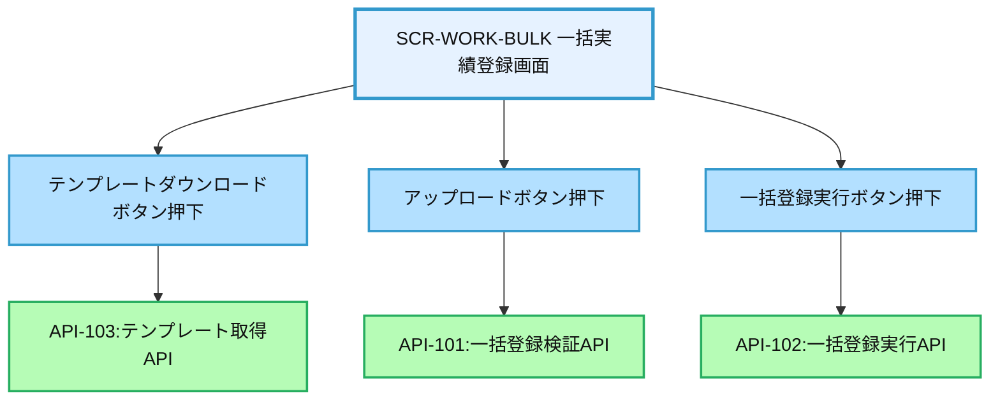
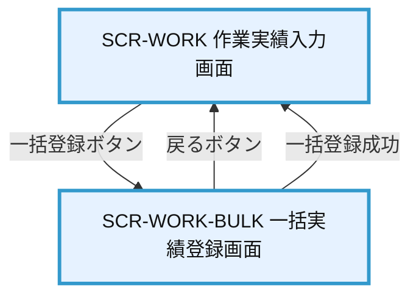

# 画面設計書：SCR-WORK-BULK（一括実績登録画面）

## 1. 画面基本情報

- **画面ID**：SCR-WORK-BULK
- **画面名称**：一括実績登録画面
- **画面の機能概要・目的**：  
  複数の作業実績を一括でシステムに登録するための画面。CSV/Excelファイルのアップロードによる一括登録や、テンプレートのダウンロード機能を提供し、大量データの効率的な入力を実現する。
- **利用ユーザー・アクター**：社員、管理者
- **関連機能・仕様ID・機能ID**：F09 / WRK.2-BULK.1, WRK.2-BULK.2, WRK.2-BULK.3, WRK.2-BULK.4
- **作成日**：2025/05/28
- **作成者**：システム設計担当
- **改訂履歴**：2025/05/28 初版作成

---

## 2. 画面レイアウト

- **画面イメージ・ワイヤーフレーム**
```
+------------------------------------------------------+
|  [ヘッダー]                                          |
+------------------------------------------------------+
|  一括実績登録                                        |
|                                                      |
|  ■ テンプレートダウンロード                          |
|  [ テンプレートをダウンロード ]                      | ①
|                                                      |
|  ■ ファイルアップロード                              |
|  [ ファイルを選択 ] 選択されていません               | ②
|  対応形式: CSV, Excel(xlsx)                          |
|                                                      |
|  [ アップロード ]                                    | ③
|                                                      |
|  ■ 登録前確認                                        |
|  +--------------------------------------------------+|
|  | プロジェクト | 作業日 | 作業内容 | 工数 | 状態   ||
|  |-------------|--------|----------|------|--------||
|  | Project A   | 5/1    | 設計     | 8.0  | OK     || ④
|  | Project B   | 5/2    | 開発     | 7.5  | エラー ||
|  | ...         | ...    | ...      | ...  | ...    ||
|  +--------------------------------------------------+|
|                                                      |
|  [ 戻る ] [ エラー行のみ表示 ] [ 一括登録実行 ]      | ⑤⑥⑦
|                                                      |
|  (処理結果メッセージ表示エリア)                      | ⑧
+------------------------------------------------------+
|  [フッター]                                          |
+------------------------------------------------------+
```
- **画面サイズ**：レスポンシブ（PC：横1200px基準、タブレット：横幅100%）
- **UI/UX設計上の注意点**：大量データ処理時のフィードバック、エラー表示の視認性、操作ガイダンス

---

## 3. 画面項目定義

| 項目ID | 項目名                  | APIパラメータ対応           | データ型   | I/O区分 | 必須 | 備考                       |
|--------|-------------------------|----------------------------|-----------|---------|------|----------------------------|
| ①      | テンプレートダウンロード | -                          | ボタン     | 入力    | -    | CSV/Excelテンプレート取得  |
| ②      | ファイル選択            | API-101.file               | ファイル   | 入力    | ○    | CSV/Excel形式のみ許可      |
| ③      | アップロード            | API-101（POST）            | ボタン     | 入力    | -    | ファイル選択後のみ活性     |
| ④      | 登録前確認テーブル      | API-101レスポンス          | テーブル   | 出力    | -    | アップロード後に表示       |
| ⑤      | 戻るボタン              | -                          | ボタン     | 入力    | -    | 作業実績入力画面へ戻る     |
| ⑥      | エラー行のみ表示        | -                          | ボタン     | 入力    | -    | エラー行のフィルタリング   |
| ⑦      | 一括登録実行            | API-102（POST）            | ボタン     | 入力    | -    | 確認後の最終登録処理       |
| ⑧      | 処理結果メッセージ      | API-101/102レスポンス      | ラベル     | 出力    | -    | 処理結果・エラー表示       |

---

## 4. 画面イベント・アクション定義

| イベントID | トリガー/アクション           | イベント内容・アクション詳細                                         | 紐付くAPI ID・名称      | メッセージ表示                       |
|------------|------------------------------|---------------------------------------------------------------------|------------------------|--------------------------------------|
| E01        | [テンプレートダウンロード]ボタン押下 | API-103呼出→テンプレートファイルのダウンロード                    | API-103:テンプレート取得API | エラー時：エラーメッセージ表示        |
| E02        | [ファイル選択]ボタン押下     | ファイル選択ダイアログ表示→ファイル選択                             | -                      | 非対応形式：「対応していないファイル形式です」|
| E03        | [アップロード]ボタン押下      | API-101呼出→ファイルアップロード→登録前確認テーブル表示             | API-101:一括登録検証API | エラー時：エラーメッセージ表示        |
| E04        | [エラー行のみ表示]ボタン押下  | 登録前確認テーブルのフィルタリング（エラー行のみ表示）               | -                      |                                      |
| E05        | [一括登録実行]ボタン押下      | API-102呼出→一括登録実行→結果表示                                  | API-102:一括登録実行API | 成功時：「XX件の登録が完了しました」<br>エラー時：エラーメッセージ表示 |
| E06        | [戻る]ボタン押下             | SCR-WORK（作業実績入力画面）へ遷移                                  | -                      |                                      |
| E07        | ファイル形式エラー           | 非対応ファイル形式選択時                                            | -                      | 「対応していないファイル形式です」    |
| E08        | データ検証エラー             | アップロードデータの検証エラー（必須項目・形式・論理チェック）        | API-101                | エラー内容を登録前確認テーブルに表示  |
| E09        | 一括登録成功                 | 一括登録処理成功                                                    | API-102                | 「XX件の登録が完了しました」          |
| E10        | 一括登録失敗                 | 一括登録処理失敗                                                    | API-102                | 「登録処理に失敗しました」            |

---

## 5. 画面イベント・API関連図（Mermaid）



---

## 6. 画面遷移図・フロー



---

## 7. メッセージ定義

| メッセージID | メッセージ内容                                  | 種別    | 表示タイミング           |
|--------------|-----------------------------------------------|---------|-------------------------|
| MSG01        | 対応していないファイル形式です                 | エラー  | 非対応ファイル選択時    |
| MSG02        | ファイルを選択してください                     | エラー  | ファイル未選択時        |
| MSG03        | アップロードに失敗しました                     | エラー  | ファイルアップロード失敗時 |
| MSG04        | XX件の登録が完了しました                       | 成功    | 一括登録成功時          |
| MSG05        | 登録処理に失敗しました                         | エラー  | 一括登録失敗時          |
| MSG06        | データにエラーがあります。修正してください     | 警告    | データ検証エラー時      |
| MSG07        | システム障害が発生しました。再度お試しください | エラー  | システム例外時          |

---

## 8. 入出力一覧

| 種別      | 名称           | 概要                         | アクセス方式 | 経由API（ID・名称・エンドポイント）         |
|-----------|----------------|------------------------------|--------------|--------------------------------------------|
| テーブル  | WorkRecord     | 作業実績情報                 | API経由      | API-102:一括登録実行API /api/work/bulk     |
| API       | API-101        | 一括登録検証API              | -            | /api/work/bulk/validate                    |
| API       | API-102        | 一括登録実行API              | -            | /api/work/bulk                             |
| API       | API-103        | テンプレート取得API          | -            | /api/work/bulk/template                    |
| ファイル  | テンプレート   | CSV/Excelテンプレート        | API経由      | API-103経由で取得                          |

---

## 9. バックエンドAPIコール仕様（APIファースト設計）

### API-101 一括登録検証API
- エンドポイント: `/api/work/bulk/validate`
- HTTPメソッド: POST
- リクエストパラメータ: file (multipart/form-data, 必須)
- レスポンスパラメータ: validation_result (array), total_count (number), error_count (number)
- ステータスコードとエラーケース: 200, 400, 401, 403, 500
- 認証・認可要件: 認証済みユーザー、作業実績登録権限
- 呼び出しタイミング: [アップロード]ボタン押下時（E03）
- 備考: ファイル内容の検証のみ実施、DB登録は行わない

### API-102 一括登録実行API
- エンドポイント: `/api/work/bulk`
- HTTPメソッド: POST
- リクエストパラメータ: validation_id (string, 必須)
- レスポンスパラメータ: success_count (number), error_count (number), result_details (array)
- ステータスコードとエラーケース: 200, 400, 401, 403, 500
- 認証・認可要件: 認証済みユーザー、作業実績登録権限
- 呼び出しタイミング: [一括登録実行]ボタン押下時（E05）
- 備考: API-101で検証済みデータのみ登録可能

### API-103 テンプレート取得API
- エンドポイント: `/api/work/bulk/template`
- HTTPメソッド: GET
- リクエストパラメータ: format (string, オプション, デフォルト="xlsx")
- レスポンスパラメータ: file (binary)
- ステータスコードとエラーケース: 200, 400, 401, 403, 500
- 認証・認可要件: 認証済みユーザー、作業実績登録権限
- 呼び出しタイミング: [テンプレートダウンロード]ボタン押下時（E01）
- 備考: format="csv"またはformat="xlsx"を指定可能

---

## 10. オブジェクト構成・CRUD定義

- WorkRecord: C（API-102経由のみ）
- WorkBulkValidation: C, R（API-101/102経由のみ）
- WorkTemplate: R（API-103経由のみ）
- WorkBulkLog: C（API-102経由のみ）

---

## 11. その他

- **アクセシビリティ要件**  
  - キーボード操作対応、エラー表示の色だけに依存しない設計、スクリーンリーダー対応
- **セキュリティ要件**  
  - ファイルアップロードサイズ制限（10MB）、対応形式制限（CSV/XLSX）、ウイルススキャン
  - 権限チェック（作業実績登録権限）、監査ログ記録
- **操作手順・利用ガイド**  
  - テンプレートダウンロード→データ入力→ファイル選択→アップロード→データ確認→一括登録実行
  - エラーがある場合は修正してから再アップロード、または個別登録画面で対応
- **備考・補足**  
  - 大量データ処理時のタイムアウト対策として非同期処理を実装
  - 登録上限：1ファイルあたり1,000件まで
  - 一括登録履歴は管理者画面から参照可能
