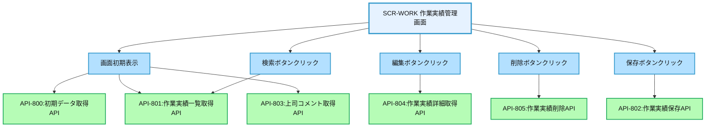
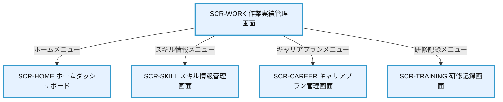

# 画面設計書：SCR-WORK（作業実績管理画面）

## 1. 画面基本情報

- **画面ID**：SCR-WORK
- **画面名称**：作業実績管理画面
- **画面の機能概要・目的**：  
  社員が担当したプロジェクトや業務の実績を記録・管理する画面。実施した作業内容、使用技術、役割、期間などを登録し、スキル評価の根拠データとして活用するとともに、キャリア形成の振り返りや評価面談の資料として利用する。
- **利用ユーザー・アクター**：社員、上司
- **関連機能・仕様ID・機能ID**：F09 / PLT.1-WEB.1, PLT.1-RESP.1, PLT.2-ENC.1, ACC.1-ROLE.1, WRK.1-HIST.1
- **作成日**：2025/05/28
- **作成者**：システム設計担当
- **改訂履歴**：2025/05/28 初版作成

---

## 2. 画面レイアウト

- **画面イメージ・ワイヤーフレーム**
```
+------------------------------------------------------+
| [ロゴ] 年間スキル報告書システム    [ユーザー名▼] [🔔] |
+------------------------------------------------------+
| [サイドメニュー] | [作業実績管理]                    |
| ┌─────────────┐ | ┌─────────────────────────────┐    |
| │ ホーム      │ | │ 作業実績一覧                │    | ①
| │ プロフィール │ | │ [+ 新規登録]                │    |
| │ スキル情報   │ | │ 期間: [▼2025年度] [検索]    │    |
| │ キャリアプラン│ | │ ┌────┬────┬────┬────┬────┐ │    |
| │ 作業実績    │ | │ │プロジェクト│期間│役割│技術│操作│ │    |
| │ 研修記録    │ | │ ├────┼────┼────┼────┼────┤ │    |
| │ レポート    │ | │ │顧客管理..│4-6月│開発│Java│編集│ │    |
| │ 管理機能    │ | │ │ECサイト..│1-3月│設計│React│編集│ │    |
| └─────────────┘ | │ │...      │... │... │... │... │ │    |
|                 | │ └────┴────┴────┴────┴────┘ │    |
|                 | │ [< 前へ] 1/2 [次へ >]        │    |
|                 | └─────────────────────────────┘    |
|                 | ┌─────────────────────────────┐    |
|                 | │ 作業実績詳細                │    | ②
|                 | │ プロジェクト名: [_________] │    |
|                 | │ 期間: [▼2025/4] ～ [▼2025/6]│    |
|                 | │ 役割: [▼開発担当]           │    |
|                 | │ 使用技術:                   │    |
|                 | │ [✓] Java [✓] Spring [ ] React │    |
|                 | │ [ ] Angular [✓] MySQL [ ] AWS │    |
|                 | │ 作業内容:                   │    |
|                 | │ [____________________]      │    |
|                 | │ 習得スキル:                 │    |
|                 | │ [____________________]      │    |
|                 | │ [保存] [キャンセル]         │    |
|                 | └─────────────────────────────┘    |
|                 | ┌─────────────────────────────┐    |
|                 | │ 上司コメント                │    | ③
|                 | │ [____________________]      │    |
|                 | │ 最終更新: 2025/05/15 山田部長│    |
|                 | └─────────────────────────────┘    |
+------------------------------------------------------+
|  © 2025 Example Corp.                                |
+------------------------------------------------------+
```
- **画面サイズ**：レスポンシブ（PC：横1200px基準、スマホ：100%）
- **UI/UX設計上の注意点**：
  - 作業実績一覧と詳細入力フォームを一画面で管理
  - 一覧から選択すると詳細情報を表示・編集可能
  - 使用技術はチェックボックスで複数選択可能
  - 期間検索で過去の実績を絞り込み表示
  - アクセシビリティ対応（キーボード操作・スクリーンリーダー対応）

---

## 3. 画面項目定義

| 項目ID | 項目名                | APIパラメータ対応           | データ型   | I/O区分 | 必須 | 備考                       |
|--------|----------------------|----------------------------|-----------|---------|------|----------------------------|
| ①      | 作業実績一覧セクション | -                          | セクション | -       | -    | 作業実績一覧表示エリア     |
| -      | 新規登録ボタン        | -                          | ボタン     | 入力    | -    | 新規作業実績登録ボタン     |
| -      | 期間選択              | API-801.period             | セレクト   | 入力    | -    | 表示期間選択ドロップダウン |
| -      | 検索ボタン            | -                          | ボタン     | 入力    | -    | 期間検索実行ボタン         |
| -      | 作業実績一覧テーブル  | API-801.work_records       | テーブル   | 出力    | -    | 作業実績一覧表示           |
| -      | プロジェクト列        | API-801.work_records[].project_name | テキスト | 出力 | -    | プロジェクト名表示         |
| -      | 期間列                | API-801.work_records[].period | テキスト | 出力    | -    | 作業期間表示               |
| -      | 役割列                | API-801.work_records[].role | テキスト   | 出力    | -    | 担当役割表示               |
| -      | 技術列                | API-801.work_records[].technologies | テキスト | 出力 | -    | 主要使用技術表示           |
| -      | 操作列                | -                          | ボタン     | 入力    | -    | 編集/削除ボタン表示        |
| -      | ページネーション      | API-801.pagination         | ページャー | 入力    | -    | ページ切替                 |
| ②      | 作業実績詳細セクション | -                          | セクション | -       | -    | 作業実績詳細入力エリア     |
| -      | プロジェクト名入力    | API-802.project_name       | テキスト   | 入力    | ○    | プロジェクト名入力フィールド |
| -      | 開始期間選択          | API-802.start_date         | セレクト   | 入力    | ○    | 開始年月選択ドロップダウン |
| -      | 終了期間選択          | API-802.end_date           | セレクト   | 入力    | ○    | 終了年月選択ドロップダウン |
| -      | 役割選択              | API-802.role               | セレクト   | 入力    | ○    | 役割選択ドロップダウン     |
| -      | 使用技術チェックボックス | API-802.technologies     | チェックボックス | 入力 | ○    | 使用技術選択チェックボックス |
| -      | 作業内容入力          | API-802.description        | テキストエリア | 入力 | ○    | 作業内容入力エリア         |
| -      | 習得スキル入力        | API-802.acquired_skills    | テキストエリア | 入力 | -    | 習得スキル入力エリア       |
| -      | 保存ボタン            | -                          | ボタン     | 入力    | -    | 作業実績保存ボタン         |
| -      | キャンセルボタン      | -                          | ボタン     | 入力    | -    | 編集キャンセルボタン       |
| ③      | 上司コメントセクション | -                          | セクション | -       | -    | 上司フィードバックエリア   |
| -      | コメント表示          | API-803.manager_comment    | テキストエリア | 出力 | -    | 上司コメント表示           |
| -      | 最終更新情報          | API-803.updated_at, API-803.manager_name | テキスト | 出力 | -    | 更新日時・担当者表示       |

---

## 4. 画面イベント・アクション定義

| イベントID | トリガー/アクション           | イベント内容・アクション詳細                                         | 紐付くAPI ID・名称      | メッセージ表示                       |
|------------|------------------------------|---------------------------------------------------------------------|------------------------|--------------------------------------|
| E01        | 画面初期表示                  | API-800呼出→初期データ取得、API-801呼出→作業実績一覧取得、API-803呼出→上司コメント取得 | API-800, API-801, API-803 | エラー時：エラーメッセージ表示 |
| E02        | 新規登録ボタンクリック        | 詳細セクションをクリアし、新規入力モードに切替                       | -                      | -                                    |
| E03        | 検索ボタンクリック            | API-801呼出→選択期間の作業実績一覧取得・表示                        | API-801                | エラー時：エラーメッセージ表示        |
| E04        | 編集ボタンクリック            | API-804呼出→選択した作業実績の詳細情報を取得し詳細セクションに表示   | API-804                | エラー時：エラーメッセージ表示        |
| E05        | 削除ボタンクリック            | 確認ダイアログ表示→API-805呼出→作業実績削除                         | API-805                | 成功/失敗メッセージ表示               |
| E06        | 保存ボタンクリック            | 入力値バリデーション→API-802呼出→作業実績保存                       | API-802                | 成功/失敗メッセージ表示               |
| E07        | キャンセルボタンクリック      | 詳細セクションの編集内容を破棄                                      | -                      | -                                    |
| E08        | ページネーションクリック      | API-801呼出→指定ページの作業実績一覧表示                            | API-801                | エラー時：エラーメッセージ表示        |
| E09        | 入力エラー                    | 必須項目未入力・形式不正                                            | -                      | 「必須項目を入力してください」等      |

---

## 5. 画面イベント・API関連図（Mermaid）



---

## 6. 画面遷移図・フロー



---

## 7. メッセージ定義

| メッセージID | メッセージ内容                                  | 種別    | 表示タイミング           |
|--------------|-----------------------------------------------|---------|-------------------------|
| MSG01        | データの取得に失敗しました                      | エラー  | API呼出失敗時           |
| MSG02        | 必須項目を入力してください                      | エラー  | 必須項目未入力時        |
| MSG03        | 作業実績を保存しました                          | 成功    | 実績保存成功時          |
| MSG04        | 作業実績を削除しました                          | 成功    | 実績削除成功時          |
| MSG05        | この作業実績を削除してもよろしいですか？         | 確認    | 実績削除実行前          |
| MSG06        | 開始日は終了日より前の日付を選択してください     | エラー  | 日付関係不正時          |
| MSG07        | 使用技術は1つ以上選択してください               | エラー  | 技術未選択時            |

---

## 8. 入出力一覧

| 種別      | 名称           | 概要                         | アクセス方式 | 経由API（ID・名称・エンドポイント）         |
|-----------|----------------|------------------------------|--------------|--------------------------------------------|
| API       | API-800        | 初期データ取得API            | -            | /api/work/init                             |
| API       | API-801        | 作業実績一覧取得API          | -            | /api/work/records                          |
| API       | API-802        | 作業実績保存API              | -            | /api/work/records                          |
| API       | API-803        | 上司コメント取得API          | -            | /api/work/manager-comment                  |
| API       | API-804        | 作業実績詳細取得API          | -            | /api/work/records/{id}                     |
| API       | API-805        | 作業実績削除API              | -            | /api/work/records/{id}                     |
| テーブル  | WorkRecords    | 作業実績                     | API経由      | API-801/802/804/805経由                    |
| テーブル  | Technologies   | 技術マスタ                   | API経由      | API-800経由                                |
| テーブル  | Roles          | 役割マスタ                   | API経由      | API-800経由                                |
| テーブル  | ManagerComments| 上司コメント                 | API経由      | API-803経由                                |

---

## 9. バックエンドAPIコール仕様（APIファースト設計）

### API-800 初期データ取得API
- エンドポイント: `/api/work/init`
- HTTPメソッド: GET
- リクエストパラメータ: なし
- レスポンスパラメータ: technologies (array), roles (array), periods (array)
- ステータスコードとエラーケース: 200, 401, 403, 500
- 認証・認可要件: 認証済みユーザー
- 呼び出しタイミング: 画面初期表示時（E01）
- 備考: 初期表示に必要なマスタデータを返却

### API-801 作業実績一覧取得API
- エンドポイント: `/api/work/records`
- HTTPメソッド: GET
- リクエストパラメータ: period (string, 任意), page (integer, 任意), limit (integer, 任意)
- レスポンスパラメータ: work_records (array of work record objects), pagination (object)
- ステータスコードとエラーケース: 200, 401, 403, 500
- 認証・認可要件: 認証済みユーザー
- 呼び出しタイミング: 画面初期表示時（E01）、検索ボタンクリック時（E03）、ページネーション操作時（E08）
- 備考: 作業実績一覧をページング対応で返却

### API-802 作業実績保存API
- エンドポイント: `/api/work/records`
- HTTPメソッド: POST
- リクエストパラメータ: id (string, 更新時のみ必須), project_name (string, 必須), start_date (string, 必須), end_date (string, 必須), role (string, 必須), technologies (array of strings, 必須), description (string, 必須), acquired_skills (string, 任意)
- レスポンスパラメータ: success (boolean), work_record (object)
- ステータスコードとエラーケース: 200, 400, 401, 403, 500
- 認証・認可要件: 認証済みユーザー
- 呼び出しタイミング: 保存ボタンクリック時（E06）
- 備考: 新規登録/更新共通API

### API-803 上司コメント取得API
- エンドポイント: `/api/work/manager-comment`
- HTTPメソッド: GET
- リクエストパラメータ: なし
- レスポンスパラメータ: manager_comment (string), updated_at (string), manager_name (string)
- ステータスコードとエラーケース: 200, 401, 403, 500
- 認証・認可要件: 認証済みユーザー
- 呼び出しタイミング: 画面初期表示時（E01）
- 備考: 上司からのコメント情報を返却

### API-804 作業実績詳細取得API
- エンドポイント: `/api/work/records/{id}`
- HTTPメソッド: GET
- リクエストパラメータ: id (path parameter, 必須)
- レスポンスパラメータ: work_record (object)
- ステータスコードとエラーケース: 200, 400, 401, 403, 404, 500
- 認証・認可要件: 認証済みユーザー
- 呼び出しタイミング: 編集ボタンクリック時（E04）
- 備考: 指定IDの作業実績詳細情報を返却

### API-805 作業実績削除API
- エンドポイント: `/api/work/records/{id}`
- HTTPメソッド: DELETE
- リクエストパラメータ: id (path parameter, 必須)
- レスポンスパラメータ: success (boolean)
- ステータスコードとエラーケース: 200, 400, 401, 403, 404, 500
- 認証・認可要件: 認証済みユーザー
- 呼び出しタイミング: 削除ボタンクリック時（E05）
- 備考: 指定IDの作業実績を削除

---

## 10. オブジェクト構成・CRUD定義

- WorkRecords: C, R, U, D（API-801/802/804/805経由）
- Technologies: R（API-800経由）
- Roles: R（API-800経由）
- ManagerComments: R（API-803経由）

---

## 11. その他

- **アクセシビリティ要件**  
  - キーボード操作・スクリーンリーダー対応、コントラスト確保、ラベル付与
  - テーブルにはキャプションと適切なヘッダー設定
  - フォーム要素にはラベルと説明テキスト提供
  - チェックボックスグループには適切なグループラベル設定

- **セキュリティ要件**  
  - 自身の作業実績のみ閲覧・編集可能
  - 上司は部下の作業実績を閲覧・コメント可能
  - 操作の監査ログ記録
  - CSRF対策、XSS対策
  - API呼出時のJWTトークン検証

- **操作手順・利用ガイド**  
  - 新規登録ボタンから新しい作業実績を登録
  - 一覧から編集ボタンをクリックして既存の実績を編集
  - 期間選択で表示する実績の期間を絞り込み
  - 必須項目（プロジェクト名、期間、役割、使用技術、作業内容）を入力
  - 習得スキルは任意入力だが、スキル評価の参考になるため入力推奨
  - 上司からのコメントを確認し、次回の業務改善に活用

- **備考・補足**  
  - 作業実績は四半期ごとに登録することを推奨
  - 使用技術は実際に自分が担当した技術のみ選択
  - 作業内容は具体的に記載し、自身の貢献度や成果が分かるように記述
  - 習得スキルは技術面だけでなく、ビジネススキルや対人スキルも含めて記載可能
  - 上司コメントは上司のみ編集可能（社員は閲覧のみ）
  - 将来的には、プロジェクト情報との連携や、チーム全体の実績閲覧機能を追加予定
