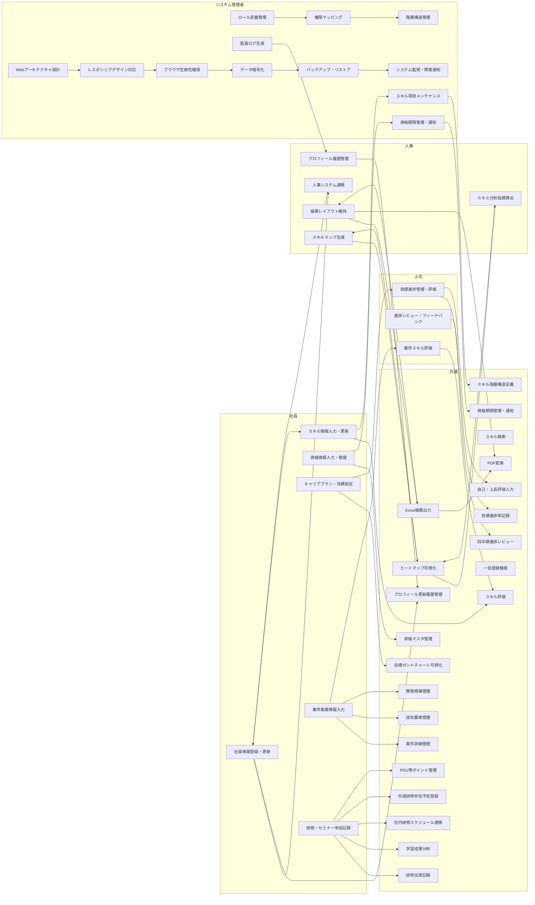
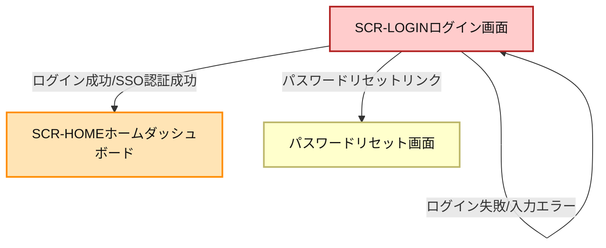
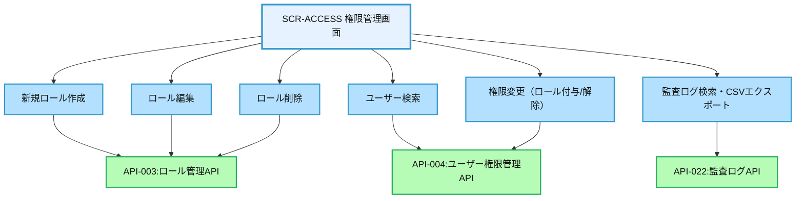
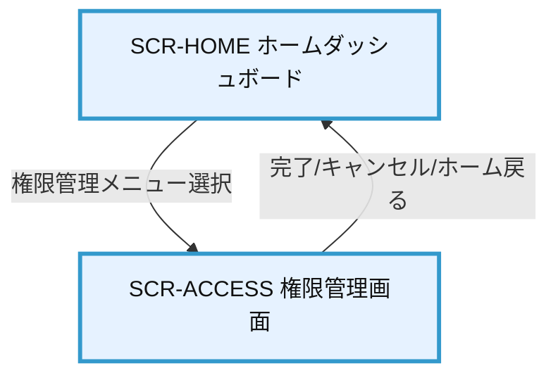

```mermaid
flowchart TD
    %% プロフィール管理
    PRO1["社員基本情報登録・更新 (PRO.1-BASE)"]
    PRO2["部署情報管理 (PRO.1-DEPT)"]
    PRO3["プロフィール更新履歴管理 (PRO.1-HIST)"]
    PRO4["人事システム連携 (PRO.2-SYNC)"]

    %% スキル情報管理
    SKL1["スキル階層構造定義 (SKL.1-HIER)"]
    SKL2["スキル評価基準設定 (SKL.1-EVAL)"]
    SKL3["スキル項目メンテナンス (SKL.1-MAINT)"]
    SKL4["スキル検索 (SKL.1-SRCH)"]
    SKL5["資格マスタ管理 (SKL.2-MST)"]
    SKL6["資格情報入力 (SKL.2-INP)"]
    SKL7["資格期限管理・通知 (SKL.2-EXP)"]

    %% 目標・キャリア管理
    CAR1["キャリアプラン目標設定 (CAR.1-PLAN)"]
    CAR2["目標ガントチャート可視化 (CAR.1-VIS)"]
    CAR3["目標進捗率記録 (CAR.2-TRACK)"]
    CAR4["自己・上長評価入力 (CAR.2-EVAL)"]
    CAR5["四半期進捗レビュー (CAR.2-REV)"]

    %% 作業実績管理
    WPM1["案件詳細管理 (WPM.1-DET)"]
    WPM2["技術要素管理 (WPM.1-TECH)"]
    WPM3["開発規模管理 (WPM.1-SCALE)"]
    WPM4["スキル評価連携 (WPM.1-SKILL)"]
    WPM5["一括登録機能 (WPM.1-BULK)"]

    %% 研修・セミナー管理
    TRN1["研修出席記録 (TRN.1-ATT)"]
    TRN2["学習成果分析 (TRN.1-ANAL)"]
    TRN3["社内研修スケジュール連携 (TRN.2-SCH)"]
    TRN4["外部研修参加予定登録 (TRN.2-REG)"]
    TRN5["PDU等ポイント管理 (TRN.3-PDU)"]

    %% レポート出力
    RPT1["Excel帳票出力 (RPT.1-EXCEL)"]
    RPT2["帳票レイアウト維持 (RPT.1-LAY)"]
    RPT3["PDF変換 (RPT.1-PDF)"]
    RPT4["スキルマップ生成 (RPT.2-MAP)"]
    RPT5["ヒートマップ可視化 (RPT.2-VIS)"]
    RPT6["スキル分析指標算出 (RPT.2-ANAL)"]

    %% アクセス制御
    ACC1["ロール定義管理 (ACC.1-ROLE)"]
    ACC2["権限マッピング (ACC.1-PERM)"]
    ACC3["階層構造管理 (ACC.1-HIER)"]
    ACC4["監査ログ生成 (ACC.3-AUDT)"]

    %% システム基盤
    PLT1["Webアーキテクチャ設計 (PLT.1-WEB)"]
    PLT2["レスポンシブデザイン対応 (PLT.1-RESP)"]
    PLT3["ブラウザ互換性確保 (PLT.1-BRS)"]
    PLT4["データ暗号化 (PLT.2-ENC)"]
    PLT5["バックアップ・リストア (PLT.2-BKP)"]
    PLT6["システム監視・障害通知 (PLT.2-MON)"]

    %% 業務フロー
    PRO1 --> PRO2
    PRO1 --> PRO3
    PRO1 --> PRO4
    PRO1 --> SKL1
    PRO1 --> CAR1

    SKL1 --> SKL2
    SKL1 --> SKL3
    SKL1 --> SKL4
    SKL2 --> SKL3
    SKL5 --> SKL6
    SKL6 --> SKL7

    CAR1 --> CAR2
    CAR1 --> CAR3
    CAR3 --> CAR4
    CAR4 --> CAR5

    WPM1 --> WPM2
    WPM2 --> WPM3
    WPM3 --> WPM4
    WPM1 --> WPM5

    TRN1 --> TRN2
    TRN1 --> TRN3
    TRN3 --> TRN4
    TRN2 --> TRN5

    SKL4 --> RPT4
    SKL7 --> RPT4
    CAR5 --> RPT4
    WPM4 --> RPT4
    TRN5 --> RPT4

    RPT4 --> RPT5
    RPT5 --> RPT6
    RPT4 --> RPT1
    RPT1 --> RPT2
    RPT1 --> RPT3

    ACC1 --> ACC2
    ACC2 --> ACC3
    ACC1 --> ACC4

    PLT1 --> PLT2
    PLT1 --> PLT3
    PLT1 --> PLT4
    PLT4 --> PLT5
    PLT5 --> PLT6
```

```mermaid
flowchart TD
    %% 優先度: 最高=red, 高=orange, 中=yellow, 低=gray

    %% 認証・認可
    A1["ユーザー認証 (SCR-LOGIN/AuthAPI)"]:::prio_max
    A2["権限・ロール管理 (SCR-ACCESS/RBACAPI)"]:::prio_high

    %% プロフィール管理
    B1["基本情報管理 (SCR-PROFILE/ProfileAPI)"]:::prio_max
    B2["組織・役職管理 (SCR-ADMIN/OrgAPI)"]:::prio_low

    %% スキル管理
    C1["スキルマスタ管理 (SCR-SKILL-M/SkillAPI)"]:::prio_high
    C2["スキル情報入力・編集 (SCR-SKILL/SkillAPI)"]:::prio_max
    C3["資格マスタ・資格管理 (SCR-SKILL-M, SCR-SKILL/CertAPI)"]:::prio_high
    C4["スキル検索 (SCR-SKILL-SEARCH/SearchAPI)"]:::prio_high

    %% 目標・キャリア管理
    D1["目標・キャリア設定 (SCR-CAR-PLAN/GoalAPI)"]:::prio_mid
    D2["進捗管理・評価 (SCR-CAR-EVAL/ProgressAPI)"]:::prio_mid

    %% 作業実績管理
    E1["案件実績入力・編集 (SCR-WORK/WorkAPI)"]:::prio_mid
    E2["一括実績登録 (SCR-WORK-BULK/BulkAPI)"]:::prio_low

    %% 研修・教育管理
    F1["研修参加記録管理 (SCR-TRAIN/TrainingAPI)"]:::prio_mid
    F2["継続教育・PDU管理 (SCR-TRAIN-M/EduAPI)"]:::prio_mid

    %% レポート・分析
    G1["帳票出力（Excel/PDF） (SCR-REPORT/ReportAPI)"]:::prio_low
    G2["スキルマップ・分析 (SCR-SKILL-MAP/AnalyticsAPI)"]:::prio_low

    %% システム管理
    H1["バックアップ・リストア (SCR-ADMIN/BackupAPI)"]:::prio_high
    H2["システム監視・障害対応 (SCR-ADMIN/MonitorAPI)"]:::prio_high
    H3["ログ・監査証跡管理 (SCR-ADMIN/LogAPI)"]:::prio_high
    H4["マスタデータ管理 (SCR-ADMIN/MasterAPI)"]:::prio_low
    H5["システム基本設定 (SCR-ADMIN/ConfigAPI)"]:::prio_low

    %% 共通基盤
    I1["UIフレームワーク (React/Vue.js)"]:::prio_high
    I2["APIゲートウェイ (Kong/AWS API Gateway)"]:::prio_high
    I3["データ暗号化 (AES-256/TLS 1.3)"]:::prio_high
    I4["監査証跡 (ELK Stack)"]:::prio_high
    I5["非同期処理 (Apache Kafka)"]:::prio_high

    %% 関連線
    A1 --> A2
    A1 --> B1
    A2 --> B1
    B1 --> C2
    B2 --> B1
    C1 --> C2
    C1 --> C3
    C2 --> C4
    C3 --> C2
    C4 --> C2
    B1 --> D1
    D1 --> D2
    B1 --> E1
    E1 --> E2
    E1 --> C2
    B1 --> F1
    F1 --> F2
    C2 --> G2
    D2 --> G2
    E1 --> G2
    F2 --> G2
    G2 --> G1
    H1 --> H2
    H1 --> H3
    H4 --> C1
    H4 --> C3
    H4 --> B2
    H4 --> F1
    H4 --> F2
    H2 --> H3
    H5 --> H1
    H5 --> H2
    H5 --> H3
    H5 --> H4
    %% 共通基盤の連携
    I1 --> A1
    I1 --> B1
    I1 --> C2
    I1 --> D1
    I1 --> E1
    I1 --> F1
    I1 --> G1
    I1 --> H1
    I2 --> A1
    I2 --> C2
    I2 --> D1
    I2 --> E1
    I2 --> F1
    I2 --> G1
    I2 --> H1
    I3 --> A1
    I3 --> B1
    I3 --> C2
    I3 --> D1
    I3 --> E1
    I3 --> F1
    I3 --> G1
    I3 --> H1
    I4 --> H3
    I4 --> A2
    I5 --> G2
    I5 --> H1

    %% スタイル定義
    classDef prio_max fill:#ffcccc,stroke:#b22222,stroke-width:2px,color:#111;
    classDef prio_high fill:#ffe4b5,stroke:#ff8c00,stroke-width:2px,color:#111;
    classDef prio_mid fill:#ffffcc,stroke:#bdb76b,stroke-width:2px,color:#111;
    classDef prio_low fill:#eeeeee,stroke:#888888,stroke-width:1px,color:#111;

```

# 要件定義書: 年間スキル報告書WEB化PJT

## 1. プロジェクト概要

プロジェクトの基本情報、目的、スコープについては README.md に詳細に記載されているため、本ドキュメントでは省略します。詳細は README.md を参照してください。

なお、本ドキュメントでは、README.md に記載されていない詳細な機能要件、データモデル、開発・運用方針について記載します。

## 2. 要求仕様

### 2.1 要件カテゴリ一覧
| カテゴリID | 名称 | 説明 |
| :--: | :-- | :-- |
| PLT | Platform | システム基盤要件 |
| ACC | Access Control | ユーザー権限管理 |
| PRO | Profile | 個人プロフィール管理 |
| SKL | Skill | スキル情報管理 |
| CAR | Career | 目標・キャリア管理 |
| WPM | Work Performance Mgmt | 作業実績管理 |
| TRN | Training | 研修・セミナー管理 |
| RPT | Report | レポート出力 |

### 2.2 要求仕様一覧

**優先度基準**
- 最高：業務フロー起点（社員基本情報登録・更新、スキル階層構造定義）
- 高：最低限の非機能（セキュリティ、認証）、スキル管理・検索、社員の業務起点に近いもの
- 中：進捗管理や目標管理、作業実績、資格管理、研修管理など日常の業務運用に必要なもの
- 低：一括登録、PDF変換、レイアウト維持、分析・可視化など補助的・運用効率向上機能

| カテゴリID | 要求ID | 要求内容 | 優先度 | 仕様グループID | 仕様グループ内容 | 仕様ID | 仕様内容 |
| :--: | :-- | :-- | :-- | :-- | :-- | :-- | :-- |
| **PLT** | PLT.1 | Webベースシステムの構築 | 高 | PLT.1-BRS | ブラウザ互換性確保 | PLT.1-BRS.1 | Chrome, Edge, Safari最新版対応 |
| PLT | PLT.1 | Webベースシステムの構築 | 高 | PLT.1-RESP | レスポンシブデザイン対応 | PLT.1-RESP.1 | マルチデバイス対応 |
| PLT | PLT.1 | Webベースシステムの構築 | 高 | PLT.1-WEB | Webアーキテクチャ設計 | PLT.1-WEB.1 | SPA構成、RESTful API設計 |
| PLT | PLT.2 | データセキュリティ | 高 | PLT.2-BKP | バックアップ・リストア | PLT.2-BKP.1 | 日次バックアップ、30日保持 |
| PLT | PLT.2 | データセキュリティ | 高 | PLT.2-ENC | データ暗号化 | PLT.2-ENC.1 | AES-256暗号化 |
| PLT | PLT.2 | データセキュリティ | 高 | PLT.2-MON | システム監視・障害通知 | PLT.2-MON.1 | 死活監視と障害時の管理者通知 |
| **ACC** | ACC.1 | ロールベースアクセス制御 | 高 | ACC.1-PERM | 権限マッピング | ACC.1-PERM.1 | リソースと権限の紐付け |
| ACC | ACC.1 | ロールベースアクセス制御 | 高 | ACC.1-ROLE | ロール定義管理 | ACC.1-ROLE.1 | 4段階権限評価体系の実装 |
| ACC | ACC.1 | ロールベースアクセス制御 | 中 | ACC.1-HIER | 階層構造管理 | ACC.1-HIER.1 | 権限継承ルール |
| ACC | ACC.3 | 監査証跡管理 | 中 | ACC.3-AUDT | 監査ログ生成 | ACC.3-AUDT.1 | 90日間ログ保持の実装 |
| **PRO** | PRO.1 | 基本情報管理機能 | 最高 | PRO.1-BASE | 基本属性管理 | PRO.1-BASE.1 | 7項目の個人情報を主キー管理 |
| PRO | PRO.1 | 基本情報管理機能 | 高 | PRO.1-DEPT | 部署情報管理 | PRO.1-DEPT.1 | 組織変更時の自動反映機能 |
| PRO | PRO.1 | 基本情報管理機能 | 高 | PRO.1-HIST | 更新履歴管理 | PRO.1-HIST.1 | 変更前/変更後の値保持、変更者記録 |
| PRO | PRO.2 | データ連携 | 高 | PRO.2-SYNC | 人事システム連携 | PRO.2-SYNC.1 | マスタデータ同期 |
| **SKL** | SKL.1 | 技術スキルを階層的に管理する | 最高 | SKL.1-HIER | 階層構造定義 | SKL.1-HIER.1 | 3階層（カテゴリ/サブカテゴリ/項目）構成 |
| SKL | SKL.1 | 技術スキルを階層的に管理する | 高 | SKL.1-EVAL | 評価基準設定 | SKL.1-EVAL.1 | 4段階評価（×/△/○/◎） |
| SKL | SKL.1 | 技術スキルを階層的に管理する | 高 | SKL.1-MAINT | メンテナンス機能 | SKL.1-MAINT.1 | 管理者によるスキル項目管理（追加・編集・削除） |
| SKL | SKL.1 | 技術スキルを階層的に管理する | 高 | SKL.1-SRCH | 検索機能 | SKL.1-SRCH.1 | 特定スキルを持つ社員抽出 |
| SKL | SKL.2 | 取得資格情報を管理する | 中 | SKL.2-EXP | 期限管理・通知 | SKL.2-EXP.1 | 有効期限のある資格は期限管理・通知 |
| SKL | SKL.2 | 取得資格情報を管理する | 中 | SKL.2-INP | 資格情報入力 | SKL.2-INP.1 | 資格マスタにない資格は自由入力も可能 |
| SKL | SKL.2 | 取得資格情報を管理する | 中 | SKL.2-MST | 資格マスタ管理 | SKL.2-MST.1 | 資格マスタを用意し選択式で入力 |
| **CAR** | CAR.1 | 個人のキャリアプランと目標を管理する | 中 | CAR.1-PLAN | 長期計画定義 | CAR.1-PLAN.1 | 3年・5年・10年の目標設定 |
| CAR | CAR.1 | 個人のキャリアプランと目標を管理する | 中 | CAR.1-VIS | 可視化機能 | CAR.1-VIS.1 | ガントチャート形式で目標期間を表示 |
| CAR | CAR.2 | 目標の進捗状況を管理する | 中 | CAR.2-TRACK | 達成率追跡 | CAR.2-TRACK.1 | 目標ごとに達成率（%）を記録 |
| CAR | CAR.2 | 目標の進捗状況を管理する | 中 | CAR.2-EVAL | 評価機能 | CAR.2-EVAL.1 | 自己評価と上長評価を分離入力 |
| CAR | CAR.2 | 目標の進捗状況を管理する | 中 | CAR.2-REV | 進捗確認 | CAR.2-REV.1 | 四半期ごとに進捗確認リマインダー |
| **WPM** | WPM.1 | 担当案件の実績情報を記録する | 中 | WPM.1-DET | 案件詳細管理 | WPM.1-DET.1 | 案件ごとに期間・案件名・業務内容を記録 |
| WPM | WPM.1 | 担当案件の実績情報を記録する | 中 | WPM.1-SKILL | スキル評価連携 | WPM.1-SKILL.1 | 担当スキル領域の自己評価をスキルマップと連動 |
| WPM | WPM.1 | 担当案件の実績情報を記録する | 中 | WPM.1-TECH | 技術要素管理 | WPM.1-TECH.1 | 使用機種・言語/ツール・ミドルウェア記録 |
| WPM | WPM.1 | 担当案件の実績情報を記録する | 低 | WPM.1-BULK | 一括登録機能 | WPM.1-BULK.1 | CSV/Excel形式による複数案件の一括登録 |
| WPM | WPM.1 | 担当案件の実績情報を記録する | 低 | WPM.1-SCALE | 開発規模管理 | WPM.1-SCALE.1 | プログラム本数・画面数・帳票数・バッチ数記録 |
| **TRN** | TRN.1 | 参加した研修・セミナー情報を管理する | 中 | TRN.1-ANAL | 学習成果分析 | TRN.1-ANAL.1 | 講習内容と学びのポイントを自由記述 |
| TRN | TRN.1 | 参加した研修・セミナー情報を管理する | 中 | TRN.1-ATT | 出席記録管理 | TRN.1-ATT.1 | 開催日・主催・講師・テーマ・理解度を記録 |
| TRN | TRN.2 | 社内研修情報と連携する | 低 | TRN.2-REG | 参加予定登録 | TRN.2-REG.1 | 外部研修の手動登録機能 |
| TRN | TRN.2 | 社内研修情報と連携する | 低 | TRN.2-SCH | 社内研修スケジュール連携 | TRN.2-SCH.1 | 社内研修カレンダーから参加予定を自動取得 |
| TRN | TRN.3 | 専門資格の継続教育ポイントを管理する | 低 | TRN.3-PDU | ポイント管理 | TRN.3-PDU.1 | PDU等のポイントを自動計算・累積 |
| **RPT** | RPT.1 | 年間スキル報告書をExcel形式で出力する | 低 | RPT.1-EXCEL | Excel形式出力 | RPT.1-EXCEL.1 | 4シート構成（表紙/スケジュール/スキル/作業報告書） |
| RPT | RPT.1 | 年間スキル報告書をExcel形式で出力する | 低 | RPT.1-LAY | レイアウト維持 | RPT.1-LAY.1 | サンプルファイルと同一のセル結合/書式を再現 |
| RPT | RPT.1 | 年間スキル報告書をExcel形式で出力する | 低 | RPT.1-PDF | PDF変換機能 | RPT.1-PDF.1 | Excel→PDF自動変換機能 |
| RPT | RPT.2 | 部門スキルマップを生成する | 低 | RPT.2-ANAL | 分析指標算出 | RPT.2-ANAL.1 | スキル充足率/リスク領域を自動算出 |
| RPT | RPT.2 | 部門スキルマップを生成する | 低 | RPT.2-MAP | マトリクス表示 | RPT.2-MAP.1 | スキルカテゴリ×社員のマトリクス表生成 |
| RPT | RPT.2 | 部門スキルマップを生成する | 低 | RPT.2-VIS | 可視化機能 | RPT.2-VIS.1 | ヒートマップ表示（スキルレベル色分け） |


### 2.3 ## 要求仕様書

[RequirementsSpecification.xlsx](https://github.com/user-attachments/files/20297499/RequirementsSpecification.xlsx)


## 2. 業務要件

### 2.1 業務フロー



### 2.2 業務スイムレーン




## 3. 機能要件

### 3.1 機能一覧

## 画面一覧（API IDマッピング付き）

| 画面ID          | 画面名称                 | 主な機能カテゴリ           | 主な対応機能（抜粋）                            | 主な利用者         | 優先度 | 機能IDマッピング | API IDマッピング            |
|-----------------|--------------------------|---------------------------|------------------------------------------------|--------------------|--------|------------------|-----------------------------|
| SCR-LOGIN       | ログイン画面             | 認証・認可                | ユーザー認証、SSO連携                           | 全ユーザー         | 最高   | F01              | API-001, API-002            |
| SCR-ACCESS      | 権限管理画面             | 認証・認可                | 権限・ロール管理、監査証跡                      | システム管理者     | 高     | F02              | API-003, API-004, API-022   |
| SCR-PROFILE     | プロフィール管理画面     | プロフィール管理          | 基本情報管理、組織・役職管理                    | 社員・人事         | 最高   | F03, F04         | API-005, API-006            |
| SCR-ADMIN       | システム管理画面         | システム管理、プロフィール管理 | バックアップ、監視、マスタ管理、組織・役職管理 | システム管理者     | 高/低  | F04, F17, F18, F19, F20, F21 | API-006, API-020, API-021, API-022, API-023, API-024 |
| SCR-SKILL       | スキル情報管理画面       | スキル管理                | スキル入力・編集、資格管理                      | 社員・上司         | 最高   | F05, F06, F07    | API-007, API-008, API-009, API-010 |
| SCR-SKILL-M     | スキルマスタ管理画面     | スキル管理                | スキルマスタ管理、資格マスタ管理                | システム管理者     | 高     | F05, F07         | API-007, API-009            |
| SCR-SKILL-SEARCH| スキル検索画面           | スキル管理                | スキル検索、社員抽出                            | 上司・管理者       | 高     | F08              | API-011                     |
| SCR-SKILL-MAP   | スキルマップ・分析画面   | レポート・分析            | スキルマップ生成、ギャップ分析                  | 管理者・人事       | 低     | F16              | API-019                     |
| SCR-CAR-PLAN    | キャリアプラン・目標設定 | 目標・キャリア管理        | 目標・キャリア設定                              | 社員・上司         | 中     | F09              | API-012                     |
| SCR-CAR-EVAL    | 目標進捗・評価画面       | 目標・キャリア管理        | 進捗管理・評価                                  | 社員・上司         | 中     | F10              | API-013                     |
| SCR-WORK        | 作業実績入力画面         | 作業実績管理              | 案件実績入力・編集                              | 社員               | 中     | F11              | API-014                     |
| SCR-WORK-BULK   | 一括実績登録画面         | 作業実績管理              | 一括実績登録（CSV/Excel）                        | 社員・管理者       | 低     | F12              | API-015                     |
| SCR-TRAIN       | 研修参加記録画面         | 研修・教育管理            | 研修参加記録管理                                | 社員・人事         | 中     | F13              | API-016                     |
| SCR-TRAIN-M     | 継続教育管理画面         | 研修・教育管理            | 継続教育・PDU管理                                | 社員・人事         | 中     | F14              | API-017                     |
| SCR-REPORT      | レポート出力画面         | レポート・分析            | 帳票出力（Excel/PDF）                            | 管理者・人事       | 低     | F15              | API-018                     |
| SCR-NOTIFY      | 通知・アラート画面       | システム管理、研修・教育管理 | 障害通知、資格期限アラート、進捗リマインダー   | 全ユーザー         | 中     | F07, F18, F10    | API-010, API-021, API-013   |
| SCR-HOME        | ホームダッシュボード     | 共通基盤                  | 各種通知・進捗サマリ・ショートカット             | 全ユーザー         | 高     | F22, F23, F24, F25, F26 | （各カテゴリのAPIを参照）   |

---

**優先度基準の解説**

- **最高**：業務フローの起点（ログイン、基本情報・スキル入力/管理）
- **高**：最低限の非機能（認証、権限、セキュリティ）、スキル管理・検索、管理者向け主要機能
- **中**：目標管理、作業実績、研修管理、通知など日常業務運用に必要な機能
- **低**：一括登録、マスタ管理、レポート出力など補助的・運用効率向上機能

**備考**
- 「API IDマッピング」には、各画面で直接利用・連携されるAPI ID（API-001～API-024）を記載しています。
- SCR-HOMEはダッシュボードのため、複数カテゴリのAPIを参照（主要APIは各カテゴリの画面に従う）。
- 複数APIを利用する画面（例：SCR-SKILL, SCR-ADMIN, SCR-NOTIFY）はカンマ区切りで記載しています。
- ご要望に応じて、画面-機能-API-仕様IDの四層マッピングやAPI詳細仕様も作成可能です。

---


### 3.2 機能関連図



### 3.1 画面一覧

## 画面一覧（機能IDマッピング付き）

| 画面ID          | 画面名称                 | 主な機能カテゴリ           | 主な対応機能（抜粋）                            | 主な利用者         | 優先度 | 機能IDマッピング（機能一覧より）      |
|-----------------|--------------------------|---------------------------|------------------------------------------------|--------------------|--------|--------------------------------------|
| SCR-LOGIN       | ログイン画面             | 認証・認可                | ユーザー認証、SSO連携                           | 全ユーザー         | 最高   | F01                                 |
| SCR-ACCESS      | 権限管理画面             | 認証・認可                | 権限・ロール管理、監査証跡                      | システム管理者     | 高     | F02                                 |
| SCR-PROFILE     | プロフィール管理画面     | プロフィール管理          | 基本情報管理、組織・役職管理                    | 社員・人事         | 最高   | F03, F04                            |
| SCR-ADMIN       | システム管理画面         | システム管理、プロフィール管理 | バックアップ、監視、マスタ管理、組織・役職管理 | システム管理者     | 高/低  | F04, F17, F18, F19, F20, F21         |
| SCR-SKILL       | スキル情報管理画面       | スキル管理                | スキル入力・編集、資格管理                      | 社員・上司         | 最高   | F05, F06, F07                       |
| SCR-SKILL-M     | スキルマスタ管理画面     | スキル管理                | スキルマスタ管理、資格マスタ管理                | システム管理者     | 高     | F05, F07                            |
| SCR-SKILL-SEARCH| スキル検索画面           | スキル管理                | スキル検索、社員抽出                            | 上司・管理者       | 高     | F08                                 |
| SCR-SKILL-MAP   | スキルマップ・分析画面   | レポート・分析            | スキルマップ生成、ギャップ分析                  | 管理者・人事       | 低     | F16                                 |
| SCR-CAR-PLAN    | キャリアプラン・目標設定 | 目標・キャリア管理        | 目標・キャリア設定                              | 社員・上司         | 中     | F09                                 |
| SCR-CAR-EVAL    | 目標進捗・評価画面       | 目標・キャリア管理        | 進捗管理・評価                                  | 社員・上司         | 中     | F10                                 |
| SCR-WORK        | 作業実績入力画面         | 作業実績管理              | 案件実績入力・編集                              | 社員               | 中     | F11                                 |
| SCR-WORK-BULK   | 一括実績登録画面         | 作業実績管理              | 一括実績登録（CSV/Excel）                        | 社員・管理者       | 低     | F12                                 |
| SCR-TRAIN       | 研修参加記録画面         | 研修・教育管理            | 研修参加記録管理                                | 社員・人事         | 中     | F13                                 |
| SCR-TRAIN-M     | 継続教育管理画面         | 研修・教育管理            | 継続教育・PDU管理                                | 社員・人事         | 中     | F14                                 |
| SCR-REPORT      | レポート出力画面         | レポート・分析            | 帳票出力（Excel/PDF）                            | 管理者・人事       | 低     | F15                                 |
| SCR-NOTIFY      | 通知・アラート画面       | システム管理、研修・教育管理 | 障害通知、資格期限アラート、進捗リマインダー   | 全ユーザー         | 中     | F07, F18, F10                       |
| SCR-HOME        | ホームダッシュボード     | 共通基盤                  | 各種通知・進捗サマリ・ショートカット             | 全ユーザー         | 高     | F22, F23, F24, F25, F26              |

---

### 優先度基準
- **最高**：業務フローの起点となる「社員基本情報登録・更新」「スキル階層構造定義」に関わる画面
- **高**：最低限の非機能（認証、権限、セキュリティ）、スキル管理・検索、管理者向けの主要画面
- **中**：目標管理、作業実績、研修管理、通知など日常の業務運用に必要な画面
- **低**：一括登録、マスタ管理、レポート出力など補助的・運用効率向上画面

### 備考
- **機能IDマッピング**は、機能一覧で採番した機能ID（F01〜F26）を画面単位で網羅的に割り当てています。
- 複数の機能を持つ画面（例：SCR-ADMIN, SCR-PROFILE, SCR-SKILL, SCR-NOTIFY, SCR-HOME）は該当する機能IDをカンマ区切りで記載しています。
- 共通基盤（SCR-HOME）はUIフレームワークやAPIゲートウェイ、暗号化、監査証跡、非同期処理など全体共通の機能IDを割り当てています。
- ご要望に応じて、画面-機能-仕様IDの三層マッピングや画面遷移図も作成可能です。

### 3.2 画面遷移図

```mermaid
flowchart TD
    %% 優先度: 最高=red, 高=orange, 中=yellow, 低=gray

    %% 最高優先度
    SCR-LOGIN["SCR-LOGINログイン画面"]:::prio_max
    SCR-PROFILE["SCR-PROFILEプロフィール管理画面"]:::prio_max
    SCR-SKILL["SCR-SKILLスキル情報管理画面"]:::prio_max

    %% 高優先度
    SCR-ACCESS["SCR-ACCESS権限管理画面"]:::prio_high
    SCR-SKILL-M["SCR-SKILL-Mスキルマスタ管理画面"]:::prio_high
    SCR-SKILL-SEARCH["SCR-SKILL-SEARCHスキル検索画面"]:::prio_high
    SCR-ADMIN["SCR-ADMINシステム管理画面"]:::prio_high
    SCR-HOME["SCR-HOMEホームダッシュボード"]:::prio_high

    %% 中優先度
    SCR-CAR-PLAN["SCR-CAR-PLANキャリアプラン・目標設定"]:::prio_mid
    SCR-CAR-EVAL["SCR-CAR-EVAL目標進捗・評価画面"]:::prio_mid
    SCR-WORK["SCR-WORK作業実績入力画面"]:::prio_mid
    SCR-TRAIN["SCR-TRAIN研修参加記録画面"]:::prio_mid
    SCR-TRAIN-M["SCR-TRAIN-M継続教育管理画面"]:::prio_mid
    SCR-NOTIFY["SCR-NOTIFY通知・アラート画面"]:::prio_mid

    %% 低優先度
    SCR-WORK-BULK["SCR-WORK-BULK一括実績登録画面"]:::prio_low
    SCR-REPORT["SCR-REPORTレポート出力画面"]:::prio_low
    SCR-SKILL-MAP["SCR-SKILL-MAPスキルマップ・分析画面"]:::prio_low

    %% 画面遷移
    SCR-LOGIN --> SCR-HOME
    SCR-HOME --> SCR-PROFILE
    SCR-HOME --> SCR-SKILL
    SCR-HOME --> SCR-CAR-PLAN
    SCR-HOME --> SCR-WORK
    SCR-HOME --> SCR-TRAIN
    SCR-HOME --> SCR-REPORT
    SCR-HOME --> SCR-NOTIFY
    SCR-HOME --> SCR-ACCESS
    SCR-HOME --> SCR-ADMIN
    SCR-HOME --> SCR-SKILL-SEARCH
    SCR-HOME --> SCR-SKILL-MAP

    SCR-PROFILE --> SCR-HOME
    SCR-SKILL --> SCR-HOME
    SCR-SKILL --> SCR-SKILL-M
    SCR-SKILL --> SCR-SKILL-SEARCH
    SCR-SKILL --> SCR-SKILL-MAP
    SCR-SKILL --> SCR-REPORT

    SCR-SKILL-M --> SCR-SKILL
    SCR-SKILL-SEARCH --> SCR-SKILL
    SCR-SKILL-MAP --> SCR-SKILL
    SCR-ACCESS --> SCR-ADMIN
    SCR-ADMIN --> SCR-HOME

    SCR-CAR-PLAN --> SCR-CAR-EVAL
    SCR-CAR-EVAL --> SCR-HOME

    SCR-WORK --> SCR-WORK-BULK
    SCR-WORK-BULK --> SCR-WORK

    SCR-TRAIN --> SCR-TRAIN-M
    SCR-TRAIN-M --> SCR-TRAIN

    SCR-NOTIFY --> SCR-HOME
    SCR-REPORT --> SCR-HOME

    %% スタイル定義
    classDef prio_max fill:#ffcccc,stroke:#b22222,stroke-width:2px,color:#111;
    classDef prio_high fill:#ffe4b5,stroke:#ff8c00,stroke-width:2px,color:#111;
    classDef prio_mid fill:#ffffcc,stroke:#bdb76b,stroke-width:2px,color:#111;
    classDef prio_low fill:#eeeeee,stroke:#888888,stroke-width:1px,color:#111;
```



---

### 色分け凡例
- **最高（赤）**：業務フローの起点（ログイン・基本情報・スキル入力/編集）
- **高（オレンジ）**：最低限の非機能（認証・権限・セキュリティ）、スキル管理・検索、管理者向け主要機能
- **中（黄）**：目標管理、作業実績、研修管理など日常運用機能
- **低（グレー）**：一括登録・マスタ管理・レポート出力など補助・運用効率向上機能

---

### 3.3 画面詳細

---
# 画面設計書：SCR-LOGIN（ログイン画面）

---

## 1. 画面基本情報

| 項目                 | 内容                                                                 |
|----------------------|----------------------------------------------------------------------|
| 画面ID               | SCR-LOGIN                                                            |
| 画面名称             | ログイン画面                                                         |
| 画面の機能概要・目的 | システム利用者が安全かつ簡便にログイン認証を行う画面。ID/パスワード認証およびSSO（シングルサインオン）に対応。セキュアな認証基盤を提供し、業務システムの起点となる。 |
| 利用ユーザー・アクター| 全ユーザー（社員・上司・人事・管理者）                                 |
| 関連機能ID           | F01                                                                   |
| 関連仕様ID           | PLT.1-WEB.1, PLT.1-RESP.1, PLT.1-BRS.1, PLT.2-ENC.1, ACC.1-ROLE.1    |
| API ID               | API-001, API-002                                                     |
| 作成日               | 2025/05/22                                                            |
| 作成者               | システム設計担当                                                     |
| 改訂履歴             | 2025/05/22 初版作成                                                  |

---

## 2. 画面レイアウト

### 画面イメージ・ワイヤーフレーム

```
+------------------------------------------------------+
|  [会社ロゴ]   年間スキル報告書システム ログイン       |
+------------------------------------------------------+
|  ユーザーID [__________________________]             | ①
|  パスワード [__________________________]             | ②
|  [ ] パスワードを表示                                | ③
|                                                      |
|  [ ログイン ]                                       | ④
|                                                      |
|  [SSOでログイン]                                     | ⑤
|                                                      |
|  [パスワードを忘れた方はこちら]                      | ⑥
|                                                      |
|  (エラー時メッセージ表示エリア)                      | ⑦
+------------------------------------------------------+
|  © 2025 Example Corp.                                |
+------------------------------------------------------+
```
- 画面サイズ：レスポンシブ（PC：横800px基準、スマホ：100%）
- UI/UX設計：キーボード操作・タブ移動対応、フォーカス時の強調、視認性重視

---

## 3. 画面項目定義

| 項目ID | 項目名            | API参照名/物理名 | データ型     | I/O区分 | 必須 | 桁数 | フォーマット | デフォルト値 | バリデーション・制約           | 表示条件/活性 | ヘルプ・備考                       | 取得元テーブル |
|--------|-------------------|------------------|-------------|--------|------|------|-------------|--------------|-------------------------------|--------------|-------------------------------------|---------------|
| ①      | ユーザーID        | user_id          | テキスト     | 入力   | ○    | 32   | 半角英数字   |              | 必須、半角英数字              | 常時         | 社員番号またはメールアドレス        | UserAuth      |
| ②      | パスワード        | password         | パスワード   | 入力   | ○    | 64   | 半角英数記号 |              | 必須、8文字以上                | 常時         | 入力時マスク                        | UserAuth      |
| ③      | パスワード表示    | show_pass        | チェックBOX  | 入力   | -    | 1    |             |              |                              | 常時         | チェックでパスワード表示/非表示     |               |
| ④      | ログインボタン    | login_btn        | ボタン       | 入力   | -    |      |             |              | 必須項目入力後のみ活性         | 入力済       |                                     |               |
| ⑤      | SSOログイン       | sso_btn          | ボタン       | 入力   | -    |      |             |              | SSO連携設定時のみ表示          | SSO環境時    | SAML/OIDC等でIdPへリダイレクト      |               |
| ⑥      | パスワードリセット| forgot_btn       | リンク       | 入力   | -    |      |             |              |                              | 常時         | パスワードリセット画面へ遷移        |               |
| ⑦      | エラーメッセージ  | error_msg        | ラベル       | 出力   | -    | 100  |             |              |                              | エラー時     | 入力エラー・認証失敗時に表示         |               |

---

## 4. 画面イベント・アクション定義

| イベントID | トリガー/アクション           | イベント内容・アクション詳細                                         | メッセージ表示                       | 入出力処理設計           |
|------------|------------------------------|---------------------------------------------------------------------|--------------------------------------|--------------------------|
| E01        | [ログイン]ボタン押下          | 入力値バリデーション→API-001呼出→認証成功時はSCR-HOMEへ遷移         | エラー時：エラーメッセージ表示        | 認証API（Read）          |
| E02        | [SSOでログイン]ボタン押下     | API-002呼出（IdPリダイレクト）→認証成功時はSCR-HOMEへ遷移           | エラー時：エラーメッセージ表示        | SSO認証API               |
| E03        | [パスワード表示]チェック      | パスワード入力欄の表示/非表示切替                                   |                                      |                          |
| E04        | [パスワードを忘れた方はこちら]| パスワードリセット画面へ遷移                                        |                                      |                          |
| E05        | Enterキー押下                 | ログインボタン押下と同等処理                                        |                                      |                          |
| E06        | 入力エラー                    | 必須項目未入力・形式不正・認証失敗                                  | エラーメッセージ表示                  |                          |
| E07        | ログイン成功                  | セッション発行・ユーザー権限取得・SCR-HOMEへ遷移                    |                                      | セッション管理           |
| E08        | ログイン失敗                  | エラーメッセージ表示・パスワード再入力促す                          | 「ユーザーIDまたはパスワードが違います」|                          |
| E09        | アカウントロック              | ログイン失敗回数上限超過                                            | 「アカウントがロックされました」      | ロックフラグ更新         |

---

## 5. 画面遷移図・フロー



---

## 6. メッセージ定義

| メッセージID | メッセージ内容                                  | 種別    | 表示タイミング           |
|--------------|-----------------------------------------------|---------|-------------------------|
| MSG01        | ユーザーIDまたはパスワードが違います           | エラー  | 認証失敗時              |
| MSG02        | 必須項目が入力されていません                   | エラー  | 入力バリデーション時    |
| MSG03        | アカウントがロックされました。管理者に連絡してください | エラー  | ログイン失敗上限時      |
| MSG04        | システム障害が発生しました。再度お試しください | エラー  | システム例外時          |

---

## 7. 入出力一覧

| 種別      | 名称           | 概要                         |
|-----------|----------------|------------------------------|
| テーブル  | UserAuth       | ユーザー認証情報             |
| API       | API-001        | ユーザー認証API（ID/PW認証） |
| API       | API-002        | SSO認証API                   |
| セッション| Session        | ログインセッション管理       |

---

## 8. バックエンドAPIコール仕様

### API-001 ユーザー認証API

- **エンドポイント**: `/api/auth/login`
- **HTTPメソッド**: POST
- **リクエストパラメータ**:
    - user_id (string, 必須): ユーザーIDまたはメールアドレス
    - password (string, 必須): パスワード
- **レスポンスパラメータ**:
    - token (string): 認証トークン
    - user_info (object): ユーザー情報（氏名、ロール等）
- **ステータスコードとエラーケース**:
    - 200: 認証成功
    - 401: 認証失敗（MSG01）
    - 403: アカウントロック（MSG03）
    - 500: システムエラー（MSG04）
- **認証・認可要件**: なし（認証前のAPI）
- **呼び出しタイミング**: [ログイン]ボタン押下時（E01）
- **サンプルリクエスト**:
    ```json
    {
      "user_id": "yamada.taro",
      "password": "********"
    }
    ```
- **サンプルレスポンス（成功）**:
    ```json
    {
      "token": "eyJhbGciOiJIUzI1NiIsInR5cCI6...",
      "user_info": {
        "name": "山田 太郎",
        "role": "一般社員"
      }
    }
    ```
- **備考**: ログイン失敗回数上限でアカウントロック処理

---

### API-002 SSO認証API

- **エンドポイント**: `/api/auth/sso`
- **HTTPメソッド**: GET
- **リクエストパラメータ**:
    - sso_token (string, 必須): SSOトークン（IdPからのリダイレクト時）
- **レスポンスパラメータ**:
    - token (string): 認証トークン
    - user_info (object): ユーザー情報（氏名、ロール等）
- **ステータスコードとエラーケース**:
    - 200: 認証成功
    - 401: 認証失敗（MSG01）
    - 403: アカウントロック（MSG03）
    - 500: システムエラー（MSG04）
- **認証・認可要件**: SSO（SAML/OIDC等）によるIdP認証
- **呼び出しタイミング**: [SSOでログイン]ボタン押下時（E02）
- **サンプルリクエスト**:  
  `GET /api/auth/sso?sso_token=abcdef123456`
- **サンプルレスポンス（成功）**:
    ```json
    {
      "token": "eyJhbGciOiJIUzI1NiIsInR5cCI6...",
      "user_info": {
        "name": "山田 太郎",
        "role": "一般社員"
      }
    }
    ```
- **備考**: SSO未設定時はボタン非表示

---

## 9. オブジェクト構成・CRUD定義

| オブジェクト名 | CRUD操作 | 説明                         |
|----------------|----------|------------------------------|
| UserAuth       | R        | 認証時に参照                 |
| Session        | C, D     | ログイン時作成、ログアウト時削除 |
| ログイン履歴   | C        | ログイン試行毎に記録         |
| アカウントロック| U        | ログイン失敗上限で状態更新   |

---

## 10. その他

- **アクセシビリティ要件**  
  - キーボード操作・スクリーンリーダー対応、コントラスト確保、ラベル付与
- **セキュリティ要件**  
  - パスワードマスク、ペースト禁止、SSOはSAML/OIDC対応、TLS必須、アカウントロック、ログ記録
- **操作手順・利用ガイド**  
  - ユーザーID・パスワード入力→ログインボタンまたはEnter→認証→ホーム画面へ遷移
  - SSO利用時は「SSOでログイン」ボタンからIdP認証
  - パスワード忘れ時は「パスワードを忘れた方はこちら」リンクからリセット画面へ
- **備考・補足**  
  - SSO方式はシステム要件に応じてSAML/OIDC/代理認証等選択可能
  - 多要素認証（MFA）拡張も設計上考慮
  - 監査証跡は全認証トランザクションを記録


---
# 画面設計書：SCR-ACCESS（権限管理画面）  
**APIファースト・イベント連携重視版**

---

## 1. 画面基本情報

- **画面ID**：SCR-ACCESS  
- **画面名称**：権限管理画面  
- **画面の機能概要・目的**：  
  システム管理者がユーザーのロール・権限を管理し、操作履歴（監査ログ）を確認する画面。ユーザー・ロール単位での権限付与・変更、監査証跡の検索・閲覧を行う。  
- **利用ユーザー・アクター**：システム管理者  
- **関連機能・仕様ID・機能ID**：F02 / ACC.1-ROLE.1, ACC.1-PERM.1, ACC.1-HIER.1, ACC.3-AUDT.1  
- **作成日**：2025/05/22  
- **作成者**：システム設計担当  
- **改訂履歴**：2025/05/22 初版作成

---

## 2. 画面レイアウト

- **画面イメージ・ワイヤーフレーム**
```
+---------------------------------------------------------------+
| [権限管理]                                                    |
+---------------------------------------------------------------+
| [ロール一覧] [ユーザー別権限] [監査ログ]                      |
+---------------------------------------------------------------+
| ＜ロール一覧タブ＞                                            |
| [新規ロール作成]                                              |
| ┌─────────┬──────┬──────┬──────┬──────┐
| │ ロール名 │ 説明 │ 権限数 │ 階層 │ 操作 │
| ├─────────┼──────┼──────┼──────┼──────┤
| │ 管理者   │ 全機能 │ 12   │ 1   │[編集][削除]|
| │ 一般社員 │ 閲覧・入力 │ 5   │ 2   │[編集][削除]|
| └─────────┴──────┴──────┴──────┴──────┘
+---------------------------------------------------------------+
| ＜ユーザー別権限タブ＞                                        |
| [ユーザー検索][ユーザー選択]                                  |
| ┌─────────┬──────┬──────┬──────┬──────┐
| │ ユーザー名 │ 所属 │ 付与ロール │ 権限 │ 操作 │
| ├─────────┼──────┼──────┼──────┼──────┤
| │ 山田太郎 │ 営業部 │ 一般社員 │ 参照 │[変更]|
| │ 佐藤花子 │ 開発部 │ 管理者   │ 全権 │[変更]|
| └─────────┴──────┴──────┴──────┴──────┘
+---------------------------------------------------------------+
| ＜監査ログタブ＞                                              |
| [期間指定][ロール/ユーザー指定][検索]                         |
| ┌──────────────┬─────────────┬─────────────┬─────────────┐
| │ 日時         │ 操作ユーザー │ 操作内容    │ 詳細         │
| ├──────────────┼─────────────┼─────────────┼─────────────┤
| │ 2025/05/20   │ 管理者A     │ 権限付与    │ 山田太郎→管理者|
| │ 2025/05/18   │ 管理者B     │ ロール作成  │ 新規ロール:監査担当|
| └──────────────┴─────────────┴─────────────┴─────────────┘
| [CSVエクスポート]                                             |
+---------------------------------------------------------------+
```
- **画面サイズ**：レスポンシブ（PC：横1200px基準、スマホ：100%）
- **UI/UX設計上の注意点**：タブ切替、テーブルソート、検索・フィルタ、モーダル編集、操作ログの即時反映

---

## 3. 画面項目定義（APIパラメータ紐付け付き）

| 項目ID | 項目名           | APIパラメータ対応                | データ型     | I/O区分 | 必須 | 備考                       |
|--------|------------------|----------------------------------|-------------|---------|------|----------------------------|
| ①      | タブ切替         | -                                | タブ        | 入力    | -    | ロール/ユーザー/監査       |
| ②      | ロール名         | API-003.role_name                | テキスト    | 入力    | ○    | ロール編集・新規           |
| ③      | ロール説明       | API-003.description              | テキスト    | 入力    | -    |                            |
| ④      | 権限数           | API-003.permissions              | 数値        | 出力    | -    | 権限マスタ連携             |
| ⑤      | 階層             | API-003.level                    | 数値        | 入力    | -    | 権限継承用                 |
| ⑥      | 編集ボタン       | API-003（PUT）                   | ボタン      | 入力    | -    | 編集モーダル表示           |
| ⑦      | 削除ボタン       | API-003（DELETE）                | ボタン      | 入力    | -    | 削除確認ダイアログ         |
| ⑧      | 新規ロール作成   | API-003（POST）                  | ボタン      | 入力    | -    | 新規ロール追加モーダル     |
| ⑨      | ユーザー検索     | API-004.user_id                  | テキスト    | 入力    | -    | 氏名・社員番号検索         |
| ⑩      | ユーザー選択     | API-004.user_id                  | プルダウン  | 入力    | -    | 検索結果から選択           |
| ⑪      | 付与ロール       | API-004.role_id                  | プルダウン  | 入力    | -    | ロール一覧から選択         |
| ⑫      | 権限             | API-004.permissions              | ラベル      | 出力    | -    | 権限一覧参照               |
| ⑬      | 監査ログ検索     | API-022.period, user_id, role_id | ボタン      | 入力    | -    | 検索実行                   |
| ⑭      | 監査ログテーブル | API-022.auditlog_list            | テーブル    | 出力    | -    | 日時・操作・内容・詳細     |
| ⑮      | CSVエクスポート  | API-022（CSV形式）               | ボタン      | 入力    | -    | 検索結果をCSV出力          |

---

## 4. 画面イベント・アクション定義（API紐付け明記）

| イベントID | トリガー/アクション           | イベント内容・アクション詳細                                         | 紐付くAPI ID・名称      | メッセージ表示                       |
|------------|------------------------------|---------------------------------------------------------------------|------------------------|--------------------------------------|
| E01        | タブ切替                     | ロール/ユーザー/監査ログの管理対象切替                              | -                      |                                      |
| E02        | [新規ロール作成]ボタン押下    | ロール追加モーダル表示、入力値バリデーション後API-003呼出で登録      | API-003:ロール管理API   | 成功/エラー                          |
| E03        | [編集]ボタン押下              | 編集モーダル表示、編集後API-003呼出で保存                            | API-003                | 成功/エラー                          |
| E04        | [削除]ボタン押下              | 削除確認ダイアログ表示、OKでAPI-003呼出で論理削除                    | API-003                | 成功/エラー                          |
| E05        | ユーザー検索                  | 氏名・社員番号等でAPI-004呼出しユーザー一覧を絞込                    | API-004:ユーザー権限管理API |                                      |
| E06        | [変更]ボタン押下              | 権限変更モーダル表示、変更内容API-004呼出で保存                      | API-004                | 成功/エラー                          |
| E07        | 監査ログ検索                  | 検索条件指定→API-022呼出し検索実行                                  | API-022:監査ログAPI     |                                      |
| E08        | [CSVエクスポート]ボタン押下   | 現在の一覧をCSV形式でダウンロード                                   | API-022                |                                      |

---

## 5. 画面イベント・API関連図（Mermaid）



---

## 6. 画面遷移図・フロー


- 遷移元：SCR-HOME（管理者メニューから遷移）
- 遷移先：SCR-HOME（完了、キャンセル、またはメニュー選択時）

---

## 7. メッセージ定義

| メッセージID | メッセージ内容                                  | 種別    | 表示タイミング           |
|--------------|-----------------------------------------------|---------|-------------------------|
| MSG01        | ロール名は必須です                             | エラー  | ロール追加・編集時      |
| MSG02        | ロール名が重複しています                       | エラー  | ロール追加・編集時      |
| MSG03        | 削除しますか？                                 | 確認    | ロール削除時            |
| MSG04        | 権限変更を保存しました                         | 完了    | 権限変更時              |
| MSG05        | 監査ログ検索条件を入力してください             | エラー  | 監査ログ検索時          |
| MSG06        | CSVエクスポートが完了しました                  | 完了    | CSV出力時               |

---

## 8. 入出力一覧（API経由アクセス明示）

| 種別      | 名称           | 概要                         | アクセス方式 | 経由API（ID・名称・エンドポイント）         |
|-----------|----------------|------------------------------|--------------|--------------------------------------------|
| テーブル  | Role           | ロール情報                   | API経由      | API-003: ロール管理API /api/roles          |
| テーブル  | UserRole       | ユーザーロール紐付け         | API経由      | API-004: ユーザー権限管理API /api/users/{id}/roles |
| テーブル  | AuditLog       | 監査ログ                     | API経由      | API-022: 監査ログAPI /api/system/auditlog  |

---

## 9. バックエンドAPIコール仕様（APIファースト設計）

### API-003 ロール管理API
- エンドポイント: `/api/roles`
- HTTPメソッド: GET, POST, PUT, DELETE
- リクエストパラメータ: role_id, role_name, description, permissions, level
- レスポンスパラメータ: role_info
- ステータスコードとエラーケース: 200, 400, 409, 500
- 認証・認可要件: 管理者権限必須
- 呼び出しタイミング: タブ表示時（GET）、新規作成・編集・削除時（POST/PUT/DELETE）
- 備考: 削除は論理削除

### API-004 ユーザー権限管理API
- エンドポイント: `/api/users/{id}/roles`
- HTTPメソッド: GET, PUT
- リクエストパラメータ: user_id, role_id
- レスポンスパラメータ: user_role_info
- ステータスコードとエラーケース: 200, 400, 403, 500
- 認証・認可要件: 管理者権限必須
- 呼び出しタイミング: ユーザー検索時（GET）、権限変更時（PUT）
- 備考: 権限変更履歴は自動で監査ログ記録

### API-022 監査ログAPI
- エンドポイント: `/api/system/auditlog`
- HTTPメソッド: GET
- リクエストパラメータ: period, user_id, role_id
- レスポンスパラメータ: auditlog_list
- ステータスコードとエラーケース: 200, 400, 500
- 認証・認可要件: 管理者権限必須
- 呼び出しタイミング: 監査ログ検索時、CSVエクスポート時
- 備考: CSVエクスポートはレスポンス形式で切替

---

## 10. オブジェクト構成・CRUD定義

- Role: C, R, U, D（API-003経由のみ）
- UserRole: C, R, U, D（API-004経由のみ）
- AuditLog: C, R（API-022経由のみ）

---

## 11. その他

- **アクセシビリティ要件**  
  - キーボード操作・スクリーンリーダー対応、ラベル付与、テーブルソート・フィルタ操作の視認性向上
- **セキュリティ要件**  
  - 権限変更・ロール削除時の操作ログ記録、CSRF/XSS対策、権限チェック
- **操作手順・利用ガイド**  
  - 管理者はタブで管理対象を切り替え、ロール・ユーザー権限・監査ログの管理を行う
  - 編集・削除・追加はモーダルダイアログで実施
  - 監査ログは条件指定で検索・CSV出力可能
- **備考・補足**  
  - ロール削除は論理削除とし、履歴保持
  - 操作ログ・監査証跡は全操作で必ず記録
  - 権限継承（階層）はロール階層で自動反映

---


## 3. API設計

## 3.1 API一覧

| API ID   | API名称                | カテゴリ           | バージョン | エンドポイント例                | メソッド | 認証 | 主なパラメータ           | 主なレスポンス         | ステータスコード | 利用画面         | 優先度 | 備考                     |
|----------|-----------------------|--------------------|------------|---------------------------------|----------|------|--------------------------|------------------------|------------------|------------------|--------|--------------------------|
| API-001  | ユーザー認証API        | 認証・認可         | v1         | /api/auth/login                 | POST     | 必須 | user_id, password        | token, user_info       | 200, 401, 403    | SCR-LOGIN        | 最高   | SSO連携対応              |
| API-002  | SSO認証API             | 認証・認可         | v1         | /api/auth/sso                   | GET      | 必須 | sso_token                | token, user_info       | 200, 401, 403    | SCR-LOGIN        | 最高   | SAML/OIDC対応            |
| API-003  | ロール管理API          | 認証・認可         | v1         | /api/roles                      | GET/POST/PUT/DELETE | 必須 | role_id, role_name, permission_list | role_info           | 200, 400, 409    | SCR-ACCESS       | 高     | RBAC管理                |
| API-004  | ユーザー権限管理API    | 認証・認可         | v1         | /api/users/{id}/roles           | GET/PUT  | 必須 | user_id, role_id         | user_role_info         | 200, 400, 403    | SCR-ACCESS       | 高     | 権限変更履歴記録         |
| API-005  | プロフィールAPI        | プロフィール管理   | v1         | /api/profile                    | GET/PUT  | 必須 | emp_no, profile_fields   | profile_data           | 200, 400, 403    | SCR-PROFILE      | 最高   | 人事システム連携          |
| API-006  | 組織・役職マスタAPI    | プロフィール管理   | v1         | /api/organization, /api/positions | GET   | 必須 | org_id, position_id      | org_list, position_list| 200, 400         | SCR-PROFILE, SCR-ADMIN | 最高/低 | マスタ同期対応           |
| API-007  | スキルマスタAPI        | スキル管理         | v1         | /api/skills/master              | GET/POST/PUT/DELETE | 必須 | skill_id, category, name | skill_master_list      | 200, 400, 409    | SCR-SKILL-M      | 高     | 階層構造対応              |
| API-008  | スキル情報API          | スキル管理         | v1         | /api/skills                     | GET/POST/PUT        | 必須 | user_id, skill_data      | skill_list             | 200, 400, 403    | SCR-SKILL        | 最高   |                          |
| API-009  | 資格マスタAPI          | スキル管理         | v1         | /api/certifications/master      | GET/POST/PUT/DELETE | 必須 | cert_id, name, org, valid_period | cert_master_list     | 200, 400, 409    | SCR-SKILL-M      | 高     |                          |
| API-010  | 資格情報API            | スキル管理         | v1         | /api/certifications             | GET/POST/PUT        | 必須 | user_id, cert_data        | cert_list              | 200, 400, 403    | SCR-SKILL        | 最高   | 期限アラート連携          |
| API-011  | スキル検索API          | スキル管理         | v1         | /api/skills/search              | GET      | 必須 | category, level, keyword | user_skill_list        | 200, 400         | SCR-SKILL-SEARCH | 高     | Elasticsearch連携         |
| API-012  | 目標・キャリアAPI      | 目標・キャリア管理 | v1         | /api/goals                      | GET/POST/PUT        | 必須 | user_id, goal_data        | goal_list              | 200, 400, 403    | SCR-CAR-PLAN     | 中     | ガントチャート連携         |
| API-013  | 目標進捗API            | 目標・キャリア管理 | v1         | /api/goals/progress             | GET/POST/PUT        | 必須 | goal_id, progress_data    | progress_info          | 200, 400, 403    | SCR-CAR-EVAL     | 中     |                          |
| API-014  | 案件実績API            | 作業実績管理       | v1         | /api/projects                   | GET/POST/PUT        | 必須 | user_id, project_data     | project_list           | 200, 400, 403    | SCR-WORK         | 中     |                          |
| API-015  | 一括実績登録API        | 作業実績管理       | v1         | /api/projects/bulk              | POST     | 必須 | file, user_id             | import_result          | 200, 400, 409    | SCR-WORK-BULK    | 低     | CSV/Excel対応              |
| API-016  | 研修参加記録API        | 研修・教育管理     | v1         | /api/trainings                  | GET/POST/PUT        | 必須 | user_id, training_data    | training_list          | 200, 400, 403    | SCR-TRAIN        | 中     | 研修カレンダー連携         |
| API-017  | 継続教育・PDU API      | 研修・教育管理     | v1         | /api/pdu                        | GET/POST/PUT        | 必須 | user_id, pdu_data         | pdu_info               | 200, 400, 403    | SCR-TRAIN-M      | 中     | 外部認定機関連携            |
| API-018  | 帳票出力API            | レポート・分析     | v1         | /api/reports                    | GET/POST            | 必須 | report_type, params       | file_url, report_data  | 200, 400, 403    | SCR-REPORT       | 低     | Excel/PDF対応              |
| API-019  | スキルマップAPI        | レポート・分析     | v1         | /api/skills/map                 | GET      | 必須 | department_id, category   | skill_map_data         | 200, 400         | SCR-SKILL-MAP    | 低     | ヒートマップ、ギャップ分析  |
| API-020  | バックアップAPI        | システム管理       | v1         | /api/system/backup              | POST/GET | 必須 | backup_id, schedule       | backup_status, file    | 200, 400, 403    | SCR-ADMIN        | 高/低  | クラウドストレージ連携      |
| API-021  | 監視・障害通知API      | システム管理       | v1         | /api/system/monitor             | GET      | 必須 | -                         | monitor_status         | 200, 500         | SCR-ADMIN        | 高     | 死活監視                   |
| API-022  | 監査ログAPI            | システム管理       | v1         | /api/system/auditlog            | GET      | 必須 | period, user_id, role_id  | auditlog_list          | 200, 400         | SCR-ADMIN, SCR-ACCESS | 高     | CSVエクスポート対応         |
| API-023  | マスタデータAPI        | システム管理       | v1         | /api/masterdata                 | GET/POST/PUT/DELETE | 必須 | master_type, data         | masterdata_list        | 200, 400, 409    | SCR-ADMIN        | 低     | 部署・役職・スキル等        |
| API-024  | システム設定API        | システム管理       | v1         | /api/system/config              | GET/PUT  | 必須 | config_items              | config_info            | 200, 400, 403    | SCR-ADMIN        | 低     | メール通知・メンテナンス    |

---

### 優先度基準
- **最高**：SCR-LOGIN, SCR-PROFILE, SCR-SKILL（および関連API）、組織・役職マスタAPI（プロフィール管理用途）
- **高**：SCR-ACCESS, SCR-SKILL-M, SCR-SKILL-SEARCH, SCR-ADMIN（主要機能）、スキル関連API
- **中**：SCR-CAR-PLAN, SCR-CAR-EVAL, SCR-WORK, SCR-TRAIN, SCR-TRAIN-M, SCR-NOTIFY
- **低**：SCR-WORK-BULK, SCR-REPORT, SCR-SKILL-MAP, SCR-ADMIN（補助機能）、マスタデータ・システム設定API

**備考**
- 画面が複数ある場合は優先度の高い方を優先し、両方該当する場合は「/」区切りで記載しています。
- ご要望に応じて、API単位の詳細設計や優先度の根拠説明も作成可能です。

---


## 3. バッチ設計


## 4. インターフェース設計


## 3. データモデル

### 3.1 エンティティ関連図

```
┌───────────────┐      ┌───────────────────────┐      ┌───────────────────┐
│     User      │      │  PersonalMasterSchedule │      │    SkillReport    │
├───────────────┤      ├───────────────────────┤      ├───────────────────┤
│ employeeId    │──┐   │ reportYear            │      │ reportYear        │
│ name          │  │   │ employeeId            │◄─┐   │ employeeId        │◄─┐
│ departmentName│  │   │ personalGoal          │  │   │ technicalSkill    │  │
│ departmentCode│  └──►│ targetGrade           │  │   │ developmentSkill  │  │
│ groupName     │      │ workGoal              │  │   │ businessSkill     │  │
│ groupCode     │      │ lifeGoal              │  │   │ productionSkill   │  │
└───────────────┘      │ promotionCheckpoint   │  │   │ trainingSeminar   │  │
                       └───────────────────────┘  │   │ salesPoint        │  │
                                                  │   │ remarks           │  │
                                                  │   └───────────────────┘  │
                                                  │                          │
                       ┌───────────────────────┐  │   ┌───────────────────┐  │
                       │   AnnualWorkReport    │  │   │  MemberManagement │  │
                       ├───────────────────────┤  │   ├───────────────────┤  │
                       │ reportYear            │  │   │ managerEmployeeId │  │
                       │ employeeId            │◄─┘   │ memberEmployeeId  │◄─┘
                       │ technicalSkill        │      │ interviewStatus   │
                       │ developmentSkill      │      │ reportStatus      │
                       │ businessSkill         │      │ departmentName    │
                       │ productionSkill       │      │ groupName         │
                       │ workPositions         │      └───────────────────┘
                       └───────────────────────┘
```

### 3.2 エンティティ詳細

#### 3.2.1 ユーザ (User)
- **社員番号** (employeeId): 主キー、文字列
- **氏名** (name): 文字列
- **所属部署名** (departmentName): 文字列
- **所属部署コード** (departmentCode): 文字列
- **所属Gr名** (groupName): 文字列
- **所属Grコード** (groupCode): 文字列
- **権限** (role): 文字列（一般ユーザー/管理職）
- **パスワード** (password): ハッシュ化された文字列
- **メールアドレス** (email): 文字列

#### 3.2.2 個人マスタスケジュール (PersonalMasterSchedule)
- **報告年度** (reportYear): 主キー（複合）、数値
- **社員番号** (employeeId): 主キー（複合）、外部キー（User）
- **個人目標** (personalGoal): テキスト
- **目標人事グレード** (targetGrade): 文字列
- **ワーク目標** (workGoal): テキスト
- **ライフ目標** (lifeGoal): テキスト
- **昇進チェックポイント** (promotionCheckpoint): テキスト
- **提出状態** (submissionStatus): 文字列（下書き/提出済み/承認済み）
- **最終更新日** (lastUpdated): 日時

#### 3.2.3 スキル報告書 (SkillReport)
- **報告年度** (reportYear): 主キー（複合）、数値
- **社員番号** (employeeId): 主キー（複合）、外部キー（User）
- **技術スキル** (technicalSkill): JSON/テキスト
- **開発スキル** (developmentSkill): JSON/テキスト
- **業務スキル** (businessSkill): JSON/テキスト
- **生産・管理スキル** (productionSkill): JSON/テキスト
- **受講研修・セミナー** (trainingSeminar): JSON/テキスト
- **セールポイント** (salesPoint): テキスト
- **備考** (remarks): テキスト
- **提出状態** (submissionStatus): 文字列（下書き/提出済み/承認済み）
- **最終更新日** (lastUpdated): 日時

#### 3.2.4 年間作業報告書 (AnnualWorkReport)
- **報告年度** (reportYear): 主キー（複合）、数値
- **社員番号** (employeeId): 主キー（複合）、外部キー（User）
- **技術スキル** (technicalSkill): JSON/テキスト
- **開発スキル** (developmentSkill): JSON/テキスト
- **業務スキル** (businessSkill): JSON/テキスト
- **生産・管理スキル** (productionSkill): JSON/テキスト
- **業務内容作業ポジション** (workPositions): JSON/テキスト
- **提出状態** (submissionStatus): 文字列（下書き/提出済み/承認済み）
- **最終更新日** (lastUpdated): 日時

#### 3.2.5 メンバー管理 (MemberManagement)
- **管理者社員番号** (managerEmployeeId): 主キー（複合）、外部キー（User）
- **所属メンバー社員番号** (memberEmployeeId): 主キー（複合）、外部キー（User）
- **面談状況** (interviewStatus): JSON/テキスト
- **報告書申請状況** (reportStatus): JSON/テキスト
- **所属部署** (departmentName): 文字列
- **所属Gr** (groupName): 文字列
- **最終更新日** (lastUpdated): 日時

## 4. 開発・運用方針

### 4.1 タスク管理手法
- Backlogでタスク管理を実施
- アプリケーション開発は画面ベースでチケット管理
- スプリント期間は1週間単位
- 週次レビューを実施（毎週金曜）
- WBSと工数管理は以下のSharePoint内のファイルで行う
  - [SharePointリンク](https://sasbusiness.sharepoint.com/:f:/r/sites/msteams_81e110_093265/Shared%20Documents/General/43_AI%E6%8E%A8%E9%80%B2TF/2025%E5%B9%B4%E5%BA%A6/AI%E9%A7%86%E5%8B%95%E9%96%8B%E7%99%BA/%E5%B9%B4%E9%96%93%E3%82%B9%E3%82%AD%E3%83%AB%E5%A0%B1%E5%91%8A%E6%9B%B8WEB%E5%8C%96PJT?csf=1&web=1&e=ZQJDLB)
  - 各メンバーは週次で工数実績を記録
  - 進捗状況はWBSに基づいて週次で更新

### 4.2 開発に関するルール
- コーディング規約やテスト手法等はGitHubのWikiに記載
- ブランチ戦略はGitFlow採用
  - `main`: 製品リリース用
  - `develop`: 開発用
  - `feature/*`: 機能開発用
  - `release/*`: リリース準備用
  - `hotfix/*`: 緊急バグ修正用
- コードレビューはPull Request形式で実施
- CIによる自動テスト実行

### 4.3 テスト方針
- ユニットテスト: 各コンポーネントの単体テスト
- 統合テスト: コンポーネント間の連携テスト
- E2Eテスト: ユーザーシナリオに基づいたテスト
- パフォーマンステスト: 応答時間の検証

### 4.4 デプロイメント方針
- 開発環境: 開発者用、頻繁な更新
- テスト環境: QA用、安定版のテスト
- ステージング環境: 本番に近い環境でのテスト
- 本番環境: エンドユーザー向け

## 5. プロジェクトスケジュール

| フェーズ | 期間 | 主な成果物 |
|---------|------|-----------|
| 要件定義 | 2025年5月中旬まで | 要件定義書、画面設計書 |
| 設計 | 2025年5月下旬 | システム設計書、データモデル設計書 |
| 開発 | 2025年6月〜7月中旬 | アプリケーションコード、テストコード |
| テスト | 2025年7月中旬〜下旬 | テスト結果報告書 |
| リリース | 2025年7月末 | 本番環境、ユーザーマニュアル |

## 6. 参考資料

- README.md: プロジェクト概要
- memory-bank/: プロジェクト詳細情報
- 既存Excelフォーマット: 現行の個人マスタースケジュール／スキル報告書
- ドキュメントテンプレート：https://github.com/Foo-x/documentation_templates/tree/master
