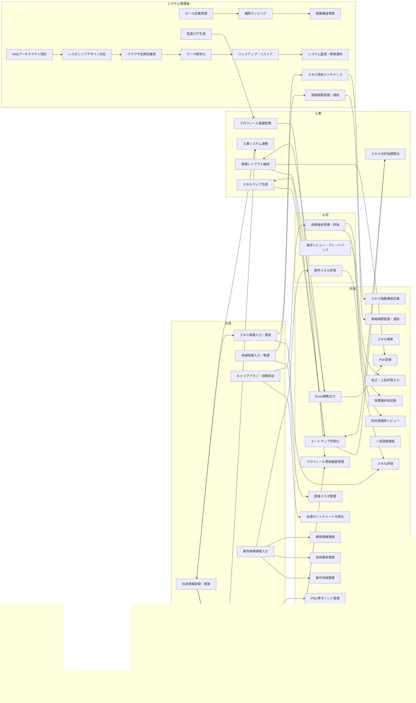
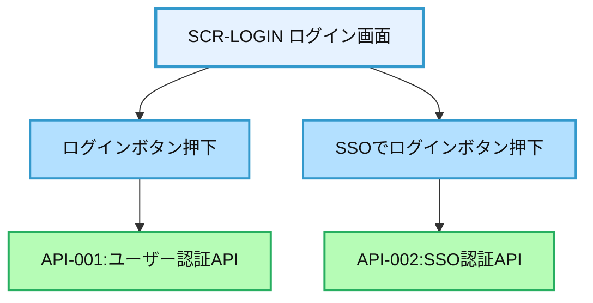
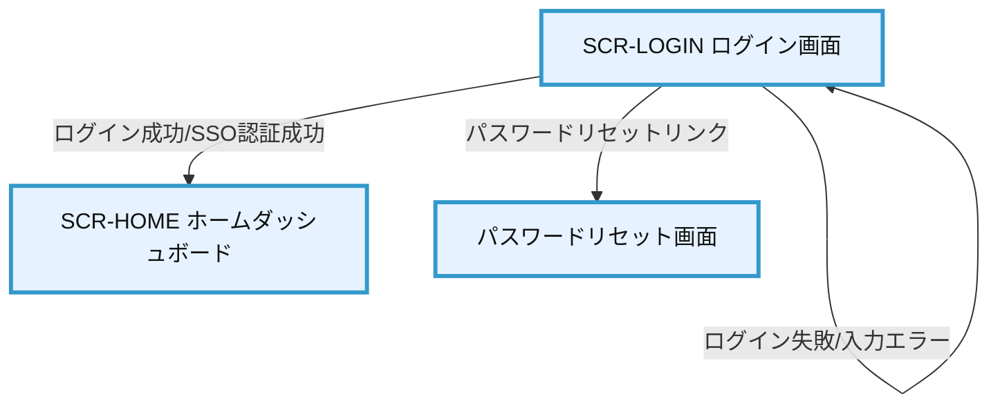

# 要件定義書: 年間スキル報告書WEB化PJT

## 1. プロジェクト概要

プロジェクトの基本情報、目的、スコープについては README.md に詳細に記載されているため、本ドキュメントでは省略します。詳細は README.md を参照してください。

なお、本ドキュメントでは、README.md に記載されていない詳細な機能要件、データモデル、開発・運用方針について記載します。

## 2. 要求仕様

### 2.1 要件カテゴリ一覧
| カテゴリID | 名称 | 説明 |
| :--: | :-- | :-- |
| PLT | Platform | システム基盤要件 |
| ACC | Access Control | ユーザー権限管理 |
| PRO | Profile | 個人プロフィール管理 |
| SKL | Skill | スキル情報管理 |
| CAR | Career | 目標・キャリア管理 |
| WPM | Work Performance Mgmt | 作業実績管理 |
| TRN | Training | 研修・セミナー管理 |
| RPT | Report | レポート出力 |

### 2.2 要求仕様一覧

**優先度基準**
- 最高：業務フロー起点（社員基本情報登録・更新、スキル階層構造定義）
- 高：最低限の非機能（セキュリティ、認証）、スキル管理・検索、社員の業務起点に近いもの
- 中：進捗管理や目標管理、作業実績、資格管理、研修管理など日常の業務運用に必要なもの
- 低：一括登録、PDF変換、レイアウト維持、分析・可視化など補助的・運用効率向上機能

| カテゴリID | 要求ID | 要求内容 | 優先度 | 仕様グループID | 仕様グループ内容 | 仕様ID | 仕様内容 |
| :--: | :-- | :-- | :-- | :-- | :-- | :-- | :-- |
| **PLT** | PLT.1 | Webベースシステムの構築 | 高 | PLT.1-BRS | ブラウザ互換性確保 | PLT.1-BRS.1 | Chrome, Edge, Safari最新版対応 |
| PLT | PLT.1 | Webベースシステムの構築 | 高 | PLT.1-RESP | レスポンシブデザイン対応 | PLT.1-RESP.1 | マルチデバイス対応 |
| PLT | PLT.1 | Webベースシステムの構築 | 高 | PLT.1-WEB | Webアーキテクチャ設計 | PLT.1-WEB.1 | SPA構成、RESTful API設計 |
| PLT | PLT.2 | データセキュリティ | 高 | PLT.2-BKP | バックアップ・リストア | PLT.2-BKP.1 | 日次バックアップ、30日保持 |
| PLT | PLT.2 | データセキュリティ | 高 | PLT.2-ENC | データ暗号化 | PLT.2-ENC.1 | AES-256暗号化 |
| PLT | PLT.2 | データセキュリティ | 高 | PLT.2-MON | システム監視・障害通知 | PLT.2-MON.1 | 死活監視と障害時の管理者通知 |
| **ACC** | ACC.1 | ロールベースアクセス制御 | 高 | ACC.1-PERM | 権限マッピング | ACC.1-PERM.1 | リソースと権限の紐付け |
| ACC | ACC.1 | ロールベースアクセス制御 | 高 | ACC.1-ROLE | ロール定義管理 | ACC.1-ROLE.1 | 4段階権限評価体系の実装 |
| ACC | ACC.1 | ロールベースアクセス制御 | 中 | ACC.1-HIER | 階層構造管理 | ACC.1-HIER.1 | 権限継承ルール |
| ACC | ACC.3 | 監査証跡管理 | 中 | ACC.3-AUDT | 監査ログ生成 | ACC.3-AUDT.1 | 90日間ログ保持の実装 |
| **PRO** | PRO.1 | 基本情報管理機能 | 最高 | PRO.1-BASE | 基本属性管理 | PRO.1-BASE.1 | 7項目の個人情報を主キー管理 |
| PRO | PRO.1 | 基本情報管理機能 | 高 | PRO.1-DEPT | 部署情報管理 | PRO.1-DEPT.1 | 組織変更時の自動反映機能 |
| PRO | PRO.1 | 基本情報管理機能 | 高 | PRO.1-HIST | 更新履歴管理 | PRO.1-HIST.1 | 変更前/変更後の値保持、変更者記録 |
| PRO | PRO.2 | データ連携 | 高 | PRO.2-SYNC | 人事システム連携 | PRO.2-SYNC.1 | マスタデータ同期 |
| **SKL** | SKL.1 | 技術スキルを階層的に管理する | 最高 | SKL.1-HIER | 階層構造定義 | SKL.1-HIER.1 | 3階層（カテゴリ/サブカテゴリ/項目）構成 |
| SKL | SKL.1 | 技術スキルを階層的に管理する | 高 | SKL.1-EVAL | 評価基準設定 | SKL.1-EVAL.1 | 4段階評価（×/△/○/◎） |
| SKL | SKL.1 | 技術スキルを階層的に管理する | 高 | SKL.1-MAINT | メンテナンス機能 | SKL.1-MAINT.1 | 管理者によるスキル項目管理（追加・編集・削除） |
| SKL | SKL.1 | 技術スキルを階層的に管理する | 高 | SKL.1-SRCH | 検索機能 | SKL.1-SRCH.1 | 特定スキルを持つ社員抽出 |
| SKL | SKL.2 | 取得資格情報を管理する | 中 | SKL.2-EXP | 期限管理・通知 | SKL.2-EXP.1 | 有効期限のある資格は期限管理・通知 |
| SKL | SKL.2 | 取得資格情報を管理する | 中 | SKL.2-INP | 資格情報入力 | SKL.2-INP.1 | 資格マスタにない資格は自由入力も可能 |
| SKL | SKL.2 | 取得資格情報を管理する | 中 | SKL.2-MST | 資格マスタ管理 | SKL.2-MST.1 | 資格マスタを用意し選択式で入力 |
| **CAR** | CAR.1 | 個人のキャリアプランと目標を管理する | 中 | CAR.1-PLAN | 長期計画定義 | CAR.1-PLAN.1 | 3年・5年・10年の目標設定 |
| CAR | CAR.1 | 個人のキャリアプランと目標を管理する | 中 | CAR.1-VIS | 可視化機能 | CAR.1-VIS.1 | ガントチャート形式で目標期間を表示 |
| CAR | CAR.2 | 目標の進捗状況を管理する | 中 | CAR.2-TRACK | 達成率追跡 | CAR.2-TRACK.1 | 目標ごとに達成率（%）を記録 |
| CAR | CAR.2 | 目標の進捗状況を管理する | 中 | CAR.2-EVAL | 評価機能 | CAR.2-EVAL.1 | 自己評価と上長評価を分離入力 |
| CAR | CAR.2 | 目標の進捗状況を管理する | 中 | CAR.2-REV | 進捗確認 | CAR.2-REV.1 | 四半期ごとに進捗確認リマインダー |
| **WPM** | WPM.1 | 担当案件の実績情報を記録する | 中 | WPM.1-DET | 案件詳細管理 | WPM.1-DET.1 | 案件ごとに期間・案件名・業務内容を記録 |
| WPM | WPM.1 | 担当案件の実績情報を記録する | 中 | WPM.1-SKILL | スキル評価連携 | WPM.1-SKILL.1 | 担当スキル領域の自己評価をスキルマップと連動 |
| WPM | WPM.1 | 担当案件の実績情報を記録する | 中 | WPM.1-TECH | 技術要素管理 | WPM.1-TECH.1 | 使用機種・言語/ツール・ミドルウェア記録 |
| WPM | WPM.1 | 担当案件の実績情報を記録する | 低 | WPM.1-BULK | 一括登録機能 | WPM.1-BULK.1 | CSV/Excel形式による複数案件の一括登録 |
| WPM | WPM.1 | 担当案件の実績情報を記録する | 低 | WPM.1-SCALE | 開発規模管理 | WPM.1-SCALE.1 | プログラム本数・画面数・帳票数・バッチ数記録 |
| **TRN** | TRN.1 | 参加した研修・セミナー情報を管理する | 中 | TRN.1-ANAL | 学習成果分析 | TRN.1-ANAL.1 | 講習内容と学びのポイントを自由記述 |
| TRN | TRN.1 | 参加した研修・セミナー情報を管理する | 中 | TRN.1-ATT | 出席記録管理 | TRN.1-ATT.1 | 開催日・主催・講師・テーマ・理解度を記録 |
| TRN | TRN.2 | 社内研修情報と連携する | 低 | TRN.2-REG | 参加予定登録 | TRN.2-REG.1 | 外部研修の手動登録機能 |
| TRN | TRN.2 | 社内研修情報と連携する | 低 | TRN.2-SCH | 社内研修スケジュール連携 | TRN.2-SCH.1 | 社内研修カレンダーから参加予定を自動取得 |
| TRN | TRN.3 | 専門資格の継続教育ポイントを管理する | 低 | TRN.3-PDU | ポイント管理 | TRN.3-PDU.1 | PDU等のポイントを自動計算・累積 |
| **RPT** | RPT.1 | 年間スキル報告書をExcel形式で出力する | 低 | RPT.1-EXCEL | Excel形式出力 | RPT.1-EXCEL.1 | 4シート構成（表紙/スケジュール/スキル/作業報告書） |
| RPT | RPT.1 | 年間スキル報告書をExcel形式で出力する | 低 | RPT.1-LAY | レイアウト維持 | RPT.1-LAY.1 | サンプルファイルと同一のセル結合/書式を再現 |
| RPT | RPT.1 | 年間スキル報告書をExcel形式で出力する | 低 | RPT.1-PDF | PDF変換機能 | RPT.1-PDF.1 | Excel→PDF自動変換機能 |
| RPT | RPT.2 | 部門スキルマップを生成する | 低 | RPT.2-ANAL | 分析指標算出 | RPT.2-ANAL.1 | スキル充足率/リスク領域を自動算出 |
| RPT | RPT.2 | 部門スキルマップを生成する | 低 | RPT.2-MAP | マトリクス表示 | RPT.2-MAP.1 | スキルカテゴリ×社員のマトリクス表生成 |
| RPT | RPT.2 | 部門スキルマップを生成する | 低 | RPT.2-VIS | 可視化機能 | RPT.2-VIS.1 | ヒートマップ表示（スキルレベル色分け） |


### 2.3 ## 要求仕様書

[RequirementsSpecification.xlsx](https://github.com/user-attachments/files/20297499/RequirementsSpecification.xlsx)


## 2. 業務要件

### 2.1 業務フロー


### 2.2 業務スイムレーン




## 3. 機能要件

### 3.1 機能一覧

| 機能ID | 機能カテゴリ         | 機能名                  | 機能概要                                                                 | 要求仕様ID（全）                                               | 画面ID（全）                                         | API ID（全）                                   | バッチID（全）                      | 優先度 |
|--------|----------------------|-------------------------|--------------------------------------------------------------------------|----------------------------------------------------------------|----------------------------------------------------|----------------------------------------------|-------------------------------------|--------|
| F01    | 認証・認可           | ユーザー認証            | ユーザーID・パスワード/SSOによる認証、トークン発行、アカウントロック管理 | PLT.1-WEB.1, PLT.1-RESP.1, PLT.1-BRS.1, PLT.2-ENC.1, ACC.1-ROLE.1 | SCR-LOGIN                                           | API-001, API-002                            | BATCH-001, BATCH-002, BATCH-017     | 最高   |
| F02    | 認証・認可           | 権限・ロール管理        | ロール・権限の作成・編集・削除、ユーザーへの付与、監査証跡の管理         | ACC.1-ROLE.1, ACC.1-PERM.1, ACC.1-HIER.1, ACC.3-AUDT.1          | SCR-ACCESS                                         | API-003, API-004, API-022                   | BATCH-003                            | 高     |
| F03    | プロフィール管理     | 基本情報管理            | 社員の基本情報（氏名・所属・役職等）の参照・編集                         | PRO.1-BASE.1, PRO.1-DEPT.1, PRO.1-HIST.1, PRO.2-SYNC.1          | SCR-PROFILE                                        | API-005, API-006                            | BATCH-004                             | 最高   |
| F04    | プロフィール管理     | 組織・役職マスタ管理    | 組織・役職マスタの同期・編集、人事システムとの連携                       | PRO.1-DEPT.1, PRO.2-SYNC.1                                      | SCR-ADMIN, SCR-PROFILE                             | API-006                                    | BATCH-004, BATCH-015                  | 最高   |
| F05    | スキル管理           | スキルマスタ管理        | スキル・資格マスタの追加・編集・削除、階層管理                           | SKL.1-HIER.1, SKL.1-MAINT.1, SKL.2-MST.1                        | SCR-SKILL-M                                        | API-007, API-009                           | BATCH-005                              | 高     |
| F06    | スキル管理           | スキル情報入力・編集    | ユーザーのスキル・資格情報の登録・編集・削除                             | SKL.1-HIER.1, SKL.1-EVAL.1, SKL.1-MAINT.1, SKL.1-SRCH.1, SKL.2-MST.1, SKL.2-INP.1, SKL.2-EXP.1 | SCR-SKILL | API-008, API-010 | BATCH-006, BATCH-007 | 最高   |
| F07    | スキル管理           | スキル検索              | スキル情報によるユーザー検索・絞り込み                                   | SKL.1-SRCH.1                                                   | SCR-SKILL-SEARCH                                    | API-011                                   | BATCH-006                              | 高     |
| F08    | スキル管理           | スキル分析・レポート    | スキルマップ・ギャップ分析、スキルデータの集計・可視化                   | RPT.2-MAP.1, RPT.2-VIS.1, RPT.2-ANAL.1                          | SCR-SKILL-MAP                                       | API-019                                   | BATCH-006                              | 低     |
| F09    | 目標・キャリア管理   | 目標・キャリア設定      | 目標・キャリアプランの登録・参照・編集                                   | CAR.1-PLAN.1, CAR.1-VIS.1                                      | SCR-CAR-PLAN                                        | API-012                                   | BATCH-008                              | 中     |
| F10    | 目標・キャリア管理   | 進捗管理・評価          | 目標進捗・評価・フィードバックの登録・参照                               | CAR.2-TRACK.1, CAR.2-EVAL.1, CAR.2-REV.1                        | SCR-CAR-EVAL                                        | API-013                                   | BATCH-008                              | 中     |
| F11    | 作業実績管理         | 案件実績入力・編集      | 案件実績データの登録・編集・集計                                        | WPM.1-DET.1, WPM.1-TECH.1, WPM.1-SKILL.1                        | SCR-WORK                                            | API-014                                   | BATCH-009                              | 中     |
| F12    | 作業実績管理         | 一括実績登録            | CSV/Excelによる案件実績の一括登録                                       | WPM.1-BULK.1, WPM.1-SCALE.1                                    | SCR-WORK-BULK                                       | API-015                                   | BATCH-010                              | 低     |
| F13    | 研修・教育管理       | 研修参加記録管理        | 研修参加履歴の登録・参照・集計                                          | TRN.1-ATT.1, TRN.1-ANAL.1                                      | SCR-TRAIN                                           | API-016                                   | BATCH-011                              | 中     |
| F14    | 研修・教育管理       | 継続教育・PDU管理       | 継続教育ポイント（PDU）の登録・参照・集計                                | TRN.3-PDU.1                                                    | SCR-TRAIN-M                                         | API-017                                   | BATCH-011                              | 中     |
| F15    | レポート・分析       | 帳票出力                | Excel/PDF帳票の出力・ダウンロード                                       | RPT.1-EXCEL.1, RPT.1-LAY.1, RPT.1-PDF.1                        | SCR-REPORT                                          | API-018                                   | BATCH-012                              | 低     |
| F16    | システム管理         | バックアップ・リストア  | データベース・ファイルのバックアップ・リストア                           | PLT.2-BKP.1                                                    | SCR-ADMIN                                           | API-020                                   | BATCH-013                              | 高     |
| F17    | システム管理         | システム監視・障害対応  | 死活監視、障害通知、システムログ管理                                    | PLT.2-MON.1                                                    | SCR-ADMIN, SCR-NOTIFY                               | API-021                                   | BATCH-014                              | 高     |
| F18    | システム管理         | 監査証跡管理            | 操作ログ・監査証跡の記録・検索・CSV出力                                 | ACC.3-AUDT.1                                                   | SCR-ACCESS, SCR-ADMIN                               | API-022                                   | BATCH-003, BATCH-014                   | 高     |
| F19    | システム管理         | マスタデータ管理        | 各種マスタデータ（部署・役職・スキル等）の編集・同期                     | SKL.1-MAINT.1, SKL.2-MST.1, PRO.1-DEPT.1, PRO.2-SYNC.1         | SCR-ADMIN                                           | API-023                                   | BATCH-015                              | 低     |
| F20    | システム管理         | システム設定管理        | システム設定の変更・履歴管理                                            |                                                            | SCR-ADMIN                                           | API-024                                   | BATCH-016                              | 低     |
| F21    | 共通基盤             | トークン管理            | セッション・認証トークンの発行・更新・削除                              | PLT.2-ENC.1                                                    | -                                                  | API-001, API-002                          | BATCH-017                              | 高     |
| F22    | 通知・アラート       | 資格期限アラート        | 資格期限・障害・目標進捗のリマインダー通知                              | SKL.2-EXP.1, PLT.2-MON.1, CAR.2-REV.1                          | SCR-NOTIFY                                         | API-010, API-021, API-013                 | BATCH-007, BATCH-017                   | 高     |
| F23    | ホームダッシュボード | ホーム表示・通知集約    | 各種通知・進捗サマリ・ショートカットの集約表示                           |                                                            | SCR-HOME                                           | 各カテゴリAPI                              | -                                     | 高     |

---

**優先度基準の解説**

- **最高**：業務フローの起点（ログイン、基本情報・スキル入力/管理）
- **高**：最低限の非機能（認証、権限、セキュリティ）、スキル管理・検索、管理者向け主要機能
- **中**：目標管理、作業実績、研修管理、通知など日常業務運用に必要な機能
- **低**：一括登録、マスタ管理、レポート出力など補助的・運用効率向上機能

**備考**
- 「API IDマッピング」には、各画面で直接利用・連携されるAPI ID（API-001～API-024）を記載しています。
- SCR-HOMEはダッシュボードのため、複数カテゴリのAPIを参照（主要APIは各カテゴリの画面に従う）。
- 複数APIを利用する画面（例：SCR-SKILL, SCR-ADMIN, SCR-NOTIFY）はカンマ区切りで記載しています。
- ご要望に応じて、画面-機能-API-仕様IDの四層マッピングやAPI詳細仕様も作成可能です。

---


### 3.2 機能関連図


### 3.1 画面一覧

## 画面一覧（機能IDマッピング付き）

| 画面ID          | 画面名称                 | 主な機能カテゴリ           | 主な対応機能（抜粋）                            | 主な利用者         | 優先度 | 機能IDマッピング（機能一覧より）      |
|-----------------|--------------------------|---------------------------|------------------------------------------------|--------------------|--------|--------------------------------------|
| SCR-LOGIN       | ログイン画面             | 認証・認可                | ユーザー認証、SSO連携                           | 全ユーザー         | 最高   | F01                                 |
| SCR-ACCESS      | 権限管理画面             | 認証・認可                | 権限・ロール管理、監査証跡                      | システム管理者     | 高     | F02                                 |
| SCR-PROFILE     | プロフィール管理画面     | プロフィール管理          | 基本情報管理、組織・役職管理                    | 社員・人事         | 最高   | F03, F04                            |
| SCR-ADMIN       | システム管理画面         | システム管理、プロフィール管理 | バックアップ、監視、マスタ管理、組織・役職管理 | システム管理者     | 高/低  | F04, F17, F18, F19, F20, F21         |
| SCR-SKILL       | スキル情報管理画面       | スキル管理                | スキル入力・編集、資格管理                      | 社員・上司         | 最高   | F05, F06, F07                       |
| SCR-SKILL-M     | スキルマスタ管理画面     | スキル管理                | スキルマスタ管理、資格マスタ管理                | システム管理者     | 高     | F05, F07                            |
| SCR-SKILL-SEARCH| スキル検索画面           | スキル管理                | スキル検索、社員抽出                            | 上司・管理者       | 高     | F08                                 |
| SCR-SKILL-MAP   | スキルマップ・分析画面   | レポート・分析            | スキルマップ生成、ギャップ分析                  | 管理者・人事       | 低     | F16                                 |
| SCR-CAR-PLAN    | キャリアプラン・目標設定 | 目標・キャリア管理        | 目標・キャリア設定                              | 社員・上司         | 中     | F09                                 |
| SCR-CAR-EVAL    | 目標進捗・評価画面       | 目標・キャリア管理        | 進捗管理・評価                                  | 社員・上司         | 中     | F10                                 |
| SCR-WORK        | 作業実績入力画面         | 作業実績管理              | 案件実績入力・編集                              | 社員               | 中     | F11                                 |
| SCR-WORK-BULK   | 一括実績登録画面         | 作業実績管理              | 一括実績登録（CSV/Excel）                        | 社員・管理者       | 低     | F12                                 |
| SCR-TRAIN       | 研修参加記録画面         | 研修・教育管理            | 研修参加記録管理                                | 社員・人事         | 中     | F13                                 |
| SCR-TRAIN-M     | 継続教育管理画面         | 研修・教育管理            | 継続教育・PDU管理                                | 社員・人事         | 中     | F14                                 |
| SCR-REPORT      | レポート出力画面         | レポート・分析            | 帳票出力（Excel/PDF）                            | 管理者・人事       | 低     | F15                                 |
| SCR-NOTIFY      | 通知・アラート画面       | システム管理、研修・教育管理 | 障害通知、資格期限アラート、進捗リマインダー   | 全ユーザー         | 中     | F07, F18, F10                       |
| SCR-HOME        | ホームダッシュボード     | 共通基盤                  | 各種通知・進捗サマリ・ショートカット             | 全ユーザー         | 高     | F22, F23, F24, F25, F26              |

---

### 優先度基準
- **最高**：業務フローの起点となる「社員基本情報登録・更新」「スキル階層構造定義」に関わる画面
- **高**：最低限の非機能（認証、権限、セキュリティ）、スキル管理・検索、管理者向けの主要画面
- **中**：目標管理、作業実績、研修管理、通知など日常の業務運用に必要な画面
- **低**：一括登録、マスタ管理、レポート出力など補助的・運用効率向上画面

### 備考
- **機能IDマッピング**は、機能一覧で採番した機能ID（F01〜F26）を画面単位で網羅的に割り当てています。
- 複数の機能を持つ画面（例：SCR-ADMIN, SCR-PROFILE, SCR-SKILL, SCR-NOTIFY, SCR-HOME）は該当する機能IDをカンマ区切りで記載しています。
- 共通基盤（SCR-HOME）はUIフレームワークやAPIゲートウェイ、暗号化、監査証跡、非同期処理など全体共通の機能IDを割り当てています。
- ご要望に応じて、画面-機能-仕様IDの三層マッピングや画面遷移図も作成可能です。

### 3.2 画面遷移図


---

### 色分け凡例
- **最高（赤）**：業務フローの起点（ログイン・基本情報・スキル入力/編集）
- **高（オレンジ）**：最低限の非機能（認証・権限・セキュリティ）、スキル管理・検索、管理者向け主要機能
- **中（黄）**：目標管理、作業実績、研修管理など日常運用機能
- **低（グレー）**：一括登録・マスタ管理・レポート出力など補助・運用効率向上機能

---

### 3.3 画面詳細

---
# 画面設計書：SCR-LOGIN（ログイン画面）  
**APIファースト・イベント連携重視版**

---

### 1. 画面基本情報

- **画面ID**：SCR-LOGIN
- **画面名称**：ログイン画面
- **画面の機能概要・目的**：  
  システム利用者が安全かつ簡便にログイン認証を行う画面。ID/パスワード認証およびSSO（シングルサインオン）に対応。セキュアな認証基盤を提供し、業務システムの起点となる。
- **利用ユーザー・アクター**：全ユーザー（社員・上司・人事・管理者）
- **関連機能・仕様ID・機能ID**：F01 / PLT.1-WEB.1, PLT.1-RESP.1, PLT.1-BRS.1, PLT.2-ENC.1, ACC.1-ROLE.1
- **作成日**：2025/05/22
- **作成者**：システム設計担当
- **改訂履歴**：2025/05/22 初版作成

---

### 2. 画面レイアウト

- **画面イメージ・ワイヤーフレーム**
```
+------------------------------------------------------+
|  [会社ロゴ]   年間スキル報告書システム ログイン       |
+------------------------------------------------------+
|  ユーザーID [__________________________]             | ①
|  パスワード [__________________________]             | ②
|  [ ] パスワードを表示                                | ③
|                                                      |
|  [ ログイン ]                                       | ④
|                                                      |
|  [SSOでログイン]                                     | ⑤
|                                                      |
|  [パスワードを忘れた方はこちら]                      | ⑥
|                                                      |
|  (エラー時メッセージ表示エリア)                      | ⑦
+------------------------------------------------------+
|  © 2025 Example Corp.                                |
+------------------------------------------------------+
```
- **画面サイズ**：レスポンシブ（PC：横800px基準、スマホ：100%）
- **UI/UX設計上の注意点**：キーボード操作・タブ移動対応、フォーカス時の強調、視認性重視

---

### 3. 画面項目定義

| 項目ID | 項目名            | APIパラメータ対応           | データ型   | I/O区分 | 必須 | 備考                       |
|--------|-------------------|----------------------------|-----------|---------|------|----------------------------|
| ①      | ユーザーID        | API-001.user_id            | テキスト   | 入力    | ○    | 社員番号またはメール       |
| ②      | パスワード        | API-001.password           | パスワード | 入力    | ○    | 8文字以上                  |
| ③      | パスワード表示    | -                          | チェックBOX| 入力    | -    | 入力時マスク/表示切替      |
| ④      | ログインボタン    | API-001（POST）            | ボタン     | 入力    | -    | 必須項目入力後のみ活性     |
| ⑤      | SSOログイン       | API-002（GET）             | ボタン     | 入力    | -    | SSO連携設定時のみ表示      |
| ⑥      | パスワードリセット| -                          | リンク     | 入力    | -    | パスワードリセット画面へ   |
| ⑦      | エラーメッセージ  | API-001/002エラー応答      | ラベル     | 出力    | -    | 入力エラー・認証失敗時     |

---

### 4. 画面イベント・アクション定義

| イベントID | トリガー/アクション           | イベント内容・アクション詳細                                         | 紐付くAPI ID・名称      | メッセージ表示                       |
|------------|------------------------------|---------------------------------------------------------------------|------------------------|--------------------------------------|
| E01        | [ログイン]ボタン押下          | 入力値バリデーション→API-001呼出→認証成功時はSCR-HOMEへ遷移         | API-001:ユーザー認証API | エラー時：エラーメッセージ表示        |
| E02        | [SSOでログイン]ボタン押下     | API-002呼出（IdPリダイレクト）→認証成功時はSCR-HOMEへ遷移           | API-002:SSO認証API     | エラー時：エラーメッセージ表示        |
| E03        | [パスワード表示]チェック      | パスワード入力欄の表示/非表示切替                                   | -                      |                                      |
| E04        | [パスワードを忘れた方はこちら]| パスワードリセット画面へ遷移                                        | -                      |                                      |
| E05        | Enterキー押下                 | ログインボタン押下と同等処理                                        | API-001                |                                      |
| E06        | 入力エラー                    | 必須項目未入力・形式不正・認証失敗                                  | API-001/002            | エラーメッセージ表示                  |
| E07        | ログイン成功                  | セッション発行・ユーザー権限取得・SCR-HOMEへ遷移                    | API-001/002            |                                      |
| E08        | ログイン失敗                  | エラーメッセージ表示・パスワード再入力促す                          | API-001/002            | 「ユーザーIDまたはパスワードが違います」|
| E09        | アカウントロック              | ログイン失敗回数上限超過                                            | API-001/002            | 「アカウントがロックされました」      |

---

### 5. 画面イベント・API関連図（Mermaid）



---

### 6. 画面遷移図・フロー



---

### 7. メッセージ定義

| メッセージID | メッセージ内容                                  | 種別    | 表示タイミング           |
|--------------|-----------------------------------------------|---------|-------------------------|
| MSG01        | ユーザーIDまたはパスワードが違います           | エラー  | 認証失敗時              |
| MSG02        | 必須項目が入力されていません                   | エラー  | 入力バリデーション時    |
| MSG03        | アカウントがロックされました。管理者に連絡してください | エラー  | ログイン失敗上限時      |
| MSG04        | システム障害が発生しました。再度お試しください | エラー  | システム例外時          |

---

### 8. 入出力一覧

| 種別      | 名称           | 概要                         | アクセス方式 | 経由API（ID・名称・エンドポイント）         |
|-----------|----------------|------------------------------|--------------|--------------------------------------------|
| テーブル  | UserAuth       | ユーザー認証情報             | API経由      | API-001:ユーザー認証API /api/auth/login    |
| API       | API-001        | ユーザー認証API              | -            | /api/auth/login                           |
| API       | API-002        | SSO認証API                   | -            | /api/auth/sso                             |
| セッション| Session        | ログインセッション管理       | API経由      | API-001/002経由で発行                     |

---

### 9. バックエンドAPIコール仕様（APIファースト設計）

#### API-001 ユーザー認証API
- エンドポイント: `/api/auth/login`
- HTTPメソッド: POST
- リクエストパラメータ: user_id (string, 必須), password (string, 必須)
- レスポンスパラメータ: token (string), user_info (object)
- ステータスコードとエラーケース: 200, 401, 403, 500
- 認証・認可要件: なし（認証前API）
- 呼び出しタイミング: [ログイン]ボタン押下時（E01）
- 備考: ログイン失敗回数上限でアカウントロック

#### API-002 SSO認証API
- エンドポイント: `/api/auth/sso`
- HTTPメソッド: GET
- リクエストパラメータ: sso_token (string, 必須)
- レスポンスパラメータ: token (string), user_info (object)
- ステータスコードとエラーケース: 200, 401, 403, 500
- 認証・認可要件: SSO（SAML/OIDC等）によるIdP認証
- 呼び出しタイミング: [SSOでログイン]ボタン押下時（E02）
- 備考: SSO未設定時はボタン非表示

---

### 10. オブジェクト構成・CRUD定義

- UserAuth: R（API-001/002経由のみ）
- Session: C, D（API-001/002経由のみ）
- ログイン履歴: C（API-001/002経由のみ）
- アカウントロック: U（API-001/002経由のみ）

---

### 11. その他

- **アクセシビリティ要件**  
  - キーボード操作・スクリーンリーダー対応、コントラスト確保、ラベル付与
- **セキュリティ要件**  
  - パスワードマスク、ペースト禁止、SSOはSAML/OIDC対応、TLS必須、アカウントロック、ログ記録
- **操作手順・利用ガイド**  
  - ユーザーID・パスワード入力→ログインボタンまたはEnter→認証→ホーム画面へ遷移
  - SSO利用時は「SSOでログイン」ボタンからIdP認証
  - パスワード忘れ時は「パスワードを忘れた方はこちら」リンクからリセット画面へ
- **備考・補足**  
  - SSO方式はシステム要件に応じてSAML/OIDC/代理認証等選択可能
  - 多要素認証（MFA）拡張も設計上考慮
  - 監査証跡は全認証トランザクションを記録


---
# 画面設計書：SCR-ACCESS（権限管理画面）  
**APIファースト・イベント連携重視版**

---

## 1. 画面基本情報

- **画面ID**：SCR-ACCESS  
- **画面名称**：権限管理画面  
- **画面の機能概要・目的**：  
  システム管理者がユーザーのロール・権限を管理し、操作履歴（監査ログ）を確認する画面。ユーザー・ロール単位での権限付与・変更、監査証跡の検索・閲覧を行う。  
- **利用ユーザー・アクター**：システム管理者  
- **関連機能・仕様ID・機能ID**：F02 / ACC.1-ROLE.1, ACC.1-PERM.1, ACC.1-HIER.1, ACC.3-AUDT.1  
- **作成日**：2025/05/22  
- **作成者**：システム設計担当  
- **改訂履歴**：2025/05/22 初版作成

---

## 2. 画面レイアウト

- **画面イメージ・ワイヤーフレーム**
```
+---------------------------------------------------------------+
| [権限管理]                                                    |
+---------------------------------------------------------------+
| [ロール一覧] [ユーザー別権限] [監査ログ]                      |
+---------------------------------------------------------------+
| ＜ロール一覧タブ＞                                            |
| [新規ロール作成]                                              |
| ┌─────────┬──────┬──────┬──────┬──────┐
| │ ロール名 │ 説明 │ 権限数 │ 階層 │ 操作 │
| ├─────────┼──────┼──────┼──────┼──────┤
| │ 管理者   │ 全機能 │ 12   │ 1   │[編集][削除]|
| │ 一般社員 │ 閲覧・入力 │ 5   │ 2   │[編集][削除]|
| └─────────┴──────┴──────┴──────┴──────┘
+---------------------------------------------------------------+
| ＜ユーザー別権限タブ＞                                        |
| [ユーザー検索][ユーザー選択]                                  |
| ┌─────────┬──────┬──────┬──────┬──────┐
| │ ユーザー名 │ 所属 │ 付与ロール │ 権限 │ 操作 │
| ├─────────┼──────┼──────┼──────┼──────┤
| │ 山田太郎 │ 営業部 │ 一般社員 │ 参照 │[変更]|
| │ 佐藤花子 │ 開発部 │ 管理者   │ 全権 │[変更]|
| └─────────┴──────┴──────┴──────┴──────┘
+---------------------------------------------------------------+
| ＜監査ログタブ＞                                              |
| [期間指定][ロール/ユーザー指定][検索]                         |
| ┌──────────────┬─────────────┬─────────────┬─────────────┐
| │ 日時         │ 操作ユーザー │ 操作内容    │ 詳細         │
| ├──────────────┼─────────────┼─────────────┼─────────────┤
| │ 2025/05/20   │ 管理者A     │ 権限付与    │ 山田太郎→管理者|
| │ 2025/05/18   │ 管理者B     │ ロール作成  │ 新規ロール:監査担当|
| └──────────────┴─────────────┴─────────────┴─────────────┘
| [CSVエクスポート]                                             |
+---------------------------------------------------------------+
```
- **画面サイズ**：レスポンシブ（PC：横1200px基準、スマホ：100%）
- **UI/UX設計上の注意点**：タブ切替、テーブルソート、検索・フィルタ、モーダル編集、操作ログの即時反映

---

## 3. 画面項目定義（APIパラメータ紐付け付き）

| 項目ID | 項目名           | APIパラメータ対応                | データ型     | I/O区分 | 必須 | 備考                       |
|--------|------------------|----------------------------------|-------------|---------|------|----------------------------|
| ①      | タブ切替         | -                                | タブ        | 入力    | -    | ロール/ユーザー/監査       |
| ②      | ロール名         | API-003.role_name                | テキスト    | 入力    | ○    | ロール編集・新規           |
| ③      | ロール説明       | API-003.description              | テキスト    | 入力    | -    |                            |
| ④      | 権限数           | API-003.permissions              | 数値        | 出力    | -    | 権限マスタ連携             |
| ⑤      | 階層             | API-003.level                    | 数値        | 入力    | -    | 権限継承用                 |
| ⑥      | 編集ボタン       | API-003（PUT）                   | ボタン      | 入力    | -    | 編集モーダル表示           |
| ⑦      | 削除ボタン       | API-003（DELETE）                | ボタン      | 入力    | -    | 削除確認ダイアログ         |
| ⑧      | 新規ロール作成   | API-003（POST）                  | ボタン      | 入力    | -    | 新規ロール追加モーダル     |
| ⑨      | ユーザー検索     | API-004.user_id                  | テキスト    | 入力    | -    | 氏名・社員番号検索         |
| ⑩      | ユーザー選択     | API-004.user_id                  | プルダウン  | 入力    | -    | 検索結果から選択           |
| ⑪      | 付与ロール       | API-004.role_id                  | プルダウン  | 入力    | -    | ロール一覧から選択         |
| ⑫      | 権限             | API-004.permissions              | ラベル      | 出力    | -    | 権限一覧参照               |
| ⑬      | 監査ログ検索     | API-022.period, user_id, role_id | ボタン      | 入力    | -    | 検索実行                   |
| ⑭      | 監査ログテーブル | API-022.auditlog_list            | テーブル    | 出力    | -    | 日時・操作・内容・詳細     |
| ⑮      | CSVエクスポート  | API-022（CSV形式）               | ボタン      | 入力    | -    | 検索結果をCSV出力          |

---

## 4. 画面イベント・アクション定義（API紐付け明記）

| イベントID | トリガー/アクション           | イベント内容・アクション詳細                                         | 紐付くAPI ID・名称      | メッセージ表示                       |
|------------|------------------------------|---------------------------------------------------------------------|------------------------|--------------------------------------|
| E01        | タブ切替                     | ロール/ユーザー/監査ログの管理対象切替                              | -                      |                                      |
| E02        | [新規ロール作成]ボタン押下    | ロール追加モーダル表示、入力値バリデーション後API-003呼出で登録      | API-003:ロール管理API   | 成功/エラー                          |
| E03        | [編集]ボタン押下              | 編集モーダル表示、編集後API-003呼出で保存                            | API-003                | 成功/エラー                          |
| E04        | [削除]ボタン押下              | 削除確認ダイアログ表示、OKでAPI-003呼出で論理削除                    | API-003                | 成功/エラー                          |
| E05        | ユーザー検索                  | 氏名・社員番号等でAPI-004呼出しユーザー一覧を絞込                    | API-004:ユーザー権限管理API |                                      |
| E06        | [変更]ボタン押下              | 権限変更モーダル表示、変更内容API-004呼出で保存                      | API-004                | 成功/エラー                          |
| E07        | 監査ログ検索                  | 検索条件指定→API-022呼出し検索実行                                  | API-022:監査ログAPI     |                                      |
| E08        | [CSVエクスポート]ボタン押下   | 現在の一覧をCSV形式でダウンロード                                   | API-022                |                                      |

---

## 5. 画面イベント・API関連図（Mermaid）


---

## 6. 画面遷移図・フロー


- 遷移元：SCR-HOME（管理者メニューから遷移）
- 遷移先：SCR-HOME（完了、キャンセル、またはメニュー選択時）

---

## 7. メッセージ定義

| メッセージID | メッセージ内容                                  | 種別    | 表示タイミング           |
|--------------|-----------------------------------------------|---------|-------------------------|
| MSG01        | ロール名は必須です                             | エラー  | ロール追加・編集時      |
| MSG02        | ロール名が重複しています                       | エラー  | ロール追加・編集時      |
| MSG03        | 削除しますか？                                 | 確認    | ロール削除時            |
| MSG04        | 権限変更を保存しました                         | 完了    | 権限変更時              |
| MSG05        | 監査ログ検索条件を入力してください             | エラー  | 監査ログ検索時          |
| MSG06        | CSVエクスポートが完了しました                  | 完了    | CSV出力時               |

---

## 8. 入出力一覧（API経由アクセス明示）

| 種別      | 名称           | 概要                         | アクセス方式 | 経由API（ID・名称・エンドポイント）         |
|-----------|----------------|------------------------------|--------------|--------------------------------------------|
| テーブル  | Role           | ロール情報                   | API経由      | API-003: ロール管理API /api/roles          |
| テーブル  | UserRole       | ユーザーロール紐付け         | API経由      | API-004: ユーザー権限管理API /api/users/{id}/roles |
| テーブル  | AuditLog       | 監査ログ                     | API経由      | API-022: 監査ログAPI /api/system/auditlog  |

---

## 9. バックエンドAPIコール仕様（APIファースト設計）

### API-003 ロール管理API
- エンドポイント: `/api/roles`
- HTTPメソッド: GET, POST, PUT, DELETE
- リクエストパラメータ: role_id, role_name, description, permissions, level
- レスポンスパラメータ: role_info
- ステータスコードとエラーケース: 200, 400, 409, 500
- 認証・認可要件: 管理者権限必須
- 呼び出しタイミング: タブ表示時（GET）、新規作成・編集・削除時（POST/PUT/DELETE）
- 備考: 削除は論理削除

### API-004 ユーザー権限管理API
- エンドポイント: `/api/users/{id}/roles`
- HTTPメソッド: GET, PUT
- リクエストパラメータ: user_id, role_id
- レスポンスパラメータ: user_role_info
- ステータスコードとエラーケース: 200, 400, 403, 500
- 認証・認可要件: 管理者権限必須
- 呼び出しタイミング: ユーザー検索時（GET）、権限変更時（PUT）
- 備考: 権限変更履歴は自動で監査ログ記録

### API-022 監査ログAPI
- エンドポイント: `/api/system/auditlog`
- HTTPメソッド: GET
- リクエストパラメータ: period, user_id, role_id
- レスポンスパラメータ: auditlog_list
- ステータスコードとエラーケース: 200, 400, 500
- 認証・認可要件: 管理者権限必須
- 呼び出しタイミング: 監査ログ検索時、CSVエクスポート時
- 備考: CSVエクスポートはレスポンス形式で切替

---

## 10. オブジェクト構成・CRUD定義

- Role: C, R, U, D（API-003経由のみ）
- UserRole: C, R, U, D（API-004経由のみ）
- AuditLog: C, R（API-022経由のみ）

---

## 11. その他

- **アクセシビリティ要件**  
  - キーボード操作・スクリーンリーダー対応、ラベル付与、テーブルソート・フィルタ操作の視認性向上
- **セキュリティ要件**  
  - 権限変更・ロール削除時の操作ログ記録、CSRF/XSS対策、権限チェック
- **操作手順・利用ガイド**  
  - 管理者はタブで管理対象を切り替え、ロール・ユーザー権限・監査ログの管理を行う
  - 編集・削除・追加はモーダルダイアログで実施
  - 監査ログは条件指定で検索・CSV出力可能
- **備考・補足**  
  - ロール削除は論理削除とし、履歴保持
  - 操作ログ・監査証跡は全操作で必ず記録
  - 権限継承（階層）はロール階層で自動反映

---


## 3. API設計

## 3.1 API一覧

| API ID   | API名称                | カテゴリ           | バージョン | エンドポイント例                | メソッド | 認証 | 主なパラメータ           | 主なレスポンス         | ステータスコード | 利用画面         | 優先度 | 備考                     |
|----------|-----------------------|--------------------|------------|---------------------------------|----------|------|--------------------------|------------------------|------------------|------------------|--------|--------------------------|
| API-001  | ユーザー認証API        | 認証・認可         | v1         | /api/auth/login                 | POST     | 必須 | user_id, password        | token, user_info       | 200, 401, 403    | SCR-LOGIN        | 最高   | SSO連携対応              |
| API-002  | SSO認証API             | 認証・認可         | v1         | /api/auth/sso                   | GET      | 必須 | sso_token                | token, user_info       | 200, 401, 403    | SCR-LOGIN        | 最高   | SAML/OIDC対応            |
| API-003  | ロール管理API          | 認証・認可         | v1         | /api/roles                      | GET/POST/PUT/DELETE | 必須 | role_id, role_name, permission_list | role_info           | 200, 400, 409    | SCR-ACCESS       | 高     | RBAC管理                |
| API-004  | ユーザー権限管理API    | 認証・認可         | v1         | /api/users/{id}/roles           | GET/PUT  | 必須 | user_id, role_id         | user_role_info         | 200, 400, 403    | SCR-ACCESS       | 高     | 権限変更履歴記録         |
| API-005  | プロフィールAPI        | プロフィール管理   | v1         | /api/profile                    | GET/PUT  | 必須 | emp_no, profile_fields   | profile_data           | 200, 400, 403    | SCR-PROFILE      | 最高   | 人事システム連携          |
| API-006  | 組織・役職マスタAPI    | プロフィール管理   | v1         | /api/organization, /api/positions | GET   | 必須 | org_id, position_id      | org_list, position_list| 200, 400         | SCR-PROFILE, SCR-ADMIN | 最高/低 | マスタ同期対応           |
| API-007  | スキルマスタAPI        | スキル管理         | v1         | /api/skills/master              | GET/POST/PUT/DELETE | 必須 | skill_id, category, name | skill_master_list      | 200, 400, 409    | SCR-SKILL-M      | 高     | 階層構造対応              |
| API-008  | スキル情報API          | スキル管理         | v1         | /api/skills                     | GET/POST/PUT        | 必須 | user_id, skill_data      | skill_list             | 200, 400, 403    | SCR-SKILL        | 最高   |                          |
| API-009  | 資格マスタAPI          | スキル管理         | v1         | /api/certifications/master      | GET/POST/PUT/DELETE | 必須 | cert_id, name, org, valid_period | cert_master_list     | 200, 400, 409    | SCR-SKILL-M      | 高     |                          |
| API-010  | 資格情報API            | スキル管理         | v1         | /api/certifications             | GET/POST/PUT        | 必須 | user_id, cert_data        | cert_list              | 200, 400, 403    | SCR-SKILL        | 最高   | 期限アラート連携          |
| API-011  | スキル検索API          | スキル管理         | v1         | /api/skills/search              | GET      | 必須 | category, level, keyword | user_skill_list        | 200, 400         | SCR-SKILL-SEARCH | 高     | Elasticsearch連携         |
| API-012  | 目標・キャリアAPI      | 目標・キャリア管理 | v1         | /api/goals                      | GET/POST/PUT        | 必須 | user_id, goal_data        | goal_list              | 200, 400, 403    | SCR-CAR-PLAN     | 中     | ガントチャート連携         |
| API-013  | 目標進捗API            | 目標・キャリア管理 | v1         | /api/goals/progress             | GET/POST/PUT        | 必須 | goal_id, progress_data    | progress_info          | 200, 400, 403    | SCR-CAR-EVAL     | 中     |                          |
| API-014  | 案件実績API            | 作業実績管理       | v1         | /api/projects                   | GET/POST/PUT        | 必須 | user_id, project_data     | project_list           | 200, 400, 403    | SCR-WORK         | 中     |                          |
| API-015  | 一括実績登録API        | 作業実績管理       | v1         | /api/projects/bulk              | POST     | 必須 | file, user_id             | import_result          | 200, 400, 409    | SCR-WORK-BULK    | 低     | CSV/Excel対応              |
| API-016  | 研修参加記録API        | 研修・教育管理     | v1         | /api/trainings                  | GET/POST/PUT        | 必須 | user_id, training_data    | training_list          | 200, 400, 403    | SCR-TRAIN        | 中     | 研修カレンダー連携         |
| API-017  | 継続教育・PDU API      | 研修・教育管理     | v1         | /api/pdu                        | GET/POST/PUT        | 必須 | user_id, pdu_data         | pdu_info               | 200, 400, 403    | SCR-TRAIN-M      | 中     | 外部認定機関連携            |
| API-018  | 帳票出力API            | レポート・分析     | v1         | /api/reports                    | GET/POST            | 必須 | report_type, params       | file_url, report_data  | 200, 400, 403    | SCR-REPORT       | 低     | Excel/PDF対応              |
| API-019  | スキルマップAPI        | レポート・分析     | v1         | /api/skills/map                 | GET      | 必須 | department_id, category   | skill_map_data         | 200, 400         | SCR-SKILL-MAP    | 低     | ヒートマップ、ギャップ分析  |
| API-020  | バックアップAPI        | システム管理       | v1         | /api/system/backup              | POST/GET | 必須 | backup_id, schedule       | backup_status, file    | 200, 400, 403    | SCR-ADMIN        | 高/低  | クラウドストレージ連携      |
| API-021  | 監視・障害通知API      | システム管理       | v1         | /api/system/monitor             | GET      | 必須 | -                         | monitor_status         | 200, 500         | SCR-ADMIN        | 高     | 死活監視                   |
| API-022  | 監査ログAPI            | システム管理       | v1         | /api/system/auditlog            | GET      | 必須 | period, user_id, role_id  | auditlog_list          | 200, 400         | SCR-ADMIN, SCR-ACCESS | 高     | CSVエクスポート対応         |
| API-023  | マスタデータAPI        | システム管理       | v1         | /api/masterdata                 | GET/POST/PUT/DELETE | 必須 | master_type, data         | masterdata_list        | 200, 400, 409    | SCR-ADMIN        | 低     | 部署・役職・スキル等        |
| API-024  | システム設定API        | システム管理       | v1         | /api/system/config              | GET/PUT  | 必須 | config_items              | config_info            | 200, 400, 403    | SCR-ADMIN        | 低     | メール通知・メンテナンス    |

---

### 優先度基準
- **最高**：SCR-LOGIN, SCR-PROFILE, SCR-SKILL（および関連API）、組織・役職マスタAPI（プロフィール管理用途）
- **高**：SCR-ACCESS, SCR-SKILL-M, SCR-SKILL-SEARCH, SCR-ADMIN（主要機能）、スキル関連API
- **中**：SCR-CAR-PLAN, SCR-CAR-EVAL, SCR-WORK, SCR-TRAIN, SCR-TRAIN-M, SCR-NOTIFY
- **低**：SCR-WORK-BULK, SCR-REPORT, SCR-SKILL-MAP, SCR-ADMIN（補助機能）、マスタデータ・システム設定API

**備考**
- 画面が複数ある場合は優先度の高い方を優先し、両方該当する場合は「/」区切りで記載しています。
- ご要望に応じて、API単位の詳細設計や優先度の根拠説明も作成可能です。

---

## 3.2 API仕様書

---
# API仕様書：API-001 ユーザー認証API

---

### 1. 基本情報

- **API ID**：API-001
- **API名称**：ユーザー認証API（User Authentication API）
- **概要／目的**：  
  ユーザーIDとパスワードによる認証を行い、認証に成功した場合はアクセストークン（JWT等）とユーザー情報を返却する。システムへのログインやセッション管理の起点となるAPI。SSO連携にも対応。
- **バージョン**：v1
- **管理責任者**：システム管理者
- **作成日**：2025/05/22
- **改訂履歴**：2025/05/22 初版作成

---

### 2. エンドポイント定義

- **エンドポイントURL**：`/api/auth/login`
- **HTTPメソッド**：POST
- **サポートプロトコル**：HTTPS
- **バージョニング方式**：/v1/（例：/api/v1/auth/login）

---

### 3. 認証・認可

- **認証方式**：なし（このAPI自体は認証前に利用。以降のAPIは返却されたトークンで認証）
- **必要なロール・権限**：不要（全ユーザー利用可）
- **アクセス制御ポリシー**：アカウントロック等の制御はAPI内部で実施

---

### 4. リクエスト仕様

#### パスパラメータ
- なし

#### クエリパラメータ
- なし

#### リクエストヘッダ
| 名称           | 型     | 必須 | 説明                  | 例                  |
|----------------|--------|------|-----------------------|---------------------|
| Content-Type   | string | ○    | application/json      | application/json    |

#### リクエストボディ（JSON）

| フィールド名 | 型     | 必須 | 説明                       | 制約例              |
|--------------|--------|------|----------------------------|---------------------|
| user_id      | string | ○    | ユーザーIDまたはメール     | 最大32文字、半角    |
| password     | string | ○    | パスワード                 | 8～64文字、半角英数 |

**入力制約・バリデーション**
- user_id：必須、半角英数字、最大32文字
- password：必須、8～64文字、半角英数記号

**サンプルリクエスト**
```json
{
  "user_id": "yamada.taro",
  "password": "P@ssw0rd123"
}
```

---

### 5. レスポンス仕様

#### ステータスコード
- 200：認証成功
- 401：認証失敗（ユーザーIDまたはパスワード誤り）
- 403：アカウントロック
- 400：リクエスト不正（必須項目未入力等）
- 500：システムエラー

#### レスポンスヘッダ
| 名称           | 型     | 説明                  |
|----------------|--------|-----------------------|
| Content-Type   | string | application/json      |

#### レスポンスボディ（JSON）

| フィールド名 | 型     | 説明                           | 例                   |
|--------------|--------|--------------------------------|----------------------|
| token        | string | 認証トークン（JWT等）          | "eyJhbGciOi..."      |
| user_info    | object | ユーザー情報                   | {"name":"山田 太郎", "role":"一般社員"} |

**サンプルレスポンス（成功）**
```json
{
  "token": "eyJhbGciOiJIUzI1NiIsInR5cCI6...",
  "user_info": {
    "user_id": "yamada.taro",
    "name": "山田 太郎",
    "role": "一般社員",
    "email": "yamada.taro@example.com"
  }
}
```

---

### 6. エラー仕様

| エラーコード | HTTPステータス | エラーメッセージ                   | 原因・対処方法                                | サンプルエラーレスポンス           |
|--------------|---------------|------------------------------------|-----------------------------------------------|------------------------------------|
| 401          | 401           | ユーザーIDまたはパスワードが違います | 入力値誤り。再入力。                          | {"error":"invalid_credentials"}    |
| 403          | 403           | アカウントがロックされています      | ログイン失敗上限。管理者へ連絡。              | {"error":"account_locked"}         |
| 400          | 400           | 必須項目が入力されていません        | user_id/password未入力                        | {"error":"invalid_request"}        |
| 500          | 500           | システムエラーが発生しました        | サーバ障害。管理者へ連絡。                    | {"error":"system_error"}           |

---

### 7. 業務ルール・補足仕様

- アカウントロックは連続認証失敗回数上限（例：5回）で発動し、一定時間または管理者解除で復帰
- 認証成功時のみアクセストークン発行
- SSO連携時は別API（API-002）を利用
- トークン有効期間はシステム設定に準拠（例：1時間）

---

### 8. 関連情報

- **利用画面・機能ID**：SCR-LOGIN / F01
- **関連DBテーブル・オブジェクト**：UserAuth, ログイン履歴, アカウントロック
- **外部システム連携有無**：IdP連携（SSO時）
- **操作ログ・監査証跡要件**：全リクエスト・レスポンスを監査ログ記録

---

### 9. サンプル集

#### サンプルリクエスト（curl）
```bash
curl -X POST "https://example.com/api/auth/login" \
  -H "Content-Type: application/json" \
  -d '{"user_id":"yamada.taro","password":"P@ssw0rd123"}'
```

#### サンプルレスポンス（正常）
```json
{
  "token": "eyJhbGciOiJIUzI1NiIsInR5cCI6...",
  "user_info": {
    "user_id": "yamada.taro",
    "name": "山田 太郎",
    "role": "一般社員",
    "email": "yamada.taro@example.com"
  }
}
```

#### サンプルレスポンス（認証失敗）
```json
{
  "error": "invalid_credentials"
}
```

---

### 10. 備考・補足

- SSO認証はAPI-002を参照
- パスワードは暗号化通信（HTTPS）必須
- 多要素認証（MFA）拡張も設計上考慮
- 変更履歴：2025/05/22 初版作成

---


## 3. バッチ設計


## 4. インターフェース設計

## 5. データベース設計

```mermaid
erDiagram

%% マスタ系
MST_UserAuth {
    string user_id PK
    string password_hash
    string email
    string status
}
MST_Role {
    string role_id PK
    string role_name
    string description
    int level
}
MST_Permission {
    string perm_id PK
    string perm_name
    string description
}
MST_UserRole {
    string user_id PK, FK
    string role_id PK, FK
}
MST_Employee {
    string emp_no PK
    string name_kanji
    string name_kana
    string dept_id FK
    string position_id FK
    string email
    date birth_date
    date join_date
}
MST_Department {
    string dept_id PK
    string dept_name
}
MST_Position {
    string position_id PK
    string position_name
}
MST_SkillHierarchy {
    string skill_id PK
    string parent_skill_id
    string skill_name
    int level
}
MST_Certification {
    string cert_id PK
    string cert_name
    string org
    date valid_from
    date valid_to
}
MST_CareerPlan {
    string plan_id PK
    string emp_no FK
    string plan_content
    date plan_date
}
MST_ReportTemplate {
    string template_id PK
    string template_name
    string file_path
}
MST_SystemConfig {
    string config_id PK
    string config_key
    string config_value
}

%% トランザクション系
TRN_SkillRecord {
    string record_id PK
    string emp_no FK
    string skill_id FK
    int level
    date acquired_date
}
TRN_GoalProgress {
    string progress_id PK
    string plan_id FK
    string emp_no FK
    string status
    date progress_date
}
TRN_ProjectRecord {
    string project_id PK
    string emp_no FK
    string project_name
    date start_date
    date end_date
}
TRN_TrainingHistory {
    string training_id PK
    string emp_no FK
    string training_name
    date attend_date
}
TRN_PDU {
    string pdu_id PK
    string emp_no FK
    int points
    date acquired_date
}

%% 履歴系
HIS_AuditLog {
    string log_id PK
    string user_id FK
    string action
    string detail
    date log_date
}

%% システム系
SYS_SkillIndex {
    string index_id PK
    string skill_id FK
    string emp_no FK
}
SYS_SkillMatrix {
    string matrix_id PK
    string dept_id FK
    string skill_id FK
    int avg_level
}
SYS_BackupHistory {
    string backup_id PK
    date backup_date
    string status
}
SYS_SystemLog {
    string log_id PK
    string log_type
    string message
    date log_date
}
SYS_TokenStore {
    string token_id PK
    string user_id FK
    date issued_at
    date expired_at
}
SYS_MasterData {
    string master_id PK
    string master_type
    string data_json
}

%% ワーク系
WRK_BatchJobLog {
    string job_id PK
    string job_type
    string status
    date executed_at
}

%% 関連（外部キー）
MST_UserRole ||--|| MST_UserAuth : user_id
MST_UserRole }o--|| MST_Role : role_id
MST_Role ||--o{ MST_Permission : role_id
MST_Employee }o--|| MST_Department : dept_id
MST_Employee }o--|| MST_Position : position_id
TRN_SkillRecord }o--|| MST_Employee : emp_no
TRN_SkillRecord }o--|| MST_SkillHierarchy : skill_id
TRN_GoalProgress }o--|| MST_CareerPlan : plan_id
TRN_GoalProgress }o--|| MST_Employee : emp_no
TRN_ProjectRecord }o--|| MST_Employee : emp_no
TRN_TrainingHistory }o--|| MST_Employee : emp_no
TRN_PDU }o--|| MST_Employee : emp_no
HIS_AuditLog }o--|| MST_UserAuth : user_id
SYS_SkillIndex }o--|| MST_SkillHierarchy : skill_id
SYS_SkillIndex }o--|| MST_Employee : emp_no
SYS_SkillMatrix }o--|| MST_Department : dept_id
SYS_SkillMatrix }o--|| MST_SkillHierarchy : skill_id
SYS_TokenStore }o--|| MST_UserAuth : user_id

```




---

### ポイント
- 各テーブルはカテゴリごとにプレフィックス（MST_, TRN_, HIS_, SYS_, WRK_）を付与
- 主な外部キーリレーションを明示
- ER図としてMermaid記法で表現（Mermaid Live Editor等で可視化可）
- インターフェイス系や一時テーブルは必要に応じて追加

**このER図で、全体の論理構造・参照関係・カテゴリが一目で把握できます。**


## 6. テスト設計


## ユーザーテストシナリオ一覧（要求仕様・機能・画面一覧ベース、アクター明確化）

| シナリオID | シナリオ名                       | 登場アクター         | 主な画面ID           | 主な機能ID         | 要求仕様ID（抜粋）               | テスト内容・期待結果                                           |
|------------|----------------------------------|----------------------|----------------------|--------------------|-------------------------------|-------------------------------------------------------------|
| TS-001     | ログイン認証正常                 | 一般ユーザー         | SCR-LOGIN            | F01                | PLT.1-WEB.1, ACC.1-ROLE.1     | 正しいID/パスワードでログインし、ホームへ遷移できる           |
| TS-002     | ログイン認証エラー               | 一般ユーザー         | SCR-LOGIN            | F01                | PLT.1-WEB.1                   | 誤ったパスワードでエラーメッセージが表示される                |
| TS-003     | アカウントロック                 | 一般ユーザー         | SCR-LOGIN            | F01                | PLT.1-WEB.1                   | ログイン失敗上限でロックされ、以降ログイン不可                |
| TS-004     | SSOログイン                      | 一般ユーザー         | SCR-LOGIN            | F01                | PLT.1-WEB.1                   | SSOボタンからIdP認証し、正常にホームへ遷移できる              |
| TS-005     | プロフィール参照・編集           | 一般ユーザー         | SCR-PROFILE          | F03                | PRO.1-BASE.1, PRO.1-DEPT.1    | プロフィール情報を参照・編集し、保存後に変更が反映される      |
| TS-006     | 部署・役職マスタ同期             | 人事担当者           | SCR-PROFILE, SCR-ADMIN| F04                | PRO.2-SYNC.1                  | 外部人事システム連携で部署・役職マスタが最新化される           |
| TS-007     | 権限管理（ロール追加・編集）     | システム管理者       | SCR-ACCESS           | F02                | ACC.1-ROLE.1                  | 新規ロール追加・編集・削除が正しく反映される                  |
| TS-008     | 権限付与・変更                   | システム管理者       | SCR-ACCESS           | F02                | ACC.1-PERM.1                  | ユーザーへロール付与・変更が正しく反映される                  |
| TS-009     | 監査証跡検索・CSV出力            | システム管理者       | SCR-ACCESS, SCR-ADMIN| F02, F19           | ACC.3-AUDT.1                  | 監査ログの検索・CSV出力ができ、操作履歴が正しく記録される      |
| TS-010     | スキル情報登録・編集             | 一般ユーザー         | SCR-SKILL            | F06                | SKL.1-HIER.1, SKL.2-INP.1     | スキル情報を登録・編集し、保存後に正しく反映される            |
| TS-011     | スキルマスタ管理                 | システム管理者       | SCR-SKILL-M          | F05, F07           | SKL.1-MAINT.1                 | スキル・資格マスタの追加・編集・削除ができる                   |
| TS-012     | スキル検索                       | 上司・管理者         | SCR-SKILL-SEARCH     | F08                | SKL.1-SRCH.1                  | 検索条件でユーザー抽出・スキル一覧が正しく表示される           |
| TS-013     | 目標設定・進捗管理               | 一般ユーザー, 上司   | SCR-CAR-PLAN, SCR-CAR-EVAL | F09, F10      | CAR.1-PLAN.1, CAR.2-TRACK.1   | 目標設定・進捗入力・評価ができ、履歴が残る                     |
| TS-014     | 案件実績入力・一括登録           | 一般ユーザー, 管理者 | SCR-WORK, SCR-WORK-BULK | F11, F12         | WPM.1-DET.1, WPM.1-BULK.1     | 案件実績の個別・一括登録が正しく反映される                     |
| TS-015     | 研修参加記録・PDU管理            | 一般ユーザー, 人事   | SCR-TRAIN, SCR-TRAIN-M | F13, F14         | TRN.1-ATT.1, TRN.3-PDU.1      | 研修参加・PDUポイントの登録・参照ができる                      |
| TS-016     | 帳票出力・ダウンロード           | 管理者, 人事         | SCR-REPORT           | F15                | RPT.1-EXCEL.1, RPT.1-PDF.1    | 帳票（Excel/PDF）出力・ダウンロードが正常にできる              |
| TS-017     | システムバックアップ・リストア    | システム管理者       | SCR-ADMIN            | F17                | PLT.2-BKP.1                   | バックアップ・リストアが正常に実行でき、履歴が残る             |
| TS-018     | システム監視・障害通知           | システム管理者       | SCR-ADMIN, SCR-NOTIFY| F18                | PLT.2-MON.1                   | 死活監視・障害通知・アラートが正しく発報される                 |
| TS-019     | システム設定変更・履歴記録       | システム管理者       | SCR-ADMIN            | F21                |                                | システム設定変更ができ、履歴が記録される                       |
| TS-020     | マスタデータ管理                 | システム管理者       | SCR-ADMIN            | F20                | SKL.1-MAINT.1, PRO.2-SYNC.1    | マスタデータの追加・編集・削除・同期ができる                    |
| TS-021     | 通知・アラート受信               | 全ユーザー           | SCR-NOTIFY           | F07, F18, F10      | SKL.2-EXP.1, PLT.2-MON.1       | 資格期限アラート、障害通知、進捗リマインダーが正しく受信できる  |
| TS-022     | ホームダッシュボード表示         | 全ユーザー           | SCR-HOME             | F22, F23, F24, F25, F26 |                              | 各種通知・進捗サマリ・ショートカットが正しく表示される           |

---

### 登場アクター定義

- **一般ユーザー**：システム利用社員
- **上司**：部下を持つ管理職
- **人事担当者**：人事部門ユーザー
- **システム管理者**：システム運用・管理専任者
- **管理者**：部門管理や帳票出力等を担うユーザー

---


---
# 以下は、元々ベース作成頂いた情報
---


## 3. データモデル

### 3.1 エンティティ関連図

```
┌───────────────┐      ┌───────────────────────┐      ┌───────────────────┐
│     User      │      │  PersonalMasterSchedule │      │    SkillReport    │
├───────────────┤      ├───────────────────────┤      ├───────────────────┤
│ employeeId    │──┐   │ reportYear            │      │ reportYear        │
│ name          │  │   │ employeeId            │◄─┐   │ employeeId        │◄─┐
│ departmentName│  │   │ personalGoal          │  │   │ technicalSkill    │  │
│ departmentCode│  └──►│ targetGrade           │  │   │ developmentSkill  │  │
│ groupName     │      │ workGoal              │  │   │ businessSkill     │  │
│ groupCode     │      │ lifeGoal              │  │   │ productionSkill   │  │
└───────────────┘      │ promotionCheckpoint   │  │   │ trainingSeminar   │  │
                       └───────────────────────┘  │   │ salesPoint        │  │
                                                  │   │ remarks           │  │
                                                  │   └───────────────────┘  │
                                                  │                          │
                       ┌───────────────────────┐  │   ┌───────────────────┐  │
                       │   AnnualWorkReport    │  │   │  MemberManagement │  │
                       ├───────────────────────┤  │   ├───────────────────┤  │
                       │ reportYear            │  │   │ managerEmployeeId │  │
                       │ employeeId            │◄─┘   │ memberEmployeeId  │◄─┘
                       │ technicalSkill        │      │ interviewStatus   │
                       │ developmentSkill      │      │ reportStatus      │
                       │ businessSkill         │      │ departmentName    │
                       │ productionSkill       │      │ groupName         │
                       │ workPositions         │      └───────────────────┘
                       └───────────────────────┘
```

### 3.2 エンティティ詳細

#### 3.2.1 ユーザ (User)
- **社員番号** (employeeId): 主キー、文字列
- **氏名** (name): 文字列
- **所属部署名** (departmentName): 文字列
- **所属部署コード** (departmentCode): 文字列
- **所属Gr名** (groupName): 文字列
- **所属Grコード** (groupCode): 文字列
- **権限** (role): 文字列（一般ユーザー/管理職）
- **パスワード** (password): ハッシュ化された文字列
- **メールアドレス** (email): 文字列

#### 3.2.2 個人マスタスケジュール (PersonalMasterSchedule)
- **報告年度** (reportYear): 主キー（複合）、数値
- **社員番号** (employeeId): 主キー（複合）、外部キー（User）
- **個人目標** (personalGoal): テキスト
- **目標人事グレード** (targetGrade): 文字列
- **ワーク目標** (workGoal): テキスト
- **ライフ目標** (lifeGoal): テキスト
- **昇進チェックポイント** (promotionCheckpoint): テキスト
- **提出状態** (submissionStatus): 文字列（下書き/提出済み/承認済み）
- **最終更新日** (lastUpdated): 日時

#### 3.2.3 スキル報告書 (SkillReport)
- **報告年度** (reportYear): 主キー（複合）、数値
- **社員番号** (employeeId): 主キー（複合）、外部キー（User）
- **技術スキル** (technicalSkill): JSON/テキスト
- **開発スキル** (developmentSkill): JSON/テキスト
- **業務スキル** (businessSkill): JSON/テキスト
- **生産・管理スキル** (productionSkill): JSON/テキスト
- **受講研修・セミナー** (trainingSeminar): JSON/テキスト
- **セールポイント** (salesPoint): テキスト
- **備考** (remarks): テキスト
- **提出状態** (submissionStatus): 文字列（下書き/提出済み/承認済み）
- **最終更新日** (lastUpdated): 日時

#### 3.2.4 年間作業報告書 (AnnualWorkReport)
- **報告年度** (reportYear): 主キー（複合）、数値
- **社員番号** (employeeId): 主キー（複合）、外部キー（User）
- **技術スキル** (technicalSkill): JSON/テキスト
- **開発スキル** (developmentSkill): JSON/テキスト
- **業務スキル** (businessSkill): JSON/テキスト
- **生産・管理スキル** (productionSkill): JSON/テキスト
- **業務内容作業ポジション** (workPositions): JSON/テキスト
- **提出状態** (submissionStatus): 文字列（下書き/提出済み/承認済み）
- **最終更新日** (lastUpdated): 日時

#### 3.2.5 メンバー管理 (MemberManagement)
- **管理者社員番号** (managerEmployeeId): 主キー（複合）、外部キー（User）
- **所属メンバー社員番号** (memberEmployeeId): 主キー（複合）、外部キー（User）
- **面談状況** (interviewStatus): JSON/テキスト
- **報告書申請状況** (reportStatus): JSON/テキスト
- **所属部署** (departmentName): 文字列
- **所属Gr** (groupName): 文字列
- **最終更新日** (lastUpdated): 日時

## 4. 開発・運用方針

### 4.1 タスク管理手法
- Backlogでタスク管理を実施
- アプリケーション開発は画面ベースでチケット管理
- スプリント期間は1週間単位
- 週次レビューを実施（毎週金曜）
- WBSと工数管理は以下のSharePoint内のファイルで行う
  - [SharePointリンク](https://sasbusiness.sharepoint.com/:f:/r/sites/msteams_81e110_093265/Shared%20Documents/General/43_AI%E6%8E%A8%E9%80%B2TF/2025%E5%B9%B4%E5%BA%A6/AI%E9%A7%86%E5%8B%95%E9%96%8B%E7%99%BA/%E5%B9%B4%E9%96%93%E3%82%B9%E3%82%AD%E3%83%AB%E5%A0%B1%E5%91%8A%E6%9B%B8WEB%E5%8C%96PJT?csf=1&web=1&e=ZQJDLB)
  - 各メンバーは週次で工数実績を記録
  - 進捗状況はWBSに基づいて週次で更新

### 4.2 開発に関するルール
- コーディング規約やテスト手法等はGitHubのWikiに記載
- ブランチ戦略はGitFlow採用
  - `main`: 製品リリース用
  - `develop`: 開発用
  - `feature/*`: 機能開発用
  - `release/*`: リリース準備用
  - `hotfix/*`: 緊急バグ修正用
- コードレビューはPull Request形式で実施
- CIによる自動テスト実行

### 4.3 テスト方針
- ユニットテスト: 各コンポーネントの単体テスト
- 統合テスト: コンポーネント間の連携テスト
- E2Eテスト: ユーザーシナリオに基づいたテスト
- パフォーマンステスト: 応答時間の検証

### 4.4 デプロイメント方針
- 開発環境: 開発者用、頻繁な更新
- テスト環境: QA用、安定版のテスト
- ステージング環境: 本番に近い環境でのテスト
- 本番環境: エンドユーザー向け

## 5. プロジェクトスケジュール

| フェーズ | 期間 | 主な成果物 |
|---------|------|-----------|
| 要件定義 | 2025年5月中旬まで | 要件定義書、画面設計書 |
| 設計 | 2025年5月下旬 | システム設計書、データモデル設計書 |
| 開発 | 2025年6月〜7月中旬 | アプリケーションコード、テストコード |
| テスト | 2025年7月中旬〜下旬 | テスト結果報告書 |
| リリース | 2025年7月末 | 本番環境、ユーザーマニュアル |

## 6. 参考資料

- README.md: プロジェクト概要
- memory-bank/: プロジェクト詳細情報
- 既存Excelフォーマット: 現行の個人マスタースケジュール／スキル報告書
- ドキュメントテンプレート：https://github.com/Foo-x/documentation_templates/tree/master
