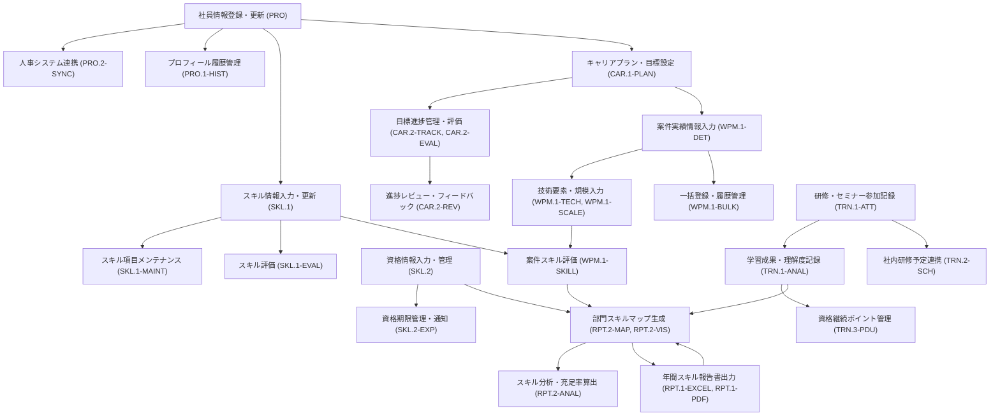

# 要件定義書: 年間スキル報告書WEB化PJT

## 1. プロジェクト概要

プロジェクトの基本情報、目的、スコープについては README.md に詳細に記載されているため、本ドキュメントでは省略します。詳細は README.md を参照してください。

なお、本ドキュメントでは、README.md に記載されていない詳細な機能要件、データモデル、開発・運用方針について記載します。

## 2. 要求仕様

### 2.1 要件カテゴリ一覧
| カテゴリID | 名称 | 説明 |
| :--: | :-- | :-- |
| PLT | Platform | システム基盤要件 |
| ACC | Access Control | ユーザー権限管理 |
| PRO | Profile | 個人プロフィール管理 |
| SKL | Skill | スキル情報管理 |
| CAR | Career | 目標・キャリア管理 |
| WPM | Work Performance Mgmt | 作業実績管理 |
| TRN | Training | 研修・セミナー管理 |
| RPT | Report | レポート出力 |

### 2.2 ## 要求仕様一覧
| カテゴリ | 要求ID | 要求内容 | 仕様グループID | 仕様グループ内容 | 仕様ID | 仕様内容 |
| :-- | :-- | :-- | :-- | :-- | :-- | :-- |
| PLT | PLT.1 | Webベースシステムの構築 | PLT.1-WEB | Webアーキテクチャ設計 | PLT.1-WEB.1 | SPA構成、RESTful API設計 |
| PLT | PLT.1 | Webベースシステムの構築 | PLT.1-RESP | レスポンシブデザイン対応 | PLT.1-RESP.1 | マルチデバイス対応 |
| PLT | PLT.1 | Webベースシステムの構築 | PLT.1-BRS | ブラウザ互換性確保 | PLT.1-BRS.1 | Chrome, Edge, Safari最新版対応 |
| PLT | PLT.2 | データセキュリティ | PLT.2-ENC | データ暗号化 | PLT.2-ENC.1 | AES-256暗号化 |
| PLT | PLT.2 | データセキュリティ | PLT.2-BKP | バックアップ・リストア | PLT.2-BKP.1 | 日次バックアップ、30日保持 |
| PLT | PLT.2 | データセキュリティ | PLT.2-MON | システム監視・障害通知 | PLT.2-MON.1 | 死活監視と障害時の管理者通知 |
| ACC | ACC.1 | ロールベースアクセス制御 | ACC.1-ROLE | ロール定義管理 | ACC.1-ROLE.1 | 4段階権限評価体系の実装 |
| ACC | ACC.1 | ロールベースアクセス制御 | ACC.1-PERM | 権限マッピング | ACC.1-PERM.1 | リソースと権限の紐付け |
| ACC | ACC.1 | ロールベースアクセス制御 | ACC.1-HIER | 階層構造管理 | ACC.1-HIER.1 | 権限継承ルール |
| ACC | ACC.3 | 監査証跡管理 | ACC.3-AUDT | 監査ログ生成 | ACC.3-AUDT.1 | 90日間ログ保持の実装 |
| PRO | PRO.1 | 基本情報管理機能 | PRO.1-BASE | 基本属性管理 | PRO.1-BASE.1 | 7項目の個人情報を主キー管理 |
| PRO | PRO.1 | 基本情報管理機能 | PRO.1-DEPT | 部署情報管理 | PRO.1-DEPT.1 | 組織変更時の自動反映機能 |
| PRO | PRO.1 | 基本情報管理機能 | PRO.1-HIST | 更新履歴管理 | PRO.1-HIST.1 | 変更前/変更後の値保持、変更者記録 |
| PRO | PRO.2 | データ連携 | PRO.2-SYNC | 人事システム連携 | PRO.2-SYNC.1 | マスタデータ同期 |
| SKL | SKL.1 | 技術スキルを階層的に管理する | SKL.1-HIER | 階層構造定義 | SKL.1-HIER.1 | 3階層（カテゴリ/サブカテゴリ/項目）構成 |
| SKL | SKL.1 | 技術スキルを階層的に管理する | SKL.1-EVAL | 評価基準設定 | SKL.1-EVAL.1 | 4段階評価（×/△/○/◎） |
| SKL | SKL.1 | 技術スキルを階層的に管理する | SKL.1-MAINT | メンテナンス機能 | SKL.1-MAINT.1 | 管理者によるスキル項目管理（追加・編集・削除） |
| SKL | SKL.1 | 技術スキルを階層的に管理する | SKL.1-SRCH | 検索機能 | SKL.1-SRCH.1 | 特定スキルを持つ社員抽出 |
| SKL | SKL.2 | 取得資格情報を管理する | SKL.2-MST | 資格マスタ管理 | SKL.2-MST.1 | 資格マスタを用意し選択式で入力 |
| SKL | SKL.2 | 取得資格情報を管理する | SKL.2-INP | 資格情報入力 | SKL.2-INP.1 | 資格マスタにない資格は自由入力も可能 |
| SKL | SKL.2 | 取得資格情報を管理する | SKL.2-EXP | 期限管理・通知 | SKL.2-EXP.1 | 有効期限のある資格は期限管理・通知 |
| CAR | CAR.1 | 個人のキャリアプランと目標を管理する | CAR.1-PLAN | 長期計画定義 | CAR.1-PLAN.1 | 3年・5年・10年の目標設定 |
| CAR | CAR.1 | 個人のキャリアプランと目標を管理する | CAR.1-VIS | 可視化機能 | CAR.1-VIS.1 | ガントチャート形式で目標期間を表示 |
| CAR | CAR.2 | 目標の進捗状況を管理する | CAR.2-TRACK | 達成率追跡 | CAR.2-TRACK.1 | 目標ごとに達成率（%）を記録 |
| CAR | CAR.2 | 目標の進捗状況を管理する | CAR.2-EVAL | 評価機能 | CAR.2-EVAL.1 | 自己評価と上長評価を分離入力 |
| CAR | CAR.2 | 目標の進捗状況を管理する | CAR.2-REV | 進捗確認 | CAR.2-REV.1 | 四半期ごとに進捗確認リマインダー |
| WPM | WPM.1 | 担当案件の実績情報を記録する | WPM.1-DET | 案件詳細管理 | WPM.1-DET.1 | 案件ごとに期間・案件名・業務内容を記録 |
| WPM | WPM.1 | 担当案件の実績情報を記録する | WPM.1-TECH | 技術要素管理 | WPM.1-TECH.1 | 使用機種・言語/ツール・ミドルウェア記録 |
| WPM | WPM.1 | 担当案件の実績情報を記録する | WPM.1-SCALE | 開発規模管理 | WPM.1-SCALE.1 | プログラム本数・画面数・帳票数・バッチ数記録 |
| WPM | WPM.1 | 担当案件の実績情報を記録する | WPM.1-SKILL | スキル評価連携 | WPM.1-SKILL.1 | 担当スキル領域の自己評価をスキルマップと連動 |
| WPM | WPM.1 | 担当案件の実績情報を記録する | WPM.1-BULK | 一括登録機能 | WPM.1-BULK.1 | CSV/Excel形式による複数案件の一括登録 |
| TRN | TRN.1 | 参加した研修・セミナー情報を管理する | TRN.1-ATT | 出席記録管理 | TRN.1-ATT.1 | 開催日・主催・講師・テーマ・理解度を記録 |
| TRN | TRN.1 | 参加した研修・セミナー情報を管理する | TRN.1-ANAL | 学習成果分析 | TRN.1-ANAL.1 | 講習内容と学びのポイントを自由記述 |
| TRN | TRN.2 | 社内研修情報と連携する | TRN.2-SCH | 社内研修スケジュール連携 | TRN.2-SCH.1 | 社内研修カレンダーから参加予定を自動取得 |
| TRN | TRN.2 | 社内研修情報と連携する | TRN.2-REG | 参加予定登録 | TRN.2-REG.1 | 外部研修の手動登録機能 |
| TRN | TRN.3 | 専門資格の継続教育ポイントを管理する | TRN.3-PDU | ポイント管理 | TRN.3-PDU.1 | PDU等のポイントを自動計算・累積 |
| RPT | RPT.1 | 年間スキル報告書をExcel形式で出力する | RPT.1-EXCEL | Excel形式出力 | RPT.1-EXCEL.1 | 4シート構成（表紙/スケジュール/スキル/作業報告書） |
| RPT | RPT.1 | 年間スキル報告書をExcel形式で出力する | RPT.1-LAY | レイアウト維持 | RPT.1-LAY.1 | サンプルファイルと同一のセル結合/書式を再現 |
| RPT | RPT.1 | 年間スキル報告書をExcel形式で出力する | RPT.1-PDF | PDF変換機能 | RPT.1-PDF.1 | Excel→PDF自動変換機能 |
| RPT | RPT.2 | 部門スキルマップを生成する | RPT.2-MAP | マトリクス表示 | RPT.2-MAP.1 | スキルカテゴリ×社員のマトリクス表生成 |
| RPT | RPT.2 | 部門スキルマップを生成する | RPT.2-VIS | 可視化機能 | RPT.2-VIS.1 | ヒートマップ表示（スキルレベル色分け） |
| RPT | RPT.2 | 部門スキルマップを生成する | RPT.2-ANAL | 分析指標算出 | RPT.2-ANAL.1 | スキル充足率/リスク領域を自動算出 |

### 2.3 ## 要求仕様書

[RequirementsSpecification.xlsx](https://github.com/user-attachments/files/20297499/RequirementsSpecification.xlsx)


## 2. 業務要件

### 2.1 業務フロー




## 2. 機能要件

### 2.1 画面一覧

| ID | 画面名 | 概要 | アクセス権限 |
|------|------|------|------|
| SCR-01 | **ログイン画面** | システムへのアクセス認証を行う | 全ユーザー |
| SCR-02 | **パスワード再発行画面** | パスワードを忘れた場合の再発行処理 | 全ユーザー |
| SCR-03 | **個人マスタスケジュール画面** | 年間目標や個人の成長計画を入力・編集 | 全ユーザー |
| SCR-04 | **スキル報告書画面** | 各種スキルの自己評価を入力・編集 | 全ユーザー |
| SCR-05 | **年間作業報告書画面** | 年間の業務内容や成果を入力・編集 | 全ユーザー |
| SCR-06 | **メンバー管理画面** | 部下の報告書確認・承認、面談記録 | 管理職のみ |
| SCR-07 | **ダッシュボード** | 年間目標・達成度の可視化（チャート） | 全ユーザー |

### 2.2 画面詳細

#### 2.2.1 ログイン画面 (SCR-01)
- SSO またはダミーユーザー認証を実装
- ユーザーID（社員番号）とパスワードによる認証
- パスワード再発行リンクの設置

#### 2.2.2 パスワード再発行画面 (SCR-02)
- 社員番号による本人確認
- メールアドレスへの再設定リンク送信機能
- セキュリティ質問による本人確認（オプション）

#### 2.2.3 個人マスタスケジュール画面 (SCR-03)
- 年度選択機能
- 個人目標の入力・編集（テキストエリア）
- 目標人事グレードの選択（ドロップダウン）
- ワーク目標・ライフ目標の入力（テキストエリア）
- 昇進チェックポイントの入力・編集
- 保存・提出機能
- 履歴表示機能

#### 2.2.4 スキル報告書画面 (SCR-04)
- 年度選択機能
- 各スキルカテゴリの入力（テーブル形式）
  - 技術スキル（5段階評価+コメント）
  - 開発スキル（5段階評価+コメント）
  - 業務スキル（5段階評価+コメント）
  - 生産・管理スキル（5段階評価+コメント）
- 受講研修・セミナーの記録（追加・削除可能なリスト）
- セールポイント、備考の入力（テキストエリア）
- 保存・提出機能
- 履歴表示機能

#### 2.2.5 年間作業報告書画面 (SCR-05)
- 年度選択機能
- 各スキルカテゴリの入力（テーブル形式）
- 業務内容作業ポジションの入力（複数選択可能）
- 保存・提出機能
- 履歴表示機能

#### 2.2.6 メンバー管理画面 (SCR-06)
- メンバー一覧表示（所属部署/Grでフィルタリング可能）
- 各メンバーの報告書提出状況確認
- 報告書の承認・差し戻し機能
- 面談記録の入力・編集
- メンバー別の進捗状況グラフ表示

#### 2.2.7 ダッシュボード (SCR-07)
- 年間目標の達成度表示（レーダーチャート）
- スキル成長の推移グラフ
- 未完了タスクのリマインダー
- 部署/グループ全体のスキルマップ（管理職のみ）

### 2.3 非機能要件

| ID | 要件 | 補足 |
|------|------|------|
| NFR‑01 | **パフォーマンス** | API 〜 UI までレスポンス 1 秒以内 |
| NFR‑02 | **アクセシビリティ** | WCAG 2.1 AA 相当（キーボード操作 & 画面読み上げ） |
| NFR-03 | **セキュリティ** | 通信の暗号化（HTTPS）、適切な認証・認可 |
| NFR-04 | **可用性** | 稼働率 99.5%以上（計画メンテナンス除く） |
| NFR-05 | **バックアップ** | 日次バックアップ、3世代保存 |
| NFR-06 | **同時接続** | 最大100ユーザーの同時アクセスに対応 |

## 3. データモデル

### 3.1 エンティティ関連図

```
┌───────────────┐      ┌───────────────────────┐      ┌───────────────────┐
│     User      │      │  PersonalMasterSchedule │      │    SkillReport    │
├───────────────┤      ├───────────────────────┤      ├───────────────────┤
│ employeeId    │──┐   │ reportYear            │      │ reportYear        │
│ name          │  │   │ employeeId            │◄─┐   │ employeeId        │◄─┐
│ departmentName│  │   │ personalGoal          │  │   │ technicalSkill    │  │
│ departmentCode│  └──►│ targetGrade           │  │   │ developmentSkill  │  │
│ groupName     │      │ workGoal              │  │   │ businessSkill     │  │
│ groupCode     │      │ lifeGoal              │  │   │ productionSkill   │  │
└───────────────┘      │ promotionCheckpoint   │  │   │ trainingSeminar   │  │
                       └───────────────────────┘  │   │ salesPoint        │  │
                                                  │   │ remarks           │  │
                                                  │   └───────────────────┘  │
                                                  │                          │
                       ┌───────────────────────┐  │   ┌───────────────────┐  │
                       │   AnnualWorkReport    │  │   │  MemberManagement │  │
                       ├───────────────────────┤  │   ├───────────────────┤  │
                       │ reportYear            │  │   │ managerEmployeeId │  │
                       │ employeeId            │◄─┘   │ memberEmployeeId  │◄─┘
                       │ technicalSkill        │      │ interviewStatus   │
                       │ developmentSkill      │      │ reportStatus      │
                       │ businessSkill         │      │ departmentName    │
                       │ productionSkill       │      │ groupName         │
                       │ workPositions         │      └───────────────────┘
                       └───────────────────────┘
```

### 3.2 エンティティ詳細

#### 3.2.1 ユーザ (User)
- **社員番号** (employeeId): 主キー、文字列
- **氏名** (name): 文字列
- **所属部署名** (departmentName): 文字列
- **所属部署コード** (departmentCode): 文字列
- **所属Gr名** (groupName): 文字列
- **所属Grコード** (groupCode): 文字列
- **権限** (role): 文字列（一般ユーザー/管理職）
- **パスワード** (password): ハッシュ化された文字列
- **メールアドレス** (email): 文字列

#### 3.2.2 個人マスタスケジュール (PersonalMasterSchedule)
- **報告年度** (reportYear): 主キー（複合）、数値
- **社員番号** (employeeId): 主キー（複合）、外部キー（User）
- **個人目標** (personalGoal): テキスト
- **目標人事グレード** (targetGrade): 文字列
- **ワーク目標** (workGoal): テキスト
- **ライフ目標** (lifeGoal): テキスト
- **昇進チェックポイント** (promotionCheckpoint): テキスト
- **提出状態** (submissionStatus): 文字列（下書き/提出済み/承認済み）
- **最終更新日** (lastUpdated): 日時

#### 3.2.3 スキル報告書 (SkillReport)
- **報告年度** (reportYear): 主キー（複合）、数値
- **社員番号** (employeeId): 主キー（複合）、外部キー（User）
- **技術スキル** (technicalSkill): JSON/テキスト
- **開発スキル** (developmentSkill): JSON/テキスト
- **業務スキル** (businessSkill): JSON/テキスト
- **生産・管理スキル** (productionSkill): JSON/テキスト
- **受講研修・セミナー** (trainingSeminar): JSON/テキスト
- **セールポイント** (salesPoint): テキスト
- **備考** (remarks): テキスト
- **提出状態** (submissionStatus): 文字列（下書き/提出済み/承認済み）
- **最終更新日** (lastUpdated): 日時

#### 3.2.4 年間作業報告書 (AnnualWorkReport)
- **報告年度** (reportYear): 主キー（複合）、数値
- **社員番号** (employeeId): 主キー（複合）、外部キー（User）
- **技術スキル** (technicalSkill): JSON/テキスト
- **開発スキル** (developmentSkill): JSON/テキスト
- **業務スキル** (businessSkill): JSON/テキスト
- **生産・管理スキル** (productionSkill): JSON/テキスト
- **業務内容作業ポジション** (workPositions): JSON/テキスト
- **提出状態** (submissionStatus): 文字列（下書き/提出済み/承認済み）
- **最終更新日** (lastUpdated): 日時

#### 3.2.5 メンバー管理 (MemberManagement)
- **管理者社員番号** (managerEmployeeId): 主キー（複合）、外部キー（User）
- **所属メンバー社員番号** (memberEmployeeId): 主キー（複合）、外部キー（User）
- **面談状況** (interviewStatus): JSON/テキスト
- **報告書申請状況** (reportStatus): JSON/テキスト
- **所属部署** (departmentName): 文字列
- **所属Gr** (groupName): 文字列
- **最終更新日** (lastUpdated): 日時

## 4. 開発・運用方針

### 4.1 タスク管理手法
- Backlogでタスク管理を実施
- アプリケーション開発は画面ベースでチケット管理
- スプリント期間は1週間単位
- 週次レビューを実施（毎週金曜）
- WBSと工数管理は以下のSharePoint内のファイルで行う
  - [SharePointリンク](https://sasbusiness.sharepoint.com/:f:/r/sites/msteams_81e110_093265/Shared%20Documents/General/43_AI%E6%8E%A8%E9%80%B2TF/2025%E5%B9%B4%E5%BA%A6/AI%E9%A7%86%E5%8B%95%E9%96%8B%E7%99%BA/%E5%B9%B4%E9%96%93%E3%82%B9%E3%82%AD%E3%83%AB%E5%A0%B1%E5%91%8A%E6%9B%B8WEB%E5%8C%96PJT?csf=1&web=1&e=ZQJDLB)
  - 各メンバーは週次で工数実績を記録
  - 進捗状況はWBSに基づいて週次で更新

### 4.2 開発に関するルール
- コーディング規約やテスト手法等はGitHubのWikiに記載
- ブランチ戦略はGitFlow採用
  - `main`: 製品リリース用
  - `develop`: 開発用
  - `feature/*`: 機能開発用
  - `release/*`: リリース準備用
  - `hotfix/*`: 緊急バグ修正用
- コードレビューはPull Request形式で実施
- CIによる自動テスト実行

### 4.3 テスト方針
- ユニットテスト: 各コンポーネントの単体テスト
- 統合テスト: コンポーネント間の連携テスト
- E2Eテスト: ユーザーシナリオに基づいたテスト
- パフォーマンステスト: 応答時間の検証

### 4.4 デプロイメント方針
- 開発環境: 開発者用、頻繁な更新
- テスト環境: QA用、安定版のテスト
- ステージング環境: 本番に近い環境でのテスト
- 本番環境: エンドユーザー向け

## 5. プロジェクトスケジュール

| フェーズ | 期間 | 主な成果物 |
|---------|------|-----------|
| 要件定義 | 2025年5月中旬まで | 要件定義書、画面設計書 |
| 設計 | 2025年5月下旬 | システム設計書、データモデル設計書 |
| 開発 | 2025年6月〜7月中旬 | アプリケーションコード、テストコード |
| テスト | 2025年7月中旬〜下旬 | テスト結果報告書 |
| リリース | 2025年7月末 | 本番環境、ユーザーマニュアル |

## 6. 参考資料

- README.md: プロジェクト概要
- memory-bank/: プロジェクト詳細情報
- 既存Excelフォーマット: 現行の個人マスタースケジュール／スキル報告書
- ドキュメントテンプレート：https://github.com/Foo-x/documentation_templates/tree/master
